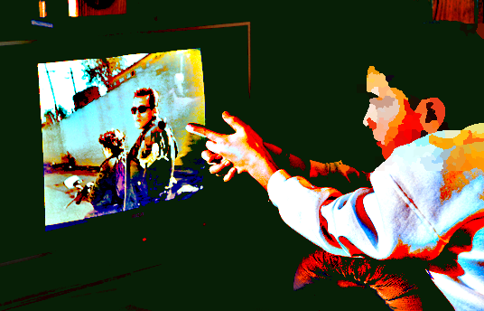
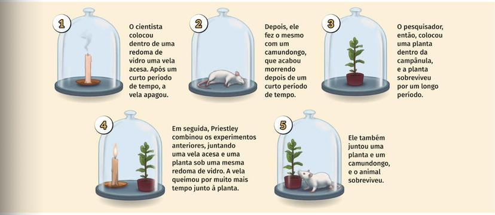

```{r setup, include=FALSE}
options(html.tag.transform.rmarkdown = TRUE)
knitr::opts_chunk$set(echo = TRUE)
```

class: inverse, center, middle

# Parte 1: A Gênese - Por que Fazemos Ciência com Dados?

---

## O Propósito da Investigação Científica

Como usamos dados para responder a perguntas de forma confiável? No coração de toda a investigação científica está um objetivo fundamental, elegantemente descrito por Einstein:

> "O grande objetivo de toda ciência... é cobrir o maior número possível de fatos empíricos por dedução lógica, a partir do menor número possível de hipóteses ou axiomas."

Em outras palavras, buscamos explicações simples e poderosas para o funcionamento do mundo. O **método científico** é o nosso mapa para essa busca.

---

## O Ciclo do Método Científico

Este mapa não é linear, mas sim um ciclo contínuo de aprendizagem e refinamento.

- **Observação:** Identificar um fenômeno e observar suas características.
- **Formulação da Pergunta:** Formular uma pergunta clara e específica.
- **Hipótese:** Propor uma explicação testável.
- **Experimentação:** Projetar e conduzir um estudo para testar a hipótese.
- **Coleta de Dados:** Registrar os resultados do estudo.
- **Análise de Dados:** Usar métodos estatísticos para interpretar os dados.
- **Conclusão:** Avaliar se os resultados suportam ou refutam a hipótese.
- **Comunicação:** Partilhar as descobertas, o que leva a novas observações.

---

## O Ciclo em Ação

```{r, echo=FALSE, purl=FALSE, out.width="50%", fig.align='center'}
# Assumindo que a imagem está disponível
# include_graphics("images/circular_flowchart.png")
knitr::include_graphics("images/circular_flowchart.png") # Usando a imagem anterior como placeholder
```

A **Estatística** é a linguagem e o motor que impulsionam cada etapa deste ciclo.

---

## Exemplo Prático na Psicologia Comportamental

- **Comportamento Observado:** Frequência de estudo em estudantes universitários.
- **Pergunta:** O uso de recompensas influencia na frequência de estudo dos alunos?
- **Hipótese:** Oferecer recompensas por horas de estudo aumentará a frequência de estudo dos alunos.
- **Experimento:** Dividir os alunos em grupos, um com recompensas e outro sem. Registrar o tempo de estudo semanal.
- **Dados Comportamentais:** Registrar o número de horas de estudo em cada grupo.
- **Análise Estatística:** Comparar as médias de horas de estudo usando testes estatísticos.
- **Conclusão:** Se o grupo com recompensas estudar significativamente mais, a hipótese pode ser confirmada.
---

## Importância do Método Científico 

- **Rigor:** O método científico ajuda a garantir a precisão e a confiabilidade dos resultados.
- **Progresso Científico:** Contribui para o avanço do conhecimento e a descoberta de novas informações.
- **Tomada de Decisão:** Resultados confiáveis auxiliam na tomada de decisões informadas.
- **Reprodutibilidade:** Outros cientistas podem repetir os experimentos para verificar os resultados.


Maiores detalhes ver [@brown1955scientific], [@hook2020psychoanalysis] e [@mcbride2023process].
---


## Por que a Estatística é Crucial na Ciência?

O mundo é complexo e cheio de variabilidade. A Estatística oferece as ferramentas para:

- **Descrever a Complexidade:** A **Estatística Descritiva** resume e apresenta dados de forma organizada, permitindo-nos ver padrões e tendências no meio do "caos". É o primeiro passo para a compreensão.

- **Tomar Decisões sob Incerteza:** A **Estatística Inferencial** permite-nos extrair conclusões sobre uma população inteira (e.g., todos os estudantes universitários) a partir de uma amostra (e.g., 200 estudantes), quantificando a nossa confiança e a nossa incerteza.

- **Fazer Previsões:** Com base em dados passados, podemos construir modelos para prever novas situações.

---

## Estatística: A Lógica da Ciência

Podemos pensar em duas grandes correntes lógicas que a estatística nos ajuda a formalizar:

- **Raciocínio Indutivo:** Partimos de observações específicas (nos nossos dados) para formular conclusões mais gerais (teorias ou hipóteses). Vemos um padrão emergente.
    - *Exemplo:* "Nos últimos 5 experimentos, o grupo que recebeu o tratamento X melhorou. **Talvez** o tratamento X seja eficaz."

- **Raciocínio Dedutivo:** Partimos de uma teoria ou princípio geral para fazer uma previsão específica que pode ser testada.
    - *Exemplo:* "Se a teoria da gravidade está correta, **então** ao largar esta maçã, ela deve cair."

A análise estatística permite-nos mover com rigor entre estes dois modos de pensamento.

---

class: inverse, center, middle

# Parte 2: Como Extraímos Informação? Tipos de Estudos Científicos

Antes de focarmos no "padrão ouro" dos experimentos, é importante entender o espectro de como os estudos são realizados.

---

## Estudos Descritivos

- **O quê:** Observam e descrevem características de uma população ou fenômeno, sem manipular variáveis. Respondem a perguntas como "O quê?", "Onde?", "Quando?".
- **Exemplo:** Um estudo de campo para descrever os padrões de interação social de crianças numa creche. Registamos o que vemos.
- **Importância:** Fornecem insights iniciais cruciais, ajudam a gerar hipóteses para estudos futuros e podem revelar padrões inesperados.
- **Limitações:** Não estabelecem relações de causa e efeito; propensos a viés de observador. Exemplo, um estudo que descreve que crianças que veem mais TV têm vocabulário menor não pode concluir que a TV *causa* o vocabulário menor.


Leitura recomendada [@rabinowitz1986descriptive].

---

### Exemplo de Estudo Descritivo
**Estudo:** Observar o padrão de interações sociais em crianças com Transtorno do Espectro Autista (TEA).

- **Importância:** Fornece insights sobre os desafios sociais das crianças com TEA.
- **Limitações:** Não esclarece as causas subjacentes das dificuldades; não permite inferências causais.

```{r, echo=FALSE, purl=FALSE, out.width="45%", fig.align='center'}
# Assumindo que a imagem está disponível
# include_graphics("images/circular_flowchart.png")

```
Leitura recomendada [@bauminger2008children] e [@dere2018analyzing].

---


## Estudos de Coorte

- **O quê:** Um tipo de estudo observacional onde seguimos um grupo de indivíduos (a coorte) ao longo do tempo para ver como certos fatores de exposição afetam o desenvolvimento de um resultado.
- **Exemplo:** Acompanhar um grupo de crianças desde o nascimento para entender a influência da exposição à violência na mídia no desenvolvimento de comportamentos agressivos na adolescência.


```{r, echo=FALSE, purl=FALSE, out.width="25%", fig.align='center'}
# Assumindo que a imagem está disponível
# include_graphics("images/circular_flowchart.png")

```

- **Importância:** Permitem observar a sequência temporal dos eventos (a exposição vem antes do resultado), o que fortalece a evidência para uma possível relação causal.
- **Limitações:** Demorados, caros e ainda sujeitos a fatores de confundimento.


---

## Estudos de Caso-Controle

- **O quê:** Outro estudo observacional, mas retrospetivo. Começamos com indivíduos que já têm um resultado (os "casos", e.g., pessoas com depressão) e um grupo de controle comparável sem o resultado. Depois, olhamos para o passado para ver se os casos foram mais expostos a um fator de risco do que os controles.
- **Exemplo:** Investigar fatores de risco para depressão em adultos jovens. Comparamos a história de vida (e.g., abuso na infância, stress) de um grupo de adultos com depressão (casos) com um grupo sem depressão (controles).


```{r, echo=FALSE, purl=FALSE, out.width="25%", fig.align='center'}
# Assumindo que a imagem está disponível
# include_graphics("images/circular_flowchart.png")
knitr::include_graphics("images/depre.png")
```
- **Importância:** Eficientes para estudar doenças ou resultados raros.
- **Limitações:** Dependem da memória dos participantes (viés de recordação) e tornam difícil estabelecer a causalidade.

---

## Estudos Comparativos ou Confirmatórios (Experimentos)

- **O quê:** O foco da nossa aula. Aqui, o investigador **manipula ativamente** uma variável (o fator) para observar o seu efeito em uma outra variável (a resposta), enquanto tenta controlar todas as outras.
- **Exemplo:** Investigar se a prática regular de mindfulness melhora a concentração.

```{r, echo=FALSE, purl=FALSE, out.width="50%", fig.align='center'}
# Assumindo que a imagem está disponível
# include_graphics("images/circular_flowchart.png")

```
---


## Estudos Comparativos ou Confirmatórios (Experimentos)

**Manipulação:** Atribuímos aleatoriamente metade dos estudantes a um programa de mindfulness (grupo de tratamento) e a outra metade a uma lista de espera (grupo de controle).
- **Controle:** Ambos os grupos são testados nas mesmas condições.
- **Medição:** Comparamos as notas num teste de concentração após o programa.
- **Importância:** São o **padrão-ouro para estabelecer relações de causa e efeito**.
- **Limitações:** Nem sempre são viáveis ou éticos (não podemos forçar pessoas a fumar, por exemplo ou usar drigas para elevar seu nível de relaxamento).

Leitura recomendada [@molinari2015mindful] e [@ross2010health]
---

## Estudo  Clínico

Avaliar a eficácia de uma intervenção de terapia cognitivo-comportamental no tratamento de fobia social.

- **Importância:** Fornecer evidências sobre a eficácia de tratamentos específicos em situações clínicas.
- **Limitações:** Dificuldade em controlar variáveis externas que podem influenciar os resultados; resultados podem ser específicos para a população estudada.

```{r, echo=FALSE, purl=FALSE, out.width="40%", fig.align='center'}
# Assumindo que a imagem está disponível
# include_graphics("images/circular_flowchart.png")

```
Leitura recomendada [@hofmann2006recent] e [@neufeld2020randomized]

---

## Exemplo de problemas que um psicólogo/Estatístico pode enfrentar

- Henry Lee Lucas (Assassino em série). Henry Lee Lucas foi um criminoso americano, preso em 1983 por posse de arma de fogo. Foi condenado por 189 casos de assassinato [@gudjonsson1999making].

```{r, echo=FALSE, purl=FALSE, out.width="50%", fig.align='center'}
# Assumindo que a imagem está disponível
# include_graphics("images/circular_flowchart.png")

```

- O que um psicólogo/estatístico pode fazer para ajudar a sociedade em casos de assassinatos em série? (Estudo observacional) [@labrode2007etiology]


---

Traçar um perfil psicológico pode ser útil para orientar investigações, mas não é garantia de prisão.  O perfil pode fornecer insights sobre possíveis motivações, comportamentos e características do criminoso, o que pode ajudar a polícia a direcionar suas investigações. 

No entanto, a construção de um perfil não garante a captura do criminoso, pois as informações obtidas podem ser vagas ou genéricas.

**Coletando informações sobre criminosos que sofreram abuso na infância** 

Se o foco é entender criminosos que sofreram abuso sexual e psicológico na infância (caso relatado de Henry Lee Lucas), um estudo apropriado pode ser uma pesquisa qualitativa, como entrevistas em profundidade com criminosos condenados ou ex-condenados que tiveram essa experiência. Seria importante coletar informações sobre:


- Detalhes do abuso sofrido.
- Reações emocionais e comportamentais à experiência.
- Eventuais influências do abuso nas decisões criminais.

Leitura recomendada [@finkelhor1994current] e [@laangstrom2013preventing].

---

## Estudo observacional e investigações de crimes em série:

Investigações de crimes em série são frequentemente baseadas em estudos observacionais, já que envolvem a análise de padrões de comportamento do criminoso. 

No entanto, essas investigações também podem envolver coleta de evidências físicas, análise forense e análise de dados, como registros de locais e horários dos crimes. 

A coleta de informações do perfil psicológico também se enquadra na categoria observacional, pois não envolve manipulação deliberada de variáveis.

_Ética e a privacidade_ dos indivíduos envolvidos devem ser cuidadosamente consideradas durante todo o processo.
---

## Dados relevantes em crimes em séries

Em relação a crimes em série, dados relevantes podem incluir:

- Localização dos crimes.
- Padrões de modus operandi (métodos usados) do criminoso.
- Perfis das vítimas.
- Cronologia dos crimes.
- Evidências físicas, como armas, marcas e impressões.
- Análise de DNA.
- Comportamentos de pós-crime (por exemplo, se o criminoso volta à cena do crime).

**E elas representam diferentes tipos de variáveis e escalas.**

---

class: inverse, center, middle

# Parte 3: Os Pioneiros - Desvendando os Pilares da Experimentação

A melhor forma de entender os princípios do delineamento de experimentos é ver como eles foram descobertos por pioneiros que enfrentaram perguntas fundamentais.

---

## Lição 1: O Poder da Quantificação (van Helmont, Séc. XVII)

- **Pergunta da Época:** "De onde vem a massa das plantas? Elas 'comem' terra?"
- **Hipótese:** Sim, as plantas crescem consumindo o solo.
- **O Experimento de van Helmont:** Em vez de apenas observar, ele *mediu*.
    1. Pesou 90 kg de solo seco.
    2. Plantou uma muda de salgueiro de 2.25 kg.
    3. Regou-a apenas com água por 5 anos.
    
```{r, echo=FALSE, purl=FALSE, out.width="38%", fig.align='center'}
# Assumindo que a imagem está disponível
# include_graphics("images/circular_flowchart.png")
knitr::include_graphics("images/Van_Helmont_Experiment.jpg")
```
---

```{r , echo=TRUE, fig.align='center', warning=FALSE, out.width="40%"}
# Dados iniciais
peso_inicial_arvore <- 2.25 # Kg
peso_inicial_solo <- 90.0 # Kg
# Dados finais (após 5 anos)
peso_final_arvore <- 76.1 # Kg
peso_final_solo <- 89.9 # Kg
# Cálculos
ganho_peso_arvore <- peso_final_arvore - peso_inicial_arvore
perda_peso_solo <- peso_inicial_solo - peso_final_solo
print(paste("Ganho de peso da árvore:", ganho_peso_arvore, "Kg"))
print(paste("Perda de peso do solo:", perda_peso_solo, "Kg"))
```
**Conclusão de van Helmont:**  O aumento de massa da árvore veio principalmente da água, e não do solo. Embora hoje saibamos da importância do dióxido de carbono do ar na fotossíntese.  A **quantificação rigorosa** é a primeira arma contra o senso comum e as hipóteses incorretas.
---

## Lição 2: O Poder do Controle (Priestley, Séc. XVIII)

- **Pergunta:** O que acontece com o ar quando algo queima ou um animal respira?

```{r, echo=FALSE, purl=FALSE, out.width="90%", fig.align='center'}
# Assumindo que a imagem está disponível
# include_graphics("images/circular_flowchart.png")

```

---
- **Experimento A (Controle):** Uma vela acesa sob uma redoma de vidro se apaga.
- **Experimento B (Tratamento):** Priestley coloca um ramo de hortelã dentro da redoma com o ar "danificado".
- **Resultado:** Após alguns dias, uma nova vela consegue queimar na redoma do Experimento B.
- **Lição Principal:** Priestley usou o Experimento A como **grupo de controle**. Comparando a situação *com* a planta versus *sem* a planta, ele conseguiu isolar o efeito da planta. O **controle** é essencial para a comparação.

---

## Lição 3: A Formalização dos Princípios (R. A. Fisher, Séc. XX)

A história da "Senhora do Chá" é o exemplo perfeito para ilustrar os três pilares do delineamento experimental moderno, formalizados por R. A. Fisher.

- **A Afirmação:** Uma senhora afirmava conseguir distinguir, pelo sabor, se o leite ou o chá foram colocados primeiro na xícara.
- **A Pergunta Científica:** Esta capacidade é real ou é apenas sorte?
- **O Delineamento Genial de Fisher:**
    1. Preparar 8 chávenas: 4 com leite primeiro (Tratamento A), 4 com chá primeiro (Tratamento B).
    2. Apresentar as 8 xícaras à senhora em **ordem aleatória**.
    3. Pedir que ela separe as xícaras nos dois grupos de 4.

---

### Princípio 1: Replicação

Fisher não usou apenas uma chávena de cada tipo. Ele usou **quatro** de cada.

- **Definição:** A **replicação** é a repetição de um tratamento em múltiplas unidades experimentais independentes.
- **Por que é crucial?** Permite-nos medir a variabilidade natural (o "ruído") e aumenta a confiança de que o efeito observado não é apenas sorte.

---

### Princípio 2: Aleatorização

A ordem em que as chávenas foram apresentadas não foi A-A-A-A-B-B-B-B. Foi **aleatória**.

- **Definição:** A **aleatorização** é o uso do acaso para atribuir tratamentos às unidades experimentais.
- **Por que é o pilar mais importante?** Elimina o viés de fatores não controlados (conscientes ou inconscientes) e é a base matemática que valida a análise estatística.

---

### Princípio 3: Blocagem (Controle Local)

Implicitamente, Fisher usou este princípio. Todas as 8 chávenas deveriam ser o mais parecidas possível (mesmo chá, mesma temperatura, etc.).

- **Definição:** A **blocagem** é uma técnica para controlar fontes de variação conhecidas. Agrupamos as unidades em "blocos" homogéneos e, em seguida, aleatorizamos os tratamentos dentro de cada bloco. A blocagem torna o experimento mais preciso.

---

class: inverse, center, middle

# Parte 4: A Linguagem Moderna e o Processo Experimental

Com a motivação histórica e os princípios em mente, estamos prontos para a linguagem formal que usamos hoje para delinear e discutir experimentos.

---

## O Desafio Fundamental: O Contrafactual

A razão pela qual a causalidade é difícil é que nunca podemos observar o **contrafactual**: o que teria acontecido a uma pessoa do grupo de tratamento se ela, em vez disso, estivesse no grupo de controle?

A **aleatorização** é a nossa solução mágica: ela cria dois grupos que, em média, são estatisticamente idênticos em todas as outras variáveis. Assim, o grupo de controle serve como um **proxy** credível para o contrafactual do grupo de tratamento.

---

## A Nomenclatura Essencial

- **Unidade Experimental:** A entidade à qual o tratamento é aplicado (a chávena, o utilizador do site, o paciente, uma parcela de terra).
- **Tratamento:** A condição experimental que estamos a testar (leite primeiro, layout em grade, novo fertilizante).
- **Fator:** A variável geral que estamos a manipular (ordem de preparo, layout da página, tipo de fertilizante).
- **Níveis:** Os valores específicos do fator (nível 1: leite primeiro; nível 2: chá primeiro).
- **Variável Resposta:** A métrica que medimos para avaliar o efeito do tratamento (classificação correta/incorreta, taxa de checkout, altura da planta).

---

## O Ciclo QPDAC: O Processo Estruturado

O **QPDAC (Question, Plan, Data, Analysis, Conclusion)** é a implementação moderna e sistemática do método científico para experimentos.

1.  **Question:** Qual a pergunta precisa e mensurável?
2.  **Plan:** Como vamos responder? (Definir Fatores, Níveis, Unidades, Replicação, Aleatorização, etc.)
3.  **Data:** Coletar os dados seguindo o plano.
4.  **Analysis:** Analisar os dados com as ferramentas estatísticas corretas.
5.  **Conclusion:** Interpretar os resultados e responder à pergunta original.

---

class: inverse, center, middle

# Parte 5: A Prática - Análise de Dados com R

Agora, vamos aplicar tudo o que aprendemos a dois cenários modernos.

---

## Cenário 1: O Teste A/B da Nike

- **Question:** A mudança do layout de "Visualização em Lista" (Controle, A) para "Visualização em Grade" (Tratamento, B) causa uma mudança na taxa de checkout?
- **Plan:**
    - **Fator:** Layout da Página (2 Níveis: Lista, Grade).
    - **Unidades Experimentais:** Utilizadores do site.
    - **Replicação:** 20,000 utilizadores no total (10,000 por grupo).
    - **Aleatorização:** Cada utilizador é aleatoriamente designado para ver o layout A ou B.
    - **Variável Resposta:** Binária (Checkout Sim/Não).

---

### Visualização dos Layouts A e B

.pull-left[
**Layout 'A': Lista**
```{r list-view-plot, echo=FALSE, fig.align='center', warning=FALSE, message=FALSE}
library(ggplot2)
library(tidyverse)
library(broom)
library(knitr)
library(kableExtra) # Adicionado para estilização de tabelas

list_df <- data.frame(
  ymin = c(0.8, 2.3), ymax = c(2, 3.5), xmin = 0, xmax = 10,
  img_xmin = 0.5, img_xmax = 3,
  text1_x = 3.5, text1_y = c(3.1, 1.6), label1 = c("Tênis de Corrida Super Veloz", "Camiseta Técnica Respirável"),
  text2_x = 3.5, text2_y = c(2.7, 1.2), label2 = c("R$ 499,99", "R$ 129,99")
)
ggplot(list_df) + geom_rect(aes(xmin = xmin, xmax = xmax, ymin = ymin, ymax = ymax), fill = "white", color = "grey") + geom_rect(aes(xmin = img_xmin, xmax = img_xmax, ymin = ymin + 0.2, ymax = ymax - 0.2), fill = "#a1d9f0") + geom_text(aes(x=img_xmin + 1.25, y = (ymin+ymax)/2, label="[Imagem]"), color="grey40") + geom_text(aes(x = text1_x, y = text1_y, label = label1), hjust = 0, size = 3, fontface="bold") + geom_text(aes(x = text2_x, y = text2_y, label = label2), hjust = 0, size = 3) + labs(title="Layout 'A': Lista") + theme_void() + theme(plot.title = element_text(hjust = 0.5))
```
]
.pull-right[
**Layout 'B': Grade**
```{r tile-view-plot, echo=FALSE, fig.align='center', warning=FALSE}
tile_df <- data.frame( xmin = c(0.5, 5.5, 0.5, 5.5), xmax = c(4.5, 9.5, 4.5, 9.5), ymin = c(5.5, 5.5, 0.5, 0.5), ymax = c(9.5, 9.5, 4.5, 4.5), label1 = c("Tênis Super Veloz", "Camiseta Técnica", "Shorts de Ciclismo", "Meias de Compressão"), label2 = c("R$ 499,99", "R$ 129,99", "R$ 199,99", "R$ 79,99"))
ggplot(tile_df) + geom_rect(aes(xmin=xmin, xmax=xmax, ymin=ymin, ymax=ymax), fill="white", color="grey") + geom_rect(aes(xmin=xmin, xmax=xmax, ymin=ymin + 1.5, ymax=ymax), fill="#a1d9f0") + geom_text(aes(x=(xmin+xmax)/2, y=ymax - 1.25, label="[Imagem]"), color="grey40") + geom_text(aes(x=(xmin+xmax)/2, y=ymin+1, label=label1), size=3, fontface="bold") + geom_text(aes(x=(xmin+xmax)/2, y=ymin+0.5, label=label2), size=3) + labs(title="Layout 'B': Grade") + theme_void() + theme(plot.title = element_text(hjust = 0.5))
```
]

---

### Análise (Nike)

- **Data:** Simulamos dados onde a taxa de checkout real é de 5.0% para a Lista e 5.5% para a Grade (um pequeno aumento).
- **Analysis:** Usaremos um teste de hipóteses para proporções.
    - $H_0: p_{lista} = p_{grade}$ (Não há diferença)
    - $H_1: p_{lista} \neq p_{grade}$ (Há diferença)

```{r nike-sim, message=FALSE, warning=FALSE, out.width="60%"}
set.seed(42)
n <- 10000; taxa_lista <- 0.050; taxa_grade <- 0.055
dados_nike <- tibble( grupo = factor(rep(c("Lista (A)", "Grade (B)"), each = n)), checkout = c(rbinom(n, 1, taxa_lista), rbinom(n, 1, taxa_grade)))
sucessos <- c(sum(dados_nike$checkout[dados_nike$grupo == "Lista (A)"]), sum(dados_nike$checkout[dados_nike$grupo == "Grade (B)"]))
total <- c(n, n)
teste_prop <- prop.test(x = sucessos, n = total, conf.level = 0.95)
```

---
```{r nike-sim1, message=FALSE, warning=FALSE, out.width="30%", echo=FALSE}
kable(tidy(teste_prop), format = "html", digits = 4) %>%
  kable_styling(full_width = FALSE, font_size = 15)
```
- **Interpretação:** O p-valor (`r round(tidy(teste_prop)$p.value, 3)`) é maior que o nosso nível de significância de 0.05. Portanto, **não rejeitamos a hipótese nula**.
- **Comunicação:** "Apesar da 'Visualização em Grade' ter mostrado uma taxa de checkout ligeiramente superior, a diferença não é estatisticamente significativa. Não temos evidência forte para concluir que a mudança de layout terá um impacto real. O intervalo de confiança para a diferença `r round(tidy(teste_prop)$conf.low, 6)`, `r round(tidy(teste_prop)$conf.high, 6)` inclui o zero, o que reforça esta conclusão."
---

### Conclusão e Visualização (Nike)


```{r nike-plot, echo=FALSE, fig.align='center', warning=FALSE, out.width="40%"}
# Criar um dataframe com os resultados para o gráfico
resultados_df <- tidy(teste_prop) %>%
  select(estimate1, estimate2) %>%
  pivot_longer(cols = everything(), names_to = "grupo", values_to = "taxa") %>%
  mutate(
    grupo = if_else(grupo == "estimate1", "Lista (A)", "Grade (B)"),
    sucessos = sucessos,
    total = total
  )
# --- INÍCIO DA CORREÇÃO FINAL E TESTADA ---
# Usamos sapply para iterar sobre as linhas do dataframe (1 e 2)
# Para cada linha, corremos prop.test e extraímos o vetor conf.int
# O resultado é uma matriz 2x2.
matriz_cis <- sapply(1:nrow(resultados_df), function(i) {
  prop.test(x = resultados_df$sucessos[i], n = resultados_df$total[i])$conf.int
})
# A primeira linha da matriz contém os limites inferiores.
# A segunda linha da matriz contém os limites superiores.
resultados_df$conf.low <- matriz_cis[1, ]
resultados_df$conf.high <- matriz_cis[2, ]
# --- FIM DA CORREÇÃO FINAL E TESTADA ---
# Gerar o gráfico (este código agora funcionará corretamente)
ggplot(resultados_df, aes(x = grupo, y = taxa, fill = grupo)) +
  geom_bar(stat = "identity") +
  geom_errorbar(aes(ymin = conf.low, ymax = conf.high), width = 0.2) +
  geom_text(aes(label = paste0(round(taxa * 100, 2), "%")), vjust = -0.5, size = 5) +
  scale_y_continuous(labels = scales::percent_format(), limits = c(0, 0.07)) +
  labs(
    title = "Comparação da Taxa de Checkout (Teste A/B)",
    subtitle = "Barras de erro representam o Intervalo de Confiança de 95%",
    x = "Layout da Interface",
    y = "Taxa de Checkout Estimada"
  ) +
  theme_minimal(base_size = 14) +
  theme(legend.position = "none")
```
O gráfico mostra claramente a sobreposição dos intervalos de confiança.

---

## Cenário 2: O Teste A/B/C/D da Nixon

- **Question:** Qual dos quatro temas de anúncio (Surf, Escalada, Campismo, Profissional) gera a maior duração média de visualização?
- **Plan:**
    - **Fator:** Tema do Anúncio (4 Níveis).
    - **Replicação:** 100 utilizadores por tema.
- **Analysis:** Quando temos mais de dois grupos, não podemos simplesmente fazer vários Testes A/B (inflacionaria a taxa de erro). A ferramenta correta é a **Análise de Variância (ANOVA)**.

---

### Análise (Nixon)

- **Lógica da ANOVA:** Compara a variação *entre* as médias dos grupos com a variação *dentro* de cada grupo. Se a variação entre os grupos for muito maior, concluímos que os grupos são realmente diferentes.
- **Hipóteses da ANOVA:**
    - $H_0: \mu_{Surf} = \mu_{Escalada} = \mu_{Campismo} = \mu_{Profissional}$ (Todas as médias são iguais).
    - $H_1:$ Pelo menos uma média é diferente.

```{r nixon-sim, message=FALSE, warning=FALSE, out.width="40%"}
# library(broom)
set.seed(123)
dados_nixon <- tibble( tema = factor(rep(c("Surf", "Escalada", "Campismo", "Profissional"), each = 100)), duracao = c(rnorm(100, mean = 35, sd = 10), rnorm(100, mean = 28, sd = 10), rnorm(100, mean = 32, sd = 10), rnorm(100, mean = 27, sd = 10)))
modelo_anova <- aov(duracao ~ tema, data = dados_nixon)
```
---
```{r nixon-sim1, message=FALSE, warning=FALSE, out.width="40%"}
kable(tidy(modelo_anova), format = "markdown", digits = 4) %>%
  kable_styling(full_width = FALSE, font_size = 15)
```

**Interpretação:** O p-valor é extremamente baixo. **Rejeitamos $H_0$**. Concluímos que o tema do anúncio tem um efeito significativo no tempo de visualização.

### Análise Post-Hoc e Conclusão (Nixon)

A ANOVA nos disse *que* há uma diferença, mas não *onde*. Para isso, usamos um teste **post-hoc** como o de **Tukey HSD**, que compara todos os pares de grupos controlando o erro.
---

<div style="font-size: 75%;">
```{r nixon-tukey-plot, echo=FALSE, fig.align='center', warning=FALSE, out.width="40%"}
tukey_results <- TukeyHSD(modelo_anova)
par(mar = c(4.1, 11.1, 4.1, 2.1))

 plot(tukey_results,  las=1)

# tukey_tidy <- tidy(tukey_results)
# 
# # 2. Criar um gráfico muito mais claro com ggplot2
# ggplot(tukey_tidy, aes(y = term, x = estimate)) +
#   geom_vline(xintercept = 0, linetype = "dashed", color = "red") +
#   geom_errorbarh(aes(xmin = conf.low, xmax = conf.high), height = 0.2) +
#   geom_point(size = 3, color = "navy") +
#   labs(
#     title = "Resultados do Teste de Tukey HSD",
#     y = "Comparação entre Pares",
#     x = "Diferença Estimada nas Médias"
#   ) +
#   theme_minimal(base_size = 14)

```

**Interpretação:** O gráfico mostra a diferença estimada entre as médias de cada par (ponto) e o intervalo de confiança de 95% para essa diferença (linha).
- **Se um intervalo não cruza a linha vertical do zero, a diferença é significativa.**
- **Conclusão para a Nixon:** "Os temas 'Surf' e 'Campismo' têm uma performance significativamente superior aos temas 'Escalada' e 'Profissional'. Não há diferença estatística entre 'Surf' e 'Campismo', nem entre 'Escalada' e 'Profissional'. A recomendação é focar em temas de aventura/natureza."


<!-- --- -->

<!-- ## Referências -->

<!-- <div id="refs"></div> -->


<!-- --- -->

<!-- class: inverse, center, middle -->

<!-- # Conclusão e Próximos Passos -->

<!-- --- -->

<!-- ## Síntese da Jornada -->

<!-- Hoje, viajamos desde a filosofia fundamental da ciência até a aplicação prática de análises estatísticas em R. -->

<!-- 1.  Vimos que a **ciência é um ciclo** de observação e teste. -->
<!-- 2.  Aprendemos com os **pioneiros** a importância da **quantificação**, do **controle**, e dos três pilares: **replicação, aleatorização e blocagem**. -->
<!-- 3.  Formalizamos a **linguagem da experimentação** e o processo **QPDAC**. -->
<!-- 4.  Aplicamos este conhecimento para analisar um **Teste A/B** e um experimento com múltiplos grupos (**ANOVA**), aprendendo a interpretar e a visualizar os resultados. -->

<!-- O delineamento cuidadoso de um experimento é a sua fundação. Nenhuma análise, por mais complexa que seja, pode salvar um mau delineamento. A estatística nos dá as ferramentas para aprender com o mundo de forma estruturada e honesta. -->
<!-- --- -->

<!-- class: inverse -->

<!-- # Referências -->

<!-- <div id="refs"></div> -->