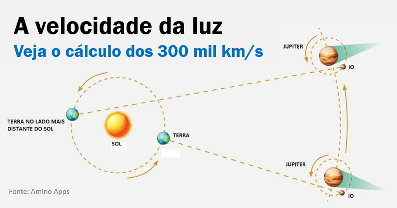

```{r setup, include=FALSE}
options(html.tag.transform.rmarkdown = TRUE)
knitr::opts_chunk$set(echo = TRUE)
```
```{r setup1, include=FALSE}
# Configurações globais para os chunks de código
options(htmltools.dir.version = FALSE)
knitr::opts_chunk$set(warning = FALSE, message = FALSE, fig.retina = 3, comment = "#>")
# Carregar pacotes necessários
library(dplyr)
library(ggplot2)
library(knitr)
```

## O que é um EXPERIMENTO?

No contexto científico, um experimento pode ser definido da seguinte forma:
  
  .pull-left[
    > Um **EXPERIMENTO** consiste em um conjunto de procedimentos realizados com o objetivo de comprovar ou não uma hipótese idealizada.
  ]

Apesar dessa definição ser bastante abrangente, ela será suficiente por enquanto.

Para efeito deste curso, experimentos serão distinguidos entre **ABSOLUTOS** e **COMPARATIVOS**.

---
  
  ## Experimentos ABSOLUTOS
  
São experimentos empregados para avaliação de quantidades (ou atributos) constantes. Um exemplo típico é o tipo de experimento executado para se estimar a velocidade da luz [Mecânica Celeste de Johannes Kepler].

```{r, echo=FALSE, purl=FALSE, out.width="40%", fig.align='center'}
# Assumindo que a imagem está disponível
# 
 # Usando a imagem anterior como placeholder
```  
  

**Notas:**
  
  a) A Teoria dos Erros foi desenvolvida neste contexto [[Link]](https://www.google.com/url?sa=t&source=web&rct=j&opi=89978449&url=https://macbeth.if.usp.br/~gusev/ApostilaErros.pdf&ved=2ahUKEwiUq-a6o8-PAxVEl5UCHaFMIR4QFnoECBgQAQ&usg=AOvVaw2AOGFbgVO7pYIOUU7rFtrj).

b) Um levantamento amostral pode ser considerado um experimento absoluto.

---
  
  ## Experimentos COMPARATIVOS
  
  São experimentos onde o efeito (medido através de uma função de uma variável resposta) de dois ou mais tratamentos são comparados em uma certa população.

_O curso trata destes experimentos._ 


Salvo menção em contrário, daqui por diante, o termo experimento estará referindo-se a experimentos comparativos.

---

<div style="font-size: 75%;">
## Algumas questões contemporâneas que têm sido (ou podem ser) investigadas através de experimentos planejados:
  
i) Vitamina C ajuda a prevenir resfriado?
  
ii) Técnicas de melhoramento genético levam a uma nova variedade de milho (B), supostamente mais resistente a determinada praga que a variedade de milho comumente cultivada (A). A variedade B é de fato mais resistente à praga que a variedade A? A variedade B tem produtividade pelo menos equivalente à da variedade A?
  
iii) A produção média, em laboratório, de certo composto químico, depende de fatores como temperatura, pressão e umidade na hora da reação. Quais devem ser os níveis ideais de temperatura, pressão e umidade para maximizar a produção do produto desejado?
  
iv) Qual, dentre três dietas possíveis de se administrar ao gado leiteiro, resulta em maior produção de leite?
  
v) Um certo produto, à base de folhas secas de graviola, supostamente tem maior eficiência na redução de tumores que o método convencional de quimioterapia. Como testar cientificamente essa hipótese?
  
---


## Terminologia e Definições Básicas
  
  **Fator:** Variável cujo efeito (observado em uma variável resposta) é de interesse para a investigação. Um fator define uma partição da população em estudo.

--
  
  **Níveis de um fator:** Os níveis de um fator são os valores que este assume no experimento.

  ### Classificação de Fatores
  
  Dentre várias classificações possíveis, fatores podem ser ditos **quantitativos** ou **qualitativos** dependendo da natureza dos níveis que este assume.

- **Fatores qualitativos** são também chamados de fatores classificatórios.
- **Fatores quantitativos** são também chamados de fatores numéricos.

No experimento para investigar as questões descritas no item 
  **ii)** da seção anterior, por exemplo, o fator variedade possui dois níveis: A e B. Variedade, então, é um fator classificatório. 

---


.small[
No experimento relativo ao item **iii)**, os níveis do fator temperatura não foram definidos, mas poderiam, por exemplo, ser 500°C, 550°C e 600°C. Temperatura, neste caso, seria um fator quantitativo. Note que existe uma métrica associada aos níveis de um fator quantitativo. O mesmo não acontece com um fator qualitativo.
]


```{r factor-example}
# Exemplo: Fator "Variedade" com 2 níveis e "Temperatura" com 3 níveis
variedade <- factor(c("A", "B", "A", "B"))
temperatura <- factor(c("500C", "550C", "500C", "600C"),
                      levels = c("500C", "550C", "600C"),
                      ordered = TRUE)
print(variedade)
print(temperatura)
```

---

**Tratamento:** O termo tratamento é dado aos níveis de um fator ou à combinação de níveis de fatores sobre os quais há interesse em comparar o desempenho com respeito a uma ou mais variáveis-resposta.

**Fator de ruído:** Nem todo fator ou combinação de níveis de fatores é chamado de tratamento. Um fator cujo efeito na variável-resposta seja conhecido e que não seja de interesse comparar o seu desempenho é dito fator de ruído.

.small[
  Para investigar a questão relativa ao item **iv)**, por exemplo, sabe-se que há um declínio na produção de leite entre a primeira e a segunda metade do período de lactação das vacas. Assim, o fator “período de lactação”, com dois níveis ("primeira e segunda metade") é fator de ruído.
  
Note que se este fator de ruído não estiver sob controle, diferenças na produção de leite podem ser explicadas tanto pela diferença entre dietas quanto pelo período de lactação.
]

---
  
  ### Unidades
  
  **Unidade Experimental (U.E.):** É a unidade física/material experimental à qual os tratamentos são designados e aplicados.

.small[
  Embora não tenha sido especificada, a U.E. no experimento relativo ao item **i)** descrito na seção passada deve ser uma pessoa. Já no relativo ao **ii)**, pode ser uma parcela (faixa de terra onde a variedade será plantada).
]

--
  
  **Erro Experimental:** O erro experimental diz respeito às unidades experimentais. A existência de tal erro está associada ao fato de que não existem na natureza unidades experimentais perfeitamente idênticas. Parte da variação observada na variável-resposta é explicada então pelas diferenças naturais entre unidades experimentais, que contribuem para o chamado erro experimental. O erro experimental também é reflexo de falha humana em reproduzir com exatidão um tratamento.

---
  
  ### Unidades (cont.)
  
  **Unidade Observacional (U.O.):** É a unidade física em que as medidas (mensurações) da variável resposta são avaliadas, após o experimento ser realizado.

.small[
  Em muitas situações, as unidades experimentais e observacionais coincidem. Porém, pode ocorrer de não serem as mesmas. 
  
No experimento associado ao item **ii)**, por exemplo, para medir a resistência da variedade a determinada praga, provavelmente cada espiga de milho seria avaliada. No entanto, se o tratamento (variedade de milho) é aplicado à parcela, tem-se a parcela como U.E. e a espiga como U.O.
]

---
  
  ### Erros e Replicação
  
  **Erro Observacional:** O erro observacional diz respeito à unidade observacional. Tal erro deve-se, por exemplo, aos erros de medida (mensuração) cometidos e aos erros amostrais (se o experimento fosse repetido, provavelmente outras U.O. seriam utilizadas).

--
  
  **Replicação:** Quando um tratamento é designado e aplicado a mais de uma U.E., sob as mesmas condições experimentais, diz-se que houve replicação.

.small[
  Quando há replicação em um experimento, é possível estimar a variância do erro experimental a partir das variações observadas entre as unidades experimentais identificadas como réplicas.
]

---
  
  ### Repetição
  
  **Repetição:** O termo repetição é aplicado quando mais de uma U.O. é utilizada numa situação em que as definições de U.E. e U.O. não coincidem.

.small[
  Quando há repetição em um experimento, variações entre as unidades observacionais permitem estimar a qualidade do processo de mensuração utilizado no experimento.
]

### Relações entre Terminologias
  
  Note as relações entre terminologias motivadas pela diferença conceitual entre unidade experimental e observacional:
  
  **U.E. ➡️ Replicação ➡️ Erro Experimental**
  
  **U.O. ➡️ Repetição ➡️ Erro Observacional**

---

  
  ## EXERCÍCIO EM CLASSE:
  
  Identifique o(s) tratamento(s) (incluindo fatores e níveis), a unidade experimental e a amostral no seguinte experimento:
  
  Deseja-se investigar os efeitos de agentes poluentes do ar em mudas de determinada árvore. Os poluentes, a serem usados em conjunto, são ozônio (O₃) e nitrito (NO₂) aplicados a .00, .05 e .10 ppm, seis horas por dia, durante 28 dias consecutivos. Para o experimento, 18 câmeras, com 28 mudas cada uma, estão disponíveis. Os tratamentos serão aplicados a cada câmera e a média da variável resposta por muda, para cada câmera, será analisada.

---

### Resposta: Unindo Teoria e Código
  

#### Análise Teórica
    
  -   **Fatores:** Ozônio (O₃), Nitrito (NO₂).
  -   **Níveis:** .00, .05, .10 ppm para cada fator.
  -   **Tratamentos:** São as **9 combinações** dos níveis dos fatores (3 níveis de O₃ × 3 níveis de NO₂).
    -   **Unidade Experimental (U.E.):** A **câmera**. É a câmera que recebe a atmosfera controlada (o tratamento).
    -   **Unidade Observacional (U.O.):** A **muda**. É nela que o crescimento é medido. Como a análise usa a média por câmera, a U.O. efetiva na análise é a câmera.
    -   **Replicação:** Temos 18 câmeras e 9 tratamentos. Portanto, cada tratamento é replicado **2 vezes** (18 / 9 = 2).

---

#### Estruturando o Plano em R
  
  Podemos gerar o esqueleto do nosso plano experimental facilmente com a função `expand.grid()`.
  
```{r exercise-r}
  # Níveis dos fatores
  niveis_o3 <- c(0.00, 0.05, 0.10)
  niveis_no2 <- c(0.00, 0.05, 0.10)
  
  # expand.grid cria todas as 9 combinações de tratamentos
  tratamentos <- expand.grid(
    Ozonio_ppm = niveis_o3,
    Nitrito_ppm = niveis_no2
  )
  
  # Criar o plano com 2 réplicas (18 câmeras no total)
  plano_exp <- tratamentos %>% 
    slice(rep(1:n(), each = 2)) %>%
    mutate(Camera_ID = 1:18)
```

---
```{r exercise-r1}
  kable(head(plano_exp), "html", caption = "Início do Plano Experimental")
```
---
  
  
## Esquema de modelo estatístico para as observações de um experimento planejado:
  
Observação = Efeito do Plano + Efeito do Tratamento + Erro Experimental + Erro Observacional
  

### Importância do Plano Experimental e sua Relação com o Modelo Linear Empregado
  
  Dentre as etapas de uma investigação científica descritas na seção anterior, a decisão de qual plano experimental aplicar assume uma relevância especial. Com efeito, modelos lineares contendo os mesmos componentes em termos de efeitos de tratamentos, erro experimental e erro observacional podem levar ao desenvolvimento de análises distintas dependendo do plano experimental adotado. 
---

Para ilustrar essa afirmação, o seguinte estudo, adaptado de Hinkelmann e Kempthorne (1994, págs 43-47), será considerado.

Um pesquisador deseja comparar o efeito de poluentes em mudas de Pinho. Ele considera, além de um tratamento controle (ar puro) - Tratamento 1, os poluentes Ozônio (O₃) - Tratamento 2, e Dióxido de Enxofre (SO₂) - Tratamento 3. Estão disponíveis para o experimento 12 mudas de Pinho de aproximadamente mesma idade, altura e que vem sendo cuidadas sob as mesmas condições laboratoriais.


Com base neste estudo, as situações experimentais descritas a seguir, além de ilustrar planos experimentais que poderiam ser adotados, seus respectivos modelos lineares e subsequente análise de dados, realçam o efeito do planejamento no potencial que o experimento tem para responder às questões postas pelo pesquisador.


---
```{r, echo=FALSE, purl=FALSE, out.width="70%", fig.align='center'}
# Assumindo que a imagem está disponível
# 
 # Usando a imagem anterior como placeholder
```  

---
```{r, echo=FALSE, purl=FALSE, out.width="70%", fig.align='center'}
# Assumindo que a imagem está disponível
# 
 # Usando a imagem anterior como placeholder
```  


---
```{r, echo=FALSE, purl=FALSE, out.width="60%", fig.align='center'}
# Assumindo que a imagem está disponível
# 
 # Usando a imagem anterior como placeholder
```  

---
```{r, echo=FALSE, purl=FALSE, out.width="70%", fig.align='center'}
# Assumindo que a imagem está disponível
# 
 # Usando a imagem anterior como placeholder
```  

---
### Cenário: Poluentes em Mudas de Pinho

#### Premissas para nossa Simulação em R:
Vamos assumir que conhecemos os "efeitos verdadeiros" para poder simular os dados:
- Crescimento base (Controle) = 10 cm.
- Efeito do Ozônio = -1.5 cm (prejudica o crescimento).
- Efeito do SO₂ = -3.0 cm (prejudica ainda mais).
- Adicionaremos um ruído aleatório (o **erro experimental**) para tornar a simulação realista.


---
### Delineamento 1: Inteiramente Casualizado (DIC) 

**Modelo Linear - Situação 1:**

#### Teoria 
É o delineamento mais simples. Os 3 tratamentos são atribuídos de forma completamente aleatória entre as 12 mudas (as U.E.s). Cada tratamento terá 4 réplicas. Este design assume que as 12 mudas são homogêneas.

**Modelo Estatístico:**

`Crescimento = Média Geral + Efeito do Tratamento + Erro`
---

#### Código de Simulação
```{r sim-dic}
    set.seed(42) # Para resultados reprodutíveis
    
    # Criar o plano de dados e aleatorizar
    dic_data <- data.frame(
      Tratamento = factor(rep(c("Controle", "Ozonio", "SO2"), each = 4))
    )
    
    # Simular os dados de crescimento
    efeitos <- c("Controle" = 0, "Ozonio" = -1.5, "SO2" = -3.0)
    dic_data$Crescimento <- 10 + efeitos[dic_data$Tratamento] +
      rnorm(12, mean = 0, sd = 0.8)
```

---
  #### Análise e Visualização
  Usamos a Análise de Variância (ANOVA) para testar se as médias de crescimento são diferentes entre os tratamentos.
  
```{r anova-dic}
  # Modelo linear e ANOVA
  modelo_dic <- aov(Crescimento ~ Tratamento, data = dic_data)
  kable(anova(modelo_dic), "html", digits = 2)
```

**Conclusão:** O p-valor (`Pr(>F)`) é muito baixo (< 0.001), indicando uma forte evidência de que os poluentes afetam o crescimento. Mas por que o F value para Residuals é NA? Veremos a seguir!


---
 Não há um teste F para a linha Residuals porque ela é a própria régua de medição. Testar o erro contra ele mesmo não faz sentido, por isso R exibe NA.
```{r plot-dic,  echo=FALSE, fig.align='center', warning=FALSE, out.width="55%"}
  ggplot(dic_data, aes(x = Tratamento, y = Crescimento, fill = Tratamento)) +
    geom_boxplot(alpha = 0.7) + geom_jitter(width = 0.1) +
    labs(title = "Resultado do Experimento (DIC)", y = "Crescimento (cm)") +
    theme_minimal() + theme(legend.position = "none")
```


---
### Delineamento 2: Blocos Casualizados (DBC)

#### Teoria
Agora, suponha que 6 mudas estão em uma prateleira perto da janela (**Bloco 1**) e 6 estão longe (**Bloco 2**). A luz solar é um **fator de ruído** que pode influenciar o crescimento. O bloqueamento controla esse ruído. Dentro de cada bloco, os 3 tratamentos são aleatorizados.
    
**Modelo Estatístico:** 
`Crescimento = Média Geral + Efeito do Bloco + Efeito do Tratamento + Erro`

---
#### Código de Simulação
```{r sim-dbc}
    set.seed(42)
    # Criar o plano com blocos
    dbc_data <- expand.grid(Tratamento = factor(c("Controle", "Ozonio", "SO2")),
                            Bloco = factor(1:2))
    dbc_data <- dbc_data %>% slice(rep(1:n(), each = 2)) # 12 mudas, 2 por comb.
    
    # Simular dados com efeito de tratamento E de bloco
    efeito_bloco <- c("1" = 1.2, "2" = -1.2) # Bloco 1 (janela) é melhor
    dbc_data$Crescimento <- 10 + efeitos[dbc_data$Tratamento] + 
      efeito_bloco[dbc_data$Bloco] + 
      rnorm(12, mean = 0, sd = 0.5)
```

---
#### Análise e Visualização
  O modelo agora inclui o termo do bloco para remover sua variabilidade do erro, tornando o teste para `Tratamento` mais preciso.
  
```{r anova-dbc}
  modelo_dbc <- aov(Crescimento ~ Bloco + Tratamento, data = dbc_data)
  kable(anova(modelo_dbc), "html", digits = 2)
```

**Conclusão:** O p-valor para `Tratamento` continua muito baixo. O p-valor para `Bloco` também é baixo, confirmando que o bloqueamento foi eficaz: a luz solar realmente importava!


---
```{r plot-dic2,  echo=FALSE, fig.align='center', warning=FALSE, out.width="55%"}
  ggplot(dbc_data, aes(x = Tratamento, y = Crescimento, fill = Bloco)) +
    geom_boxplot(alpha = 0.7) +
    labs(title = "Resultado do Experimento (DBC)", y = "Crescimento (cm)") +
    theme_minimal()
```


---
# Dificuldades no Aprendizado Científico Através de Experimentação Atenuadas pelos Métodos Estatísticos


  ### 1. Erro Experimental (Ruído):
  
  Dependendo da magnitude do erro experimental, pode-se pensar, erroneamente, que não há efeito de tratamento.

--
  
  ### 2. Confundimento entre Correlação e Causa:
  
  Caipirinha + batata frita,
Vodka + batata frita,
Rum + batata frita &rarr; Embriaguês.

--
  
  #### Que fator esteve sempre presente?
  **Resposta:** O álcool presente nas bebidas (Caipirinha, Vodka, Rum). A batata frita é um fator de confusão, pois está correlacionada com a embriaguez no exemplo, mas não é a causa.

---
  
  ### 3. Complexidade dos Efeitos sob Estudo:
  
  Estudo sobre efeitos do álcool e café no tempo de reação do motorista ao volante.

- Uma dose &rarr; +0.45 segundos, em média.
- Um café &rarr; -0.20 segundos, em média.

--
  
  #### Linearidade? Aditividade?
  **Resposta:** Essas questões investigam se os efeitos são simplesmente somáveis. Por exemplo, o efeito combinado de álcool e café seria (+0.45) + (-0.20) = +0.25 segundos? Ou existe uma **interação** entre eles, onde o café potencializa ou diminui o efeito do álcool de uma forma não aditiva? A experimentação estatística permite modelar e testar essas interações complexas.


---
##  Voltemos ao Famoso Experimento de R. A. Fisher
  
Uma senhora afirma ser capaz de dizer se o leite ou o chá foi colocado primeiro na xícara. Para testá-la, Fisher preparou 8 xícaras: 4 de cada tipo. As xícaras foram apresentadas a ela em ordem aleatória, e ela deveria separar as 8 xícaras nos dois grupos.

**Pergunta:** Se ela acertar todas, isso é evidência suficiente de sua habilidade?
  
  **Princípios em Jogo:**
  - **Aleatorização:** Garante a validade do teste, protegendo contra vieses inconscientes.
- **Replicação:** Usar múltiplas xícaras (4 de cada tipo) é essencial. Com apenas uma xícara, ela teria 50% de chance de acertar por sorte.
- **Controle Local:** Todas as xícaras devem ser o mais parecidas possível (mesma temperatura, quantidade de açúcar, etc.) para que a única diferença seja a ordem de preparo.

---
### Testando a Hipótese com o Teste Exato de Fisher em R
  
#### A Teoria

**Hipótese Nula ($H_0$) :** A senhora está apenas adivinhando. Sua classificação é aleatória.
    
  Se $H_0$ é verdadeira, a chance dela acertar todas as 8 xícaras é a mesma que escolher 4 xícaras quaisquer de um total de 8. A probabilidade é:
  `$$ P(\text{Distinguir}|\text{Não sabe}) = \frac{1}{\binom{8}{4}} = \frac{1}{70} \approx 0.014 $$`
  Como essa probabilidade é muito baixa, se ela acertar tudo, rejeitamos a ideia de que foi apenas sorte.
  
---
  Podemos representar o resultado (supondo que ela acertou tudo) em uma tabela de contingência e usar `fisher.test()`.
  
```{r tea-test}
  # Tabela: Linhas = Adivinha da Senhora, Colunas = Realidade
  resultados <- matrix(c(4, 0, 0, 4), nrow = 2,
                       dimnames = list(Adivinha = c("Leite 1º", "Chá 1º"),
                                       Real = c("Leite 1º", "Chá 1º")))
  
kable(resultados, "html", caption="Tabela de Contingência")
```
---
# Executar o Teste Exato de Fisher
```{r tea-test1}
# alternative="greater" testa se a associação é positiva (ela acerta)
teste_fisher <- fisher.test(resultados, alternative = "greater")
  
# Imprimir apenas o p-valor para clareza
cat("P-valor do teste:", round(teste_fisher$p.value, 4))
```

**Conclusão:** O p-valor de **0.0143** confirma o cálculo teórico. Como p < 0.05, rejeitamos a hipótese nula. O resultado fornece forte evidência estatística de que a senhora possui, de fato, a habilidade que alega ter.

### a) Princípio da Aleatorização

A probabilidade em que o raciocínio anterior baseia-se é gerada pela aleatorização e permanecerá a mesma, independentemente de qualquer outro fator que possa interferir no experimento (como por exemplo, diferenças na quantidade de açúcar colocada nos chás).


> A aleatorização é a base para validação da inferência.

---

### b) Princípio da Replicação

O que aconteceria se, no experimento proposto por Fisher, apenas uma xícara de chá ao leite fosse utilizada?

--

Pelo princípio da replicação, cada forma de preparo do chá (tratamento) foi aplicada a mais de uma xícara (u.e.).

A replicação é necessária¹ para que seja possível estimar a variância do erro experimental.

.footnote[¹ A replicação é necessária para estimar a variância do erro experimental. Porém, existem situações especiais em que experimentos são conduzidos sem replicação fornecendo informações úteis.]


> A presença de replicação em um experimento é importante para aumentar a sua sensibilidade.

---
### c) Princípio do Controle Local

Suponha que o uso de açúcar ou adoçante faça diferença na hora de decidir de que forma foi preparado o chá ao leite. Não seria justo, então, se parte das oito xícaras usassem açúcar e parte, adoçante. Isso poderia confundir a habilidade da senhora. O princípio do controle local está por trás deste raciocínio. Por ele, as xícaras devem ser o mais homogêneas possível. Dessa forma, diferenças de sabor seriam reflexo apenas da forma de preparo do chá ao leite.

> Mais adiante será visto que a aplicação deste princípio, através do uso de blocos, por exemplo, permite “neutralizar” a ação de fatores de ruído, reduzindo o erro experimental.


```