```{r setup, include=FALSE}
knitr::opts_chunk$set(echo = FALSE,
                      warning = FALSE,
                      message = FALSE,
                      fig.width  = 8,
                      fig.height = 4,
                      fig.cap = '',
                      fig.align = 'center')


options(knitr.table.format = "html",
        show.signif.stars = TRUE)
library(leaflet)
library(knitr)
library(tidyverse)
library(haven)
#library(kableExtra)
library(htmltools)
#library(webshot) # Desnecessário
#library(gm)
library(kableExtra)
library(ggrepel)
library(lubridate)
library(GGally)
library(mosaicData)
library(paletteer)
library(tidymodels)
library(fastDummies)
library(htmltools)
library(DT)
library(cowplot)
library(gghalfnorm)
library(showtext)

font_add_google(name = "Montserrat", family = "montserrat")
font_add_google(name = "Jost", family = "jost")

#library(DescTools) usando apenas uma função
#library(LogisticDx) usando apenas uma função
```


## Estruturas Fatoriais de Tratamentos

:::{.text}
Em muitas situações é desejável
estudar o efeito de **diversos fatores** em
uma **variável resposta**.
:::

:::{.mlkexbox .textbox}
Um químico pode ter interesse em estudar os efeitos de **temperatura** e **pressão** numa certa reação.
:::

:::{.mlkexbox .textbox}
Um agrônomo pode estar interessado em estudar qual o melhor **método de irrigação**, **tipo** e **quantidade** de fertilizante para maximizar a **produção** de uma certa cultivar.
:::

## Estruturas Fatoriais de Tratamentos

:::{.text}
Nesse contexto, a questão que se coloca não é a de que plano usar (**completamente aleatorizado**, **aleatorizado em blocos**, em **quadrados latinos**, etc...) mas sim: 
:::
:::{.mlkinfobox .textbox}
Como **investigar**, de forma **eficiente**, o **efeito** de todos esses fatores numa mesma variável resposta (ou em diferentes funções de uma mesma variável resposta).
:::

:::{.text style='margin-top:1.5em'}
Uma possível solução para o problema seria <strong style='color:red'>investigar os efeitos de cada fator
separadamente.</strong> Essa abordagem, porém, é **ineficiente**, comparada com o uso de uma **estrutura fatorial de tratamentos**, onde todos os fatores são investigados conjuntamente. 
:::


## Estruturas Fatoriais da Série 2<sup>k</sup>

:::{.text}

Em um experimento com estrutura fatorial de tratamentos, um certo número de níveis é fixado para cada fator de interesse, seja ele **qualitativo** ou **quantitativo.**

Os **tratamentos** consistem, então, da combinação de **todos os níveis considerados.** 

Quando todos os **fatores** são investigados considerando-se apenas **dois níveis**, tem-se um caso especial de estrutura fatorial: são as estruturas fatoriais da **série 2<sup>k</sup>**, em que **k** representa o número de fatores envolvidos no estudo. 

:::

## Por que estudar fatoriais da Série 2<sup>k</sup>?

:::{.textlist}
- Cada fator pode ser estudado com um número relativamente pequeno de rodadas do experimento.
- A interpretação dos resultados é fácil, podendo, em alguns casos, ser obtida através de senso comum;
- Quando os fatores são quantitativos, apesar de não explorar resultados para um número maior de níveis, eles são freqüentemente capazes de determinar uma direção promissora a ser estudada em experimentos adicionais.
- Permite facilmente **acomodar**, quando necessário, **rodadas extras do experimento.**
- Eles formam a base para o estudo de **estruturas fatoriais fracionárias 2<sup>k-p</sup>**, que será abordado mais adiante;
- Podem ser utilizadas naturalmente em uma **estratégia seqüencial de investigação científica.**
:::

## Estruturas Fatoriais da Série 2<sup>k</sup>

:::{.mlkinfobox .text}
Daqui por diante --- e essa é a regra na literatura --- a expressão **experimento
fatorial** (ou **plano fatorial**), sem referir-se específicamente a um plano experimental, deve ser entendida como um experimento com estrutura fatorial de tratamentos, executado de acordo com um **plano completamente aleatorizado.** 
:::


:::{.text}
Quando planos experimentais de aleatorização restrita são usados, eles são explicitamente mencionados, como por exemplo: *experimento fatorial (aleatorizado) em blocos*, ou *plano fatorial (aleatorizado) em blocos*. 
:::


<!-- ## Contrsates e Efeitos, coeficientes -->

<!-- **Contraste** é a diferença entre as observações do nível mais alto ($+$) para o nível mais baixo ($-$) de um fator: -->

<!-- $$ -->
<!-- \text{Contraste} = \bar{z}(A_+) - \bar{z}(A_-) -->
<!-- $$ -->
<!-- Desta forma, o **efeito** de um tratamento pode ser calculado como -->

<!-- $$ -->
<!-- \text{Efeito} = \frac{\text{Contraste}}{n\cdot 2^{k-1}} -->
<!-- $$ -->
<!-- Em que $n$ é o numero de réplicas e $k$ o número de fatores. O erro padrão é calcular por -->

<!-- $$ -->
<!-- \text{Var}(\text{Efeito}) = \sqrt{\frac{\hat{\sigma}^2}{n\cdot 2^{k-1}}} -->
<!-- $$ -->


## Fatoriais 2<sup>3</sup>

:::{.text}
Numa estrutura **fatorial 2<sup>3</sup>**, o efeito de três fatores (A, B e C) é estudado, formando um total de $2^3 = 8$ tratamentos. Cada réplica de um experimento com essa estrutura utiliza, assim, $8$ unidades experimentais. 

Usando os sinais de $-$ e $+$ para denotar os níveis **baixo** e **alto**, respectivamente, de cada fator estudado, é possível apresentar a estrutura dos tratamentos como segue:
::: 

```{r yates, echo=FALSE}
header.yates <- withTags(table(
  class = 'display', style="font-size:12px;width:400px", #
  thead(
    tr(
      th(style="text-align: center;vertical-align: middle;",
         colspan = "2", rowspan = "2", 'Tratamentos'),
      th(style="text-align: center;",
         colspan = "3", 'Fatores'),
    ),
    tr(
      th(style="text-align:center;border-left:solid 1px;", 
         colspan = 1, "A"),
      th(style="text-align:center", 
         colspan = 1, "B"),
      th(style="text-align:center", 
         colspan = 1, "C")
    )
  )
))

yates.table <- tibble(
  N = 1:8,
  Tratamentos = c("(1)", "a", "b", "ab", "c", "ac", "bc", "abc"),
  A = c("−", "+", "−", "+", "−", "+", "−", "+"),
  B = c("−", "−", "+", "+", "−", "−", "+", "+"),
  C = c("−", "−", "−", "−", "+", "+", "+", "+")
) 

yates.table %>% DT::datatable(rownames = FALSE,  #escape = FALSE,
                 options = list(autoWidth = FALSE,    
                                fixedColumns = TRUE,
                                dom = 't',
                                columnDefs = list(list(className = 'dt-center', targets = 0:4),
                                                  list(bSortable = FALSE, targets = 0:4))
                ), 
                container = header.yates,
                class = "compact hover", 
                style = 'default') %>% 
   formatStyle(columns = 0:4, 'font-size' = '12px') %>%
   formatStyle(columns = 2:3, 'border-left' = "solid 1px")
```


## Fatoriais 2<sup>3</sup>


:::{.text}
A **ordem dos sinais** apresentada na estrutura acima é chamada de **ordem de Yates**, ou ainda, de **ordem padrão**. 

É comum adotar a notação da segunda coluna, para os tratamentos. Segundo esta notação, quando um fator contribui com o nível **alto**, a sua "letra" aparece na notação do tratamento. Do contrário, a "letra" não aparece. O símbolo $(1)$ denota o
tratamento em que todos os fatores contribuem com o nível **baixo**.
É possível representar os tratamentos através dos vértices de um **cubo**, centrado na origem:
:::

```{r cube1, echo = FALSE, fig.keep='last', fig.height= 3, eval=FALSE, include=FALSE}

#Define the corners of the cube
cube <- matrix(
  c(
    1,  1,  1,
    1, -1,  1,
    -1, -1,  1,
    -1,  1,  1,
    1,  1, -1,
    1, -1, -1,
    -1, -1, -1,
    -1,  1, -1
  ),
  ncol = 3, byrow = TRUE
)

# Define each edge - practically making a network the hard way
segments <- data.frame(
  ind = c(1, 2, 
          2, 3, 
          3, 4, 
          4, 1, 
          5, 6, 
          6, 7, 
          7, 8, 
          8, 5, 
          1, 5, 
          2, 6, 
          3, 7, 
          4, 8),
  group = rep(1:12, each = 2)
)


tr_mat <- persp(z = cube, theta = 0, phi = 0, 
                xlim = c(-2, 2), ylim = c(-2, 2), zlim = c(-2,2))


trans_cube <- trans3d(cube[,1], cube[,2], cube[,3], tr_mat)

to_grid <- function(mat, segments, tr_mat) {
  trans <- trans3d(mat[, 1], mat[, 2], mat[, 3], tr_mat)
  cube <- cbind(as.data.frame(trans), depth = -mat[, 2])
  cbind(cube[segments$ind, ], segments)
}

cube_grid <- to_grid(cube, segments, tr_mat)

library(ggforce)


rotXY <- function(mat, angle) {
  mat_tmp <- mat
  mat_tmp[,1] <- mat[,1] * cos(angle) - mat[,2] * sin(angle)
  mat_tmp[,2] <- mat[,2] * cos(angle) + mat[,1] * sin(angle)
  mat_tmp
}

rotXZ <- function(mat, angle) {
  mat_tmp <- mat
  mat_tmp[,1] <- mat[,1] * cos(angle) - mat[,3] * sin(angle)
  mat_tmp[,3] <- mat[,3] * cos(angle) + mat[,1] * sin(angle)
  mat_tmp
}

rotYZ <- function(mat, angle) {
  mat_tmp <- mat
  mat_tmp[,2] <- mat[,2] * cos(angle) - mat[,3] * sin(angle)
  mat_tmp[,3] <- mat[,3] * cos(angle) + mat[,2] * sin(angle)
  mat_tmp
}


cube_grid <- to_grid(rotYZ(rotXY(cube, -.6), 0.3), segments, tr_mat)


#cube_grid <- to_grid(rotYZ(rotXY(cube, 0.4), -.4), segments, tr_mat)

# cube_grid %>% as_tibble() %>% mutate(type = if_else(group %in% c(8, 12, 7), 'solid', 'dashed')) %>% 
#   ggplot() + 
#   theme_void() + coord_equal() +
#   geom_link2(aes(x, y, group = group, color = factor(group), linetype = type), lineend = 'round', n = 500) + 
#   scale_size(range = c(1.5, 3)) + geom_point(aes(x, y)) + geom_label(aes(x, y, label = ind))

library(latex2exp)

cube_doe <- cube_grid %>% as_tibble() %>% mutate(type = if_else(group %in% c(8, 12, 7), 'solid', 'dashed')) %>% 
  left_join(
    tibble(
      N = c(8, 5, 7, 6, 4, 1, 3, 2),
      Tratamentos = c("(1)", "a", "b", "ab", "c", "ac", "bc", "abc"),
      A = c("−", "+", "−", "+", "−", "+", "−", "$+$"),
      B = c("−", "−", "+", "+", "−", "−", "+", "+"),
      C = c("−", "−", "−", "−", "+", "+", "+", "+")
      ),
    by = c("ind" = "N")
    ) 

p1 <- cube_doe %>% 
  ggplot() + 
  theme_void() + coord_equal() +
  geom_link2(aes(x, y, group = group, color = factor(group), linetype = type), lineend = 'round', n = 500) + 
  scale_size(range = c(1.5, 3)) + geom_point(aes(x, y)) + geom_label(aes(x, y), label = TeX(cube_doe$Tratamentos, )) +
  guides(color = "none", linetype = "none")

p1
```

```{r cube, echo = FALSE, fig.height= 3, cache=TRUE}
cube <- tibble( 
  x1 = c(0, 0, 0, 1),
  x2 = c(0, 1, 1, 1),
  y1 = c(0, 0, 1, 0),
  y2 = c(1, 0, 1, 1),
  type = c('solid', 'solid', 'solid', 'solid')
  ) %>% 
  bind_rows(
    tibble(
      x1 = c(    cos(pi/4),     cos(pi/4),     cos(pi/4), 1 + cos(pi/4)),
      x2 = c(    cos(pi/4), 1 + cos(pi/4), 1 + cos(pi/4), 1 + cos(pi/4)),
      y1 = c(    sin(pi/4),     sin(pi/4), 1 + sin(pi/4),     sin(pi/4)),
      y2 = c(1 + sin(pi/4),     sin(pi/4), 1 + sin(pi/4), 1 + sin(pi/4)),
      type = c('dashed', 'dashed', 'solid', 'solid')
    )
  ) %>% 
  bind_rows(
    tibble(
      x1 = c(           0,             1,             0,             1),
      x2 = c(   cos(pi/4), 1 + cos(pi/4),     cos(pi/4), 1 + cos(pi/4)),
      y1 = c(           0,             0,             1,             1),
      y2 = c(   sin(pi/4),     sin(pi/4), 1 + sin(pi/4), 1 + sin(pi/4)),
      type = c('dashed', 'solid', 'solid', 'solid')
    )
  ) 


vertices <- 
  bind_rows(cube %>% select(x = x1, y = y1), 
            cube %>% select(x = x2, y = y2)) %>%  
  distinct() %>% mutate(N = 1:8, 
                        label = c("(1)", "c", "a", "b", "cb", "ab", "ac", "abc"))

delta <- .4
distances <- 
  tibble(
    x1 = c( 0   , -delta/1.4,  1 + delta/1.75            ),
    x2 = c( 1   , -delta/1.4,  1 + delta/1.75 + cos(pi/4)),
    y1 = c(-delta/1.4,  0   ,                   - (delta/1.75)*cos(pi/4)),
    y2 = c(-delta/1.4,  1   ,         sin(pi/4) - (delta/1.75)*cos(pi/4))
  )

signal_labels <- bind_rows(distances %>% select(x = x1, y = y1), 
                           distances %>% select(x = x2, y = y2)) %>%  
  distinct() %>% mutate(label = c("−", "−", "−", "+", "+", "+"))
  

cube %>% 
  ggplot() +
  geom_segment(aes(x = x1, y = y1, xend = x2, yend = y2, linetype = type)) + coord_equal() +
  scale_linetype_identity() + theme_void() +
  geom_point(aes(x = x, y = y), data = vertices, size = 1.5) + 
  geom_text(aes(x = x, y = y, label = label), parse = FALSE, data = vertices, 
            nudge_x = 2.25*c(-.05, -.05, .025, .025, 0, .075, -.025, 0),
            nudge_y = 2.25*c(-.05, 0, -.05, -.05, .05, 0, .05, 0.05), 
            size = 5) +
  geom_segment(aes(x = x1, y = y1, xend = x2, yend = y2), arrow = arrow(length = unit(0.1, "inches"),
                                                                        angle = 90, 
                                                                        ends = "both"), 
               data = distances, color = '#bf6300') +
  geom_text(aes(x = x, y = y, label = label), parse = FALSE, data = signal_labels, 
            nudge_x = 3*c(0, -0.06, .05, 0, -.06, .05),
            nudge_y = 3*c(-.05, 0.01, -.04, -.05, 0.01, -.04),
            size = 8) +
  annotate('text', 
           x = c(.5, -.4, 1.35 + .5*cos(pi/4)), 
           y = c(-.4, .5, .15), 
           label = c("A", "C", "B"), size = 5) # "⊕⊝" +−+
  
```

## Fatoriais 2<sup>3</sup>

:::{.text}
A análise de um **experimento fatorial 2<sup>3</sup>** inclui o estudo de **efeitos principais**,
efeitos de **interações duplas** (interações entre dois fatores) e a **interação tripla**, definidos da seguinte forma:
:::

```{r cube3, echo = FALSE, fig.height= 3, cache=TRUE}
cube <- tibble( 
  x1 = c(0, 0, 0, 1),
  x2 = c(0, 1, 1, 1),
  y1 = c(0, 0, 1, 0),
  y2 = c(1, 0, 1, 1),
  type = c('solid', 'solid', 'solid', 'solid')
  ) %>% 
  bind_rows(
    tibble(
      x1 = c(    cos(pi/4),     cos(pi/4),     cos(pi/4), 1 + cos(pi/4)),
      x2 = c(    cos(pi/4), 1 + cos(pi/4), 1 + cos(pi/4), 1 + cos(pi/4)),
      y1 = c(    sin(pi/4),     sin(pi/4), 1 + sin(pi/4),     sin(pi/4)),
      y2 = c(1 + sin(pi/4),     sin(pi/4), 1 + sin(pi/4), 1 + sin(pi/4)),
      type = c('dashed', 'dashed', 'solid', 'solid')
    )
  ) %>% 
  bind_rows(
    tibble(
      x1 = c(           0,             1,             0,             1),
      x2 = c(   cos(pi/4), 1 + cos(pi/4),     cos(pi/4), 1 + cos(pi/4)),
      y1 = c(           0,             0,             1,             1),
      y2 = c(   sin(pi/4),     sin(pi/4), 1 + sin(pi/4), 1 + sin(pi/4)),
      type = c('dashed', 'solid', 'solid', 'solid')
    )
  ) 


vertices <- 
  bind_rows(cube %>% select(x = x1, y = y1), 
            cube %>% select(x = x2, y = y2)) %>%  
  distinct() %>% mutate(N = 1:8, 
                        label = c("(1)", "c", "a", "b", "cb", "ab", "ac", "abc"))

delta <- .4
distances <- 
  tibble(
    x1 = c( 0   , -delta/1.4,  1 + delta/1.75            ),
    x2 = c( 1   , -delta/1.4,  1 + delta/1.75 + cos(pi/4)),
    y1 = c(-delta/1.4,  0   ,                   - (delta/1.75)*cos(pi/4)),
    y2 = c(-delta/1.4,  1   ,         sin(pi/4) - (delta/1.75)*cos(pi/4))
  )

signal_labels <- bind_rows(distances %>% select(x = x1, y = y1), 
                           distances %>% select(x = x2, y = y2)) %>%  
  distinct() %>% mutate(label = c("−", "−", "−", "+", "+", "+"))
  

cube %>% 
  ggplot() +
  geom_segment(aes(x = x1, y = y1, xend = x2, yend = y2, linetype = type)) + coord_equal() +
  scale_linetype_identity() + theme_void() +
  geom_point(aes(x = x, y = y), data = vertices, size = 1.5) + 
  geom_text(aes(x = x, y = y, label = label), parse = FALSE, data = vertices, 
            nudge_x = 2.25*c(-.05, -.05, .025, .025, 0, .075, -.025, 0),
            nudge_y = 2.25*c(-.05, 0, -.05, -.05, .05, 0, .05, 0.05), 
            size = 5) +
  geom_segment(aes(x = x1, y = y1, xend = x2, yend = y2), arrow = arrow(length = unit(0.1, "inches"),
                                                                        angle = 90, 
                                                                        ends = "both"), 
               data = distances, color = '#bf6300') +
  geom_text(aes(x = x, y = y, label = label), parse = FALSE, data = signal_labels, 
            nudge_x = 3*c(0, -0.06, .05, 0, -.06, .05),
            nudge_y = 3*c(-.05, 0.01, -.04, -.05, 0.01, -.04),
            size = 8) +
  annotate('text', 
           x = c(.5, -.4, 1.35 + .5*cos(pi/4)), 
           y = c(-.4, .5, .15), 
           label = c("A", "C", "B"), size = 5) # "⊕⊝" +−+
  
```


## Efeitos Principais

:::{.text}
O **efeito** (principal) do fator  $\text{A}$ corresponde à mudança esperada na variável resposta quando há uma mudança do nível **baixo** para o nível **alto** desse fator:

$$
\text{A} = \bar{z}(\text{A}_+) - \bar{z}(\text{A}_{-})
$$
Em que $\bar{z}(\text{A}_+)$ representa a média dos valores da variável de interesse $z$, observados sob o nível "$+$" do fator $\text{A}$, e $\bar{z}(\text{A}_-)$, a média sob o nível "$-$".

```{r, fig.width=9}
pA <- cube %>% 
  ggplot() +
  geom_polygon(aes(x = x, y = y), fill = "#3c763d50", 
               data = vertices %>% 
                 filter(str_detect(label, "a")) %>% 
                 arrange(match(label, c("a", "ac", "abc", "ab")))) +
  geom_polygon(aes(x = x, y = y), fill = "#bf630050", 
               data = vertices %>% 
                 filter(!str_detect(label, "a")) %>% 
                 arrange(match(label, c("(1)", "c", "cb", "b")))) +
  geom_segment(aes(x = x1, y = y1, xend = x2, yend = y2, linetype = type), color = gray(.5)) + coord_equal() +
  scale_linetype_identity() + theme_void() +
  geom_point(aes(x = x, y = y), data = vertices, size = 1.5, color = gray(.5)) + 
  geom_label(aes(x = x, y = y, label = label), parse = FALSE, data = vertices, 
            size = 2.5) +
  annotate('text', x = c(.5*cos(pi/4), 1 + .5*cos(pi/4)), y = .5 + c(.5*sin(pi/4),.5*sin(pi/4)), label =  c("−", "+"), size = 10) +
  annotate('text', x = .5, y = -.1, label =  "A", size = 5)
  
pB <- cube %>% 
  ggplot() +
  geom_polygon(aes(x = x, y = y), fill = "#3c763d50", 
               data = vertices %>% 
                 filter(str_detect(label, "b")) %>% 
                 arrange(match(label, c("b", "ab", "abc", "cb")))) +
  geom_polygon(aes(x = x, y = y), fill = "#bf630050", 
               data = vertices %>% 
                 filter(!str_detect(label, "b")) %>% 
                 arrange(match(label, c("(1)", "a", "ac", "c")))) +
  geom_segment(aes(x = x1, y = y1, xend = x2, yend = y2, linetype = type), color = gray(.5)) + coord_equal() +
  scale_linetype_identity() + theme_void() +
  geom_point(aes(x = x, y = y), data = vertices, size = 1.5, color = gray(.5)) + 
  geom_label(aes(x = x, y = y, label = label), parse = FALSE, data = vertices, 
            size = 2.5) +
  annotate('text', x = c(.5, .5 + cos(pi/4)), y = c(.5, .5 + sin(pi/4)), label =  c("−", "+"), size = 10) +
  annotate('text', x = .5, y = -.1, label =  "B", size = 5)


pC <- cube %>% 
  ggplot() +
  geom_polygon(aes(x = x, y = y), fill = "#3c763d50", 
               data = vertices %>% 
                 filter(str_detect(label, "c")) %>% 
                 arrange(match(label, c("c", "ac", "abc", "cb")))) +
  geom_polygon(aes(x = x, y = y), fill = "#bf630050", 
               data = vertices %>% 
                 filter(!str_detect(label, "c")) %>% 
                 arrange(match(label, c("(1)", "a", "ab", "b")))) +
  geom_segment(aes(x = x1, y = y1, xend = x2, yend = y2, linetype = type), color = gray(.5)) + coord_equal() +
  scale_linetype_identity() + theme_void() +
  geom_point(aes(x = x, y = y), data = vertices, size = 1.5, color = gray(.5)) + 
  geom_label(aes(x = x, y = y, label = label), parse = FALSE, data = vertices, 
            size = 2.5) +
  annotate('text', x = c(.5 + .5*cos(pi/4), .5 + .5*cos(pi/4)), y = c(.5*sin(pi/4), 1 + .5*cos(pi/4)), label =  c("−", "+"), size = 10) +
  annotate('text', x = .5, y = -.1, label =  "C", size = 5)

plot_grid(pA, pB, pC, nrow = 1)
```


:::


## Efeitos de Interações Duplas

:::{.text}
O efeito da interação entre **dois fatores** $\text{A}$ e  $\text{B}$, corresponde à mudança esperada no efeito do fator  $\text{B}$ quando há uma mudança do fator  $\text{A}$ do nível "$-$" para o nível "$+$", ou, vice-versa:

$$
\text{AB} = \frac{1}{2}\cdot\left[\bar{z}( \text{B}_+ |  \text{A}_+) - \bar{z}( \text{B}_-|  \text{A}_+)\right] - \frac{1}{2}\left[\bar{z}( \text{B}_+ |  \text{A}_-) - \bar{z}( \text{B}_-|  \text{A}_-)\right]
$$
em que $\bar{z}( \text{B}_- |  \text{A}_+)$ representa a média dos valores da variável resposta $z$, observados sob o nível "$-$" do fator $\text{B}$ e nível "$+$" do fator $\text{A}$, e os outros termos são definidos de forma similar.
:::

## Efeitos de Interações Duplas

```{r, fig.width=9}
angle <- pi/4.5

cube <- tibble( 
  x1 = c(0, 0, 0, 1),
  x2 = c(0, 1, 1, 1),
  y1 = c(0, 0, 1, 0),
  y2 = c(1, 0, 1, 1),
  type = c('solid', 'solid', 'solid', 'solid')
) %>% 
  bind_rows(
    tibble(
      x1 = c(    cos(angle),     cos(angle),     cos(angle), 1 + cos(angle)),
      x2 = c(    cos(angle), 1 + cos(angle), 1 + cos(angle), 1 + cos(angle)),
      y1 = c(    sin(angle),     sin(angle), 1 + sin(angle),     sin(angle)),
      y2 = c(1 + sin(angle),     sin(angle), 1 + sin(angle), 1 + sin(angle)),
      type = c('dashed', 'dashed', 'solid', 'solid')
    )
  ) %>% 
  bind_rows(
    tibble(
      x1 = c(           0,             1,             0,             1),
      x2 = c(   cos(angle), 1 + cos(angle),     cos(angle), 1 + cos(angle)),
      y1 = c(           0,             0,             1,             1),
      y2 = c(   sin(angle),     sin(angle), 1 + sin(angle), 1 + sin(angle)),
      type = c('dashed', 'solid', 'solid', 'solid')
    )
  ) 


vertices <- 
  bind_rows(cube %>% select(x = x1, y = y1), 
            cube %>% select(x = x2, y = y2)) %>%  
  distinct() %>% mutate(N = 1:8, 
                        label = c("(1)", "c", "a", "b", "cb", "ab", "ac", "abc"),
                        tex =  c("$(1)$", "$c$", "$a$", "$b$", "$cb$", "$ab$", "$ac$", "$abc$"))


# signal_labels <- bind_rows(distances %>% select(x = x1, y = y1), 
#                            distances %>% select(x = x2, y = y2)) %>%  
#   distinct() %>% mutate(label = c("−", "−", "−", "+", "+", "+"))


pAB <- cube %>% 
  ggplot() +
  geom_polygon(aes(x = x, y = y), fill = "#3c763d50", 
               data = vertices %>% 
                 filter(label %in% c("(1)", "ab", "abc", "c")) %>% 
                 arrange(match(label, c("(1)", "ab", "abc", "c")))) +
  geom_polygon(aes(x = x, y = y), fill = "#bf630050", 
               data = vertices %>%  
                 filter(label %in% c("a", "ac", "cb", "b")) %>% 
                 arrange(match(label, c("a", "ac", "cb", "b")))) +
  geom_segment(aes(x = x1, y = y1, xend = x2, yend = y2, linetype = type), color = gray(.5)) + coord_equal() +
  scale_linetype_identity() + theme_void() +
  geom_point(aes(x = x, y = y), data = vertices, size = 1.5, color = gray(.5)) + 
  geom_label(aes(x = x, y = y, label = label), parse = FALSE, data = vertices, 
             size = 2.5) +
  annotate('text', x = .5, y = -.1, label =  "AB", size = 5) 

pBC <- cube %>% 
  ggplot() +
  geom_polygon(aes(x = x, y = y), fill = "#3c763d50", 
               data = vertices %>% 
                 filter(label %in% c("(1)", "a", "abc", "cb")) %>% 
                 arrange(match(label, c("(1)", "a", "abc", "cb")))) +
  geom_polygon(aes(x = x, y = y), fill = "#bf630050", 
               data = vertices %>%  
                 filter(label %in% c("c", "b", "ab", "ac")) %>% 
                 arrange(match(label, c("c", "b", "ab", "ac")))) +
  geom_segment(aes(x = x1, y = y1, xend = x2, yend = y2, linetype = type), color = gray(.5)) + coord_equal() +
  scale_linetype_identity() + theme_void() +
  geom_point(aes(x = x, y = y), data = vertices, size = 1.5, color = gray(.5)) + 
  geom_label(aes(x = x, y = y, label = label), parse = FALSE, data = vertices, 
             size = 2.5)  +
  annotate('text', x = .5, y = -.1, label =  "BC", size = 5)


pAC <- cube %>% 
  ggplot() +
  geom_polygon(aes(x = x, y = y), fill = "#3c763d50", 
               data = vertices %>% 
                 filter(label %in% c("(1)", "b", "abc", "ac")) %>% 
                 arrange(match(label, c("(1)", "b", "abc", "ac")))) +
  geom_polygon(aes(x = x, y = y), fill = "#bf630050", 
               data = vertices %>%  
                 filter(label %in% c("c", "cb", "ab", "a")) %>% 
                 arrange(match(label, c("c", "cb", "ab", "a")))) +
  geom_segment(aes(x = x1, y = y1, xend = x2, yend = y2, linetype = type), color = gray(.5)) + coord_equal() +
  scale_linetype_identity() + theme_void() +
  geom_point(aes(x = x, y = y), data = vertices, size = 1.5, color = gray(.5)) + 
  geom_label(aes(x = x, y = y, label = label), parse = FALSE, data = vertices, 
             size = 2.5)  +
  annotate('text', x = .5, y = -.1, label =  "AC", size = 5)


plot_grid(pAB, pAC, pBC, nrow = 1)

```


## Efeito da Interação Tripla

:::{.text}
$$
\text{ABC} = \frac{1}{2}\cdot\left[\text{Efeito}(\text{AB} | \text{C}_+) -\text{Efeito} (\text{AB}|  \text{C}_-)\right] 
$$
em que $\text{ABC}$ corresponde ao efeito da interação dupla $\text{AB}$ observado sob o nível "+" do fator $\text{C}$, e os outros termos são definidos de forma similar. 


```{r}
pABC <- cube %>% 
  ggplot() +
  geom_segment(aes(x = x, y = y, xend = xend, yend = yend, linetype = linetype), 
               data = tibble(
                 x = c(0,0,0, cos(angle), cos(angle), 1), 
                 y = c(0,0,0, 1 + sin(angle), 1 + sin(angle),1), 
                 xend = c(1, 1 + cos(angle), cos(angle), 1,1 + cos(angle),1 + cos(angle)), 
                 yend = c(1, sin(angle), 1 + sin(angle), 1, sin(angle),sin(angle)),
                 linetype = c('solid', 'solid', 'solid', 'solid', 'solid', 'solid')
               ))  +
  geom_segment(aes(x = x, y = y, xend = xend, yend = yend, linetype = linetype), 
               data = tibble(
                 x = c(0,0,1,1,cos(angle), 0), 
                 y = c(1,1,0,0,sin(angle), 1), 
                 xend = c(1, cos(angle), 1 + cos(angle),cos(angle),1 + cos(angle),1 + cos(angle)), 
                 yend = c(0, sin(angle), 1 + sin(angle),sin(angle),1 + sin(angle),1 + sin(angle)),
                 linetype = c('dashed', 'dashed', 'dashed', 'dashed', 'dashed', 'dashed')
               )) +
  # geom_polygon(aes(x = x, y = y), fill = "#3c763d50", 
  #              data = vertices %>% 
  #                filter(str_detect(label, "a")) %>% 
  #                arrange(match(label, c("a", "ac", "abc", "ab")))) +
  # geom_polygon(aes(x = x, y = y), fill = "#bf630050", 
  #              data = vertices %>% 
  #                filter(!str_detect(label, "a")) %>% 
  #                arrange(match(label, c("(1)", "c", "cb", "b")))) +
  geom_segment(aes(x = x1, y = y1, xend = x2, yend = y2, linetype = type), color = gray(.75)) + coord_equal() +
  scale_linetype_identity() + theme_void() +
  geom_label(aes(x = x, y = y, label = label, fill = color), parse = FALSE, data = vertices  %>% mutate(color = if_else(label %in% c("a", "b", "c", "abc"), "+","−")), 
             size = 5) + guides(fill = "none") +
  scale_fill_manual(values = c("−" = "#bf6300", "+" = "3c763d")) +
  annotate('text', x = .5, y = -.1, label =  "ABC", size = 5)

pABC
```


:::

## Variâncias

:::{.text}
Quando existem réplicas do experimento, a **variância do erro
experimental** pode ser estimada através da combinação das variâncias
estimadas entre réplicas, para cada tratamento.

Supondo que cada um de $g$ tratamentos seja replicado $n_i$ vezes, a variância estimada do erro experimental é dada por

$$
S^2 = \frac{\nu_1S_1^2 + \nu_2S_2^2 + \cdots + \nu_gS_g^2}{\nu_1 + \nu_2 + \cdots + \nu_g}
$$
com $\nu = \sum_{i=1}^{g}\nu_i$ graus de liberdade.
:::

:::{.mlkinfobox .text}
Na fórmula acima, $S_i^2$ é a estimativa da **variância entre réplicas** sob o **tratamento $i$**, obtida com $\nu_i = n_i - 1$ graus liberdade.
:::

## Variâncias

:::{.text}
Quando $n_i = 2$, tem-se $S_i^2 = \frac{d_i^2}{2}$, em que $d_i$ é a diferença entre os valores bservados em cada **réplica**, para o **tratamento** $i$. Nesse caso:

$$
S^2 = \frac{\sum_{i = 1}^{g} d_i^2}{2g}
$$
com $g$ graus de liberdade;
:::


## Primeiro experimento

:::{.mlkexbox .textbox}
Um engenheiro químico deseja investigar os efeitos de **temperatura** ($\text{T}$), **concentração** ($\text{C}$) e **catalisador** ($\text{K}$) na **produção** de uma certa substância química. Para tanto, ele considera os seguintes níveis de cada fator:

<br>
```{r exp1a, echo=FALSE}
header.exp1 <- withTags(table(
  class = 'display', style="font-size:12px;width:300px",
  thead(
    tr(
      th(style="text-align: center;vertical-align: middle;", colspan = 2, 'Temperatura'),
      th(style="text-align: center;vertical-align: middle;", colspan = 2, 'Concentração'),
      th(style="text-align: center;vertical-align: middle;", colspan = 2, 'Catalisador')
    ),
    tr(
      th(style="text-align: center;vertical-align: middle;", colspan = 2, 'T (°C)'),
      th(style="text-align: center;vertical-align: middle;", colspan = 2, 'C  (%)'),
      th(style="text-align: center;vertical-align: middle;", colspan = 2, 'K')
    ),
    tr(
      th(style="text-align: center;", colspan = 1, "−"),
      th(style="text-align: center;", colspan = 1, "+"),
      th(style="text-align: center;border-left:solid 1px;", colspan = 1, "−"),
      th(style="text-align: center;", colspan = 1, "+"),
      th(style="text-align: center;border-left:solid 1px;", colspan = 1, "−"),
      th(style="text-align: center;", colspan = 1, "+")
    )
  )
))

exp1 <- tibble(Tm = 160, Tp = 180, Cm = 20, Cp = 40, Km = "A", Kp = "B") %>% 
      DT::datatable(rownames = FALSE, 
                options = list(autoWidth = FALSE,    
                               fixedColumns = TRUE,
                               dom = 't',
                               columnDefs = list(list(className = 'dt-center', targets = 0:5),
                                                 list(bSortable = FALSE, targets = 0:5)),
                               rowCallback=JS(
                               'function(row,data) {
                                  if($(row)["0"]["_DT_RowIndex"] % 2 <1) 
                                  $(row).css("background","#edf4f5") //#f2f9ec
                                }')
                               ),    
                container = header.exp1,
                class = "compact hover", 
                style = 'default') %>% 
  formatStyle(columns = 0:5, 'font-size' = '12px') %>%
  #formatStyle(columns = 0:5, background = "#00000001") %>% 
  formatStyle(c(3:5), 'border-left' = "solid 1px") 

exp1
```
:::


<!-- ## Experimentos -->

<!-- :::{.mlkexbox .textbox} -->
<!-- Um engenheiro químico deseja investigar os efeitos de **temperatura** ($\text{T}$), **concentração** ($\text{C}$) e **catalisador** ($\text{K}$) na **produção** de uma certa substância química. Para tanto, ele considera os seguintes níveis de cada fator: -->


<!-- ```{r exp1, echo=FALSE} -->
<!-- header.exp1 <- withTags(table( -->
<!--   class = 'display', style="font-size:12px;width:300px", -->
<!--   thead( -->
<!--     tr( -->
<!--       th(style="text-align: center;vertical-align: middle;", rowspan = 2, 'Fatores'), -->
<!--       th(style="text-align: center;vertical-align: middle;", colspan = 2, 'Níveis'), -->
<!--     ), -->
<!--     tr( -->
<!--       th(style="text-align: center;border-left:solid 1px;", colspan = 1, "−"), -->
<!--       th(style="text-align: center;", colspan = 1, "+"), -->
<!--     ) -->
<!--   ) -->
<!-- )) -->

<!-- exp1 <- tibble( -->
<!--     Fatores = c("  Temperatura (T)  ", " Concentração (C) ", " Catalisador (K) "), -->
<!--     N = c('160°C', "20%", "A"), -->
<!--     P = c('180°C', "40%", "B")) %>%  -->
<!--       DT::datatable(rownames = FALSE,  -->
<!--                 options = list(autoWidth = FALSE,     -->
<!--                                fixedColumns = TRUE, -->
<!--                                dom = 't', -->
<!--                                columnDefs = list(list(className = 'dt-center', targets = 0:2), -->
<!--                                                  list(bSortable = FALSE, targets = 0:2)), -->
<!--                                rowCallback=JS( -->
<!--                                'function(row,data) { -->
<!--                                   if($(row)["0"]["_DT_RowIndex"] % 2 <1)  -->
<!--                                   $(row).css("background","#edf4f5") //#f2f9ec -->
<!--                                 }') -->
<!--                                ),     -->
<!--                 container = header.exp1, -->
<!--                 class = "compact hover",  -->
<!--                 style = 'default') %>%  -->
<!--   formatStyle(columns = 0:2, 'font-size' = '12px') %>% -->
<!--   formatStyle(columns = 0:2, background = "#00000001") %>%  -->
<!--   formatStyle(c(2), 'border-left' = "solid 1px")  -->

<!-- exp1 -->
<!-- ``` -->
<!-- ::: -->

## Primeiro experimento: dados

```{r exp1data, echo=FALSE}

header.exp1data <- withTags(table(
  class = 'display', style="font-size:12px;width:300px",
  thead(
    tr(
      th(style="text-align: center;vertical-align: middle;", colspan = 3, 'Fatores'),
      th(style="text-align: center;vertical-align: middle;", colspan = 2, HTML('Réplicas<sup>(o)</sup>')),
      th(style="text-align: center;vertical-align: middle;", colspan = 3, 'Estatísticas')),
    tr(
      th(style="text-align: center;", colspan = 1, "T"),
      th(style="text-align: center", colspan = 1, "C"),
      th(style="text-align: center;border-right:solid 1px;", colspan = 1, "K"),
      th(style="text-align: center;", colspan = 1, "I"),
      th(style="text-align: center;border-right:solid 1px;", colspan = 1, "II"),
      th(style="text-align: center;", colspan = 1, HTML('<span class="katex"><span class="katex-mathml"><math><semantics><mrow><msub><mover accent="true"><mrow><mi>y</mi></mrow><mo>¯</mo></mover><mi>i</mi></msub></mrow><annotation encoding="application/x-tex">\bar{y}_i</annotation></semantics></math></span><span class="katex-html" aria-hidden="true"><span class="strut" style="height: 0.56778em;"></span><span class="strut bottom" style="height: 0.76222em; vertical-align: -0.19444em;"></span><span class="base textstyle uncramped"><span class="mord"><span class="mord accent"><span class="vlist"><span class="" style="top: 0em;"><span class="fontsize-ensurer reset-size5 size5"><span class="" style="font-size: 0em;">&#8203;</span></span><span class="mord textstyle cramped"><span class="mord mathit" style="margin-right: 0.03588em;">y</span></span></span><span class="" style="top: 0em; margin-left: 0.11112em;"><span class="fontsize-ensurer reset-size5 size5"><span class="" style="font-size: 0em;">&#8203;</span></span><span class="accent-body"><span class="">¯</span></span></span><span class="baseline-fix"><span class="fontsize-ensurer reset-size5 size5"><span class="" style="font-size: 0em;">&#8203;</span></span>&#8203;</span></span></span><span class="vlist"><span class="" style="top: 0.15em; margin-right: 0.05em;"><span class="fontsize-ensurer reset-size5 size5"><span class="" style="font-size: 0em;">&#8203;</span></span><span class="reset-textstyle scriptstyle cramped"><span class="mord mathit">i</span></span></span><span class="baseline-fix"><span class="fontsize-ensurer reset-size5 size5"><span class="" style="font-size: 0em;">&#8203;</span></span>&#8203;</span></span></span></span></span></span>')),
      th(style="text-align: center;", colspan = 1, HTML('<span class="math inline"><span><span class="katex"><span class="katex-mathml"><math><semantics><mrow><mi mathvariant="normal">∣</mi><msub><mi>d</mi><mi>i</mi></msub><mi mathvariant="normal">∣</mi></mrow><annotation encoding="application/x-tex">|d_i|</annotation></semantics></math></span><span class="katex-html" aria-hidden="true"><span class="strut" style="height: 0.75em;"></span><span class="strut bottom" style="height: 1em; vertical-align: -0.25em;"></span><span class="base textstyle uncramped"><span class="mord mathrm">∣</span><span class="mord"><span class="mord mathit">d</span><span class="vlist"><span class="" style="top: 0.15em; margin-right: 0.05em; margin-left: 0em;"><span class="fontsize-ensurer reset-size5 size5"><span class="" style="font-size: 0em;">&#8203;</span></span><span class="reset-textstyle scriptstyle cramped"><span class="mord mathit">i</span></span></span><span class="baseline-fix"><span class="fontsize-ensurer reset-size5 size5"><span class="" style="font-size: 0em;">&#8203;</span></span>&#8203;</span></span></span><span class="mord mathrm">∣</span></span></span></span></span></span>')),
      th(style="text-align: center;", colspan = 1, HTML('<span class="math inline"><span><span class="katex"><span class="katex-mathml"><math><semantics><mrow><msubsup><mi>S</mi><mi>i</mi><mn>2</mn></msubsup></mrow><annotation encoding="application/x-tex">S^2_i</annotation></semantics></math></span><span class="katex-html" aria-hidden="true"><span class="strut" style="height: 0.814108em;"></span><span class="strut bottom" style="height: 1.07277em; vertical-align: -0.258664em;"></span><span class="base textstyle uncramped"><span class="mord"><span class="mord mathit" style="margin-right: 0.05764em;">S</span><span class="vlist"><span class="" style="top: 0.258664em; margin-left: -0.05764em; margin-right: 0.05em;"><span class="fontsize-ensurer reset-size5 size5"><span class="" style="font-size: 0em;">&#8203;</span></span><span class="reset-textstyle scriptstyle cramped"><span class="mord mathit">i</span></span></span><span class="" style="top: -0.363em; margin-right: 0.05em;"><span class="fontsize-ensurer reset-size5 size5"><span class="" style="font-size: 0em;">&#8203;</span></span><span class="reset-textstyle scriptstyle uncramped"><span class="mord mathrm">2</span></span></span><span class="baseline-fix"><span class="fontsize-ensurer reset-size5 size5"><span class="" style="font-size: 0em;">&#8203;</span></span>&#8203;</span></span></span></span></span></span></span></span>')),
    )
  ),
  tfoot(
    tr(
      th(style="text-align:right;font-size:12px", colspan = 7, HTML('<stront>Total</strong>')),
      td(style="text-align:center;font-size:12px", colspan = 1, HTML('64'))
      ),
    tr(
      td(style="text-align:left;font-size:10px", colspan = 8, HTML('<sup>(o)</sup> Ordem dos experimentos.'))
      )
    )
))

exp1data <- tibble(
   T = c("−", "+", "−", "+", "−", "+", "−", "+"),
   C = c("−", "−", "+", "+", "−", "−", "+", "+"),
   K = c("−", "−", "−", "−", "+", "+", "+", "+"),
   I = c('59<sup>(6)</sup>', '74<sup>(2)</sup>', '50<sup>(1)</sup>', '69<sup>(5)</sup>', '50<sup>(8)</sup>', '81<sup>(9)</sup>', '46<sup>(3)</sup>', '79<sup>(7)</sup>'),
  II = c('61<sup>(13)</sup>', '70<sup>(4)</sup>', '58<sup>(16)</sup>', '67<sup>(10)</sup>', '54<sup>(12)</sup>', '85<sup>(14)</sup>', '44<sup>(11)</sup>', '81<sup>(15)</sup>'),
  IN = c(59, 74, 50, 69, 50, 81, 46, 79),
  IIN = c(61, 70, 58, 67, 54, 85, 44, 81)
  ) %>% 
  rowwise() %>% 
  mutate(y = mean(c(IN, IIN)),
         d = abs(IIN - IN),
         s2 = var(c(IN, IIN))) 

exp1data %>% 
  select(-IN, -IIN) %>% 
      DT::datatable(escape = FALSE, rownames = FALSE, 
                options = list(autoWidth = FALSE,    
                               fixedColumns = TRUE,
                               dom = 't',
                               columnDefs = list(list(className = 'dt-center', targets = 0:7),
                                                 list(bSortable = FALSE, targets = 0:7))#,
                               # rowCallback=JS(
                               # 'function(row,data) {
                               #    if($(row)["0"]["_DT_RowIndex"] % 2 <1) 
                               #    $(row).css("background","#edf4f5") //#f2f9ec
                               #  }')
                               ),    
                container = header.exp1data,
                class = "compact hover", 
                style = 'default') %>% 
  formatStyle(columns = 0:7, 'font-size' = '12px') %>%
  formatStyle(c(3,5), 'border-right' = "solid 1px")
```


## Estimativa do efeito da temperatura

<!-- $$ -->
<!-- \begin{align*} -->
<!-- \text{T}  &= \bar{z}(\text{T}_+) - \bar{z}(\text{T}_-)\\ -->
<!--    &= \frac{72+68+83+80}{4} - \frac{61+53+52+45}{4} \\ -->
<!--    &= 75,\!75 - 52,\!75 \\ -->
<!--    &= 23 -->
<!-- \end{align*} -->
<!-- $$ -->

:::{.center}
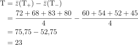
:::

```{r  class.source="watch-out"}
exp1data <- tibble(
  Temperatura = c("−", "+", "−", "+", "−", "+", "−", "+"),
  Concentração = c("−", "−", "+", "+", "−", "−", "+", "+"),
  Catalisador = c("−", "−", "−", "−", "+", "+", "+", "+"),
  I = c(59, 74, 50, 69, 50, 81, 46, 79),
  II = c(61, 70, 58, 67, 54, 85, 44, 81)
) %>% 
  rowwise() %>% 
  mutate(y = mean(c(I, II)),
         s2 = var(c(I, II))) 


exp1data %>% group_by(Temperatura) %>% 
  summarise(`Produção Média` = mean(y), .groups = "drop") %>%
  mutate(Temperatura = if_else(Temperatura == "−", 160, 180)) %>% 
  ggplot(aes(x = Temperatura, y = `Produção Média`)) + geom_point() +
  geom_line() + theme_bw() + xlim(c(156, 190)) + ylim(c(52, 80)) +
  geom_label(aes(x = Temperatura, y = `Produção Média`, label = `Produção Média`), vjust = -.5, hjust = c(.5, 1.1)) +
  geom_segment(aes(x = 180 + 1, y = 52.75, xend = 180 + 1, yend = 75.76),
                  lineend = "round", linejoin = "mitre", color = '#3c787f',
                  arrow = arrow(length = unit(0.15, "inches"),  ends = "both")) +
  geom_segment(aes(x = 180 + 1, y = 52.75, xend = 180 + 1, yend = 75.76), 
               color = '#3c787f',
               arrow = arrow(length = unit(.1, "inches"), angle = 90,  ends = "both")) +
  annotate('text', x = 180 + 2, y = (52.75+75.75)/2, label = "Efeito Temperatura = 23", 
           angle = -90)
```


## Estimativa do efeito da temperatura

```{r fig.height=4}
angle <- pi/2.75

cube <- tibble( 
  x1 = c(0, 0, 0, 1),
  x2 = c(0, 1, 1, 1),
  y1 = c(0, 0, 1, 0),
  y2 = c(1, 0, 1, 1),
  type = c('solid', 'solid', 'solid', 'solid')
) %>% 
  bind_rows(
    tibble(
      x1 = c(    .5*cos(angle),     .5*cos(angle),     .5*cos(angle), 1 + .5*cos(angle)),
      x2 = c(    .5*cos(angle), 1 + .5*cos(angle), 1 + .5*cos(angle), 1 + .5*cos(angle)),
      y1 = c(    .5*sin(angle),     .5*sin(angle), 1 + .5*sin(angle),     .5*sin(angle)),
      y2 = c(1 + .5*sin(angle),     .5*sin(angle), 1 + .5*sin(angle), 1 + .5*sin(angle)),
      type = c('dashed', 'dashed', 'solid', 'solid')
    )
  ) %>% 
  bind_rows(
    tibble(
      x1 = c(           0,             1,             0,             1),
      x2 = c(   .5*cos(angle), 1 + .5*cos(angle),     .5*cos(angle), 1 + .5*cos(angle)),
      y1 = c(           0,             0,             1,             1),
      y2 = c(   .5*sin(angle),     .5*sin(angle), 1 + .5*sin(angle), 1 + .5*sin(angle)),
      type = c('dashed', 'solid', 'solid', 'solid')
    )
  ) 


vertices <- 
  bind_rows(cube %>% select(x = x1, y = y1), 
            cube %>% select(x = x2, y = y2)) %>%  
  distinct() %>% mutate(N = 1:8, 
                        label = c("(1)", "c", "a", "b", "cb", "ab", "ac", "abc"),
                        yield = c(60, 54, 72, 52, 45, 83, 68, 80), 
                        yates =  c(1, 3, 2, 5, 7, 6, 4, 8))

delta <- .15
distances <- 
  tibble(
    x1 = c( 0   , -delta,  1 + delta),
    x2 = c( 1   , -delta,  1 + delta + .5*cos(angle)),
    y1 = c(-delta,  0   ,     0),
    y2 = c(-delta,  1   ,     .5*sin(angle))
  )

signal_labels <- bind_rows(distances %>% select(x = x1, y = y1), 
                           distances %>% select(x = x2, y = y2)) %>%  
  distinct() %>% mutate(label = c("−", "−", "−", "+", "+", "+"))

pT <- cube %>% 
  ggplot() +
  geom_polygon(aes(x = x, y = y), fill = "#3c763d50", 
               data = vertices %>% 
                 filter(str_detect(label, "a")) %>% 
                 arrange(match(label, c("a", "ac", "abc", "ab")))) +
  geom_polygon(aes(x = x, y = y), fill = "#bf630050", 
               data = vertices %>% 
                 filter(!str_detect(label, "a")) %>% 
                 arrange(match(label, c("(1)", "c", "cb", "b")))) +
  geom_segment(aes(x = x1, y = y1, xend = x2, yend = y2, linetype = type), color = gray(.5)) + coord_equal() +
  scale_linetype_identity() + theme_void() +
  geom_point(aes(x = x, y = y), data = vertices, size = 1.5, color = gray(.5)) + 
  geom_label(aes(x = x, y = y, label = yield), parse = FALSE, data = vertices,  
             size = 3.5, 
             fill =  c('black', 'black', 'black', 'white', 'black', 'black', 'black', 'black'), 
             color = c('white', 'white', 'white', 'black', 'white', 'white', 'white', 'white'), 
             fontface = "bold") +
  annotate('text', 
           x = c(.25*cos(angle), 1 + .25*cos(angle)),
           y = .5 + c(.25*sin(angle),.25*sin(angle)), 
           label =  c("−", "+"), size = 10) +
  annotate('text', x = .5, y = -.1, label =  "A", size = 5)

pT
```

:::{.center}
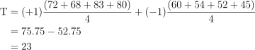
:::

## Geometria dos efeitos

:::{.center}
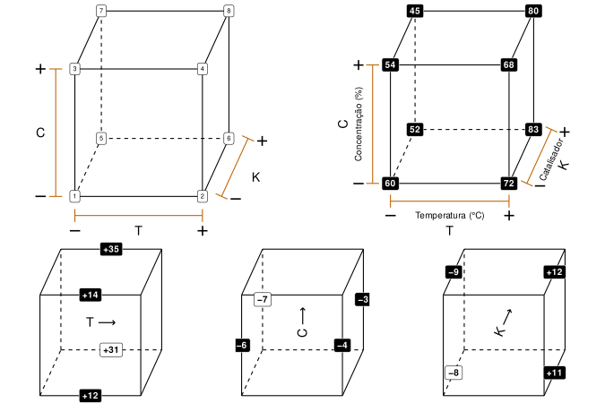
:::


```{r cube_temperatura, echo = FALSE, eval=FALSE}
angle <- pi/2.75

cube <- tibble( 
  x1 = c(0, 0, 0, 1),
  x2 = c(0, 1, 1, 1),
  y1 = c(0, 0, 1, 0),
  y2 = c(1, 0, 1, 1),
  type = c('solid', 'solid', 'solid', 'solid')
) %>% 
  bind_rows(
    tibble(
      x1 = c(    .5*cos(angle),     .5*cos(angle),     .5*cos(angle), 1 + .5*cos(angle)),
      x2 = c(    .5*cos(angle), 1 + .5*cos(angle), 1 + .5*cos(angle), 1 + .5*cos(angle)),
      y1 = c(    .5*sin(angle),     .5*sin(angle), 1 + .5*sin(angle),     .5*sin(angle)),
      y2 = c(1 + .5*sin(angle),     .5*sin(angle), 1 + .5*sin(angle), 1 + .5*sin(angle)),
      type = c('dashed', 'dashed', 'solid', 'solid')
    )
  ) %>% 
  bind_rows(
    tibble(
      x1 = c(           0,             1,             0,             1),
      x2 = c(   .5*cos(angle), 1 + .5*cos(angle),     .5*cos(angle), 1 + .5*cos(angle)),
      y1 = c(           0,             0,             1,             1),
      y2 = c(   .5*sin(angle),     .5*sin(angle), 1 + .5*sin(angle), 1 + .5*sin(angle)),
      type = c('dashed', 'solid', 'solid', 'solid')
    )
  ) 


vertices <- 
  bind_rows(cube %>% select(x = x1, y = y1), 
            cube %>% select(x = x2, y = y2)) %>%  
  distinct() %>% mutate(N = 1:8, 
                        label = c("(1)", "c", "a", "b", "cb", "ab", "ac", "abc"),
                        yield = c(60, 54, 72, 52, 45, 83, 68, 80), 
                        yates =  c(1, 3, 2, 5, 7, 6, 4, 8))

delta <- .15
distances <- 
  tibble(
    x1 = c( 0   , -delta,  1 + delta),
    x2 = c( 1   , -delta,  1 + delta + .5*cos(angle)),
    y1 = c(-delta,  0   ,     0),
    y2 = c(-delta,  1   ,     .5*sin(angle))
  )

signal_labels <- bind_rows(distances %>% select(x = x1, y = y1), 
                           distances %>% select(x = x2, y = y2)) %>%  
  distinct() %>% mutate(label = c("−", "−", "−", "+", "+", "+"))


pCube1 <- cube %>% 
  ggplot() +
  geom_segment(aes(x = x1, y = y1, xend = x2, yend = y2, linetype = type)) + coord_equal() +
  scale_linetype_identity() + theme_void() +
  geom_label(aes(x = x, y = y, label = yates), parse = FALSE, data = vertices,  
            size = 2.5) +
  geom_segment(aes(x = x1, y = y1, xend = x2, yend = y2), arrow = arrow(length = unit(0.1, "inches"),
                                                                        angle = 90, 
                                                                        ends = "both"), 
               data = distances, color = '#bf6300') +
  geom_text(aes(x = x, y = y, label = label), parse = FALSE, data = signal_labels, 
            nudge_x = 2*c(0, -0.06, .055, 0, -.06, .055),
            nudge_y = 2*c(-.05, 0.01, 0, -.05, 0.01, 0),
            size = 8) +
  annotate('text', 
           x = c(.5, -delta - .06*2, 1 + delta + .06 + .5*cos(angle)), 
           y = c(-delta -.06*2, .5, .15), 
           label = c("T", "C", "K"), size = 5) # "⊕⊝" +−+

#pCube1


pCube2 <- cube %>% 
  ggplot() +
  geom_segment(aes(x = x1, y = y1, xend = x2, yend = y2, linetype = type)) + coord_equal() +
  scale_linetype_identity() + theme_void() +
  geom_label(aes(x = x, y = y, label = yield), parse = FALSE, data = vertices,  
             size = 3.5, fill = 'black', color = 'white', fontface = "bold") +
  geom_segment(aes(x = x1, y = y1, xend = x2, yend = y2), arrow = arrow(length = unit(0.1, "inches"),
                                                                        angle = 90, 
                                                                        ends = "both"), 
               data = distances, color = '#bf6300') +
  geom_text(aes(x = x, y = y, label = label), parse = FALSE, data = signal_labels, 
            nudge_x = 2*c(0, -0.06, .055, 0, -.06, .055),
            nudge_y = 2*c(-.05, 0.01, 0, -.05, 0.01, 0),
            size = 8) +
  annotate('text', 
           x = c(.5, -.4, 1.25 + .5*cos(angle)), 
           y = c(-.4, .5, .15), angle = c(0,90, 360*angle/(2*pi)),
           label = c("T", "C", "K"), size = 5) + # "⊕⊝" +−+
  annotate('text', 
           x = c(.5, -delta - .06*2, 1 + delta - 0.0 + .5*cos(angle)), 
           y = c(-delta -.06*2, .5, .2), angle = c(0,90, 360*angle/(2*pi)),
           label = c("Temperatura (°C)", "Concentração (%)", "Catalisador"), 
           size = 3.5) # "⊕⊝" +−+−

#pCube2


pCube3 <- cube %>% 
  ggplot() +
  geom_segment(aes(x = x1, y = y1, xend = x2, yend = y2, linetype = type)) + coord_equal() +
  scale_linetype_identity() + theme_void() +
  annotate('text',
           x = c(.5 + .25*cos(angle)),
           y = c(.5 + .25*sin(angle)),
           label = "T ⟶", size = 5) +
  annotate('label', x = c(.5, .5 + .5*cos(angle), .5, .5 + .5*cos(angle)), 
                 y = c(0, .5*sin(angle), 1, 1 + .5*sin(angle)), 
                 label = c("+12", "+31", "+14", "+35"), parse = FALSE,
             size = 3.5, fill = c('black', 'white', 'black', 'black'), 
           color = c('white', 'black', 'white', 'white'), fontface = "bold") 
  

#pCube3


pCube4 <- cube %>% 
  ggplot() +
  geom_segment(aes(x = x1, y = y1, xend = x2, yend = y2, linetype = type)) + coord_equal() +
  scale_linetype_identity() + theme_void() +
  annotate('text',
           x = c(.5 + .25*cos(angle)),
           y = c(.5 + .25*sin(angle)), angle = 90,
           label = "C ⟶", size = 5) +
  annotate('label', x = c(0, .5*cos(angle), 1, 1 + .5*cos(angle)), 
           y = c(.5, .5 + .5*sin(angle),  .5, .5 + .5*sin(angle)), 
           label = c("−6", "−7", "−4", "−3"), parse = FALSE,
           size = 3.5, fill = c('black', 'white', 'black', 'black'), 
           color = c('white', 'black', 'white', 'white'), fontface = "bold") 


#pCube4


pCube5 <- cube %>% 
  ggplot() +
  geom_segment(aes(x = x1, y = y1, xend = x2, yend = y2, linetype = type)) + coord_equal() +
  scale_linetype_identity() + theme_void() +
  annotate('text',
           x = c(.5 + .25*cos(angle)),
           y = c(.5 + .25*sin(angle)), angle = 360*angle/(2*pi),
           label = "K ⟶", size = 5) +
  annotate('label', x = c(.25*cos(angle), 1 + .25*cos(angle), .25*cos(angle), 1 + .25*cos(angle)), 
           y = c(.25*sin(angle), .25*sin(angle), 1 + .25*sin(angle), 1 + .25*sin(angle)), 
           label = c("−8", "+11", "−9", "+12"), parse = FALSE,
           size = 3.5, fill = c('white','black',  'black', 'black'), 
           color = c('black', 'white',  'white', 'white'), fontface = "bold") 


#pCube5

plot_grid(
  plot_grid(pCube1, pCube2),
  plot_grid(pCube3, pCube4, pCube5, nrow = 1),
  ncol = 1, rel_heights = c(1.5, 1)
)
```

## Geometrias para a Temperatura


```{r}

angle <- pi/2.75

cube <- tibble( 
  x1 = c(0, 0, 0, 1),
  x2 = c(0, 1, 1, 1),
  y1 = c(0, 0, 1, 0),
  y2 = c(1, 0, 1, 1),
  type = c('solid', 'solid', 'solid', 'solid')
) %>% 
  bind_rows(
    tibble(
      x1 = c(    .5*cos(angle),     .5*cos(angle),     .5*cos(angle), 1 + .5*cos(angle)),
      x2 = c(    .5*cos(angle), 1 + .5*cos(angle), 1 + .5*cos(angle), 1 + .5*cos(angle)),
      y1 = c(    .5*sin(angle),     .5*sin(angle), 1 + .5*sin(angle),     .5*sin(angle)),
      y2 = c(1 + .5*sin(angle),     .5*sin(angle), 1 + .5*sin(angle), 1 + .5*sin(angle)),
      type = c('dashed', 'dashed', 'solid', 'solid')
    )
  ) %>% 
  bind_rows(
    tibble(
      x1 = c(           0,             1,             0,             1),
      x2 = c(   .5*cos(angle), 1 + .5*cos(angle),     .5*cos(angle), 1 + .5*cos(angle)),
      y1 = c(           0,             0,             1,             1),
      y2 = c(   .5*sin(angle),     .5*sin(angle), 1 + .5*sin(angle), 1 + .5*sin(angle)),
      type = c('dashed', 'solid', 'solid', 'solid')
    )
  ) 


vertices <- 
  bind_rows(cube %>% select(x = x1, y = y1), 
            cube %>% select(x = x2, y = y2)) %>%  
  distinct() %>% mutate(N = 1:8, 
                        label = c("(1)", "c", "a", "b", "cb", "ab", "ac", "abc"),
                        yield = c(60, 54, 72, 52, 45, 83, 68, 80), 
                        yates =  c(1, 3, 2, 5, 7, 6, 4, 8))

delta <- .15
distances <- 
  tibble(
    x1 = c( 0   , -delta,  1 + delta),
    x2 = c( 1   , -delta,  1 + delta + .5*cos(angle)),
    y1 = c(-delta,  0   ,     0),
    y2 = c(-delta,  1   ,     .5*sin(angle))
  )

signal_labels <- bind_rows(distances %>% select(x = x1, y = y1), 
                           distances %>% select(x = x2, y = y2)) %>%  
  distinct() %>% mutate(label = c("−", "−", "−", "+", "+", "+"))


pCube3 <- cube %>% 
  ggplot() +
  geom_segment(aes(x = x1, y = y1, xend = x2, yend = y2, linetype = type)) + coord_equal() +
  scale_linetype_identity() + theme_void() +
  annotate('text',
           x = c(.5 + .25*cos(angle)),
           y = c(.5 + .25*sin(angle)),
           label = "T ⟶", size = 5) +
  annotate('label', x = c(.5, .5 + .5*cos(angle), .5, .5 + .5*cos(angle)), 
           y = c(0, .5*sin(angle), 1, 1 + .5*sin(angle)), 
           label = c("+12", "+31", "+14", "+35"), parse = FALSE,
           size = 3.5, fill = c('black', 'white', 'black', 'black'), 
           color = c('white', 'black', 'white', 'white'), fontface = "bold") 


pT <- cube %>% 
  ggplot() +
  geom_polygon(aes(x = x, y = y), fill = "#3c763d50", 
               data = vertices %>% 
                 filter(str_detect(label, "a")) %>% 
                 arrange(match(label, c("a", "ac", "abc", "ab")))) +
  geom_polygon(aes(x = x, y = y), fill = "#bf630050", 
               data = vertices %>% 
                 filter(!str_detect(label, "a")) %>% 
                 arrange(match(label, c("(1)", "c", "cb", "b")))) +
  geom_segment(aes(x = x1, y = y1, xend = x2, yend = y2, linetype = type), color = gray(.5)) + coord_equal() +
  scale_linetype_identity() + theme_void() +
  geom_point(aes(x = x, y = y), data = vertices, size = 1.5, color = gray(.5)) + 
  geom_label(aes(x = x, y = y, label = yield), parse = FALSE, data = vertices,  
             size = 3.5, 
             fill =  c('black', 'black', 'black', 'white', 'black', 'black', 'black', 'black'), 
             color = c('white', 'white', 'white', 'black', 'white', 'white', 'white', 'white'), 
             fontface = "bold") +
  annotate('text', 
           x = c(.25*cos(angle), 1 + .25*cos(angle)),
           y = .5 + c(.25*sin(angle),.25*sin(angle)), 
           label =  c("−", "+"), size = 10) +
  annotate('text', x = .5, y = -.1, label =  "A", size = 5)

plot_grid(pCube3, pT, nrow = 1)
```


## Estimativa do efeito da interação Temperatura × Catalisador:

:::{.center}
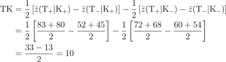
:::

```{r, class.source="watch-out", fig.height=3.5}
exp1data %>% 
  group_by(Catalisador, Temperatura) %>% 
  summarise(`Produção Média` = mean(y), .groups = 'drop') %>% 
  mutate(Temperatura = if_else(Temperatura == "−", 160, 180),
         Catalisador = if_else(Catalisador == "−", "A (−)", "B (+)")) %>%   
  ggplot(aes(x = Temperatura, y = `Produção Média`, color = Catalisador)) +
  geom_point() + geom_line() + theme_bw() +
  scale_color_manual(values = c("B (+)" = "#E7B800", "A (−)"  = "#FC4E07")) +
  geom_label(aes(x = Temperatura, y = `Produção Média`, label =  `Produção Média`), 
             inherit.aes = FALSE, vjust = -.5,  hjust = c(0,1,0,1)) + lims(x = c(157, 183), y = c(48, 84)) +
  theme(legend.text=element_text(size=10))
```

## Interação Temperatura × Catalisador

```{r fig.height=4}
pAB <- cube %>% 
  ggplot() +
  geom_polygon(aes(x = x, y = y), fill = "#3c763d50", 
               data = vertices %>% 
                 filter(label %in% c("(1)", "ab", "abc", "c")) %>% 
                 arrange(match(label, c("(1)", "ab", "abc", "c")))) +
  geom_polygon(aes(x = x, y = y), fill = "#bf630050", 
               data = vertices %>%  
                 filter(label %in% c("a", "ac", "cb", "b")) %>% 
                 arrange(match(label, c("a", "ac", "cb", "b")))) +
  geom_segment(aes(x = x1, y = y1, xend = x2, yend = y2, linetype = type), color = gray(.5)) + coord_equal() +
  scale_linetype_identity() + theme_void() +
  geom_point(aes(x = x, y = y), data = vertices, size = 1.5, color = gray(.5)) + 
  geom_label(aes(x = x, y = y, label = yield), parse = FALSE, data = vertices,  
             size = 3.5, 
             fill =  c('black', 'black', 'black', 'white', 'black', 'black', 'black', 'black'), 
             color = c('white', 'white', 'white', 'black', 'white', 'white', 'white', 'white'), 
             fontface = "bold") +
  annotate('text', x = .5, y = -.1, label =  "TK", size = 5) 

pAB
```

:::{.center}
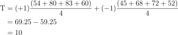
:::

## Interação Tripla TCK

```{r cube_tck, echo = FALSE, fig.height= 4, cache=TRUE}
pABC <- cube %>% 
  ggplot() +
  geom_segment(aes(x = x, y = y, xend = xend, yend = yend, linetype = linetype), color = '#bf6300', 
               data = tibble(
                 x = c(0,0,0, .5*cos(angle), .5*cos(angle), 1), 
                 y = c(0,0,0, 1 + .5*sin(angle), 1 + .5*sin(angle),1), 
                 xend = c(1, 1 + .5*cos(angle), .5*cos(angle), 1,1 + .5*cos(angle),1 + .5*cos(angle)), 
                 yend = c(1, .5*sin(angle), 1 + .5*sin(angle), 1, .5*sin(angle), .5*sin(angle)),
                 linetype =  c('dashed', 'dashed', 'dashed', 'dashed', 'dashed', 'dashed')
               ))  + 
  geom_segment(aes(x = x, y = y, xend = xend, yend = yend, linetype = linetype), color = "#3c763d", 
               data = tibble(
                 x = c(0,0,1,1,.5*cos(angle), 0), 
                 y = c(1,1,0,0,.5*sin(angle), 1), 
                 xend = c(1, .5*cos(angle), 1 + .5*cos(angle),.5*cos(angle),1 + .5*cos(angle),1 + .5*cos(angle)), 
                 yend = c(0, .5*sin(angle), 1 + .5*sin(angle),.5*sin(angle),1 + .5*sin(angle),1 + .5*sin(angle)), 
                 linetype = c('solid', 'solid', 'solid', 'solid', 'solid', 'solid')
               )) +
  # geom_polygon(aes(x = x, y = y), fill = "#3c763d50", 
  #              data = vertices %>% 
  #                filter(str_detect(label, "a")) %>% 
  #                arrange(match(label, c("a", "ac", "abc", "ab")))) +
  # geom_polygon(aes(x = x, y = y), fill = "#bf630050", 
  #              data = vertices %>% 
  #                filter(!str_detect(label, "a")) %>% 
  #                arrange(match(label, c("(1)", "c", "cb", "b")))) +
  geom_segment(aes(x = x1, y = y1, xend = x2, yend = y2, linetype = type), color = gray(.75)) + coord_equal() +
  scale_linetype_identity() + theme_void() +
  geom_label(aes(x = x, y = y, label = yield,
                 fill =  c('white', 'black', 'black', 'black', 'white', 'white', 'white', 'black')), 
                 color = c('black', 'black', 'black', 'black', 'black', 'black', 'black', 'black'),
             parse = FALSE, data = vertices,  
             size = 3.5, 
             fontface = "bold") +
  guides(fill = "none") +
  scale_fill_manual(values = c("white" = "#bf6300", "black" = "3c763d")) +
  annotate('text', x = .5, y = -.1, label =  "TCK", size = 5)

pABC
```

:::{.center}
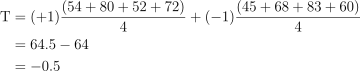
:::

## Algoritmo de Yates

:::{.text}
```{r}
yates.header <- withTags(table(
  class = 'display', style="font-size:12px;width:600px",
  thead(
    tr(
      th(style="text-align: center;vertical-align: middle;", colspan = 1, ' '),
      th(style="text-align: center;vertical-align: middle;", colspan = 1, 'Média'),
      th(style="text-align: center;vertical-align: middle;", colspan = 1, 'T'),
      th(style="text-align: center;vertical-align: middle;", colspan = 1, 'C'),
      th(style="text-align: center;vertical-align: middle;", colspan = 1, 'K'),
      th(style="text-align: center;vertical-align: middle;", colspan = 1, 'T×C'),
      th(style="text-align: center;vertical-align: middle;", colspan = 1, 'T×K'),
      th(style="text-align: center;vertical-align: middle;", colspan = 1, 'C×K'),
      th(style="text-align: center;vertical-align: middle;", colspan = 1, 'T×C×K'),
      th(style="text-align: center;vertical-align: middle;", colspan = 1, 'Produção Média')
    )),
  tfoot(
    tr(
      th(style="text-align:right;font-size:12px;border-bottom:solid 1px",   
         colspan = 1, HTML('<stront>Divisor</strong>')),
      th(style="text-align:center;font-size:12px;border-bottom:solid 1px", colspan = 1, '8'),
      th(style="text-align:center;font-size:12px;border-bottom:solid 1px", colspan = 1, '4'),
      th(style="text-align:center;font-size:12px;border-bottom:solid 1px", colspan = 1, '4'),
      th(style="text-align:center;font-size:12px;border-bottom:solid 1px", colspan = 1, '4'),
      th(style="text-align:center;font-size:12px;border-bottom:solid 1px", colspan = 1, '4'),
      th(style="text-align:center;font-size:12px;border-bottom:solid 1px", colspan = 1, '4'),
      th(style="text-align:center;font-size:12px;border-bottom:solid 1px", colspan = 1, '4'),
      th(style="text-align:center;font-size:12px;border-bottom:solid 1px", colspan = 1, '4'),
      th(style="text-align:center;font-size:12px;border-bottom:solid 1px", colspan = 1, '')
    ))
))

yates.table <- tibble(
  `Free` = " ",
  `Média` = 1,
  `T` = c("−", "+", "−", "+", "−", "+", "−", "+"),
  `C` = c("−", "−", "+", "+", "−", "−", "+", "+"),
  `K` = c("−", "−", "−", "−", "+", "+", "+", "+"),
  I = c(59, 74, 50, 69, 50, 81, 46, 79),
  II = c(61, 70, 58, 67, 54, 85, 44, 81)) %>% 
  mutate(`T` = if_else(`T` == "−", -1, 1),
         `C` = if_else(`C` == "−", -1, 1),
         `K` = if_else(`K` == "−", -1, 1),
         `T×C`   = `T` * C,
         `T×K`   = `T` * K,
         `C×K`   =  C  * K,
         `T×C×K` = `T` * C * K) %>% 
  rowwise() %>% 
  mutate(`Produção Média` = mean(c(I, II))) %>% 
  ungroup() %>% 
  select(-I,-II)  

yates.table %>% 
  DT::datatable(escape = FALSE, rownames = FALSE, 
                options = list(autoWidth = FALSE,    
                               fixedColumns = TRUE,
                               dom = 't',
                               columnDefs = list(list(className = 'dt-center', targets = 0:9),
                                                 list(bSortable = FALSE, targets = 0:9))#,
                               # rowCallback=JS(
                               # 'function(row,data) {
                               #    if($(row)["0"]["_DT_RowIndex"] % 2 <1) 
                               #    $(row).css("background","#edf4f5") //#f2f9ec
                               #  }')
                               ),    
                container = yates.header,
                class = "compact hover", 
                style = 'default') %>% 
  formatStyle(columns = 0:9, 'font-size' = '12px') %>% 
  formatStyle(3:9,
    color = styleInterval( -1, c('red', 'black')),
    fontWeight = 'bold'
    # = styleInterval(c(-1, 1), c('bold', 'bold'))
  ) %>% 
  formatStyle(3, background = styleInterval(-1, c('#bf630015', '#dff0d8'))) %>% 
  formatStyle(10, 3,
              backgroundColor = styleEqual(c(-1, 1), c('#bf630015', '#dff0d8'))
    )
  
```

<br>

:::{.center}

:::

<!-- $$ -->
<!-- \text{T} = (+1)\frac{(72 + 68 + 83 + 80)}{4} + (-1)\frac{(60 + 54 + 52 + 45)}{4} = 75.75 -52.75 = 23  -->
<!-- $$ -->
:::


## Variância e Erro padrão 

:::{.text}

<!-- $$ -->
<!-- S^2 = \frac{2 + 8 + 32 + 2 + 8 + 8 + 2 + 2}{8} = 8\quad \therefore\ \quad S = \sqrt{8} \approx 2.8 -->
<!-- $$ -->

:::{.center}
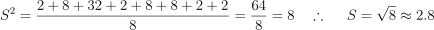
:::


com $8$ graus de liberdade. 

Para os efeitos:

:::{.center}
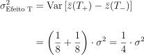
:::

<!-- $$ -->
<!-- \begin{align*} -->
<!-- \sigma^2_{\text{Efeito T}} &= \text{Var}\left[\bar{z}(T_+) - \bar{z}(T_-)\right] \\ -->
<!--  \\ -->
<!-- &= \left(\frac{1}{8} + \frac{1}{8}\right)\cdot \sigma^2 -->
<!-- \end{align*} -->
<!-- $$ -->

Portanto:

:::{.center}
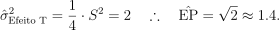
:::

<!-- $$ -->
<!-- {\hat{\sigma}^2}_{\text{Efeito T}} = \frac{2}{8}\cdot S^2 = 2 \quad \therefore \quad \hat{\text{EP}} = \sqrt{2} \approx 1.4. -->
<!-- $$ -->

:::


## Resumo dos Efeitos

```{r}

resumo.header <- withTags(table(
  class = 'display', style="font-size:12px;width:350px",
  thead(
    tr(
      th(style="text-align: center;vertical-align: middle;", colspan = 2, 'Efeito'),
      th(style="text-align: center;vertical-align: middle;", colspan = 1, 'Estimativa'),
      th(style="text-align: center;vertical-align: middle;", colspan = 1, 'Estimativa ± EP'))
    )
  ))


yates.table %>% 
  select(Média:`Produção Média`) %>% 
  rowwise() %>% 
  summarise(across(Média:`T×C×K`, ~ prod(.x, `Produção Média`)))  %>% 
  summarise(Média = Média/8, across(T:`T×C×K`, ~ .x/4)) %>% 
  summarise(across(everything(), sum)) %>% 
  pivot_longer(everything(), names_to = "Efeito", values_to = 'Estimativa') %>% 
  mutate(`Estimativa ± Desvio Padrão` = paste0(format(Estimativa, digits = 3), " ± ", 
                                               format(c(sqrt(2)/2, rep(sqrt(2), 7)), digits = 2)),
         Estimativa = format(Estimativa, digits = 3)) %>% 
  #mutate(Grupo = c(' ', rep('Efeitos Principais', 3), rep('Interação de 2 fatores', 3), 'Interação de 3 fatores')) %>%
  DT::datatable(escape = FALSE, rownames = TRUE, colnames = FALSE,
                options = list(autoWidth = FALSE,   
                               fixedColumns = TRUE,
                               dom = 't',
                               columnDefs = list(list(className = 'dt-left', targets = 1),
                                                 list(className = 'dt-right', targets = 2:3),
                                                 list(bSortable = FALSE, targets = 0:3)) #,
                               # rowCallback=JS(
                               # 'function(row,data) {
                               #    if($(row)["0"]["_DT_RowIndex"] % 2 <1) 
                               #    $(row).css("background","#edf4f5") //#f2f9ec
                               #  }')
                ),    
                container = resumo.header,
                class = "compact hover", 
                style = 'default') %>%
  formatStyle(columns = 0:3, 'font-size' = '12px') %>% 
  formatStyle(columns = 1:2, 'border-right' = 'solid 1px', 'border-right-color' = 'black') %>% 
  formatStyle(2, 1,
              backgroundColor = styleInterval(0, c('#bf630015', '#dff0d8'))) %>% 
  formatStyle(2:3, color = styleRow(c(2,3,6), values = "red"))
```


:::{.text}
__OBS:__

- Os **efeitos principais** de um fator devem ser **individualmente** interpretados somente se **não existem evidências de uma ou mais interações**. 
- Quando **existem** tal interações, as variáveis relacionadas devem ser consideradas conjuntamente. 
:::

## Distribuição dos efeitos

::::{.text}

É importante ter algum método para determinar qual efeito é provavelmente real e qual pode ser explicado por variação aleatória. Uma regra grosseira é que efeitos maiores que 2 ou 3 vezes seu desvio padrão  não são facilmente explicados pela variabilidade do processo. 

:::{.mlkinfobox}

Mais precisamente. assumindo  variáveis **NIID**, cada relação efeito/SE(efeito)  terá distribuição $t$ com $\nu = 8$ graus de liberdade.

Um valor "significante" de $t$ ao nível de $5\%$ é $2.3$, isto é

$$
\text{Pr}(|t_g| > 2.3) = 0.05
$$
 de modo que um intervalor de confiança  para os efeitos apresentados na tabela seria entimado $\pm 2.3 \cdot 1.41  = \pm 3.2$. Contudo.
 
:::
 
 
::::

## Distribuição dos efeitos

:::{.text}

Comparação dos efeitos com uma distribuição de referência $t$ com $8$ graus de liberdade e fator de escala $1.4$:

```{r}
yates.table %>% 
  select(Média:`Produção Média`) %>% 
  rowwise() %>% 
  summarise(across(Média:`T×C×K`, ~ prod(.x, `Produção Média`)))  %>% 
  summarise(Média = Média/8, across(T:`T×C×K`, ~ .x/4)) %>% 
  summarise(across(everything(), sum)) %>% 
  pivot_longer(everything(), names_to = "Efeito", values_to = 'Estimativa') %>% 
  filter(Efeito != 'Média') %>% mutate(altura = c(0, 0, 0, .02, 0, 0, 0)) %>% 
  ggplot() + stat_function(fun = ~dt(.x, df = 8, ncp = 1.4), xlim = c(-5, 26), n = 1000, size = 1, alpha = .75) + 
  geom_label_repel(aes(x = Estimativa, y = altura, label = Efeito), 
                  size = 5, 
                  box.padding = .5, 
                  max.overlaps = Inf,
                  #arrow = arrow(type = "closed", length = unit(0.03, "npc"))
                  #nudge_x = .015,
                  nudge_y = .05
                  ) +
  geom_point(aes(x = Estimativa, y = altura, color = factor(Efeito)), size = 5) + 
  guides(color = "none") + 
  theme_bw() + labs(y = 'Densidade') + 
  scale_color_brewer("Set1", type = "qual")
```

:::

## Conclusões
:::{.text}

1. O efeito de mudar a **Concentração** (C) nos limites estudados é **reduzir** a **produção** por aproximadamente **cinco unidades**. E isto acontece sem evidência de relação entre os níveis das outras variáveis.
1. Os efeitos da **Temperatura** (T)  e **Catalizador** (K) não podem ser interpretados separadamente por causa da interação TK. Com o **catalisador A** o efeito da temperatura  é 13 unidades, contudo com o **catalisador B** é de 33 unidades. 
:::

```{r, class.source="watch-out", fig.height=3.5, fig.width=9}

p1 <- exp1data %>% 
  group_by(Catalisador, Temperatura) %>% 
  summarise(`Produção Média` = mean(y), .groups = 'drop') %>% 
  mutate(Temperatura = if_else(Temperatura == "−", 160, 180),
         Catalisador = if_else(Catalisador == "−", "A (-)", "B (+)")) %>%   
  ggplot(aes(x = Temperatura, y = `Produção Média`, color = Catalisador)) +
  geom_point() + geom_line() + theme_bw() +
  scale_color_manual(values = c("B (+)" = "#E7B800", "A (-)"  = "#FC4E07")) +
  geom_label(aes(x = Temperatura, y = `Produção Média`, label =  `Produção Média`), 
             inherit.aes = FALSE, vjust = -.5,  hjust = c(0,1,0,1)) + lims(x = c(157, 183), y = c(48, 84)) +
  theme(legend.text=element_text(size=10), legend.position = "top") +
  xlab("Temperatura (°C)") 


p2 <- tibble(
  x =    c(0, 0, 1, 1),
  y =    c(0, 1, 1, 0),
  xend = c(0, 1, 1, 0),
  yend = c(1, 1, 0, 0)) %>% 
  ggplot() + 
  geom_segment(aes(x = x, y = y, xend = xend, yend = yend)) +
  geom_label(x = c(0, 0, 1, 1),
             y = c(0, 1, 1, 0),
             label = c(57.0, 48.5, 81.5, 70.0)) +
  geom_label(x = c(0, .5,  1, .5),
             y = c(.5,  1, .5,  0),
             label = c(48.5 - 57, 81.5 - 48.5, 81.5 - 70, 70 - 57),
             color = 'white', fill = "black") +
  theme_void() +
  annotate('text', x = .5, y = -.07, label = "Temperatura (°C), T", angle = 0) +
  annotate('text', x = -.1,y = .5, label = "Catalisador, K", angle = 90) + coord_equal()

plot_grid(p2, p1, rel_widths = c(1, 1))

```


## Segundo experimento (Exercício)

:::{.mlkexbox .textbox}
O gerente de uma fábrica de refrigerantes deseja solucionar um problema recentemente detectado no processo de enchimento de garrafas *pet* de $2~\text{litros}$ ($2000~\text{ml}$).

As especificações do produto permitem
que cada garrafa contenha
$$
2000\ \text{ml} \pm 10\ \text{ml}.
$$

Um estudo recente revelou que $10\%$ da produção (de $50$ milhões de garrafa por ano) estava acima do limite superior de especificação. Isso significa um **desperdício** de, pelo menos, $50$ **mil litros de refrigerante**, ou, $25$ **mil garrafas pet ao ano.**

<br>
O gerente, tendo ouvido uma palestra sua sobre planejamento de experimentos industriais, recorre a você para ajudá-lo a minimizar o desperdício da fábrica. **O que você faria?**
:::


## Segundo experimento: dados

```{r exp2data, echo=FALSE}

header.exp2data <- withTags(table(
  class = 'display', style="font-size:12px;width:500px",
  thead(
    tr(
      th(style="text-align: center;vertical-align: middle;", rowspan = 2, 'Experimento'),
      th(style="text-align: center;vertical-align: middle;", colspan = 3, 'Fatores'),
      th(style="text-align: center;vertical-align: middle;", colspan = 2, 'Desvio no volume')),
    tr(
      th(style="text-align: center;border-left:solid 1px", colspan = 1, "A"),
      th(style="text-align: center;", colspan = 1, "B"),
      th(style="text-align: center", colspan = 1, "C"),
      th(style="text-align: center;border-left:solid 1px", colspan = 1, "Replica 1"),
      th(style="text-align: center", colspan = 1, "Replica 2")
    )
  )
))

exp2data <- tibble(
    Run  = 1:8,
    T = c("−", "+", "−", "+", "−", "+", "−", "+"),
    C = c("−", "−", "+", "+", "−", "−", "+", "+"),
    K = c("−", "−", "−", "−", "+", "+", "+", "+"),
    I = c(-3, 0, -1, 2, -1, 2, 1, 6),
    II = c(-1, 1, 0, 3, 0, 1, 1, 5)
)

exp2data %>% 
      DT::datatable(escape = FALSE, rownames = FALSE, 
                options = list(autoWidth = FALSE,    
                               fixedColumns = TRUE,
                               dom = 't',
                               columnDefs = list(list(className = 'dt-center', targets = 0:5),
                                                 list(bSortable = FALSE, targets = 0:5))#,
                               # rowCallback=JS(
                               # 'function(row,data) {
                               #    if($(row)["0"]["_DT_RowIndex"] % 2 <1) 
                               #    $(row).css("background","#edf4f5") //#f2f9ec
                               #  }')
                               ),    
                container = header.exp2data,
                class = "compact hover", 
                style = 'default') %>% 
  formatStyle(columns = 0:5, 'font-size' = '12px') %>%
  formatStyle(c(2,5), 'border-left' = "solid 1px")
```


```{r exp2a, echo=FALSE}
header.exp2 <- withTags(table(
  class = 'display', style="font-size:12px;width:500px",
  thead(
    tr(
      th(style="text-align: center;vertical-align: middle;", colspan = 4, 'Níveis dos fatores')),
    tr(
      th(style="text-align: center;vertical-align: middle;", colspan = 1, 'Código'),
      th(style="text-align: center;vertical-align: middle;", colspan = 1, 'Descrição'),
      th(style="text-align: center;vertical-align: middle;", colspan = 1, '−'),
      th(style="text-align: center;vertical-align: middle;", colspan = 1, '+')
    )
  )
))

exp2 <- tibble(C = c('A', 'B', 'C'),
         D = c('Pressão do gás (psi)', 'Pressão do líquido (psi)', 'Velocidade (garrafas/min)'),
         L = c(10, 25, 200),
         H = c(12, 30, 250))
         
exp2 %>% DT::datatable(rownames = FALSE, 
                options = list(autoWidth = FALSE,    
                               fixedColumns = TRUE,
                               dom = 't',
                               columnDefs = list(list(className = 'dt-center', targets = c(0,2,3)),
                                                 list(bSortable = FALSE, targets = 0:3))
                               ),    
                container = header.exp2,
                class = "compact hover", 
                style = 'default') %>% 
  formatStyle(columns = 0:3, 'font-size' = '12px')
```


## {.fullpage .grad}

:::{class="topic"}
<span style='color:black'> Próxima aula --- </span><br> 
: Modelos lineares e a série 2<sup>3</sup>
:::

## Fatoriais 2<sup>4</sub>

::::{.text}
Para exemplificar a análise de um plano fatorial 2<sup>4</sup>, considere o seguinte cenário para um experimento:

:::{.mlkinfobox}
Um dos passos iniciais na produção de circuitos integrados é o crescimento de uma camada epitaxial em placas (*wafers*) de silicone polidas. A espessura desejável dessas camadas é de $14.5 \pm 0.5\ \mu m$.

A forma como estão sendo produzidas essas camadas tem levado a uma variação maior que o limite especificado de $1\ \mu m$.


O objetivo dos estatísticos da empresa é descobrir quais os níveis dos fatores **método de rotação** (A), **posição do jato de vapor** (B), **temperatura de deposição** (C) e **tempo de deposição** (D), que minimizariam a irregularidade das espessuras das camadas, **mantendo a espessura média o mais perto possível do valor nominal de** $14.5\ \mu m$.

:::
:::: 

## Experimento

::::{.text}
**Dois níveis** de cada fator foram escolhidos e um experimento foi executado com uma estrutura fatorial 2<sup>4</sup> em **seis réplicas**.

Uma característica importante do problema apresentado é o duplo
objetivo: 

- Diminuir a **variabilidade** do processo;
- Manter a **média** da produção o mais perto possível de um **alvo
nominal**.
::::

## Fatoriais 2<sup>4</sub>

:::{.text .mlkinfobox}

Em **engenharia de qualidade**, esse problema é conhecido como sendo do
tipo **melhor-nominal** (*nominal-the-
best*), por seu objetivo de encontrar condições de produção que atinjam (ou mantenham) um **alvo nominal especificado**.

:::

:::{.text}
A **novidade**, em comparação com os exemplos de experimentos vistos na
parte de fatorial 2<sup>3</sup>, é a necessidade de estudar a **variância** do processo --- por isso foram feitas tantas réplicas (6).

Obviamente, o estudo de variabilidade de processos não é restrito a estruturas 2<sup>4</sup>, ou a qualquer outra estrutura em particular. Os dados do experimento são fornecidos em seguida.
:::
<!-- ## Exemplos de boxes -->


## Dados

:::{.text}
```{r dados2e4, echo=FALSE}

header.dados2e4 <- withTags(table(
  class = 'display', style="font-size:12px;width:500px",
  thead(
    tr(
      th(style="text-align: center;vertical-align: middle;", rowspan = 2, 'Experimento'),
      th(style="text-align: center;vertical-align: middle;", colspan = 4, 'Fatores'),
      th(style="text-align: center;vertical-align: middle;", colspan = 6, 'Réplicas'),
      th(style="text-align: center;vertical-align: middle;", colspan = 3, 'Respostas')),
    tr(
      #th(style="text-align: center;", colspan = 1, "Experimento"),
      th(style="text-align: center;border-left:solid 1px", colspan = 1, "A"),
      th(style="text-align: center;", colspan = 1, "B"),
      th(style="text-align: center", colspan = 1, "C"),
      th(style="text-align: center", colspan = 1, "D"),
      th(style="text-align: center;border-left:solid 1px", colspan = 1, "1"),
      th(style="text-align: center", colspan = 1, "2"),
      th(style="text-align: center", colspan = 1, "3"),
      th(style="text-align: center", colspan = 1, "4"),
      th(style="text-align: center", colspan = 1, "5"),
      th(style="text-align: center", colspan = 1, "6"),
      th(style="text-align: center;border-left:solid 1px", colspan = 1, HTML('<span class="katex"><span class="katex-mathml"><math><semantics><mrow><msub><mover accent="true"><mrow><mi>y</mi></mrow><mo>¯</mo></mover><mi>i</mi></msub></mrow><annotation encoding="application/x-tex">\bar{y}_i</annotation></semantics></math></span><span class="katex-html" aria-hidden="true"><span class="strut" style="height: 0.56778em;"></span><span class="strut bottom" style="height: 0.76222em; vertical-align: -0.19444em;"></span><span class="base textstyle uncramped"><span class="mord"><span class="mord accent"><span class="vlist"><span class="" style="top: 0em;"><span class="fontsize-ensurer reset-size5 size5"><span class="" style="font-size: 0em;">&#8203;</span></span><span class="mord textstyle cramped"><span class="mord mathit" style="margin-right: 0.03588em;">y</span></span></span><span class="" style="top: 0em; margin-left: 0.11112em;"><span class="fontsize-ensurer reset-size5 size5"><span class="" style="font-size: 0em;">&#8203;</span></span><span class="accent-body"><span class="">¯</span></span></span><span class="baseline-fix"><span class="fontsize-ensurer reset-size5 size5"><span class="" style="font-size: 0em;">&#8203;</span></span>&#8203;</span></span></span><span class="vlist"><span class="" style="top: 0.15em; margin-right: 0.05em;"><span class="fontsize-ensurer reset-size5 size5"><span class="" style="font-size: 0em;">&#8203;</span></span><span class="reset-textstyle scriptstyle cramped"><span class="mord mathit">i</span></span></span><span class="baseline-fix"><span class="fontsize-ensurer reset-size5 size5"><span class="" style="font-size: 0em;">&#8203;</span></span>&#8203;</span></span></span></span></span></span>')),
      th(style="text-align: center;", colspan = 1, HTML('<span class="katex"><span class="katex-mathml"><math><semantics><mrow><msubsup><mi>S</mi><mi>i</mi><mn>2</mn></msubsup></mrow><annotation encoding="application/x-tex">S^2_i</annotation></semantics></math></span><span class="katex-html" aria-hidden="true"><span class="strut" style="height: 0.814108em;"></span><span class="strut bottom" style="height: 1.07277em; vertical-align: -0.258664em;"></span><span class="base textstyle uncramped"><span class="mord"><span class="mord mathit" style="margin-right: 0.05764em;">S</span><span class="vlist"><span class="" style="top: 0.258664em; margin-left: -0.05764em; margin-right: 0.05em;"><span class="fontsize-ensurer reset-size5 size5"><span class="" style="font-size: 0em;">&#8203;</span></span><span class="reset-textstyle scriptstyle cramped"><span class="mord mathit">i</span></span></span><span class="" style="top: -0.363em; margin-right: 0.05em;"><span class="fontsize-ensurer reset-size5 size5"><span class="" style="font-size: 0em;">&#8203;</span></span><span class="reset-textstyle scriptstyle uncramped"><span class="mord mathrm">2</span></span></span><span class="baseline-fix"><span class="fontsize-ensurer reset-size5 size5"><span class="" style="font-size: 0em;">&#8203;</span></span>&#8203;</span></span></span></span></span></span>')),
      th(style="text-align: center", colspan = 1, HTML('<span class="katex"><span class="katex-mathml"><math><semantics><mrow><mi>ln</mi><msubsup><mi>S</mi><mi>i</mi><mn>2</mn></msubsup></mrow><annotation encoding="application/x-tex">\\ln S^2_i</annotation></semantics></math></span><span class="katex-html" aria-hidden="true"><span class="strut" style="height: 0.814108em;"></span><span class="strut bottom" style="height: 1.07277em; vertical-align: -0.258664em;"></span><span class="base textstyle uncramped"><span class="mop">ln</span><span class="mord"><span class="mord mathit" style="margin-right: 0.05764em;">S</span><span class="vlist"><span class="" style="top: 0.258664em; margin-left: -0.05764em; margin-right: 0.05em;"><span class="fontsize-ensurer reset-size5 size5"><span class="" style="font-size: 0em;">&#8203;</span></span><span class="reset-textstyle scriptstyle cramped"><span class="mord mathit">i</span></span></span><span class="" style="top: -0.363em; margin-right: 0.05em;"><span class="fontsize-ensurer reset-size5 size5"><span class="" style="font-size: 0em;">&#8203;</span></span><span class="reset-textstyle scriptstyle uncramped"><span class="mord mathrm">2</span></span></span><span class="baseline-fix"><span class="fontsize-ensurer reset-size5 size5"><span class="" style="font-size: 0em;">&#8203;</span></span>&#8203;</span></span></span></span></span></span>'))
    )
  )
))


dados2e4 <- as_tibble(
matrix(c(
1, "−", "−", "−", "+", 14.506, 14.153, 14.134, 14.339, 14.953, 15.455, 
2, "−", "−", "−", "−", 12.886, 12.963, 13.669, 13.869, 14.145, 14.007, 
3, "−", "−", "+", "+", 13.926, 14.052, 14.392, 14.428, 13.568, 15.074, 
4, "−", "−", "+", "−", 13.758, 13.992, 14.808, 13.554, 14.283, 13.904, 
5, "−", "+", "−", "+", 14.629, 13.940, 14.466, 14.538, 15.281, 15.046, 
6, "−", "+", "−", "−", 14.059, 13.989, 13.666, 14.706, 13.863, 13.357, 
7, "−", "+", "+", "+", 13.800, 13.896, 14.887, 14.902, 14.461, 14.454, 
8, "−", "+", "+", "−", 13.707, 13.623, 14.210, 14.042, 14.881, 14.378, 
9, "+", "−", "−", "+", 15.050, 14.361, 13.916, 14.431, 14.968, 15.294, 
10, "+", "−", "−", "−", 14.249, 13.900, 13.065, 13.143, 13.708, 14.255,
11, "+", "−", "+", "+", 13.327, 13.457, 14.368, 14.405, 13.932, 13.552,
12, "+", "−", "+", "−", 13.605, 13.190, 13.695, 14.259, 14.428, 14.223,
13, "+", "+", "−", "+", 14.274, 13.904, 14.317, 14.754, 15.188, 14.923,
14, "+", "+", "−", "−", 13.775, 14.586, 14.379, 13.775, 13.382, 13.382,
15, "+", "+", "+", "+", 13.723, 13.914, 14.913, 14.808, 14.469, 13.973,
16, "+", "+", "+", "−", 14.031, 14.467, 14.675, 14.252, 13.658, 13.578),
nrow = 16,byrow = TRUE, 
dimnames = list(1:16, c("run", "A", "B", "C", "D", "R1", "R2", "R3", "R4", "R5", "R6")))) %>% 
  mutate(across(R1:R6, as.numeric)) %>% 
  rowwise() %>% 
  mutate(ybar = mean(c_across(R1:R6)),
         S2i = var(c_across(R1:R6)),
         lnS2i = log(S2i)) %>% 
  ungroup()


# dados2e4 <- tibble(
#     Run  = 1:16,
#     A = c("−", "−", "−", "−", "−", "−", "−", "−", "+", "+", "+", "+", "+", "+", "+", "+"),
#     B = c("−", "−", "−", "−", "+", "+", "+", "+", "−", "−", "−", "−", "+", "+", "+", "+"),
#     C = c("−", "−", "+", "+", "−", "−", "+", "+", "−", "−", "+", "+", "−", "−", "+", "+"),
#     D = c("−", "+", "−", "+", "−", "+", "−", "+", "−", "+", "−", "+", "−", "+", "−", "+"),
#     ybar = c(14.59,  13.59, 14.24, 14.05, 14.65, 13.94, 14.40, 14.14, 14.67,  13.72,  13.84, 13.90, 14.56, 13.88, 14.30, 14.11),
#     S2 = c(.270, .291, .268, .197, .221, .205,  .222, .215, .269, .272, .220, .229, .227, .253, .250, .192),
#     LnS2 =  c(-1.309, -1.234, -1.317, -1.625,-1.510, -1.585, -1.505, -1.537, -1.313,  -1.302, -1.514, -1.474, -1.483, -1.374, -1.386, -1.650))

dados2e4 %>% 
      mutate(ybar = format(round(ybar, 2), digits = 4),
             S2i = format(round(S2i,3), digits = 3),
             lnS2i = format(round(lnS2i,3), digits = 4)) %>% 
      DT::datatable(escape = FALSE, rownames = FALSE, 
                options = list(autoWidth = FALSE,    
                               fixedColumns = TRUE,
                               dom = 't',
                               pageLength = 16,
                               columnDefs = list(list(className = 'dt-center', targets = 0:13),
                                                 list(bSortable = FALSE, targets = 0:13)),
                               rowCallback=JS(
                               'function(row,data) {
                                  if($(row)["0"]["_DT_RowIndex"] % 2 <1)
                                  $(row).css("background","#edf4f5") //#f2f9ec
                                }')
                               ),    
                container = header.dados2e4,
                class = "compact hover", 
                style = 'default') %>% 
  formatStyle(columns = 0:13, 'font-size' = '12px')%>%
  formatStyle(c(2, 6, 12), 'border-left' = "solid 1px")
```
:::

## A função quadrática de perda de qualidade

::::{.text}
Para atacar o problema de forma **eficiente**, é útil definir uma **função** de
perda de qualidade devido a **desvios** em relação ao alvo **nominal**.

:::{.mlkinfobox}

Denote por $z$ uma variável resposta observada no experimento e por $t$, o
valor nominal a ser atingido. No exemplo considerado, a perda de qualidade, na medida em que há afastamento do alvo $t$, pode ser convenientemente representada pela
seguinte função quadrática:
$$
\text{L}(z,t) = c \cdot (z - t)^2
$$
em que a constante $c$ é determinada por questões de custo e/ou perda financeira.
:::
::::

## A função quadrática de perda de qualidade

::::{.text}
A perda esperada pode ser escrita como:

<!-- $$ -->
<!-- \begin{align} -->
<!-- \text{E}\left(\text{L(z,t)}\right) &= \text{E}(c\cdot(z-t)^2) \\ -->
<!--           &=c\cdot \text{E}\left[(z - \text{E}(z)) + (\text{E}(z) - t)\right]^2 \\ -->
<!--           &= c\cdot \text{Var}(z) + c\cdot \left[\text{E}(z) - t \right]^2 -->
<!-- \end{align} -->
<!-- $$ -->
:::{.center}
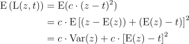
:::

**A expressão acima sugere a seguinte estratégia para atacar o problema do tipo melhor-nominal:**

- Selecione os **níveis** de alguns fatores que **minimizam** $\text{Var}(x)$.
- Selecione os **níveis** de outros fatores (que não os utilizados para minimizar a variância) para colocar $\text{E}(z)$ o **mais próximo** do valor $t$.

::::


## Comentário

::::{.text}
:::{.mlkinfobox}
A **função perda quadrática** é conveniente para o problema na medida em que é razoável assumir uma perda **simétrica** de qualidade em torno do **alvo**. Assim, a perda de qualidade quando se produz circuitos com $1\ \mu m$ a mais de espessura do que o alvo, é a mesma de quando se produz com $1\ \mu m$ a menos de espessura. Em problemas onde essa simetria de perda não é verificada, ou onde a perda torna-se constante a partir de um certo ponto, essa função **não é apropriada** para ser usada.
:::
::::

## Implementando a estratégia de análise

::::{.text}
Para estudar o efeito dos fatores na dispersão do processo e encontrar os
níveis que minimizariam $\text{Var}(z)$, a variável resposta $z_i = \ln S^2_i$ será analisada.

Estimativas de efeitos principais, interações duplas, triplas e quádrupla
são obtidas da maneira usual. O quadro a seguir apresenta esses valores para os dados do experimento.
::::


## Valores estimados dos efeitos

:::{.text}
```{r efeitos, echo=FALSE}

header.efeitos <- withTags(table(
  class = 'display', style="font-size:12px;width:500px",
  thead(
    tr(
      th(style="text-align: center", colspan = 1, "Efeito"),
      th(style="text-align: center", colspan = 1, HTML('<span class="katex"><span class="katex-mathml"><math><semantics><mrow><msub><mover accent="true"><mrow><mi>y</mi></mrow><mo>¯</mo></mover><mi>i</mi></msub></mrow><annotation encoding="application/x-tex">\bar{y}_i</annotation></semantics></math></span><span class="katex-html" aria-hidden="true"><span class="strut" style="height: 0.56778em;"></span><span class="strut bottom" style="height: 0.76222em; vertical-align: -0.19444em;"></span><span class="base textstyle uncramped"><span class="mord"><span class="mord accent"><span class="vlist"><span class="" style="top: 0em;"><span class="fontsize-ensurer reset-size5 size5"><span class="" style="font-size: 0em;">&#8203;</span></span><span class="mord textstyle cramped"><span class="mord mathit" style="margin-right: 0.03588em;">y</span></span></span><span class="" style="top: 0em; margin-left: 0.11112em;"><span class="fontsize-ensurer reset-size5 size5"><span class="" style="font-size: 0em;">&#8203;</span></span><span class="accent-body"><span class="">¯</span></span></span><span class="baseline-fix"><span class="fontsize-ensurer reset-size5 size5"><span class="" style="font-size: 0em;">&#8203;</span></span>&#8203;</span></span></span><span class="vlist"><span class="" style="top: 0.15em; margin-right: 0.05em;"><span class="fontsize-ensurer reset-size5 size5"><span class="" style="font-size: 0em;">&#8203;</span></span><span class="reset-textstyle scriptstyle cramped"><span class="mord mathit">i</span></span></span><span class="baseline-fix"><span class="fontsize-ensurer reset-size5 size5"><span class="" style="font-size: 0em;">&#8203;</span></span>&#8203;</span></span></span></span></span></span>')),
      th(style="text-align: center", colspan = 1, HTML('<span class="katex"><span class="katex-mathml"><math><semantics><mrow><mi>ln</mi><msubsup><mi>S</mi><mi>i</mi><mn>2</mn></msubsup></mrow><annotation encoding="application/x-tex">\\ln S^2_i</annotation></semantics></math></span><span class="katex-html" aria-hidden="true"><span class="strut" style="height: 0.814108em;"></span><span class="strut bottom" style="height: 1.07277em; vertical-align: -0.258664em;"></span><span class="base textstyle uncramped"><span class="mop">ln</span><span class="mord"><span class="mord mathit" style="margin-right: 0.05764em;">S</span><span class="vlist"><span class="" style="top: 0.258664em; margin-left: -0.05764em; margin-right: 0.05em;"><span class="fontsize-ensurer reset-size5 size5"><span class="" style="font-size: 0em;">&#8203;</span></span><span class="reset-textstyle scriptstyle cramped"><span class="mord mathit">i</span></span></span><span class="" style="top: -0.363em; margin-right: 0.05em;"><span class="fontsize-ensurer reset-size5 size5"><span class="" style="font-size: 0em;">&#8203;</span></span><span class="reset-textstyle scriptstyle uncramped"><span class="mord mathrm">2</span></span></span><span class="baseline-fix"><span class="fontsize-ensurer reset-size5 size5"><span class="" style="font-size: 0em;">&#8203;</span></span>&#8203;</span></span></span></span></span></span>'))
    ))
))

modelo <- dados2e4 %>% 
  select(A, B, C, D) %>% 
  mutate(across(everything(), ~ if_else(.x == "−", -1, 1))) %>% 
  mutate(
    AB = A*B, AC = A*C, AD = A*D, BC = B*C, BD = B*D, CD = C*D, 
    ABC = A*B*C, ABD = A*B*D, ACD = A*C*D, BCD = B*C*D, 
    ABCD = A*B*C*D
    )

efeitos <- tibble(efeito = names(modelo),
                  ybar = (t(modelo) %*% dados2e4$ybar)/8, 
                  lnS2 = (t(modelo) %*% dados2e4$lnS2i)/8)
efeitos %>% 
      mutate(ybar = format(round(ybar, 3), digits = 4),
             lnS2 = format(round(lnS2,3), digits = 4)) %>% 
      DT::datatable(escape = FALSE, rownames = FALSE, 
                options = list(autoWidth = FALSE,    
                               fixedColumns = TRUE,
                               dom = 't',
                               pageLength = 16,
                               columnDefs = list(list(className = 'dt-center', targets = 0:2),
                                                 list(bSortable = FALSE, targets = 0:2)),
                               rowCallback=JS(
                               'function(row,data) {
                                  if($(row)["0"]["_DT_RowIndex"] % 2 <1)
                                  $(row).css("background","#edf4f5") //#f2f9ec
                                }')
                               ),    
                container = header.efeitos,
                class = "compact hover", 
                style = 'default') %>% 
  formatStyle(columns = 0:2, 'font-size' = '12px')
```
:::

## Avaliação

:::{.text}
Para avaliar a significância dos efeitos, é importante notar que, sob suposição de normalidade dos valores observados,

<!-- $$ -->
<!-- (n_i - 1)S^2_i = \sum_{j=1}^{n_i}(y_{ij} - \bar{y}_i)^2 \ \sim \ \sigma_i^2\chi^2_{n_i - 1} -->
<!-- $$ -->

:::{.center}
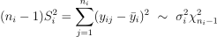
:::


Utilizando o **método delta**, é possível então mostrar que a distribuição de $\ln S_i^2$ é aproximadamente normal, com média $\ln \sigma_i^2$ e variância $2(n_i - 1)^{-1}$:

<!-- $$ -->
<!-- \ln S_i^2 \ \sim \ \text{N}(\ln \sigma^2_i;\ 2(n_i - 1)^{-1}) -->
<!-- $$ -->

:::{.center}
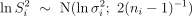
:::

Com base nesse resultado, dois **métodos gráficos** de análise são amplamente utilizados: **os gráficos de
probabilidade normal e half-normal**. 

:::

## Avaliação

:::{.text}

Vantagens de usar um método gráfico: 

- Não depende de uma estimativa da variância do erro experimental,
- Não sofre de efeito de multiplicidade de testes.
:::

## Os gráficos de probabilidade normal e *half*-normal

:::{.text}
Denote por $\theta_i$ o $i$-ésimo de $g$ efeitos estimamos. Denote por 
$$
\theta_{(1)} \leqslant \theta_{(2)} \leqslant \cdots \leqslant \theta_{(g)}
$$
os valores ordenados desses efeitos.

As coordenados dos pontos de um **gráfico de probabilidade normal** são dadas por
$$
\left(\theta_{(i)},\ \Phi^{-1}\left([i - 0,\! 5]/g\right)\right)
$$
para $i = 1, 2, \cdots, g$.
:::

## Os gráficos de probabilidade normal e *half*-normal

:::{.text}
Os **gráficos de probabilidade *half*-normal**, por sua vez, são obtidos  identificando os pontos

$$
\left({|\theta|}_{(i)},\ \Phi^{-1}\left(0,\! 5 + [i - 0,\! 5]/g\right)\right)
$$
para $i = 1, 2, \cdots, g$.
:::


:::{.text .mlkalertbox}
Em ambos os gráficos, pontos desviando claramente de uma reta são julgados significativos.

A vantagem de usar um gráfico *half*-normal, é que os pontos significativos aparecem no canto superior direito do gráfico. Gráficos de probabilidade
normal, no entanto, são mais úteis para a detecção de outliers.
:::

:::{.text}
Os gráficos a seguir ilustram a análise dos **efeitos** na **dispersão** e **locação** do processo.
:::

## Gráficos de probabilidade *half*-normal para o efeito de dispersão


```{r hnpe}
gghalfnorm::gghalfnorm(efeitos$lnS2, labs = efeitos$efeito, nlab = 16, repel = TRUE, box.padding = unit(1, "lines")) + theme_bw() + labs(x = "Quantis half-normal", y = 'Valores ordenados')  + coord_fixed(ratio = 10)
```


## Gráficos de probabilidade *half*-normal para o efeito de localização

```{r hnp}
gghalfnorm(efeitos$ybar, labs = efeitos$efeito, nlab = 16, repel = TRUE, box.padding = unit(1, "lines")) + theme_bw() + labs(x = "Quantis half-normal", y = 'Efeito ordenado')  + coord_fixed(ratio = 2.5)
```

## Análise

:::{.text}
- Observando o **primeiro** gráfico, percebe-se que nenhum efeito se distancia claramente de uma reta, sugerindo que **não há** espaço para uma melhora em termos de **dispersão.**
- Já no **segundo** gráfico, destacam-se os efeitos do fator **D**, da interação dupla **CD** e,
possivelmente, do fator **B**. A análise prosseguiria com um gráfico da interação **CD** e dos efeitos principais de **D** e **B**.
:::

## Dados originais do experimento

:::{.text}
```{r dados2e4o, echo=FALSE}

header.dados2e4 <- withTags(table(
  class = 'display', style="font-size:12px;width:500px",
  thead(
    tr(
      th(style="text-align: center;vertical-align: middle;", rowspan = 2, 'Experimento'),
      th(style="text-align: center;vertical-align: middle;", colspan = 4, 'Fatores'),
      th(style="text-align: center;vertical-align: middle;", colspan = 6, 'Réplicas'),
      th(style="text-align: center;vertical-align: middle;", colspan = 3, 'Respostas')),
    tr(
      #th(style="text-align: center;", colspan = 1, "Experimento"),
      th(style="text-align: center;border-left:solid 1px", colspan = 1, "A"),
      th(style="text-align: center;", colspan = 1, "B"),
      th(style="text-align: center", colspan = 1, "C"),
      th(style="text-align: center", colspan = 1, "D"),
      th(style="text-align: center;border-left:solid 1px", colspan = 1, "1"),
      th(style="text-align: center", colspan = 1, "2"),
      th(style="text-align: center", colspan = 1, "3"),
      th(style="text-align: center", colspan = 1, "4"),
      th(style="text-align: center", colspan = 1, "5"),
      th(style="text-align: center", colspan = 1, "6"),
      th(style="text-align: center;border-left:solid 1px", colspan = 1, HTML('<span class="katex"><span class="katex-mathml"><math><semantics><mrow><msub><mover accent="true"><mrow><mi>y</mi></mrow><mo>¯</mo></mover><mi>i</mi></msub></mrow><annotation encoding="application/x-tex">\bar{y}_i</annotation></semantics></math></span><span class="katex-html" aria-hidden="true"><span class="strut" style="height: 0.56778em;"></span><span class="strut bottom" style="height: 0.76222em; vertical-align: -0.19444em;"></span><span class="base textstyle uncramped"><span class="mord"><span class="mord accent"><span class="vlist"><span class="" style="top: 0em;"><span class="fontsize-ensurer reset-size5 size5"><span class="" style="font-size: 0em;">&#8203;</span></span><span class="mord textstyle cramped"><span class="mord mathit" style="margin-right: 0.03588em;">y</span></span></span><span class="" style="top: 0em; margin-left: 0.11112em;"><span class="fontsize-ensurer reset-size5 size5"><span class="" style="font-size: 0em;">&#8203;</span></span><span class="accent-body"><span class="">¯</span></span></span><span class="baseline-fix"><span class="fontsize-ensurer reset-size5 size5"><span class="" style="font-size: 0em;">&#8203;</span></span>&#8203;</span></span></span><span class="vlist"><span class="" style="top: 0.15em; margin-right: 0.05em;"><span class="fontsize-ensurer reset-size5 size5"><span class="" style="font-size: 0em;">&#8203;</span></span><span class="reset-textstyle scriptstyle cramped"><span class="mord mathit">i</span></span></span><span class="baseline-fix"><span class="fontsize-ensurer reset-size5 size5"><span class="" style="font-size: 0em;">&#8203;</span></span>&#8203;</span></span></span></span></span></span>')),
      th(style="text-align: center;", colspan = 1, HTML('<span class="katex"><span class="katex-mathml"><math><semantics><mrow><msubsup><mi>S</mi><mi>i</mi><mn>2</mn></msubsup></mrow><annotation encoding="application/x-tex">S^2_i</annotation></semantics></math></span><span class="katex-html" aria-hidden="true"><span class="strut" style="height: 0.814108em;"></span><span class="strut bottom" style="height: 1.07277em; vertical-align: -0.258664em;"></span><span class="base textstyle uncramped"><span class="mord"><span class="mord mathit" style="margin-right: 0.05764em;">S</span><span class="vlist"><span class="" style="top: 0.258664em; margin-left: -0.05764em; margin-right: 0.05em;"><span class="fontsize-ensurer reset-size5 size5"><span class="" style="font-size: 0em;">&#8203;</span></span><span class="reset-textstyle scriptstyle cramped"><span class="mord mathit">i</span></span></span><span class="" style="top: -0.363em; margin-right: 0.05em;"><span class="fontsize-ensurer reset-size5 size5"><span class="" style="font-size: 0em;">&#8203;</span></span><span class="reset-textstyle scriptstyle uncramped"><span class="mord mathrm">2</span></span></span><span class="baseline-fix"><span class="fontsize-ensurer reset-size5 size5"><span class="" style="font-size: 0em;">&#8203;</span></span>&#8203;</span></span></span></span></span></span>')),
      th(style="text-align: center", colspan = 1, HTML('<span class="katex"><span class="katex-mathml"><math><semantics><mrow><mi>ln</mi><msubsup><mi>S</mi><mi>i</mi><mn>2</mn></msubsup></mrow><annotation encoding="application/x-tex">\\ln S^2_i</annotation></semantics></math></span><span class="katex-html" aria-hidden="true"><span class="strut" style="height: 0.814108em;"></span><span class="strut bottom" style="height: 1.07277em; vertical-align: -0.258664em;"></span><span class="base textstyle uncramped"><span class="mop">ln</span><span class="mord"><span class="mord mathit" style="margin-right: 0.05764em;">S</span><span class="vlist"><span class="" style="top: 0.258664em; margin-left: -0.05764em; margin-right: 0.05em;"><span class="fontsize-ensurer reset-size5 size5"><span class="" style="font-size: 0em;">&#8203;</span></span><span class="reset-textstyle scriptstyle cramped"><span class="mord mathit">i</span></span></span><span class="" style="top: -0.363em; margin-right: 0.05em;"><span class="fontsize-ensurer reset-size5 size5"><span class="" style="font-size: 0em;">&#8203;</span></span><span class="reset-textstyle scriptstyle uncramped"><span class="mord mathrm">2</span></span></span><span class="baseline-fix"><span class="fontsize-ensurer reset-size5 size5"><span class="" style="font-size: 0em;">&#8203;</span></span>&#8203;</span></span></span></span></span></span>'))
    )
  )
))


dados2e4o <- as_tibble(
  matrix(c(
  1,  "−", "−", "−", "+", 14.812, 14.774, 14.772, 14.794, 14.860, 14.914, 
  2,  "−", "−", "−", "−", 13.768, 13.778, 13.870, 13.896, 13.932, 13.914, 
  3,  "−", "−", "+", "+", 14.722, 14.736, 14.774, 14.778, 14.682, 14.850, 
  4,  "−", "−", "+", "−", 13.860, 13.876, 13.932, 13.846, 13.896, 13.870, 
  5,  "−", "+", "−", "+", 14.886, 14.810, 14.868, 14.876, 14.958, 14.932, 
  6,  "−", "+", "−", "−", 14.182, 14.172, 14.126, 14.274, 14.154, 14.082, 
  7,  "−", "+", "+", "+", 14.758, 14.784, 15.054, 15.058, 14.938, 14.936, 
  8,  "−", "+", "+", "−", 13.996, 13.988, 14.044, 14.028, 14.108, 14.060, 
  9,  "+", "−", "−", "+", 15.272, 14.656, 14.258, 14.718, 15.198, 15.490, 
 10,  "+", "−", "−", "−", 14.324, 14.092, 13.536, 13.588, 13.964, 14.328, 
 11,  "+", "−", "+", "+", 13.918, 14.044, 14.926, 14.962, 14.504, 14.136, 
 12,  "+", "−", "+", "−", 13.614, 13.202, 13.704, 14.264, 14.432, 14.228, 
 13,  "+", "+", "−", "+", 14.648, 14.350, 14.682, 15.034, 15.384, 15.170, 
 14,  "+", "+", "−", "−", 13.970, 14.448, 14.326, 13.970, 13.738, 13.738, 
 15,  "+", "+", "+", "+", 14.184, 14.402, 15.544, 15.424, 15.036, 14.470, 
 16,  "+", "+", "+", "−", 13.866, 14.130, 14.256, 14.000, 13.640, 13.592), 
    nrow = 16, byrow = TRUE, 
    dimnames = list(1:16,
                    c("run", "A", "B", "C", "D", "R1", "R2", "R3", "R4", "R5", "R6")))) %>% 
  mutate(across(R1:R6, as.numeric)) %>% 
  rowwise() %>% 
  mutate(ybar = mean(c_across(R1:R6)),
         S2i = var(c_across(R1:R6)),
         lnS2i = log(S2i)) %>% 
  ungroup()


# dados2e4 <- tibble(
#     Run  = 1:16,
#     A = c("−", "−", "−", "−", "−", "−", "−", "−", "+", "+", "+", "+", "+", "+", "+", "+"),
#     B = c("−", "−", "−", "−", "+", "+", "+", "+", "−", "−", "−", "−", "+", "+", "+", "+"),
#     C = c("−", "−", "+", "+", "−", "−", "+", "+", "−", "−", "+", "+", "−", "−", "+", "+"),
#     D = c("−", "+", "−", "+", "−", "+", "−", "+", "−", "+", "−", "+", "−", "+", "−", "+"),
#     ybar = c(14.59,  13.59, 14.24, 14.05, 14.65, 13.94, 14.40, 14.14, 14.67,  13.72,  13.84, 13.90, 14.56, 13.88, 14.30, 14.11),
#     S2 = c(.270, .291, .268, .197, .221, .205,  .222, .215, .269, .272, .220, .229, .227, .253, .250, .192),
#     LnS2 =  c(-1.309, -1.234, -1.317, -1.625,-1.510, -1.585, -1.505, -1.537, -1.313,  -1.302, -1.514, -1.474, -1.483, -1.374, -1.386, -1.650))

dados2e4o %>% 
      mutate(ybar = format(round(ybar, 2), digits = 4),
             S2i = format(round(S2i,3), digits = 3),
             lnS2i = format(round(lnS2i,3), digits = 4)) %>% 
      DT::datatable(escape = FALSE, rownames = FALSE, 
                options = list(autoWidth = FALSE,    
                               fixedColumns = TRUE,
                               dom = 't',
                               pageLength = 16,
                               columnDefs = list(list(className = 'dt-center', targets = 0:13),
                                                 list(bSortable = FALSE, targets = 0:13)),
                               rowCallback=JS(
                               'function(row,data) {
                                  if($(row)["0"]["_DT_RowIndex"] % 2 <1)
                                  $(row).css("background","#edf4f5") //#f2f9ec
                                }')
                               ),    
                container = header.dados2e4,
                class = "compact hover", 
                style = 'default') %>% 
  formatStyle(columns = 0:13, 'font-size' = '12px')%>%
  formatStyle(c(2, 6, 12), 'border-left' = "solid 1px")
```
:::

## Efeitos

:::{.text}
```{r efeitoso, echo=FALSE}

header.efeitos <- withTags(table(
  class = 'display', style="font-size:12px;width:500px",
  thead(
    tr(
      th(style="text-align: center", colspan = 1, "Efeito"),
      th(style="text-align: center", colspan = 1, HTML('<span class="katex"><span class="katex-mathml"><math><semantics><mrow><msub><mover accent="true"><mrow><mi>y</mi></mrow><mo>¯</mo></mover><mi>i</mi></msub></mrow><annotation encoding="application/x-tex">\bar{y}_i</annotation></semantics></math></span><span class="katex-html" aria-hidden="true"><span class="strut" style="height: 0.56778em;"></span><span class="strut bottom" style="height: 0.76222em; vertical-align: -0.19444em;"></span><span class="base textstyle uncramped"><span class="mord"><span class="mord accent"><span class="vlist"><span class="" style="top: 0em;"><span class="fontsize-ensurer reset-size5 size5"><span class="" style="font-size: 0em;">&#8203;</span></span><span class="mord textstyle cramped"><span class="mord mathit" style="margin-right: 0.03588em;">y</span></span></span><span class="" style="top: 0em; margin-left: 0.11112em;"><span class="fontsize-ensurer reset-size5 size5"><span class="" style="font-size: 0em;">&#8203;</span></span><span class="accent-body"><span class="">¯</span></span></span><span class="baseline-fix"><span class="fontsize-ensurer reset-size5 size5"><span class="" style="font-size: 0em;">&#8203;</span></span>&#8203;</span></span></span><span class="vlist"><span class="" style="top: 0.15em; margin-right: 0.05em;"><span class="fontsize-ensurer reset-size5 size5"><span class="" style="font-size: 0em;">&#8203;</span></span><span class="reset-textstyle scriptstyle cramped"><span class="mord mathit">i</span></span></span><span class="baseline-fix"><span class="fontsize-ensurer reset-size5 size5"><span class="" style="font-size: 0em;">&#8203;</span></span>&#8203;</span></span></span></span></span></span>')),
      th(style="text-align: center", colspan = 1, HTML('<span class="katex"><span class="katex-mathml"><math><semantics><mrow><mi>ln</mi><msubsup><mi>S</mi><mi>i</mi><mn>2</mn></msubsup></mrow><annotation encoding="application/x-tex">\\ln S^2_i</annotation></semantics></math></span><span class="katex-html" aria-hidden="true"><span class="strut" style="height: 0.814108em;"></span><span class="strut bottom" style="height: 1.07277em; vertical-align: -0.258664em;"></span><span class="base textstyle uncramped"><span class="mop">ln</span><span class="mord"><span class="mord mathit" style="margin-right: 0.05764em;">S</span><span class="vlist"><span class="" style="top: 0.258664em; margin-left: -0.05764em; margin-right: 0.05em;"><span class="fontsize-ensurer reset-size5 size5"><span class="" style="font-size: 0em;">&#8203;</span></span><span class="reset-textstyle scriptstyle cramped"><span class="mord mathit">i</span></span></span><span class="" style="top: -0.363em; margin-right: 0.05em;"><span class="fontsize-ensurer reset-size5 size5"><span class="" style="font-size: 0em;">&#8203;</span></span><span class="reset-textstyle scriptstyle uncramped"><span class="mord mathrm">2</span></span></span><span class="baseline-fix"><span class="fontsize-ensurer reset-size5 size5"><span class="" style="font-size: 0em;">&#8203;</span></span>&#8203;</span></span></span></span></span></span>'))
    ))
))

modelo <- dados2e4o %>% 
    select(A, B, C, D) %>% 
    mutate(across(everything(), ~ if_else(.x == "−", -1, 1))) %>% 
    mutate(`(1)` = rep(1,16),
        AB = A*B, AC = A*C, AD = A*D, BC = B*C, BD = B*D, CD = C*D, 
        ABC = A*B*C, ABD = A*B*D, ACD = A*C*D, BCD = B*C*D, 
        ABCD = A*B*C*D
    ) %>% select(`(1)`, A:D, AB:ABCD)

efeitos <- tibble(efeito = names(modelo),
                  ybar = (t(modelo) %*% dados2e4o$ybar)/c(16, rep(8, 15)), 
                  lnS2 = (t(modelo) %*% dados2e4o$lnS2i)/c(16, rep(8, 15)))
efeitos %>% 
      mutate(ybar = format(round(ybar, 3), digits = 4),
             lnS2 = format(round(lnS2,3), digits = 4)) %>% 
      DT::datatable(escape = FALSE, rownames = FALSE, 
                options = list(autoWidth = FALSE,    
                               fixedColumns = TRUE,
                               dom = 't',
                               pageLength = 16,
                               columnDefs = list(list(className = 'dt-center', targets = 0:2),
                                                 list(bSortable = FALSE, targets = 0:2)),
                               rowCallback=JS(
                               'function(row,data) {
                                  if($(row)["0"]["_DT_RowIndex"] % 2 <1)
                                  $(row).css("background","#edf4f5") //#f2f9ec
                                }')
                               ),    
                container = header.efeitos,
                class = "compact hover", 
                style = 'default') %>% 
  formatStyle(columns = 0:2, 'font-size' = '12px')
```
:::


## Gráficos de probabilidade *half*-normal para o efeito de dispersão


```{r hnpeo}
gghalfnorm::gghalfnorm(efeitos$lnS2[-1], labs = efeitos$efeito[-1], nlab = 16, repel = TRUE, box.padding = unit(1, "lines")) + theme_bw() + labs(x = "Quantis half-normal", y = 'Valores ordenados')  + coord_fixed(ratio = .3)
```


## Gráficos de probabilidade *half*-normal para o efeito de localização

```{r hnpo}
gghalfnorm(efeitos$ybar[-1], labs = efeitos$efeito[-1], nlab = 16, repel = TRUE, box.padding = unit(1, "lines")) + theme_bw() + labs(x = "Quantis half-normal", y = 'Efeito ordenado')  + coord_fixed(ratio = 1.5)
```


## Conclusões

:::{.text}
- Com base no primeiro gráfico, percebe-se que o fator **A influencia a variância** do
processo.
- Por outro lado, o segundo gráfico revela que o **fator D influencia a média**. Como não
há evidência que esse fator influencia a variância, ele é um **fator de ajuste**.
:::

:::{.text}
**Recomendações:**

O efeito positivo do fator **A** ($+3.834$) sobre a variável $\ln S^2$ sugere a utilização deste fator no nível baixo ($-$), para reduzir a variabilidade do processo.
:::

## Conclusões


:::{.text}
Para fazer uso mais preciso da informação do fator $D$, é possível ajustar uma regressão aos dados,
levando à equação
$$
\hat{y} = \hat{\beta}_0 + \hat{\beta}_1\cdot x_{\text{D}} = 14,\! 389 + 0,\! 418\cdot x_{\text{D}}
$$

Igualando a equação ao valor nominal desejado tem-se:
$$
14.5 = \hat{y} = 14,\! 389 + 0,\! 418\cdot x_{\text{D}} \quad \therefore \quad x_\text{D} = 0,\! 266
$$

Supondo então que os valores dos níveis do fator **D** (tempo de deposição) fossem $30$ e $40$ segundos, seria recomendado utilizar $35 + 0,\!266\cdot5 = 36,\! 33$ segundos.

:::


## Princípios Fundamentais para Análise de Efeitos Fatoriais

:::{.text}
Ao analisar uma estrutura fatorial de tratamentos, **três princípios** são importantes na determinação da importância relativa e relação entre efeitos.

- Princípio da **Ordenação Hierárquica** 
- Princípio da **Esparsidade dos Efeitos** (Box e Meyer, 1986)
- Princípio da **Hereditariedade dos Efeitos** (Hamada e Wu, 1992) 
:::

## Princípio da Ordenação Hierárquica
::::{.text}
- Efeitos de **baixa ordem** são mais prováveis de **serem importantes** do que os de **ordem elevada**.
- Efeitos de **mesma ordem** são igualmente prováveis de serem importantes.

:::{.mlkinfobox}
Este princípio sugere que quando os recursos são escassos, deve ser dada prioridade
para a estimativa de efeitos de ordem inferior. 

A sua aplicação é particularmente eficaz para
experimentos de triagem que têm um grande número de fatores e número de rodadas. 

É um princípio empírico cuja validade foi confirmada em muitos experimentos reais. Além disso, outra razão para sua ampla aceitação é que interações de ordem superior são mais difíceis de interpretar ou justificar fisicamente. 
:::

::::

## Princípio da Esparsidade dos Efeitos
:::{.text}
O número de **efeitos relativamente importantes** em um experimento fatorial **é pequeno**.
:::

:::{.text .mlkinfobox}
O princípio pode também ser chamado de **Princípio de Pareto em Design Experimental** por causa de seu foco nos “poucos vitais” e não os “muitos triviais”. 
:::


## Princípio da Hereditariedade dos Efeitos
:::{.text}
Para que uma **interação** seja importante, ao menos **um** de seus fatores deve ser **importante**.
:::

:::{.text .mlkinfobox}
Para selecionar uma interação no modelo, pelo menos um de seus efeitos principais também devem estar no modelo. 
:::

## Modelo linear

:::{.text}
```{r, echo=TRUE}
base <- dados2e4o %>% 
  mutate(across(A:D, ~ if_else(.x == "−", -1, 1))) %>% 
  select(A:D, R1:R6) %>% 
  pivot_longer(-A:-D, names_to = "Réplica", values_to = "y")

modelo_1 <- (lm(y ~ 1 + A*B*C*D, data = base))

modelo_2 <- (lm(y ~ 1 + D, data = base))
```

```{r}

header.base <- withTags(table(
  class = 'display', style="font-size:12px;width:500px",
  thead(
    tr(
      th(style="text-align: center", colspan = 1, "A"),
      th(style="text-align: center", colspan = 1, "B"),
      th(style="text-align: center", colspan = 1, "C"),
      th(style="text-align: center", colspan = 1, "D"),
      th(style="text-align: center", colspan = 1, "Réplica"),
      th(style="text-align: center", colspan = 1, HTML('<span class="katex"><span class="katex-mathml"><math><semantics><mrow><mi>y</mi></mrow><annotation encoding="application/x-tex">y</annotation></semantics></math></span><span class="katex-html" aria-hidden="true"><span class="strut" style="height: 0.43056em;"></span><span class="strut bottom" style="height: 0.625em; vertical-align: -0.19444em;"></span><span class="base textstyle uncramped"><span class="mord mathit" style="margin-right: 0.03588em;">y</span></span></span></span>'))
    ))
))

base %>%
  mutate(y = format(round(y, 2), digits = 4)) %>% 
      DT::datatable(escape = FALSE, rownames = FALSE, 
                options = list(autoWidth = FALSE,    
                               fixedColumns = TRUE,
                               dom = 't',
                               pageLength = 10,
                               columnDefs = list(list(className = 'dt-center', targets = 0:5),
                                                 list(bSortable = FALSE, targets = 0:5)),
                               rowCallback=JS(
                               'function(row,data) {
                                  if($(row)["0"]["_DT_RowIndex"] % 2 <1)
                                  $(row).css("background","#edf4f5") //#f2f9ec
                                }')
                               ),    
                container = header.base,
                class = "compact hover", 
                style = 'default') %>% 
  formatStyle(columns = 0:5, 'font-size' = '12px')
```

:::

## Modelo linear 1

:::{.text}
```{r}
header.mod1 <- withTags(table(
  class = 'display', style="font-size:12px;width:500px",
  thead(
    tr(
      th(style="text-align: center", colspan = 1, "Termo"),
      th(style="text-align: center", colspan = 1, "Estimativa"),
      th(style="text-align: center", colspan = 1, "EP"),
      th(style="text-align: center", colspan = 1, "Estatística"),
      th(style="text-align: center", colspan = 1, "p-valor")
    ))
))


modelo_1 %>% 
  tidy() %>% 
  mutate(estimate = format(round(estimate, 4), digits = 6),
         std.error = format(round(std.error, 4), digits = 6),
         statistic = format(round(statistic, 3), digits = 5),
         p.value = format(round(p.value, 4), digits = 5)) %>% 
   DT::datatable(escape = FALSE, rownames = FALSE, 
                options = list(autoWidth = FALSE,    
                               fixedColumns = TRUE,
                               dom = 't',
                               pageLength = 16,
                               columnDefs = list(list(className = 'dt-center', targets = 0:4),
                                                 list(bSortable = FALSE, targets = 0:4)),
                               rowCallback=JS(
                               'function(row,data) {
                                  if($(row)["0"]["_DT_RowIndex"] % 2 <1)
                                  $(row).css("background","#edf4f5") //#f2f9ec
                                }')
                               ),    
                container = header.mod1,
                class = "compact hover", 
                style = 'default') %>% 
  formatStyle(columns = 0:4, 'font-size' = '12px')
  
```
:::

## Modelo linear 2

:::{.text}
```{r}
header.mod1 <- withTags(table(
  class = 'display', style="font-size:12px;width:500px",
  thead(
    tr(
      th(style="text-align: center", colspan = 1, "Termo"),
      th(style="text-align: center", colspan = 1, "Estimativa"),
      th(style="text-align: center", colspan = 1, "EP"),
      th(style="text-align: center", colspan = 1, "Estatística"),
      th(style="text-align: center", colspan = 1, "p-valor")
    ))
))


modelo_2 %>% 
  tidy() %>% 
  mutate(estimate = format(round(estimate, 4), digits = 6),
         std.error = format(round(std.error, 4), digits = 6),
         statistic = format(round(statistic, 3), digits = 5),
         p.value = format(round(p.value, 4), digits = 5)) %>% 
   DT::datatable(escape = FALSE, rownames = FALSE, 
                options = list(autoWidth = FALSE,    
                               fixedColumns = TRUE,
                               dom = 't',
                               pageLength = 16,
                               columnDefs = list(list(className = 'dt-center', targets = 0:4),
                                                 list(bSortable = FALSE, targets = 0:4)),
                               rowCallback=JS(
                               'function(row,data) {
                                  if($(row)["0"]["_DT_RowIndex"] % 2 <1)
                                  $(row).css("background","#edf4f5") //#f2f9ec
                                }')
                               ),    
                container = header.mod1,
                class = "compact hover", 
                style = 'default') %>% 
  formatStyle(columns = 0:4, 'font-size' = '12px')
  
```
:::


## {.fullpage .grad}

:::{class="topic"}
<span style='color:black'>ET612 --- </span><br> 
Técnicas de confundimento para blocagem em fatoriais 2<sup>k</sup>
:::

## Experimentos Fatoriais 2<sup>k</sup>  <span style='color:black'>Aleatorizados em Blocos</span> e o Plano Experimental em <span style='color:black'>Blocos Incompletos Balanceados</span>

:::{.text}
- Estruturas fatoriais geralmente implicam em um número **grande** de tratamentos. 
- Relembre, por exemplo, que no experimento anterior, um fatorial 2<sup>4</sup>, **16** tratamentos estavam sendo estudados.
- Executar um plano como este, **completo**, exige um número grande de unidades experimentais disponíveis, que muito provavelmente exibem certo grau de **heterogeneidade** entre si.
- Dizendo de outra forma, quanto **maior** o número de unidades experimentais envolvidas, **menor** é a chance de que todas elas tenham um grau de **homogeneidade** elevado entre si.
:::


## Experimentos Fatoriais 2<sup>k</sup>  <span style='color:black'>Aleatorizados em Blocos</span> e o Plano Experimental em <span style='color:black'>Blocos Incompletos Balanceados</span>

:::{.text}
- Nesse contexto, é natural pensar em panos experimentais **aleatorizados em blocos** para reduzir o impacto da heterogeneidade entre unidades experimentais na variância do erro experimental.
- Porém, no caso de experimentos fatoriais, o uso de **blocos** freqüentemente implica em restringir o número de tratamentos usados em cada bloco. 
- Por esse motivo, uma introdução aos **planos em blocos incompletos** é apresentada a seguir.
:::

## Planos Experimentais Aleatorizados em Blocos Incompletos

:::{.text}
A estrutura geral de um plano em blocos incompletos pode ser descrita da seguinte forma:

- Tem-se $t$ tratamentos e $b$ blocos.
- O $i$-ésimo bloco acomoda unidades experimentais ($i = 1, 2, \cdots, b$).
- O $j$-ésimo tratamento é replicado $r_j$ vezes ($j = 1, 2, \cdots, t$).

Logo, 
$$
\sum_{i=1}^b k_i = \sum_{j = 1}^{t}r_j = n
$$
em que $n$ é o total de unidades experimentais disponíveis.
:::

## Planos Experimentais Aleatorizados em Blocos Incompletos

:::{.text}
- Nota-se então que, sob a estrutura geral do plano, pode ocorrer de **nem 
todos os tratamentos** serem aplicados com a mesma freqüência em cada bloco. 
- De fato, na maioria dos casos, **não** é possível observar todos os tratamentos em um mesmo bloco.
:::

:::{.mlkinfobox .textbox}
Dentre a classe dos **planos em blocos incompletos**, destaca-se o plano em **blocos incompletos balanceados**, que será abordado a seguir.
:::

## Plano em Blocos Incompletos Balanceados

:::{.text}
O plano em blocos incompletos balanceados (**BIB**) foi introduzido por Yates (1936) e tem como características:

- O **mesmo número** de unidades experimentais disponíveis em cada bloco, $$k_i = k,\quad\text{para}\quad i = 1, 2,\cdots, b$$
- O **mesmo número** de réplicas por tratamento, $r_j = r$, para $j = 1, 2, \cdots, t$.
- **Pares** de tratamentos aparecem, **em conjunto**, dentro de blocos, um mesmo número de vezes, $\lambda$.
:::


## Exemplo

:::{.text}
Arranjo em blocos incompletos balanceados para comparar **4** tratamentos (A, B, C e D) em **4** blocos (I, II, III e IV) de tamanho **3**.

</br>
```{r fig.showtext=TRUE, out.width='600px'}
expand_grid(Blocs = factor(c("I", "II", "III", "IV"), ordered = TRUE),
            Pos = factor(c("1st", "2st", "3td"), ordered = TRUE)) %>% 
  mutate(
  Tratamento = c("A", "B", "C", "A", "B", "D", "A", "C", "D", "B", "C", "D"),
  Cor = c("1", "2", "2", "3", "1", "3", "3", "1", "3", "2", "2", "1"),
) %>% 
  ggplot(aes(x = Pos, y = Blocs, fill = Cor)) +
  geom_tile(color = "black", size = .5) +
  geom_text(aes(label = Tratamento),  family = "montserrat", size = 8, fontface = "bold") +
  guides(fill = 'none') + 
  labs(y = "Blocos") +
  scale_y_discrete(limits=rev) +
  theme(axis.text.x=element_blank(),   #remove x axis labels
        axis.ticks.x=element_blank(),  #remove x axis ticks
        axis.title.x = element_blank(), #remove x axis title
        axis.text.y = element_text(family="montserrat", size = 16),
        axis.title.y = element_text(vjust = 2),
        text=element_text(family="montserrat", size = 18),
        panel.background =  element_blank() 
  )  + 
  scale_fill_brewer(palette = "Greens")
```
:::

## Exemplo


:::{.text}
Com base nesse exemplo, é fácil ver que:

- Cada tratamento foi aplicado exatamente ($k$) 3 vezes.
- Pares de tratamentos ocorrem juntos, dentro de blocos, exatamente ($\lambda$) 2 vezes. Veja, por exemplo, que o par (**B**, **C**) aparece nos blocos **I** e **IV**; O par (**A**, **D**) aparece nos blocos **II** e **III**, e assim por diante.
- A seguinte relação é observada (e vale para todo **BIB**) $$t\cdot r = b\cdot k =  n$$
Nesse exemplo, $n = 12$.

:::

## Notação Especial

:::{.mlkinfobox .textbox}
Um plano em blocos balanceados incompletos é indicado por seus parâmetros, da seguinte forma:
$$
\text{BIB}(t, b, k, r; \lambda)
$$
:::

:::{.text}
No exemplo visto, trata-se de um plano

$$
\text{BIB}(4, 4, 3, 3; 2)
$$
:::

## Relação Especial

:::{.text}
Os parâmetros de um **BIB** são relacionados como segue:
$$
\lambda(t-1) = r(k - 1) \quad \therefore \quad \lambda = \frac{r(k-1)}{t-1}
$$
Como tem que ser um valor inteiro, percebe-se que não existe plano **BIB** para todo valor de $t$, $k$ e $r$. De fato, pode acontecer de ser inteiro e, mesmo assim, não existir o **BIB** correspondente.
:::

:::{.mlkalertbox .textbox}
Uma lista (incompleta) de planos **BIB** é fornecida em Box, Hunter e Hunter (1979), páginas 270 a 274.
:::


## O Processo de Aleatorização do Plano


:::{.text}
Para aleatorizar um determinado plano $\text{BIB}(t, b, k, r; \lambda)$, é  necessário: 

(a) Designar aleatoriamente cada arranjo de $k$ tratamentos a cada bloco
(b) Aleatorizar os tratamentos às unidades experimentais dentro de cada bloco, independentemente.
:::

## O Modelo Linear Associado ao Plano

:::{.text}
O modelo é o mesmo para um plano aleatorizado em blocos, fazendo uso da suposição de aditividade *bloco versus tratamento*. 

Por isso, apenas a equação linear é mostrada aqui.

$$
y_{ij} = \mu + \beta_i + \tau_j + \varepsilon_{ij}, \qquad \varepsilon_{ij} \sim \text{iid}(0, \sigma^2)
$$
:::

:::{.mlkalertbox .textbox}
Apesar de usar o mesmo modelo de um plano em blocos, em um **BIB** nem todo tratamento ocorre em cada bloco, o que gera **não**-ortogonalidade. A análise
dos dados exige cuidado especial.
:::


## Análise de Variância e Cálculo de Médias Ajustadas em um BIB

:::{.text}
Para calcular médias ajustadas em um **BIB** deve-se proceder da seguinte forma:

(i) Calcular o total da variável resposta para cada tratamento: $T_j$
(ii) Calcular o total da variável resposta somada em todos os blocos que contém o tratamento $j: B_j$
(iii) Calcular ainda o valor 
$$
Q_j = k T_j - B_j
$$
:::


## Análise de Variância e Cálculo de Médias Ajustadas em um BIB

:::{.text}
A média ajustada do tratamento $j$ é dada por
$$
\bar{y}^{\text{LS}}_{.j} =  \bar{y}_{..} + \frac{Q_j}{t\lambda}
$$
e tem como variância
$$
\text{Var}(\bar{y}^{\text{LS}}_{.j}) = \frac{k\sigma^2}{t\lambda}
$$
Logo
$$
\text{Var}(\bar{y}^{\text{LS}}_{.j} - \bar{y}^{\text{LS}}_{.j'}) = 2\frac{k\sigma^2}{t\lambda}
$$
:::

## ANOVA para um Plano BIB


:::{.text .center style='font-size:12px;width:500px'}
```{r}
tibble(
  `Fonte de Variação` =  c("Blocos", "Tratamentos", "Resíduo", "Total"),
  `Graus de Liberdade` = c('$b-1$', "$t-1$", "$n - t - b + 1$", "$n - 1$"),
  `Soma dos Quadrados` = c("$$\\sum_{i = 1}^b \\frac{B_i^2}{k} - \\frac{1}{n}\\left(\\sum_{ij} y_{ij}\\right)^2$$", "$$\\sum_{j = 1}^t \\frac{Q^2_j}{\\lambda k t}$$", "*por diferença*", "$$\\sum_{ij}  y_{ij}^2 - \\frac{1}{n}\\left(\\sum_{ij} y_{ij}\\right)^2$$")
) %>% 
  kable(escape = FALSE, align = 'lcc') %>% 
  kable_classic()
```
:::

:::{.mlkinfobox .textbox}
Na **Soma dos Quadrados dos Blocos**, $B_i$ denota o total da variável resposta no bloco $i$.
:::

## Blocos Incompletos em Fatoriais da Série 2<sup>k</sup>

:::{.mlkexbox .textbox}
Para contextualizar o assunto, imagine um experimento para estudar os efeitos da adição de 3 fatores ( **A**: *Proteína Animal*, **B**: *Farinha de Osso* e **C**: *Antibiótico*), cada um com dois níveis, na dieta de animais de uma mesma espécie. 
</br></br>
A definição dos níveis dos **fatores** é sugerida abaixo:
</br></br>
```{r}
header.bib <- withTags(table(
  class = 'display', style="font-size:12px;width:600px",
  thead(
    tr(
      th(style="text-align: center;vertical-align: middle;", colspan = 2, 'A (Proteína Animal)'),
      th(style="text-align: center;vertical-align: middle;", colspan = 2, 'B (Farinha de Osso)'),
      th(style="text-align: center;vertical-align: middle;", colspan = 2, 'C (Antibiótico)')
    ),
    tr(
      th(style="text-align: center;vertical-align: middle;", colspan = 2, '(%)'),
      th(style="text-align: center;vertical-align: middle;", colspan = 2, '(%)'),
      th(style="text-align: center;vertical-align: middle;", colspan = 2, ' ')
    ),
    tr(
      th(style="text-align: center;", colspan = 1, "−"),
      th(style="text-align: center;", colspan = 1, "+"),
      th(style="text-align: center;border-left:solid 1px;", colspan = 1, "−"),
      th(style="text-align: center;", colspan = 1, "+"),
      th(style="text-align: center;border-left:solid 1px;", colspan = 1, "−"),
      th(style="text-align: center;", colspan = 1, "+")
    )
  )
))

tibble(Am = 0, Tp = 10, Bm = 0, Bp = 5, Cm = "Sem", Cp = "Com") %>% 
      DT::datatable(rownames = FALSE, 
                options = list(autoWidth = FALSE,    
                               fixedColumns = TRUE,
                               dom = 't',
                               columnDefs = list(list(className = 'dt-center', targets = 0:5),
                                                 list(bSortable = FALSE, targets = 0:5)),
                               rowCallback=JS(
                               'function(row,data) {
                                  if($(row)["0"]["_DT_RowIndex"] % 2 <1) 
                                  $(row).css("background","#edf4f5") //#f2f9ec
                                }')
                               ),    
                container = header.bib,
                class = "compact hover", 
                style = 'default') %>% 
  formatStyle(columns = 0:5, 'font-size' = '12px') %>%
  #formatStyle(columns = 0:5, background = "#00000001") %>% 
  formatStyle(c(3:5), 'border-left' = "solid 1px") 
```
</br>
Suponha agora que 16 animais estão disponíveis para o estudo. Considerando a necessidade de **controle de uma fonte de variação sistemática** --- por exemplo, se os animais fossem de linhagens distintas.
:::


## Blocos Incompletos em Fatoriais da Série 2<sup>k</sup>

:::{.text}
As seguintes situações experimentais seriam possíveis de ocorrer:
:::

:::{.mlkinfobox .textbox}
**16** animais: 8 da linhagem **X** e 8, de uma outra, **Y**.

**Situação Experimental 1:** Duas réplicas de um 2<sup>3</sup>, em 2 blocos de tamanho 8.
:::

:::{.mlkinfobox .textbox}
**16** animais: 4 da linhagem **W**; 4 da linhagem, **X**; 4 da linhagem **Y** e 4 da **Z**

**Situação Experimental 2:** Duas réplicas de um 2<sup>3</sup>, em 4 blocos de tamanho 4.
:::

## Blocos Incompletos em Fatoriais da Série 2<sup>k</sup>

:::{.text}
O caso sugerido pela **situação 1** (duas réplicas de um 2<sup>3</sup> em dois blocos de
tamanho 8) não oferece desafios maiores por tratar-se de um típico exemplo de experimento aleatorizado em blocos.


A análise da **situação 2**, porém, merece ser vista com mais detalhe, pois trata-se de
uma estrutura fatorial particionada em blocos incompletos.


A primeira questão que se coloca é a de como escolher quais tratamentos serão agrupados para serem designados aleatoriamente aos blocos.
:::

## Blocos Incompletos em Fatoriais da Série 2<sup>k</sup>

:::{.text}
Uma sugestão poderia ser a seguinte:

```{r}
header.bibex <- withTags(table(
  class = 'display', style="font-size:12px;width:300px",
  thead(
    tr(
      th(style="text-align: center;vertical-align: middle;", colspan = 2, 'Réplica 1'),
      th(style="text-align: center;vertical-align: middle;", colspan = 2, 'Réplica 2')
    ),
    tr(
      th(style="text-align: center;vertical-align: middle;", colspan = 2, 'Blocos'),
      th(style="text-align: center;vertical-align: middle;", colspan = 2, 'Blocos')
    ),
    tr(
      th(style="text-align: center;", colspan = 1, "I"),
      th(style="text-align: center;", colspan = 1, "II"),
      th(style="text-align: center;border-left:solid 1px;", colspan = 1, "I"),
      th(style="text-align: center;", colspan = 1, "II")
    )
  )
))

tibble(Ir1 = c("(1)", "b", "c", "bc"), 
       IIr1 = c("a", "ab", "ac", "abc"), 
       Ir2 = c("(1)", "b", "c", "bc"), 
       IIr2 = c("a", "ab", "ac", "abc")) %>% 
      DT::datatable(rownames = FALSE, 
                options = list(autoWidth = FALSE,    
                               fixedColumns = TRUE,
                               dom = 't',
                               columnDefs = list(list(className = 'dt-center', targets = 0:3),
                                                 list(bSortable = FALSE, targets = 0:3)),
                               rowCallback=JS(
                               'function(row,data) {
                                  if($(row)["0"]["_DT_RowIndex"] % 2 <1) 
                                  $(row).css("background","#edf4f5") //#f2f9ec
                                }')
                               ),    
                container = header.bibex,
                class = "compact hover", 
                style = 'default') %>% 
  formatStyle(columns = 0:3, 'font-size' = '12px') %>%
  #formatStyle(columns = 0:5, background = "#00000001") %>% 
  formatStyle(c(3), 'border-left' = "solid 1px") 
```
:::

</br>

:::{style='width:50%;margin-left:25%'}

::::{.row_milk .text}

:::::{.column_milk}
```{r}
header.bloco1 <- withTags(table(
  class = 'display', style="font-size:12px;width:150px", #
  thead(
    tr(
      th(style="text-align: center;vertical-align: middle;",
         colspan = "3", 'Bloco I')),
    tr(
      th(style="text-align:center;", 
         colspan = 1, "A"),
      th(style="text-align:center", 
         colspan = 1, "B"),
      th(style="text-align:center", 
         colspan = 1, "C")
    )
  )
))

yates.table.bloco1 <- tibble(
  A = c("−", "−", "−", "−"),
  B = c("−", "+", "−", "+"),
  C = c("−", "−", "+", "+")
) 

yates.table.bloco1 %>% DT::datatable(rownames = FALSE,  #escape = FALSE,
                 options = list(autoWidth = FALSE,    
                                fixedColumns = TRUE,
                                dom = 't',
                                columnDefs = list(list(className = 'dt-center', targets = 0:2),
                                                  list(bSortable = FALSE, targets = 0:2))
                ), 
                container = header.bloco1,
                class = "compact hover", 
                style = 'default') %>% 
   formatStyle(columns = 0:2, 'font-size' = '12px') 
```
:::::

:::::{.column_milk}
```{r}
header.bloco2 <- withTags(table(
  class = 'display', style="font-size:12px;width:150px", #
  thead(
    tr(
      th(style="text-align: center;vertical-align: middle;",
         colspan = "3", 'Bloco II')),
    tr(
      th(style="text-align:center;", 
         colspan = 1, "A"),
      th(style="text-align:center", 
         colspan = 1, "B"),
      th(style="text-align:center", 
         colspan = 1, "C")
    )
  )
))

yates.table.bloco2 <- tibble(
  A = c( "+", "+", "+", "+"),
  B = c("−", "+", "−", "+"),
  C = c("−", "−", "+", "+")
) 

yates.table.bloco2 %>% DT::datatable(rownames = FALSE,  #escape = FALSE,
                 options = list(autoWidth = FALSE,    
                                fixedColumns = TRUE,
                                dom = 't',
                                columnDefs = list(list(className = 'dt-center', targets = 0:2),
                                                  list(bSortable = FALSE, targets = 0:2))
                ), 
                container = header.bloco2,
                class = "compact hover", 
                style = 'default') %>% 
   formatStyle(columns = 0:2, 'font-size' = '12px') 
```

:::::

::::

:::

## Blocos Incompletos em Fatoriais da Série 2<sup>k</sup>

:::{.text}
Há algum problema com essa sugestão de agrupamento de tratamentos em blocos?

A resposta é afirmativa.

::::{.mlkalertbox}
O efeito principal do fator A está confundido com blocos nas duas réplicas!
::::

Para executar um experimento fatorial 2<sup>k</sup> em blocos de tamanho 2<sup>k-1</sup> é preciso confundir algum efeito ou interação com blocos.


::::{.mlkinfobox}
Sendo assim, pelo **princípio da ordenação hierárquica**, é preferível confundir o efeito da interação de mais alta ordem: **ABC**, neste caso.
::::

:::

## Blocos Incompletos em Fatoriais da Série 2<sup>k</sup>


:::{style='width:66%;margin-left:17%'}

::::{.row_milk .text}

:::::{.column_milk}
```{r}
header.bibex2 <- withTags(table(
  class = 'display', style="font-size:12px;width:300px",
  thead(
    tr(
      th(style="text-align: center;vertical-align: middle;", colspan = 1, 'Tratamento'),
      th(style="text-align: center;vertical-align: middle;", colspan = 1, 'A'),
      th(style="text-align: center;vertical-align: middle;", colspan = 1, 'B'),
      th(style="text-align: center;vertical-align: middle;", colspan = 1, 'C')
    )
  )
))

tibble(Tratamento = c("(1)", "a", "b", "ab", "c", "ac", "bc", "abc"), 
       A = c("−", "+", "−", "+", "−", "+", "−", "+"),
       B = c("−", "−", "+", "+", "−", "−", "+", "+"),
       C = c("−", "−", "−", "−", "+", "+", "+", "+")) %>% 
      DT::datatable(rownames = FALSE, 
                options = list(autoWidth = FALSE,    
                               fixedColumns = TRUE,
                               dom = 't',
                               columnDefs = list(list(className = 'dt-center', targets = 0:3),
                                                 list(bSortable = FALSE, targets = 0:3))
                               ),    
                container = header.bibex2,
                class = "compact hover", 
                style = 'default') %>% 
  formatStyle(columns = 0:3, 'font-size' = '12px') 
```
:::::

:::::{.column_milk}
```{r}
header.bibex3 <- withTags(table(
  class = 'display', style="font-size:12px;width:100px",
  thead(
    tr(
      th(style="text-align: center;vertical-align: middle;", colspan = 1, 'ABC'),
      th(style="text-align: center;vertical-align: middle;", colspan = 1, 'Bloco')
    )
  )
))

tibble(
       ABC = c("−", "+", "+", "−", "+", "−", "−", "+"), 
       Bloco = c("I", "II", "II", "I", "II", "I", "I", "II")) %>% 
      DT::datatable(rownames = FALSE, 
                options = list(autoWidth = FALSE,    
                               fixedColumns = TRUE,
                               dom = 't',
                               columnDefs = list(list(className = 'dt-center', targets = 0:1),
                                                 list(bSortable = FALSE, targets = 0:1))
                               ),    
                container = header.bibex3,
                class = "compact hover", 
                style = 'default') %>% 
  formatStyle(columns = 0:1, 'font-size' = '12px') 
```

:::::

::::

:::

## Regra para “construir” os blocos


:::{.text}

$$
\text{Bloco} = \text{ABC}
$$
Para escolher os tratamentos do Bloco I, siga o raciocínio seguinte:

- Admita que o tratamento (1) faça parte do Bloco I. Este tratamento tem 0 (zero) letras em comum com a interação ABC, que define bloco. Logo, todos os tratamentos que farão parte do Bloco I devem ter um número par de letras em comum com ABC.
- O tratamento “a” possui **uma** letra em comum com ABC --- número ímpar --- logo, ele não faz parte do Bloco I. Da mesma forma, não fazem parte os tratamentos “b” e “c”.
- Já os tratamentos “ab” e “ac” têm ambos, 2 letras em comum com ABC e, por isso, estão no Bloco I. Conseqüentemente, a sua multiplicação simbólica,
$$
\text{ab}\times \text{ac} =  \text{a}^2\text{cb} = \text{bc} 
$$
também pertence ao mesmo bloco.
:::

## Regra para “construir” os blocos


:::{.text}
- Os tratamento
s restantes têm todos um número ímpar de letras em comum com a interação tripla,
formando assim o Bloco II. Uma forma alternativa de compor o Bloco II seria considerar um tratamento que não pertence ao Bloco I --- digamos, o tratamento “a”. Agora basta multiplicar simbolicamente o “a” por cada tratamento do Bloco I que teremos a formação do Bloco II:

$$
\begin{aligned}
a\times (1) &= a \\
a\times ab  &= b \\
a\times ac  &= c \\
a\times bc  &= abc 
\end{aligned}
$$
Ao final, tem-se:

```{r}
header.bibex <- withTags(table(
  class = 'display', style="font-size:12px;width:300px",
  thead(
    tr(
      th(style="text-align: center;vertical-align: middle;", colspan = 2, 'Réplica 1'),
      th(style="text-align: center;vertical-align: middle;", colspan = 2, 'Réplica 2')
    ),
    tr(
      th(style="text-align: center;vertical-align: middle;", colspan = 2, 'Blocos'),
      th(style="text-align: center;vertical-align: middle;", colspan = 2, 'Blocos')
    ),
    tr(
      th(style="text-align: center;", colspan = 1, "I"),
      th(style="text-align: center;", colspan = 1, "II"),
      th(style="text-align: center;border-left:solid 1px;", colspan = 1, "III"),
      th(style="text-align: center;", colspan = 1, "IV")
    )
  )
))

tibble(Ir1 = c("(1)", "ab", "ac", "bc"), 
       IIr1 = c("a", "b", "c", "abc"), 
       Ir2 = c("(1)", "ab", "ac", "bc"), 
       IIr2 = c("a", "b", "c", "abc")) %>% 
      DT::datatable(rownames = FALSE, 
                options = list(autoWidth = FALSE,    
                               fixedColumns = TRUE,
                               dom = 't',
                               columnDefs = list(list(className = 'dt-center', targets = 0:3),
                                                 list(bSortable = FALSE, targets = 0:3)),
                               rowCallback=JS(
                               'function(row,data) {
                                  if($(row)["0"]["_DT_RowIndex"] % 2 <1) 
                                  $(row).css("background","#edf4f5") //#f2f9ec
                                }')
                               ),    
                container = header.bibex,
                class = "compact hover", 
                style = 'default') %>% 
  formatStyle(columns = 0:3, 'font-size' = '12px') %>%
  #formatStyle(columns = 0:5, background = "#00000001") %>% 
  formatStyle(c(3), 'border-left' = "solid 1px") 
```

:::

## Blocos Incompletos em Fatoriais da Série 2<sup>k</sup>


:::{.text}
Como houve replicação nesse experimento, é possível estimar a variância do erro experimental através do quadrado médio do resíduo. 

Para um experimento 2<sup>3</sup>, em blocos de tamanho 4, com $r$ réplicas, tem-se a seguinte
ANOVA, onde na Soma dos Quadrados dos Blocos, $B_i$ denota o total da variável resposta no bloco $i$
:::

## Blocos Incompletos em Fatoriais da Série 2<sup>k</sup>

:::{.text .center style='font-size:12px;width:500px'}
```{r}
tibble(
  `Fonte de Variação` =  c("Blocos", "Tratamentos", "A", "B", "AB", "C", "AC", "BC", "Resíduo", "Total"),
  `Graus de Liberdade` = c('$2r-1$', "$6$", "$1$", "$1$", "$1$", "$1$", "$1$", "$1$", "$6(r - 1$", "$8r - 1$"),
  `Soma dos Quadrados` = c("$$\\sum_{i = 1}^{2r} \\frac{B_i^2}{4} - \\frac{1}{8r}\\left(\\sum_{ij} y_{ij}\\right)^2$$", " ", "$$2r[\\hat{A}]^2$$", "$$2r[\\hat{B}]^2$$", "$$2r[\\hat{AB}]^2$$", "$$2r[\\hat{C}]^2$$", "$$2r[\\hat{AC}]^2$$", "$$2r[\\hat{BC}]^2$$", "*por diferença*", "$$\\sum_{ij}  y_{ij}^2 - \\frac{1}{8r}\\left(\\sum_{ij} y_{ij}\\right)^2$$")
) %>% 
  kable(escape = FALSE, align = 'lcc') %>% 
  kable_classic()
```
:::

## Exercício em classe

:::{.mlkexbox .textbox}
Imagine que um quarto fator, **D**: *Idade do Desmame*, com dois níveis (precoce e normal) deva ser estudado. Tem-se então uma estrutura 2<sup>4</sup>. Mantendo os 16 animais disponíveis, como você faria para alocar os tratamentos aos 4 blocos de tamanho 4? Apresente uma sugestão identificando o(s) fator(es) confundido(s) com blocos.
:::


## Blocos Incompletos em Fatoriais da Série 2<sup>k</sup>

::::{.text}
- O método de construção de arranjos de tratamentos em **blocos** (grupos) usado nos experimentos vistos até o momento, serve para construir qualquer **bloco** (grupo) cujo tamanho seja potência de 2.
- Na literatura, tal método é comumente referido como **sistema de confundimento**.
- No exercício anterior, verificou-se a necessidade de confundir
completamente dois efeitos com blocos. Pelo princípio da ordenação
hierárquica, uma boa escolha poderia ser, por exemplo, usar a relação
::::
:::{.mlkexbox .textbox .center}
Blocos: **ABC**, **BCD** (e portanto **AD**)
:::
<!-- $$ -->
<!-- \textrm{Blocos}: \mathrm{ABC}, \mathrm{BCD}\quad(\Rightarrow \textrm{AD})   -->
<!-- $$ -->
::::{.text}
- Nesse caso, a interação *AD*, também completamente confundida com blocos, é chamada de **interação generalizada** entre **ABC** e **BCD**.
::::

## Blocos Incompletos em Fatoriais da Série 2<sup>k</sup>

:::{.text}
- O fato de **ABC** e **BCD** (e de sua interação generalizada **AD**) estarem **completamente confundidos** com blocos implica que esses efeitos **não** são estimáveis. 
- Existem situações, no entanto, em que é possível usar um **sistema de confundimento parcial** para construir blocos, permitindo recuperar
alguma informação relativa aos efeitos parcialmente confundidos.
- Relembre o exemplo do experimento 2<sup>3</sup> em 4 blocos de tamanho 4 discutido anteriormente (*Situação Experimental
2*).
:::


## Blocos Incompletos em Fatoriais da Série 2<sup>k</sup>

:::{.text}
- A interação tripla foi usada duas vezes: para compor os agrupamentos relativos aos blocos **I** e **II**, e para compor os dos blocos **III** e **IV**.
- Caso fosse de interesse obter alguma informação a respeito de
**ABC**, seria perfeitamente plausível utilizar, por exemplo, uma interação
dupla --- digamos **AC** --- para gerar os blocos **III** e **IV**.
- O quadro a seguir fornece um resumo das informações para esta
situação.
:::

<!-- ## Blocos Incompletos em Fatoriais da Série 2<sup>k</sup> -->

:::{.text}
```{r}
header.efc <- withTags(table(
  class = 'display', style="font-size:12px;width:400px",
  thead(
    tr(
      th(style="text-align: center;vertical-align: middle;", rowspan = 2, 'Bloco'),
      th(style="text-align: center;vertical-align: middle;", colspan = 2, 'Efeitos')
    ),
    tr(
      th(style="text-align: center;vertical-align: middle;", colspan = 1, 'Confundidos'),
      th(style="text-align: center;vertical-align: middle;", colspan = 1, 'Estimáveis')
    )
  )
))

tibble(Bloco = c("I", "II", "III", "IV"), 
       Confundidos = c("ABC", "ABC", "AC", "AC"), 
       Estimáveis = c("A, B, C, AB, AC, BC", "A, B, C, AB, AC, BC", "A, B, C, AB, BC, ABC", "A, B, C, AB, BC, ABC")) %>% 
      DT::datatable(rownames = FALSE, 
                options = list(autoWidth = FALSE,    
                               fixedColumns = TRUE,
                               dom = 't',
                               columnDefs = list(list(className = 'dt-center', targets = 0:2),
                                                 list(bSortable = FALSE, targets = 0:2)),
                               rowCallback=JS(
                               'function(row,data) {
                                  if($(row)["0"]["_DT_RowIndex"] % 2 <1) 
                                  $(row).css("background","#edf4f5") //#f2f9ec
                                }')
                               ),    
                container = header.efc,
                class = "compact hover", 
                style = 'default') %>% 
  formatStyle(columns = 0:2, 'font-size' = '12px') %>%
  #formatStyle(columns = 0:5, background = "#00000001") %>% 
  formatStyle(c(2), 'border-left' = "solid 1px") 
```
:::


## Blocos Incompletos em Fatoriais da Série 2<sup>k</sup> 

:::{.text}
- Percebe-se então que todos os efeitos podem ser estimados, variando apenas
a quantidade de informação disponível sobre cada um deles, a saber
:::

:::{.text}
```{r}
header.qinfo <- withTags(table(
  class = 'display', style="font-size:12px;width:300px",
  thead(
    tr(
      th(style="text-align: center;vertical-align: middle;", colspan = 1, 'Efeito'),
      th(style="text-align: center;vertical-align: middle;", colspan = 1, 'Quantidade de Informação')
    )
  )
))

tibble(Efeito = c("A", "B", "AB", "C", "AC", "BC", "ABC"), 
       QtdeInfo = c("100% (4/4)", "100% (4/4)", "100% (4/4)", "100% (4/4)", "50% (2/4)", "100% (4/4)", "50% (2/4)")) %>% 
      DT::datatable(rownames = FALSE, 
                options = list(autoWidth = FALSE,    
                               fixedColumns = TRUE,
                               dom = 't',
                               columnDefs = list(list(className = 'dt-center', targets = 0),
                                                 list(className = 'dt-right', targets = 1),
                                                 list(bSortable = FALSE, targets = 0:1)),
                               rowCallback=JS(
                               'function(row,data) {
                                  if($(row)["0"]["_DT_RowIndex"] % 2 <1) 
                                  $(row).css("background","#edf4f5") //#f2f9ec
                                }')
                               ),    
                container = header.qinfo,
                class = "compact hover", 
                style = 'default') %>% 
  formatStyle(columns = 0:1, 'font-size' = '12px') #%>%
  #formatStyle(columns = 0:5, background = "#00000001") %>% 
  #formatStyle(c(2), 'border-left' = "solid 1px") 
```
:::

## Experimentos Fatoriais 2<sup>k</sup> Não-Replicados

:::{.text}
- Freqüentemente experimentos fatoriais 2<sup>k</sup> são executados sem replicação. 
- Por exemplo, em situações onde 16 unidades exeprimentais estão disponíveis, é preferível estudar o efeito de 4 fatores (2<sup>4</sup>) a executar duas réplicas de um 2<sup>3</sup>, que dariam informação apenas sobre três deles.
- Quando isso acontece, a análise dos dados é feita com base nos gráficos de probabilidade **half-normal** (e/ou normal) já apresentados.
- Como dito antes, pontos no canto superior direito de um gráfico **half-normal**, que estejam desalinhados dos demais são julgados **ativos**.
- É interessante, nesses casos, construir um novo gráfico **half-normal** sem os pontos julgados ativos, para checar se os pontos restantes seguem, aproximadamente, uma reta.
:::

## Experimentos Fatoriais 2<sup>k</sup> Não-Replicados

:::{.text}
- O seguinte exemplo ilustra este fato
:::

:::{.mlkexbox .textbox}
Imagine um fatorial 2<sup>4</sup>, sem replicação, com as seguintes estimativas de
efeitos:

```{r}
header.qinfo <- withTags(table(
  class = 'display', style="font-size:12px;width:200px",
  thead(
    tr(
      th(style="text-align: center;vertical-align: middle;", colspan = 1, 'Efeito'),
      th(style="text-align: center;vertical-align: middle;", colspan = 1, 'Valor')
    )
  )
))

base_ex <- tibble(Efeito = c("A", "B", "C", "D", "AB", "AC", "AD", "BC", "BD", "CD", "ABC", "ABD", "ACD", "BCD", "ABCD"), 
       Valor = c(98.367, -5.164, 84.988, -26.513, 21.835, 18.986, -29.192, 15.322, 79.765, -14.388, 7.874, -42.232, 18.843, 15.928, 7.236)) 

base_ex %>% DT::datatable(rownames = FALSE, 
                options = list(autoWidth = FALSE,    
                               fixedColumns = TRUE,
                               dom = 't',
                               columnDefs = list(list(className = 'dt-center', targets = 0),
                                                 list(className = 'dt-right', targets = 1),
                                                 list(bSortable = FALSE, targets = 0:1)),
                               rowCallback=JS(
                               'function(row,data) {
                                  if($(row)["0"]["_DT_RowIndex"] % 2 <1) 
                                  $(row).css("background","#edf4f5") //#f2f9ec
                                }')
                               ),    
                container = header.qinfo,
                class = "compact hover", 
                style = 'default') %>% 
  formatStyle(columns = 0:1, 'font-size' = '12px') #%>%
  #formatStyle(columns = 0:5, background = "#00000001") %>% 
  #formatStyle(c(2), 'border-left' = "solid 1px") 
```
:::

## Experimentos Fatoriais 2<sup>k</sup> Não-Replicados

:::{.text}
```{r hnpexp}
gghalfnorm::gghalfnorm(base_ex$Valor, labs = base_ex$Efeito, nlab = 16, repel = TRUE, box.padding = unit(1, "lines")) + theme_bw() + labs(x = "Quantis half-normal", y = 'Valores ordenados')  
```

- O gráfico acima identifica os efeitos de **A**, **C** e **BD** como **ativos**. O próximo gráfico é construído **sem** esses pontos.
:::


## Experimentos Fatoriais 2<sup>k</sup> Não-Replicados

:::{.text}
```{r hnpexp2}
base_ex <- base_ex %>% filter(!(Efeito %in% c("A", "C", "BD")))

gghalfnorm::gghalfnorm(base_ex$Valor, labs = base_ex$Efeito, nlab = 13, repel = TRUE, box.padding = unit(1, "lines")) + theme_bw() + labs(x = "Quantis half-normal", y = 'Valores ordenados')  
```

- No gráfico acima, após a retirada dos efeitos significativos, **nenhum** ponto se distancia de uma reta.
:::

## Experimentos Fatoriais 2<sup>k</sup> Não-Replicados

:::{.text}
- É importante ressaltar que o método, como apresentado aqui, pressupõe variância constante e igual para todos os efeitos.
- Em situações onde **blocos incompletos** são usados, deve-se identificar os efeitos confundidos com blocos no gráfico **half-normal**. 
- A eventual  detecção de atividade desses efeitos deve-se, muito provavelmente ao efeito significativo de **blocos**.
- Para contornar a **subjetividade** de interpretação dos gráficos **half-normal** e **normal**, vários métodos são sugeridos na literatura. Veja, por exemplo, o método gráfico de Lenth (1989).
:::

## {.fullpage .grad}

:::{class="topic"}
<span style='color:black'>ET612 --- </span><br> 
Experimentos fatoriais fracionados
:::

## Réplicas Fracionárias de Estruturas Fatoriais 2<sup>k</sup>

:::{.text}
- O fato de que **estruturas fatoriais completas** demandam um número
grande de unidades experimentais já foi mencionado antes.
- Considere uma estrutura fatorial 2<sup>10</sup>. 
- Cada réplica de um experimento com tal estrutura demandaria 1024 unidades experimentais.
- Mesmo que o experimento **não** fosse replicado, os 1023 graus de liberdade de tratamentos estariam divididos da seguinte forma:
:::

## Réplicas Fracionárias de Estruturas Fatoriais 2<sup>k</sup>
:::{.text}
```{r}
header.qinfo <- withTags(table(
  class = 'display', style="font-size:12px;width:350px",
  thead(
    tr(
      th(style="text-align: center;vertical-align: middle;", colspan = 1, 'Efeitos'),
      th(style="text-align: center;vertical-align: middle;", colspan = 1, 'Graus de liberdade')
    )
  )
))

base_ex <- tibble(Efeito = c("Efeitos principais", "Interações de 2 fatores", "Interações de 3 fatores", "Interações de 4 fatores", "Interações de 5 fatores", "Interações de 6 fatores", "Interações de 7 fatores", "Interações de 8 fatores", "Interações de 9 fatores", "Interações de 10 fatores"), 
       Valor = c(10, 45, 120, 210, 252, 210, 120, 45, 10, 1)) 

base_ex %>% DT::datatable(rownames = FALSE, 
                options = list(autoWidth = FALSE,    
                               fixedColumns = TRUE,
                               dom = 't',
                               columnDefs = list(list(className = 'dt-center', targets = 0),
                                                 list(className = 'dt-right', targets = 1),
                                                 list(bSortable = FALSE, targets = 0:1)),
                               rowCallback=JS(
                               'function(row,data) {
                                  if($(row)["0"]["_DT_RowIndex"] % 2 <1) 
                                  $(row).css("background","#edf4f5") //#f2f9ec
                                }')
                               ),    
                container = header.qinfo,
                class = "compact hover", 
                style = 'default') %>% 
  formatStyle(columns = 0:1, 'font-size' = '12px') #%>%
  #formatStyle(columns = 0:5, background = "#00000001") %>% 
  #formatStyle(c(2), 'border-left' = "solid 1px") 
```
:::

## Réplicas Fracionárias de Estruturas Fatoriais 2<sup>k</sup>

:::{.mlkinfobox .textbox}
Pelo **princípio da ordenação hierárquica** e **da esparsidade de efeitos**, percebe-se que num experimento como este, recursos estariam sendo **disperdiçados** para estimar efeitos de interações de **altíssima ordem**.
:::

:::{.text}
- Admitindo que os efeitos de interações de alta ordem são negligíveis, é possível estudar os efeitos de baixa ordem através de uma **fração** da estrutura fatorial completa: **uma estrutura fatorial fracionária.**
- A idéia é simples e pode ser resumida em dois passos gerais:
:::
:::{.mlkinfobox .textbox}
**Passo 1:** Dividir os tratamentos em blocos, usando um sistema de confundimento conveniente.

**Passo 2:** Executar o experimento com apenas um dos blocos.
:::

## Réplicas Fracionárias de Estruturas Fatoriais 2<sup>k</sup>

:::{.text}
- Para estudar as conseqüências do procedimento sugerido, considere um fatorial 2<sup>3</sup>, identificando os fatores por **A**, **B** e **C**.
- Usando a interação tripla **ABC** para gerar os blocos, tem-se:

```{r}
header.bibex <- withTags(table(
  class = 'display', style="font-size:12px;width:300px",
  thead(
    tr(
      th(style="text-align: center;vertical-align: middle;", colspan = 2, 'Blocos')
    ),
    tr(
      th(style="text-align: center;", colspan = 1, "I"),
      th(style="text-align: center;", colspan = 1, "II")
    )
  )
))

tibble(Ir1 = c("(1)", "ab", "ac", "bc"), 
       IIr1 = c("a", "b", "c", "abc")) %>% 
      DT::datatable(rownames = FALSE, 
                options = list(autoWidth = FALSE,    
                               fixedColumns = TRUE,
                               dom = 't',
                               columnDefs = list(list(className = 'dt-center', targets = 0:1),
                                                 list(bSortable = FALSE, targets = 0:1)),
                               rowCallback=JS(
                               'function(row,data) {
                                  if($(row)["0"]["_DT_RowIndex"] % 2 <1) 
                                  $(row).css("background","#edf4f5") //#f2f9ec
                                }')
                               ),    
                container = header.bibex,
                class = "compact hover", 
                style = 'default') %>% 
  formatStyle(columns = 0:1, 'font-size' = '12px') %>%
  formatStyle(columns = 1, background = "#3c763d20") #%>% 
  #formatStyle(c(3), 'border-left' = "solid 1px") 
```
:::
  
## Réplicas Fracionárias de Estruturas Fatoriais 2<sup>k</sup>

:::{.text}
- Suponha agora que o experimento consista apenas dos tratamentos do **Bloco I**: (1), ab, ac, bc.
- Como estimar, por exemplo, o efeito principal de **A**?
$$
\hat{\textrm{A}} = \frac{1}{2}\left[- (1) + ab + ac - bc\right]
$$
- E o efeito de **BC**?
$$
\hat{\textrm{BC}} = \frac{1}{2}\left[+(1) - ab - ac + bc\right]
$$

</br>
Alguma semelhança entre $\hat{\textrm{A}}$ e $\hat{\textrm{BC}}$?
:::

## Réplicas Fracionárias de Estruturas Fatoriais 2<sup>k</sup>

:::{.text}
- Ao estimar o efeito de **A**, também se está estimando o efeito de **BC**. 
- Logo, só faz sentido a estimativa $\hat{\textrm{A}}$, se for esperado que o efeito de **BC** seja
negligível.
- A escolha dos tratamentos do **bloco I** (correspondentes ao sinal negativo de ABC) fez com que o efeito de **A** esteja associado com o de **BC**.
- Para descobrir que **A** está associado com **BC**, basta multiplicar simbolicamente **A** por **ABC**:
$$
\textrm{A}\times\textrm{ABC} = \textrm{A}^2\textrm{BC} = \textrm{BC}
$$
- Similarmente é possível identificar que **B** = **AC** e **C** = **AB**.
:::

## Resolução de um Plano

:::{.text}
Box e Hunter (1968) definiram o que eles chamaram de **resolução de um plano**, sendo esta definição amplamente utilizada na literatura de planejamento de experimentos.
:::

:::{.mlkinfobox .textbox}
A **resolução de um plano** corresponde ao tamanho (número de letras) do menor efeito que gerou a  fração de tratamentos considerada.
:::

## Resolução de um Plano: Exemplo

::::{.mlkexbox .textbox}
Suponha que apenas 1/4 de um fatorial 2<sup>6</sup> seja executado, escolhendo-se uma fração gerada por

:::{.center}
Blocos: **ABC**, **DEF** (e portanto **ABCDEF**)
</br>
I = **ABC** = **DEF** = **ABCDEF**
:::
::::

:::{.text}
- Nesse caso, a resolução do plano seria **III** (usa-se algarismos romanos para escrever resoluções). 
- Estaria-se lidando com uma estrutura fatorial $2^{6-2}_{\textrm{III}}$
:::

## Resolução de um Plano 

:::{.text}
- Em planos de resolução **III**, efeitos principais estão associados a efeitos de interações duplas. 
- Nos de resolução **IV**, efeitos principais estão associados a interações triplas, enquanto interações duplas estão associadas com interações duplas.
- Planos de resolução mais alta devem ser preferidos aos de resolução mais baixa, pelo princípio da ordenação hierárquica.
:::

## Exercício em classe

:::{.mlkexbox .textbox}
Apresente os tratamentos a serem estudados em um experimento fatorial
2<sup>8-2</sup> e indique a resolução do plano escolhido.
:::


## Anatomia de uma Estrutura Fracionária


::::{.text}
Para explorar um pouco mais da estrutura fatorial fracionária, considere
novamente o caso de um experimento 2<sup>3-1</sup>, como sugerido no exemplo anterior.

É possível chegar aos tratamentos escolhidos de uma outra forma, seguindo os seguintes passos:

:::{.mlkinfobox}
(i) Escreva a matriz de planejamento do fatorial 2<sup>2</sup> completo, incluindo a coluna do efeito da interação **AB**; 
(ii) No lugar da interação **AB**, superponha um terceiro fator, **C**.
:::
::::


## Anatomia de uma Estrutura Fracionária

:::{.text}

```{r}
header.bibex <- withTags(table(
  class = 'display', style="font-size:12px;width:300px",
  thead(
    tr(
      th(style="text-align: center;", colspan = 1, " "),
      th(style="text-align: center;", colspan = 1, " "),
      th(style="text-align: center;background:#3c763d20", colspan = 1, "C"),
      th(style="text-align: center;vertical-align: middle;", colspan = 2, 'Blocos')
    ),
    tr(
      th(style="text-align: center;", colspan = 1, "A"),
      th(style="text-align: center;", colspan = 1, "B"),
      th(style="text-align: center;background:#3c763d20", colspan = 1, "AB"),
      th(style="text-align: center;", colspan = 1, "I"),
      th(style="text-align: center;", colspan = 1, "II")
    )
  )
))

tibble(
      A = c("−", "+", "−", "+"),
      B = c("−", "−", "+", "+"),
      AB = c("+", "−", "−", "+"), 
      Ir1 = c("c", "a", "b", "abc"), 
      IIr1 = c("(1)", "ac", "bc", "ab")) %>% 
      DT::datatable(rownames = FALSE, 
                options = list(autoWidth = FALSE,    
                               fixedColumns = TRUE,
                               dom = 't',
                               columnDefs = list(list(className = 'dt-center', targets = 0:4),
                                                 list(bSortable = FALSE, targets = 0:4)),
                               rowCallback=JS(
                               'function(row,data) {
                                  if($(row)["0"]["_DT_RowIndex"] % 2 <1) 
                                  $(row).css("background","#edf4f5") //#f2f9ec
                                }')
                               ),    
                container = header.bibex,
                class = "compact hover", 
                style = 'default') %>% 
  formatStyle(columns = 0:1, 'font-size' = '12px') %>%
  formatStyle(columns = 3, background = "#3c763d20") #%>% 
  #formatStyle(c(3), 'border-left' = "solid 1px") 
```

</br>
- A fração de tratamentos correspondente ao **bloco II** é obtida
confundindo-se deliberadamente o fator **C** com **+AB**. 
- A fração restante corresponde aos tratamentos gerados ao confundir deliberadamente o fator **C** com **−AB**, como sugere o esquema
acima.
:::


## Anatomia de uma Estrutura Fracionária

::::{.text}
Suponha que o plano escolhido tenha sido o gerado por **C** = **−AB**.

</br>
Multiplicando ambos os lados por **C**, tem-se:
$$
\begin{align*}
\textrm{C}\times \textrm{C} &= \textrm{C} \times -\textrm{AB}\\
\textrm{C}^2 &= -\textrm{ABC}\\
\textrm{I} &= -\textrm{ABC}
\end{align*}
$$
que é a **relação de identidade** que gera o plano.
::::


## Anatomia de uma Estrutura Fracionária

:::{.text}
Suponha agora que o experimento tenha sido executado e que a seguinte estimativa tenha sido produzida: 
$$
\hat{\textrm{A}} = \frac{1}{2}\left[-\textrm{(1) + ab + ac - bc}\right] = 20,\!5
$$
Por causa da relação de identidade que gerou o plano, a interpretação correta desse valor é que:
$$
\hat{\textrm{A}} - \hat{\textrm{BC}} = 20,\!5
$$
:::

## Anatomia de uma Estrutura Fracionária

:::{.text}
Imagine agora que, após ter executado o experimento, decidiu-se executar a outra metade dos tratamentos (**I**=**+ABC**). Isso poderia ter sido motivado por uma suspeita de que a interação **BC** fosse significativa. Dessa outra metade, obteve-se a seguinte estimativa:
$$
\hat{\textrm{A}} = \frac{1}{2}\left[-c + a - b + abc\right] = 18,\!5
$$
Mais uma vez, pela relação de associação, tem-se que
$$
\hat{\textrm{A}} + \hat{\textrm{BC}} = 18,\!5
$$
:::

## Anatomia de uma Estrutura Fracionária

:::{.text}
É possível combinar as estimativas de forma a obter os efeitos estimados de **A** e **BC**, livres de associação, como segue:

$$
\begin{align*}
\hat{\textrm{A}} - \hat{\textrm{BC}} &= 20,\!5 \\
\hat{\textrm{A}} + \hat{\textrm{BC}} &= 18,\!5
\end{align*}
$$
Portanto
$$
\begin{align*}
2\hat{\textrm{A}} - \hat{\textrm{BC}} +  \hat{\textrm{BC}} &= 20,\!5 +  18,\!5\quad \Rightarrow\\ 
\hat{\textrm{A}} &= 19,\!5 \quad\textrm{e}\\
\hat{\textrm{BC}} &= 1,\!0 
\end{align*}
$$
:::

##   Anatomia de uma Estrutura Fracionária

:::{.text}
- A possibilidade de **combinar** valores de duas metades complementares de um fatorial 2<sup>k</sup> sugere que seja mais interessante para o investigador executar uma primeira metade e verificar os seus resultados, do que executar o plano completo. 
- Se for necessário, a outra metade poderá ser executada gerando estimativas livres de associação.
- Freqüentemente os resultados de uma metade são suficientes para que o
investigador passe aos estágios seguintes da investigação que poderia
envolver, por exemplo, outros níveis de fatores e/ou o estudo de novos fatores.
:::

##   Anatomia de uma Estrutura Fracionária

::::{.mlkalertbox .textbox}
Ao utilizar essa abordagem **seqüencial** de investigação, é preciso lembrar que:

:::{style='padding-left:50px;font-size:90%'}
- A aleatorização deve ser feita **dentro** de cada metade, independentemente
- Se as duas metades são executadas, há um efeito de **bloco** sendo controlado
- No caso do item anterior, a única informação **perdida** será relativa ao
efeito confundido com bloco. Porém, é possível haver ganho de precisão em comparação ao plano fatorial completo (completamente
aleatorizado) se, de fato, o bloco estiver controlando uma fonte de variação sistemática.
:::
::::

## A Importância do Conceito de Resolução

:::{.text}
Pela forma como o plano do exemplo anterior foi gerado, ficou evidente a
existência de um plano fatorial completo 2<sup>2</sup>  embutido na estrutura fracionária. O plano gerado tem resolução **III**. Mais específicamente, tratou-se da geração de um plano
$$
2^{3-1}_{\textrm{III}}
$$
Em geral, um plano fatorial **fracionário** de resolução $R$ embute um plano fatorial completo (possivelmente replicado) de qualquer subconjunto de $R-1$ fatores.
:::

## A Importância do Conceito de Resolução

:::{.text}
A figura abaixo ilustra esse fato para o caso visto, de um plano $2^{3-1}_{\textrm{III}}$ e suas projeções em 3 fatoriais completos $2^2$
:::

```{r}
angle <- pi/2.75

cube <- tibble( 
  x1 = c(0, 0, 0, 1),
  x2 = c(0, 1, 1, 1),
  y1 = c(0, 0, 1, 0),
  y2 = c(1, 0, 1, 1),
  type = c('solid', 'solid', 'solid', 'solid')
) %>% 
  bind_rows(
    tibble(
      x1 = c(    .5*cos(angle),     .5*cos(angle),     .5*cos(angle), 1 + .5*cos(angle)),
      x2 = c(    .5*cos(angle), 1 + .5*cos(angle), 1 + .5*cos(angle), 1 + .5*cos(angle)),
      y1 = c(    .5*sin(angle),     .5*sin(angle), 1 + .5*sin(angle),     .5*sin(angle)),
      y2 = c(1 + .5*sin(angle),     .5*sin(angle), 1 + .5*sin(angle), 1 + .5*sin(angle)),
      type = c('dashed', 'dashed', 'solid', 'solid')
    )
  ) %>% 
  bind_rows(
    tibble(
      x1 = c(           0,             1,             0,             1),
      x2 = c(   .5*cos(angle), 1 + .5*cos(angle),     .5*cos(angle), 1 + .5*cos(angle)),
      y1 = c(           0,             0,             1,             1),
      y2 = c(   .5*sin(angle),     .5*sin(angle), 1 + .5*sin(angle), 1 + .5*sin(angle)),
      type = c('dashed', 'solid', 'solid', 'solid')
    )
  ) 


vertices <- 
  bind_rows(cube %>% select(x = x1, y = y1), 
            cube %>% select(x = x2, y = y2)) %>%  
  distinct() %>% mutate(N = 1:8, 
                        label = c("(1)", "c", "a", "b", "cb", "ab", "ac", "abc"),
                        yield = c(60, 54, 72, 52, 45, 83, 68, 80), 
                        yates =  c(1, 3, 2, 5, 7, 6, 4, 8))

delta <- .15
distances <- 
  tibble(
    x1 = c( 0   , -delta,  1 + delta),
    x2 = c( 1   , -delta,  1 + delta + .5*cos(angle)),
    y1 = c(-delta,  0   ,     0),
    y2 = c(-delta,  1   ,     .5*sin(angle))
  )

signal_labels <- bind_rows(distances %>% select(x = x1, y = y1), 
                           distances %>% select(x = x2, y = y2)) %>%  
  distinct() %>% mutate(label = c("−", "−", "−", "+", "+", "+"))


distance_from_cube <- 1.5

v0 <- vertices %>% 
  filter(!(label %in% c("c", "a", "b", "abc")))
v1 <- vertices %>% 
  filter(label %in% c("(1)", "a", "b", "ab")) %>% 
  mutate(y = y - distance_from_cube)
v2 <- vertices %>% 
  filter(label %in% c("(1)", "c", "cb", "b")) %>% 
  mutate(x = x - distance_from_cube)
v3 <- vertices %>% 
  filter(label %in% c("b", "ab", "abc", "cb")) %>% 
  mutate(
    x = x + distance_from_cube*cos(angle) ,
    y = y + distance_from_cube*sin(angle))

s1 <-
  v1 %>% rename(x1 = x, y1 = y, label1 = label) %>% 
  select(x1, y1, label1) %>%
  left_join(tibble(label1 = c("b", "ab", "a", "(1)")), ., by = "label1") %>% 
  mutate(
    y1 = y1,
    x2 = lag(x1, default = 0),
    y2 = lag(y1, default = -distance_from_cube),
    label2 = lag(label1, default = "(1)")) 


s2 <-
  v2 %>% rename(x1 = x, y1 = y, label1 = label) %>% 
  select(x1, y1, label1) %>%
  left_join(tibble(label1 = c("b", "cb", "c", "(1)")), ., by = "label1") %>% 
  mutate(
    y1 = y1,
    x2 = lag(x1, default = -distance_from_cube),
    y2 = lag(y1, default = 0),
    label2 = lag(label1, default = "(1)")) 


s3 <-
  v3 %>% rename(x1 = x, y1 = y, label1 = label) %>% 
  select(x1, y1, label1) %>%
  left_join(tibble(label1 = c("b", "cb", "abc", "ab")), ., by = "label1") %>% 
  mutate(
    y1 = y1,
    x2 = lag(x1, default = 1 + .5*cos(angle) + distance_from_cube*cos(angle)),
    y2 = lag(y1, default = .5*sin(angle) + distance_from_cube*sin(angle)),
    label2 = lag(label1, default = "(1)")) 

l1 <- v0 %>% 
  select(x0 = x, y0 = y, label0 = label) %>%
  bind_cols(v1 %>% 
              left_join(tibble(label = c("(1)", "b", "ab", "a")), ., by = "label"))

l2 <- v0 %>% 
  select(x0 = x, y0 = y, label0 = label) %>%
  bind_cols(v2 %>% 
              left_join(tibble(label = c("(1)", "cb", "b", "c")), ., by = "label"))


l3 <- v0 %>% 
  select(x0 = x, y0 = y, label0 = label) %>%
  bind_cols(v3 %>% 
              left_join(tibble(label = c("b", "cb", "ab", "abc")), ., by = "label"))


pcube <- cube %>% 
  ggplot() +
  theme_void() +
  geom_point(aes(x = x, y = y), color = "red", size = 5, 
             data = v0) +
  geom_point(aes(x = x, y = y), color = "red", size = 5, 
             data = v1) +
  geom_point(aes(x = x, y = y), color = "red", size = 5, 
             data = v2) +
  geom_point(aes(x = x, y = y), color = "red", size = 5, 
             data = v3) +
  geom_segment(aes(x = x1, y = y1, xend = x2, yend = y2, linetype = type), color = gray(.5)) + 
  geom_segment(aes(x = x1, y = y1, xend = x2, yend = y2), data = s1) +
  geom_segment(aes(x = x1, y = y1, xend = x2, yend = y2), data = s2) +
  geom_segment(aes(x = x1, y = y1, xend = x2, yend = y2), data = s3) +
  geom_segment(aes(x = x0, y = y0, xend = x, yend = y), linetype = "dotted", color = '#FF3333', data = l1) +
  geom_segment(aes(x = x0, y = y0, xend = x, yend = y), linetype = "dotted", color = '#FF3333', data = l2) +
  geom_segment(aes(x = x0, y = y0, xend = x, yend = y), linetype = "dotted", color = '#FF3333', data = l3) +
  coord_equal() + scale_linetype_identity()

pcube
```

## A Importância do Conceito de Resolução

::::{.text}
É possível tirar proveito dessa relação entre o conceito de resolução e a existência de uma estrutura fatorial completa.

:::{.mlkinfobox .textbox}
Suponha que há interesse em estudar o efeito de $k$ fatores, e que acredite-se que apenas um número menor deles, $p$ deva ser ativo. Então, se um plano fatorial fracionário de resolução $R=p+1$ for utilizado, e a suspeita de que apenas $p$ fatores são ativos for confirmada, existirá um plano fatorial completo $2^p$ embutido na estrutura do plano fracionário utilizado. Isso permitirá o estudo de todos os efeitos necessários relativos aos $p$ fatores significativos.
:::
::::

## Critérios de Escolha de Planos

::::{.text}
A escolha de um plano pode ser baseada em diferentes critérios, além do de resolução máxima. Considere, por exemplo, os dois planos fatoriais 2<sup>7-2</sup> a seguir:

:::{.center}
Plano 1: &emsp;  **I** = **DEFG** = **ABCDF** = **ABCEG**
</br>
</br>
Plano 2: &emsp;   **I** = **ABCF** = **ADEG** = **BCDEFG**
:::

Embora ambos os planos tenham resolução IV, o padrão de tamanho de “palavras” dos efeitos geradores do plano é diferente entre eles:

O **Plano 1** é gerado por 1 “palavra” de 4 letras e duas, de 5. Já o **plano 2**, é gerado por 2 “palavras” de 4 letras e uma, de 5.
::::


## Critérios de Escolha de Planos

:::{.text}
Defina $A_i$ como o número de “palavras” de tamanho $i$ presente na relação geradora do plano. Um plano 2<sup>k-p</sup>  exibe um padrão de tamanho de “palavras” dado por:

$$
W = (A_{p+1}, \ldots, A_k)
$$

No exemplo considerado, tem-se

$$
\begin{align*}
W(\textrm{Plano 1}) &= (A_3 = 0, A_4 = 1, A_5 = 2, A_6 = 0, A_7 = 0)\\
W(\textrm{Plano 2}) &= (A_3 = 0, A_4 = 2, A_5 = 0, A_6 = 1, A_7 = 0)\\
\end{align*}
$$
Ou, simplesmente,

$$
\begin{align*}
W(\textrm{Plano 1}) &= (0, 1, 2, 0, 0)\\
W(\textrm{Plano 2}) &= (0, 2, 0, 1, 0)\\
\end{align*}
$$
:::

## Critérios de Escolha de Planos

::::{.text}
Enquanto o **plano 1** tem apenas 3 pares de interações duplas associados com outras interações duplas (DE = FG, DF =
EG, DG = EF), o **plano 2** tem 6. Isso acontece porque o **plano 1** tem apenas 1 “plavara” de tamanho 4, ao passo que o **plano 2** tem 2 delas.

Para levar em consideração esse tipo de comparação entre planos, [Fries e Hunter (1980)](https://sci-hub.st/https://www.jstor.org/stable/1268198) definiram o seguinte critério.


<div class="quote--container">
<p class="quote">
Para estudar $k$ variáveis em $N$ execuções de experimento, todos os planos de 2<sup>$k$-$p$</sup> de resolução máxima não são igualmente bons. [...] o conceito de <span class="quote--highlight">aberração</span> é proposto como forma de selecionar os melhores desenhos dentre aqueles com resolução máxima. Algoritmos são apresentados para construir esses projetos de aberração mínima.
</p>
<p class="quote--author">&#8212; Fries e
Hunter (1980)</p>
</div>
::::

## Critério de Aberração Mínima

:::{.mlkinfobox .textbox}

Considere dois planos 2<sup>k-p</sup>: $d_1$ e $d_2$. Defina $r$ como o tamanho da menor “palavra” para a qual se observa

$$
A_r(d_1) \not= A_r(d_2)
$$

O plano $d_1$ é dito ter **menos aberração** de que o $d_2$, se

$$
A_r(d_1) < A_r(d_2)
$$

O plano $d_1$ será dito ter **aberração mínima** se não houver nenhum outro plano com menos aberração que ele.
:::

## {.fullpage .grad}

:::{class="topic"}
<span style='color:black'>ET612 --- </span><br> 
6. Metodologia de Superfície de Resposta
:::

