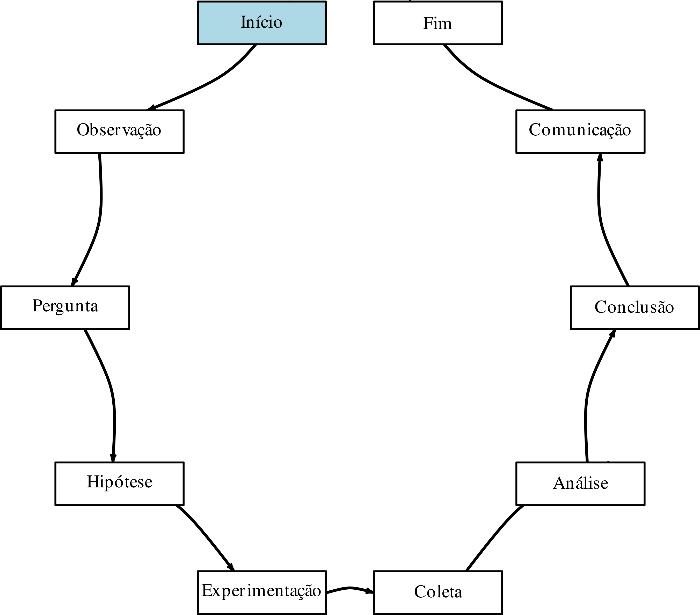
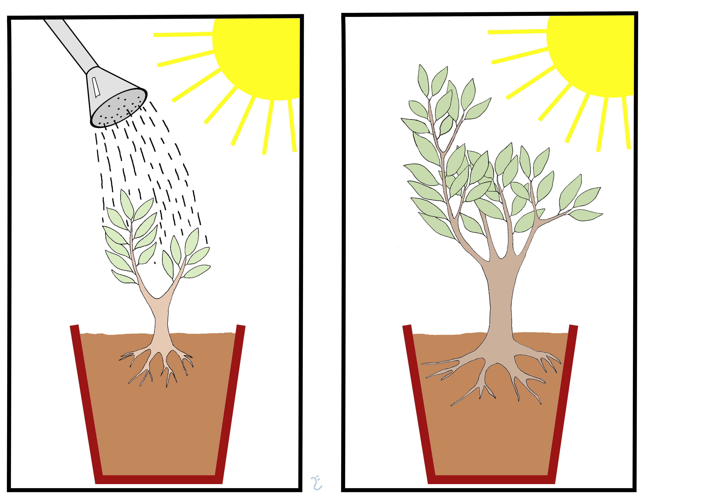
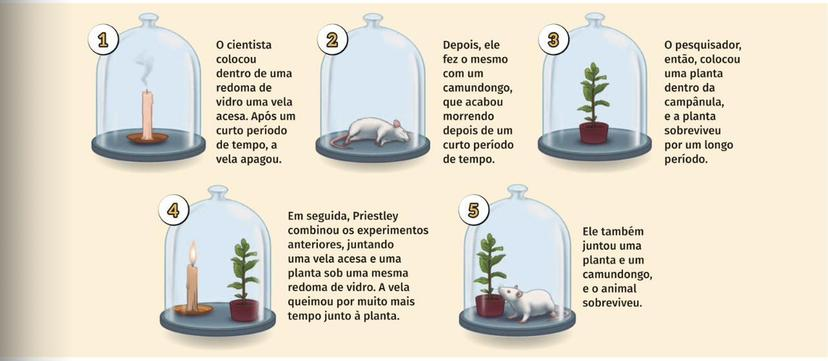

```{r setup, include=FALSE}
options(html.tag.transform.rmarkdown = TRUE)
knitr::opts_chunk$set(echo = TRUE, warning = FALSE, message = FALSE, fig.retina = 2)
suppressPackageStartupMessages({
  library(tidyverse)
  library(kableExtra)
  library(broom)
})
```

class: inverse, center, middle

# Aula 01 — Princípios do Delineamento de Experimentos

### Teoria · Aplicação · Discussão · Uso do R

---

class: inverse, center, middle

# Bloco 1 — Teoria

---

## Por que planejar, e não só analisar?

Um experimento bem desenhado responde a uma pergunta causal antes de qualquer dado existir — a
análise só formaliza o que o desenho já tornou possível.

> "Fazer uma análise estatística depois que o experimento terminou é, frequentemente, apenas uma
> tentativa de resgatar o que já foi arruinado." — paráfrase de R. A. Fisher (Fisher, 1935)

Nenhuma técnica de análise, por mais sofisticada, conserta um desenho ruim
(Fisher, 1935; Box, Hunter & Hunter, 2005).

---

## O método científico: de observação a hipótese testável

.pull-left[
```{r fig-ciclo-cientifico, echo=FALSE, out.width="96%"}

```
]
.pull-right[
Popper (1959): uma hipótese só é cientificamente informativa se for **falseável** — se existir
algum resultado observável que a contradiga.

O delineamento de experimentos entra exatamente aqui: é a engenharia de **como coletar dados que
de fato podem contradizer a hipótese**, caso ela seja falsa.

--

Um desenho fraco (sem repetição, sem aleatorização, com confusão não controlada) produz dados que
"confirmam" a hipótese do pesquisador quase independentemente de ela ser verdadeira — o oposto do
que Popper pede.
]

---

## Observação vs. experimentação

- **Estudo observacional:** o pesquisador só registra o que já aconteceria de qualquer forma —
  não decide quem recebe qual tratamento.
- **Estudo experimental:** o pesquisador **atribui** o tratamento às unidades, idealmente por
  sorteio.

--

Em um observacional, qualquer diferença entre grupos pode vir do tratamento *ou* de alguma
característica que levou aquelas unidades a receber aquele tratamento (auto-seleção, viés de
indicação, tendência histórica) — "correlação não implica causalidade". Em um experimento bem
desenhado, é a **aleatorização** — não a unidade, não nenhuma característica dela — que decide o
tratamento, e é esse fato (formalizado a seguir) que permite a leitura causal.

**Nota histórica:** a formalização de repetição/aleatorização/blocagem como resposta ao problema
causal nasce de R. A. Fisher em Rothamsted (1919–1933) (Fisher, 1935) — antes dele, ensaios
agrícolas comparavam parcelas "parecidas" escolhidas por julgamento, vulnerável a exatamente o
problema de confusão da próxima seção.

---

## Confusão (*confounding*)

Duas variáveis estão **confundidas** quando seus efeitos sobre a resposta não podem ser separados
a partir dos dados — tipicamente porque uma determinou (ou influenciou fortemente) os valores da
outra.

--

**Exemplo clássico** (Owen, 2020): todo o grupo tratado é medido de manhã, todo o
controle à tarde — o efeito do tratamento e o efeito do horário ficam **perfeitamente
confundidos**; nenhuma análise, por mais sofisticada, os separa a partir desses dados. O mesmo
ocorre ao comparar um grupo "tratado agora" com um **controle histórico**: qualquer tendência de
fundo (sazonalidade, aprendizado, mudança de público) se confunde com o tratamento.

--

Confusão por variável **medida** pode, em princípio, entrar no modelo como covariável (ANCOVA,
Capítulo 3). Confusão por variável **desconhecida** é o caso perigoso — e é exatamente aí que a
aleatorização mostra sua força: sorteando o tratamento, nenhuma variável, medida ou não, fica
sistematicamente desbalanceada entre grupos, em expectativa (prova formal a seguir).

---

## Unidade experimental vs. unidade amostral

- **Unidade experimental (UE):** onde o tratamento é sorteado. É o nível da aleatorização.
- **Unidade amostral:** onde a resposta é efetivamente medida.

Quando várias unidades amostrais vêm da mesma UE, há **submuestreo**. Contá-las como réplicas
independentes é um erro clássico: infla artificialmente o *n* e reduz o erro-padrão de forma
ilegítima.

--

.pull-left[
**UE = pessoa**
Cada pessoa recebe *um* tratamento.
]
.pull-right[
**Unidade amostral = medição**
Uma pessoa pode gerar várias medições.
]

---

## Fontes de variação

Toda resposta varia por três razões simultâneas:

1. **Efeito do tratamento** — o que queremos detectar.
2. **Variação sistemática entre unidades** — diferenças preexistentes (habilidade, fertilidade
   do solo, navegador do usuário) que não são o foco, mas afetam a resposta.
3. **Erro experimental** — o que sobra depois de contabilizar (1) e (2).

O delineamento isola (1), controla (2) e estima honestamente (3).

---

## Fator, nível, tratamento

- **Fator:** variável controlada pelo pesquisador.
- **Níveis:** valores específicos que o fator assume.
- **Tratamento:** combinação de níveis atribuída a uma unidade experimental.

```{r tabela-fatores, echo=FALSE}
tibble(
  Domínio = c("Psicologia", "Agricultura", "Ciência de dados"),
  Fator = c("Técnica de estudo", "Dose de fertilizante", "Layout da página"),
  Níveis = c("Releitura / Flashcards / Teste-prática", "0, 50, 100 kg/ha", "Lista / Grade")
) %>%
  kable(format = "html") %>%
  kable_styling(font_size = 18, full_width = FALSE)
```

---

## Os três aspectos do delineamento

Seguindo a formalização clássica (Fisher, 1935; Cochran & Cox, 1957):

1. **Desenho de tratamentos** — *o quê* comparar.
2. **Desenho para controle do erro** — *como* atribuir tratamentos com justiça.
3. **Desenho amostral** — *quantas* unidades, como medir.

Os três princípios a seguir pertencem sobretudo ao aspecto 2.

---

## Por que a aleatorização funciona: resultados potenciais

Formalização de Neyman (1923) / Rubin (1974)
(Imbens & Rubin, 2015). Para cada unidade $i$: dois **resultados potenciais**, $Y_i(0)$ e $Y_i(1)$ —
só um é observável. $Z_i \in \{0,1\}$: tratamento sorteado. Observado: $Y_i = Z_iY_i(1)+(1-Z_i)Y_i(0)$.

$$\text{ATE} = \bar Y(1) - \bar Y(0), \qquad
\widehat{\text{ATE}} = \bar Y_1^{\,obs} - \bar Y_0^{\,obs}$$

--

Tratando $\{Y_i(0),Y_i(1)\}$ como **fixos** e só $Z_i$ como aleatório (sorteio de qual
subconjunto de tamanho $n_1$ recebe tratamento):

$$E\!\left[\bar Y_1^{\,obs}\right] = \frac{1}{N}\sum_i Y_i(1) = \bar Y(1)
\;\;\Longrightarrow\;\; E\!\left[\widehat{\text{ATE}}\right] = \text{ATE}$$

porque a aleatorização faz do grupo tratado uma **amostra aleatória simples** dos $N$ valores
$Y_i(1)$ — não-viés **sem** suposição distribucional. Sem sorteio, $Z_i$ pode depender de
$(Y_i(0),Y_i(1))$: a igualdade quebra, e $\widehat{\text{ATE}}$ mistura efeito causal com viés de
seleção.

---

## Validade interna vs. validade externa

A demonstração acima garante **validade interna**: dentro da amostra de $N$ unidades estudadas, a
diferença de médias é não-viesada para o ATE *dessa amostra*. É uma afirmação sobre o mecanismo
de atribuição (a aleatorização), não sobre quem são as $N$ unidades.

--

**Validade externa** (Owen, 2020): o efeito estimado nessas $N$ unidades se generaliza
para outras unidades, fora do estudo? Validade interna alta **não implica** validade externa
alta — um experimento com aleatorização impecável ainda pode dizer pouco sobre uma população mais
ampla, se a amostra não for representativa dela (voluntários de um "programa beta", estudantes de
graduação como sujeitos de laboratório, parcelas de uma única estação experimental).

Não há solução puramente estatística para validade externa — só o cuidado de deixar explícito
**a que população** e **sob quais condições** a conclusão se aplica.

---

## Antes de formalizar: dois ingredientes, dois pioneiros

Os três pilares que vamos formalizar não nasceram juntos — cada um resolve um problema distinto,
visível separadamente **antes** de Fisher os combinar num só desenho.

.pull-left[
```{r fig-van-helmont, echo=FALSE, out.width="85%"}

```
]
.pull-right[
**Jan Baptist van Helmont, séc. XVII — o poder da quantificação.**

Pergunta: de onde vem a massa de uma planta que cresce? Em vez de especular, ele **mediu**: pesou
90 kg de solo seco, plantou um salgueiro de 2,25 kg, regou-o só com água por 5 anos.

```{r van-helmont-calc}
peso_inicial_arvore <- 2.25; peso_inicial_solo <- 90.0
peso_final_arvore   <- 76.1; peso_final_solo   <- 89.9
ganho_arvore <- peso_final_arvore - peso_inicial_arvore
perda_solo   <- peso_inicial_solo - peso_final_solo
c(ganho_arvore_kg = ganho_arvore, perda_solo_kg = perda_solo)
```
]

---

## Van Helmont — o que os números dizem

O solo quase não mudou (**`r round(perda_solo,1)` kg** perdidos em 5 anos) enquanto a árvore ganhou
**`r round(ganho_arvore,1)` kg**. Conclusão de van Helmont: a massa da árvore veio majoritariamente
da água, não do solo (hoje sabemos que vem também do CO₂ do ar — o método é o que importa aqui, não
a conclusão final).

--

**Sem quantificar, a comparação sequer existiria** — "a árvore cresceu" não é uma afirmação
testável; "a árvore ganhou 73,85 kg enquanto o solo perdeu 0,1 kg" é.

---

## O segundo ingrediente: comparar com o que não recebeu o tratamento

.pull-left[
```{r fig-priestley, echo=FALSE, out.width="92%"}

```
]
.pull-right[
**Joseph Priestley, séc. XVIII — o poder do controle.**

Uma vela sob uma redoma de vidro apaga o ar "de dentro". A pergunta: uma planta consegue
restaurá-lo?

- **Sem planta (controle):** o ar continua "danificado" — uma vela nova não queima.
- **Com planta (tratamento):** dias depois, uma vela nova volta a queimar na mesma redoma.
]

---

## Priestley — por que o controle é indispensável

Só comparando os dois cenários — não observando *apenas* o cenário com planta — Priestley pôde
atribuir a restauração à planta, e não a alguma outra mudança (temperatura, tempo, luz) que
aconteceria de qualquer forma.

--

**Sem grupo controle, "funcionou" não quer dizer nada** — funcionou *em relação a quê*?

---

## Os três pilares

Van Helmont deu o primeiro ingrediente (medir com precisão); Priestley, o segundo (comparar contra
um controle). Nenhum dos dois basta sozinho — falta ainda **repetir** e **sortear**, não só
comparar uma vez. Fisher, a seguir, combina os quatro numa só receita.

.pull-left[
### Repetição
Tratamentos em várias UEs independentes → estima o erro experimental.

### Aleatorização
Sorteio (não conveniência) → grupos comparáveis em tudo, observado ou não. Sem ela, não há
interpretação causal legítima.
]
.pull-right[
### Controle local (blocagem)
Agrupar UEs heterogêneas em blocos homogêneos, aleatorizando *dentro* de cada bloco → reduz o
erro experimental sem abrir mão da aleatorização.
]

---

## Os três pilares, num só experimento: a senhora que toma chá

.pull-left[
**Cambridge, anos 1920.** Muriel Bristol afirma distinguir se o leite foi posto antes ou depois do chá. Fisher (1935) propõe testá-la.

**O desenho:** 8 xícaras, 4 de cada tipo, apresentadas em **ordem aleatória**. Ela deve separá-las em dois grupos de 4.
]
.pull-right[
Os três pilares, visíveis de uma vez:

- **Repetição** — 8 xícaras, não uma. Com uma só, acertar por sorte tem chance $1/2$.
- **Aleatorização** — a ordem sorteada é o que **cria** a distribuição de referência e protege de viés inconsciente.
- **Controle local** — mesma xícara, mesma temperatura, mesmo açúcar: a única diferença deliberada é a ordem do leite.
]

--

**A pergunta de Fisher não é "ela acertou?", e sim:** se ela estivesse apenas adivinhando, com que frequência acertaria tudo?

---

## O teste exato: a distribuição vem do próprio sorteio

Sob $H_0$ (ela adivinha), escolher 4 xícaras entre 8 é escolher **uma** das $\binom{8}{4}=70$ partições, todas igualmente prováveis. Logo

$$P(\text{acertar as 4} \mid H_0)=\frac{1}{\binom{8}{4}}=\frac{1}{70}\approx 0{,}0143$$

--

.pull-left[
```{r cha-dist, echo=FALSE, fig.width=5, fig.height=2.9}
tibble(acertos = 0:4, p = dhyper(0:4, 4, 4, 4)) %>%
  ggplot(aes(factor(acertos), p, fill = acertos == 4)) +
  geom_col(width = 0.72, show.legend = FALSE) +
  geom_text(aes(label = paste0(round(100 * p, 1), "%")), vjust = -0.35, size = 3.4) +
  scale_fill_manual(values = c(`FALSE` = "#b9c4d0", `TRUE` = "#b3392b")) +
  scale_y_continuous(expand = expansion(mult = c(0, 0.18))) +
  labs(x = "xícaras corretas sob H₀", y = NULL,
       title = "Distribuição exata (hipergeométrica)") +
  theme_minimal(base_size = 11) +
  theme(panel.grid.major.x = element_blank())
```
]
.pull-right[
```{r cha-teste}
cha <- matrix(c(4, 0, 0, 4), nrow = 2,
  dimnames = list(Palpite = c("leite 1º", "chá 1º"),
                  Real    = c("leite 1º", "chá 1º")))
fisher.test(cha, alternative = "greater")$p.value
```

Não há aproximação, nem normalidade, nem $n$ grande: a distribuição de referência **é** o conjunto das 70 aleatorizações.
]

--

É o mesmo argumento do teste de aleatorização da Aula 04 — e a origem histórica dele.

---

## Do princípio ao processo: o ciclo QPDAC

Tudo que vimos neste bloco — quantificar, controlar, os três pilares, resultados potenciais — se
organiza, na prática, num roteiro de cinco passos (Question, Plan, Data, Analysis, Conclusion):

1. **Question** — qual pergunta causal, precisa e mensurável? (não "o tratamento funciona?", mas
   "qual o ATE do tratamento X sobre a resposta Y, na população Z?")
2. **Plan** — desenho de tratamentos, desenho para controle do erro (os três pilares), desenho
   amostral: quantas UEs, submuestragem, blocagem.
3. **Data** — coleta seguindo exatamente o plano (nenhum desvio ad-hoc do sorteio).
4. **Analysis** — a ferramenta estatística certa para a estrutura de dados que o plano gerou (não
   o inverso).
5. **Conclusion** — interpretação em linguagem simples, com validade interna **e** externa
   explicitadas.

Os dois exemplos do próximo bloco seguem esse roteiro passo a passo, em domínios diferentes.

---

class: inverse, center, middle

# Bloco 2 — Aplicação

---

## Técnicas de estudo e desempenho em prova

**Pergunta:** releitura, flashcards e teste-prática diferem quanto à nota em uma prova de
vocabulário?

- 30 estudantes, sorteados em 3 grupos de 10 (**UE = estudante**).
- Cada estudante responde **duas provas paralelas** (A e B) sobre o mesmo material
  (**unidade amostral = prova**, submuestreo).

--

**Desenho de tratamentos:** 1 fator (técnica), 3 níveis.
**Controle do erro:** aleatorização simples, sem blocos.
**Desenho amostral:** 10 UEs por grupo, 2 submuestras por UE.

---

## Os dados simulados

```{r sim-dados}
set.seed(2026)
tecnica <- c("Releitura", "Flashcards", "Teste-prática")

dados_estudantes <- tibble(
  estudante  = 1:30,
  tecnica    = factor(rep(tecnica, each = 10), levels = tecnica),
  habilidade = rnorm(30, 0, 6)
)
efeito <- c("Releitura" = 0, "Flashcards" = 4, "Teste-prática" = 9)

dados_provas <- dados_estudantes %>%
  crossing(prova = c("A", "B")) %>%
  mutate(nota = 65 + efeito[as.character(tecnica)] + habilidade +
           rnorm(n(), 0, 3))
```

```{r sim-dados-tab, echo=FALSE}
dados_provas %>%
  group_by(tecnica) %>%
  summarise(n_estudantes = n_distinct(estudante), n_provas = n(),
            media = round(mean(nota), 1), .groups = "drop") %>%
  kable(format = "html") %>% kable_styling(font_size = 18, full_width = FALSE)
```

O *n* relevante para inferência é **10 por grupo** (estudantes), não 20 (provas).

---

## Visualizando: cada ponto é uma prova, cada cor uma técnica, a forma distingue A de B

```{r plot-submuestreo, echo=FALSE, fig.width=8, fig.height=4.2}
ggplot(dados_provas, aes(x = tecnica, y = nota, group = estudante)) +
  geom_line(alpha = 0.3) +
  geom_point(aes(color = tecnica, shape = prova), size = 2.6, alpha = 0.8) +
  scale_shape_manual(values = c(A = 16, B = 17)) +
  labs(x = NULL, y = "Nota", shape = "Prova",
       title = "Duas provas (A/B) por estudante (submuestreo)") +
  theme_minimal(base_size = 14) +
  theme(legend.position = "bottom", legend.title = element_text(size = 11))
```

As duas notas de um mesmo estudante estão ligadas — são mais parecidas entre si do que notas de
estudantes diferentes. Isso é exatamente o que a distinção UE/unidade amostral prevê.

---

## Um segundo domínio: teste A/B em produto digital

**Question:** uma loja *online* testa dois layouts da página de produto — **A** (lista) e **B**
(grade) — quanto à taxa de conversão em checkout. Layout B causa mudança na taxa?

**Plan (os mesmos ingredientes, unidade diferente):**
- **UE = sessão de usuário** (o tratamento — qual layout ver — é sorteado por sessão).
- **Resultados potenciais:** $Y_i(0)\in\{0,1\}$ = converteria sob A; $Y_i(1)\in\{0,1\}$ = converteria
  sob B. $\text{ATE} = p_B - p_A$, exatamente a definição da Seção anterior — só que aqui a
  resposta é binária, não contínua.
- **Repetição:** milhares de sessões por braço. **Aleatorização:** sorteio por sessão, não por
  dia/horário (evita confundir layout com hora do dia — a lição da Seção "Confusão").

---

## Data: os dados simulados (taxa real conhecida, porque é simulação)

```{r ab-dados}
set.seed(2026)
n_por_grupo <- 8000
taxa_A <- 0.052   # taxa de conversao real sob o layout A (Lista)
taxa_B <- 0.061   # taxa de conversao real sob o layout B (Grade)

dados_ab <- tibble(
  layout    = factor(rep(c("A (lista)", "B (grade)"), each = n_por_grupo)),
  converteu = c(rbinom(n_por_grupo, 1, taxa_A), rbinom(n_por_grupo, 1, taxa_B))
)

resumo_ab <- dados_ab %>%
  group_by(layout) %>%
  summarise(sessoes = n(), conversoes = sum(converteu),
            taxa = mean(converteu), .groups = "drop")
resumo_ab %>% kable(digits = 4, format = "html") %>%
  kable_styling(font_size = 18, full_width = FALSE)
```

---

## Analysis: o teste de proporções

```{r ab-teste}
teste_ab <- prop.test(x = resumo_ab$conversoes, n = resumo_ab$sessoes)
broom::tidy(teste_ab) %>% select(estimate1, estimate2, p.value, conf.low, conf.high) %>%
  kable(digits = 4, format = "html") %>% kable_styling(font_size = 17, full_width = FALSE)
```

---

## Analysis e Conclusion: efeito, intervalo e interpretação

.pull-left[
```{r ab-plot, echo=FALSE, fig.width=4.6, fig.height=3.6}
resumo_ab %>%
  mutate(ic = map2(conversoes, sessoes, ~prop.test(.x, .y)$conf.int)) %>%
  mutate(low = map_dbl(ic, 1), high = map_dbl(ic, 2)) %>%
  ggplot(aes(layout, taxa, fill = layout)) +
  geom_col(width = 0.6, show.legend = FALSE) +
  geom_errorbar(aes(ymin = low, ymax = high), width = 0.15) +
  scale_y_continuous(labels = scales::percent_format()) +
  labs(x = NULL, y = "Taxa de conversão") +
  theme_minimal(base_size = 12)
```
]
.pull-right[
$\widehat{\text{ATE}} = \hat p_B-\hat p_A =$ `r round(diff(resumo_ab$taxa), 4)`, IC 95%
não inclui zero (p `r if (broom::tidy(teste_ab)$p.value < 0.001) "< 0,001" else paste("=", round(broom::tidy(teste_ab)$p.value,4))`).

**Conclusion (linguagem simples):** o layout em grade aumentou a conversão em
$`r round(100*diff(resumo_ab$taxa),1)`$ pontos percentuais nesta amostra de usuários do site — efeito
pequeno, mas real e estatisticamente detectável com $n=$ `r scales::comma(2*n_por_grupo, big.mark=".", decimal.mark=",")`
sessões. Validade interna: alta (aleatorização por sessão). Validade externa: limitada aos
usuários deste site, neste período — não implica o mesmo ganho em outro produto.
]

---

## Os dois exemplos, lado a lado

```{r tabela-dois-exemplos, echo=FALSE}
tibble(
  Ingrediente = c("Domínio", "UE", "Tratamento", "Resposta", "Resultados potenciais", "ATE estimado"),
  `Técnicas de estudo` = c("Psicologia", "Estudante", "Técnica (3 níveis)",
                            "Nota (contínua)", "$Y_i(t)$, $t\\in\\{1,2,3\\}$",
                            "diferenças de médias, Cap. 3"),
  `Teste A/B` = c("Ciência de dados", "Sessão de usuário", "Layout (2 níveis)",
                  "Converteu (binária)", "$Y_i(0), Y_i(1)\\in\\{0,1\\}$",
                  paste0(round(100*diff(resumo_ab$taxa),1), " p.p."))
) %>%
  kable(format = "html", escape = FALSE) %>% kable_styling(font_size = 16, full_width = TRUE)
```

Mesmos ingredientes (UE, tratamento, resposta, resultados potenciais), domínios diferentes — é
esse o padrão que o curso repete em agricultura, psicologia e ciência de dados até o Capítulo 6.

---

class: inverse, center, middle

# Bloco 3 — Discussão

---

## Perguntas para a turma

1. Se o professor deixasse os alunos **escolherem** a técnica de estudo, em vez de sortear,
   quais variáveis de confusão plausíveis contaminariam a comparação?

2. Em um experimento agrícola em que cada bloco é um **dia de plantio** (chuva, temperatura e
   luz diferentes), o que a blocagem por dia consegue controlar — e o que ela **não** consegue?

3. Uma equipe de produto testa um novo layout de site só com usuários que se voluntariam para o
   "programa beta". Isso é aleatorização? Qual população a conclusão do teste realmente
   representa?

4. No exemplo das provas paralelas, o que mudaria na análise se, em vez de reportar a média das
   duas provas por estudante, alguém rodasse a ANOVA diretamente nas 60 notas?

---

class: inverse, center, middle

# Bloco 4 — Uso do R

---

## Do desenho ao código: declarando a estrutura

```{r uso-r-1}
# 1. O fator de tratamento, com os níveis na ordem que queremos exibir
dados_estudantes$tecnica <- factor(dados_estudantes$tecnica,
                                    levels = c("Releitura", "Flashcards", "Teste-prática"))

# 2. A unidade experimental precisa de um identificador único e explícito —
#    é ele que usaremos para agregar o submuestreo antes de qualquer teste.
media_por_estudante <- dados_provas %>%
  group_by(estudante, tecnica) %>%
  summarise(nota_media = mean(nota), .groups = "drop")

nrow(dados_provas)          # 60 unidades amostrais
nrow(media_por_estudante)   # 30 unidades experimentais — o n correto
```

---

## Uma prévia do que vem no Capítulo 3

```{r uso-r-2}
modelo_ingenuo  <- aov(nota ~ tecnica, data = dados_provas)          # errado: usa 60
modelo_correto  <- aov(nota_media ~ tecnica, data = media_por_estudante)  # certo: usa 30

broom::tidy(modelo_ingenuo)[1, c("term","df","p.value")]
broom::tidy(modelo_correto)[1, c("term","df","p.value")]
```

Note a diferença nos graus de liberdade e no p-valor: tratar submuestras como réplicas
independentes muda a conclusão. Formalizaremos por que isso acontece — e como corrigi-lo — ao
estudar o **modelo de submuestreo em um DCA**, no Capítulo 3.

---

## Resumo da aula

- UE = onde o tratamento é sorteado; unidade amostral = onde a resposta é medida.
- Três fontes de variação: tratamento, variação sistemática entre UEs, erro experimental.
- Fator, nível, tratamento: o vocabulário do desenho de tratamentos.
- Repetição, aleatorização, controle local: os três pilares do controle do erro.
- Próxima aula: a maquinaria formal — o **modelo linear** — para expressar tudo isso com precisão.

---

## Referências

- Fisher, R. A. (1935). *The Design of Experiments*. Oliver and Boyd.
- Box, G. E. P., Hunter, J. S. & Hunter, W. G. (2005). *Statistics for Experimenters: Design, Innovation, and Discovery* (2ª ed.). John Wiley & Sons.
- Popper, K. R. (1959). *The Logic of Scientific Discovery*. Hutchinson & Co.
- Owen, A. B. (2020). *A First Course in Experimental Design: Notes from Stat 263/363*. Stanford University.
- Cochran, W. G. & Cox, G. M. (1957). *Experimental Designs* (2ª ed.). John Wiley & Sons.
- Splawa-Neyman, J. (1923). On the Application of Probability Theory to Agricultural Experiments. Essay on Principles. Section 9. *Statistical Science*, 5(4), 465–472.
- Rubin, D. B. (1974). Estimating Causal Effects of Treatments in Randomized and Nonrandomized Studies. *Journal of Educational Psychology*, 66(5), 688–701.
- Imbens, G. W. & Rubin, D. B. (2015). *Causal Inference for Statistics, Social, and Biomedical Sciences: An Introduction*. Cambridge University Press.
