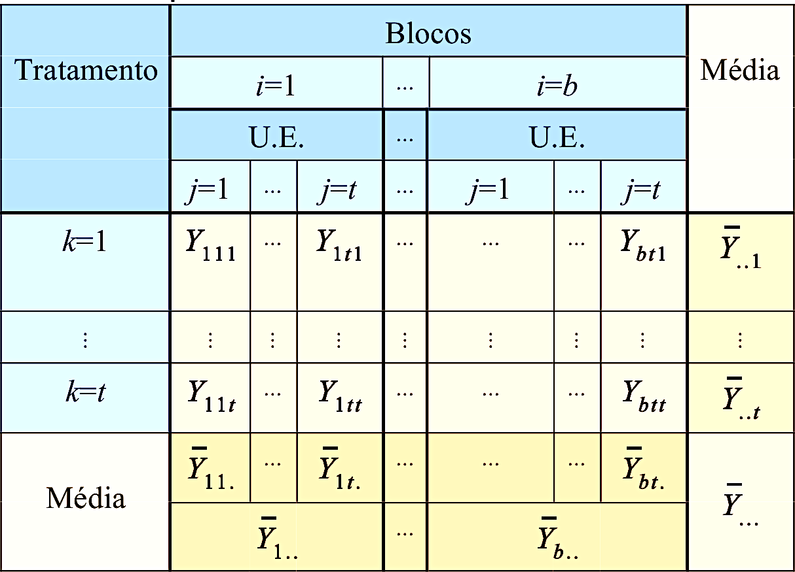

```{r setup, include=FALSE}
options(html.tag.transform.rmarkdown = TRUE)
knitr::opts_chunk$set(echo = TRUE, warning = FALSE, message = FALSE, fig.retina = 2)
suppressPackageStartupMessages({
  library(tidyverse)
  library(kableExtra)
  library(broom)
  library(sf)
})
```

class: inverse, center, middle

# Aula 09 — Delineamento em Blocos Completos Aleatorizados

### Teoria · Aplicação · Discussão · Uso do R

---

class: inverse, center, middle

# Bloco 1 — Teoria

---

## Motivação: o que dá errado sem controle — fatores confundidos

Dois fatores estão **completamente confundidos** quando seus efeitos são matematicamente
indistinguíveis: toda vez que um está em certo nível, o outro também está, sempre.

**Exemplo:** uma prefeitura lança um programa de incentivo comercial só em bairros de renda
**alta**, usando bairros de renda **baixa** como "controle".

```{r confundido-sim}
set.seed(777)
dados_confundido <- tibble(
  renda    = factor(rep(c("Alta","Baixa"), each = 3), levels = c("Alta","Baixa")),
  programa = factor(rep(c("Incentivo","Controle"), each = 3), levels = c("Incentivo","Controle")),
  faturamento = c(rnorm(3, 520, 40), rnorm(3, 210, 25))
)
```

---

## Programa ou renda? Impossível saber

```{r confundido-plot, echo=FALSE, fig.width=6, fig.height=4}
ggplot(dados_confundido, aes(x = programa, y = faturamento, fill = renda)) +
  geom_boxplot(alpha = 0.6, width = 0.5) +
  geom_jitter(width = 0.08, size = 2.6) +
  scale_fill_manual(values = c("#2a78d6", "#eb6834"), name = "Renda do bairro") +
  labs(x = NULL, y = "Faturamento (R$ mil)") +
  theme_minimal(base_size = 13)
```

--

`renda` e `programa` variam em perfeita sincronia — `lm(faturamento ~ renda + programa)` nem é
identificável. **Isso não é uma falha de estimação, é uma falha de delineamento.**

---

## O antídoto: blocos, não confusão

O DBCA é o oposto desse erro: ele **agrupa** unidades por uma variável de ruído em blocos, mas
**sorteia** os tratamentos dentro de cada bloco — todo tratamento aparece em todo nível de ruído.

```{r confundido-mapa, echo=FALSE, fig.width=6, fig.height=4.6}
recife <- st_read("../Aulas/Bairros_Recife/bairros-polygon.shp", quiet = TRUE)
ggplot(recife) +
  geom_sf(aes(fill = factor(rpa)), color = "white", linewidth = 0.15) +
  scale_fill_brewer(palette = "Set2", name = "RPA (bloco)") +
  labs(title = "94 bairros do Recife, 6 RPAs") +
  theme_minimal(base_size = 11) +
  theme(axis.text = element_blank(), panel.grid = element_blank())
```

--

Cada RPA poderia ser um bloco geográfico: dentro dela, o tratamento é sorteado — não fixado pela
própria característica da região.

---

## Do controle local ao DBCA

Na Aula 01 vimos o princípio do **controle local**: agrupar unidades heterogêneas em blocos
homogêneos e sortear tratamentos *dentro* de cada bloco.

O **DBCA** formaliza isso para $t$ tratamentos e $b$ blocos completos (todo tratamento aparece
uma vez em cada bloco):

$$
Y_{ij} = \mu + \tau_i + \beta_j + \varepsilon_{ij}, \qquad i=1,\dots,t;\ j=1,\dots,b
$$

$\varepsilon_{ij}\sim N(0,\sigma^2)$ independentes. **Sem** interação tratamento$\times$bloco: o
efeito de um tratamento é o mesmo (a menos de erro) em todo bloco.

---

## Notação matricial: $Y = X\beta + \varepsilon$

$$
X = \big[\,\mathbf 1 \mid X_{trat} \mid X_{bloco}\,\big]
$$

Sem colunas de produto tratamento$\times$bloco — é isso, na matriz, que é a suposição de
aditividade.

```{r dbca-matriz-toy}
dados_toy <- expand_grid(bloco = factor(1:2), tratamento = factor(1:3))
model.matrix(~ tratamento + bloco, data = dados_toy)
```

--

$\hat\beta=(X'X)^{-1}X'Y$, $H=X(X'X)^{-1}X'$: a ANOVA que segue é só uma forma de organizar
$\|Y-\hat Y\|^2$ pelos blocos de colunas de $X$ (Capítulo 2).

---

## Blocagem é aleatorização restrita

Modelo causal de Neyman-Rubin (Neyman, 1923; Rubin, 1974; Imbens & Rubin, 2015):
$Y_u(i)$ = resultado potencial da unidade $u$ sob tratamento $i$.

- **DCA:** sorteio *completo* entre todas as unidades.
- **DBCA:** sorteio *restrito* — dentro de cada bloco, separadamente (aleatorização
  estratificada).

--

Ambos são não viesados para $\mathbb E[Y_u(i)-Y_u(i')]$. A diferença é **variância**: blocar por
uma variável correlacionada com a resposta reduz o erro-padrão, exatamente como estratificar em
amostragem reduz a variância de uma média — a mesma lógica da eficiência relativa, adiante.

---

## Tabela de ANOVA

```{r tabela-anova-dbca, echo=FALSE}
tibble(
  Fonte = c("Tratamento", "Bloco", "Erro", "Total"),
  gl    = c("t-1", "b-1", "(t-1)(b-1)", "tb-1")
) %>%
  kable(format = "html") %>% kable_styling(font_size = 20, full_width = FALSE)
```

Teste de interesse: $F_0 = QM_{Trat}/QM_{Erro}$.

--

**Cuidado:** o teste $F$ sobre blocos não deve guiar a decisão de removê-los do modelo — os blocos
foram *fixados pelo delineamento*, não sorteados; sua função é reduzir o erro, não ser
"significativo".

---

## Por que o teste de blocos não deve orientar decisão

Sob $\sum_i\tau_i=0$, $\sum_j\beta_j=0$:

$$
\mathbb E[QM_{Trat}] = \sigma^2 + \frac{b}{t-1}\sum_i \tau_i^2, \qquad
\mathbb E[QM_{Bloco}] = \sigma^2 + \frac{t}{b-1}\sum_j \beta_j^2
$$

$\mathbb E[QM_{Erro}]=\sigma^2$ em ambos os casos — a matemática do teste $QM_{Bloco}/QM_{Erro}$
é perfeitamente válida.

--

O problema é a **pergunta**: $H_0:\beta_1=\dots=\beta_b=0$ não interessa aqui, porque os blocos
não foram sorteados de uma população de blocos — foram *escolhidos* por já se saber que eram
heterogêneos. A pergunta que importa é a eficiência relativa, adiante.

---

## Dados faltantes: fórmula de Yates

Uma observação perdida na célula (tratamento $i^*$, bloco $j^*$) pode ser estimada por
(Yates, 1936):

$$
\hat y_{i^*j^*} = \frac{t\,T'_{i^*} + b\,B'_{j^*} - G'}{(t-1)(b-1)}
$$

$T'$, $B'$, $G'$: totais de tratamento, bloco e geral, **excluindo** a observação perdida.

--

Duas ressalvas ao prosseguir com a ANOVA:

1. Reduza $gl_{Erro}$ em 1 (a observação estimada não é informação nova).
2. $SQ_{Trat}$ fica levemente viesada para cima; correção aproximada:

$$
SQ_{Trat}^{ajustada} = SQ_{Trat}^{ingênua} - \frac{\left[B'_{j^*}-(t-1)\hat y_{i^*j^*}\right]^2}{t(t-1)}
$$

---

## Eficiência relativa do DBCA frente ao DCA

Valeu a pena blocar? (Montgomery, 2017; Cochran & Cox, 1957):

$$
ER(DBCA,DCA) = \frac{(gl_B+1)(gl_{E,DCA}+3)\,QM_{Bloco} + gl_{E,DCA}(gl_B+3)\,QM_{Erro}}
                     {(gl_{E,DCA}+1)(gl_B+3)\,QM_{Erro}}
$$

com $gl_B=b-1$ e $gl_{E,DCA}=gl_{Erro}+gl_B$ (graus de liberdade do erro que um DCA teria tido com
o mesmo número de unidades).

--

$ER>1$: o DBCA foi mais eficiente — seria preciso aumentar as repetições do DCA por um fator $ER$
para igualar a precisão do DBCA. **$ER$ só é grande quando os blocos capturam heterogeneidade real.**

---

class: inverse, center, middle

# Bloco 2 — Aplicação

---

## Irrigação, silício e altura de pepineiros

**Pergunta:** oito combinações de irrigação (0,5 / 1,0) e dose de silício (0/500/1000/1500 ml)
diferem quanto à altura de plantas de pepino?

- **Bloco** = área do viveiro (3 blocos, cada um com sua heterogeneidade de solo/insolação).
- **Tratamento** = cada uma das 8 combinações irrigação$\times$silício (simplificação de um fator
  só; no Capítulo 5/Aula 12 decompomos esse efeito em irrigação, silício e interação).

--

24 unidades experimentais no total: $t=8$, $b=3$.

---

## A estrutura dos dados

```{r dbca-pepino}
pepino <- read_csv("../Livro/data/pepino.csv", show_col_types = FALSE) %>%
  mutate(
    tratamento = factor(paste0("riego", riego, "_", silicio)),
    bloco      = factor(bloque)
  )
glimpse(pepino)
```

`bloco` não é uma variável de interesse científico — só identifica a área do viveiro. Não faz
sentido perguntar "o bloco 2 é significativo?"; ele só existe para ser neutralizado.

---

## A população conceitual de respostas de um DBCA

```{r fig-quadro-blocos-09, echo=FALSE, out.width="55%"}

```

$Y_{ijk}$ = resultado (potencial) do tratamento $k$ na $j$-ésima UE do bloco $i$: uma tabela
bloco $\times$ tratamento, não um vetor solto de 24 números — é essa estrutura que o
`aov(altura ~ tratamento + bloco)` a seguir está de fato ajustando.

---

## Ajustando o DBCA

```{r dbca-pepino-mod}
mod_dbca <- aov(altura ~ tratamento + bloco, data = pepino)
X <- model.matrix(mod_dbca)
dim(X)  # 24 x 10: 1 + 7 (tratamento) + 2 (bloco), sem colunas cruzadas
```

```{r dbca-pepino-tab, echo=FALSE}
anova(mod_dbca) %>% broom::tidy() %>%
  kable(digits = 4, format = "html") %>% kable_styling(font_size = 18, full_width = FALSE)
```

Evidência forte de efeito de tratamento ($F_{7,14}=5{,}25$, $p=0{,}004$); efeito de bloco pequeno
neste conjunto de dados ($p=0{,}89$).

---

## O diagrama de Hasse deste DBCA

Tratamento e Bloco aparecem no **mesmo nível** — nenhum refina o outro, a assinatura de fatores
**cruzados** — e só se reencontram no Erro, que sobra depois de descontar ambos.

```{r hasse-dbca-09, echo=FALSE, fig.width=4.6, fig.height=4.4, fig.retina=2}
nos_dbca09 <- tibble(
  termo = c("Média", "Tratamento", "Bloco", "Erro"),
  df    = c(1, 8 - 1, 3 - 1, (8 - 1) * (3 - 1)),
  x     = c(0, -1, 1, 0),
  y     = c(3, 2, 2, 1)
)
arestas_dbca09 <- tibble(
  de   = c("Média", "Média", "Tratamento", "Bloco"),
  para = c("Tratamento", "Bloco", "Erro", "Erro")
)

arestas_xy_dbca09 <- arestas_dbca09 %>%
  left_join(nos_dbca09 %>% select(termo, x0 = x, y0 = y), by = c("de" = "termo")) %>%
  left_join(nos_dbca09 %>% select(termo, x1 = x, y1 = y), by = c("para" = "termo"))

ggplot() +
  geom_segment(data = arestas_xy_dbca09, aes(x = x0, y = y0, xend = x1, yend = y1),
               color = "grey45", linewidth = 0.6) +
  geom_label(data = nos_dbca09, aes(x = x, y = y, label = paste0(termo, "\n(", df, " gl)")),
             size = 3, label.padding = unit(0.25, "lines"), fill = "white", color = "grey15") +
  theme_void(base_size = 11) +
  labs(title = "DBCA pepino: t=8, b=3 (N=24)") +
  theme(plot.title = element_text(hjust = 0.5, face = "bold", size = 11))
```

$1+7+2+14=24=N$ — os 14 gl de Erro batem com `dim(X)` do slide anterior: $24-1-7-2=14$, a mesma
regra de subtração do Cap. 2/4 do livro-texto, agora aplicada a dois fatores cruzados em vez de
um só.

---

## Simulando um dado faltante

```{r dbca-missing}
alvo <- which(pepino$riego == 1 & pepino$silicio == "1000 ml" & pepino$bloque == 2)
valor_real <- pepino$altura[alvo]

pepino_miss <- pepino
pepino_miss$altura[alvo] <- NA

t <- nlevels(pepino$tratamento); b <- nlevels(pepino$bloco)
Tlinha <- sum(pepino_miss$altura[pepino_miss$tratamento == pepino$tratamento[alvo]], na.rm = TRUE)
Blinha <- sum(pepino_miss$altura[pepino_miss$bloco == pepino$bloco[alvo]], na.rm = TRUE)
Glinha <- sum(pepino_miss$altura, na.rm = TRUE)

y_hat <- (t * Tlinha + b * Blinha - Glinha) / ((t - 1) * (b - 1))
c(valor_real = valor_real, estimado = round(y_hat, 3), erro = round(y_hat - valor_real, 3))
```

O valor real era $5{,}12$; a fórmula de Yates estimou $4{,}69$ — erro de $0{,}43$ cm.

---

## Eficiência relativa

```{r dbca-re}
tab <- anova(mod_dbca)
MSB <- tab["bloco", "Mean Sq"];      MSE      <- tab["Residuals", "Mean Sq"]
gl_b <- tab["bloco", "Df"];          gl_e_dbca <- tab["Residuals", "Df"]
gl_e_dca <- gl_e_dbca + gl_b

ER <- ((gl_b + 1) * (gl_e_dca + 3) * MSB + gl_e_dca * (gl_b + 3) * MSE) /
      ((gl_e_dca + 1) * (gl_b + 3) * MSE)
round(ER, 3)
```

$ER\approx1{,}02$: ganho de eficiência muito modesto — coerente com $QM_{Bloco} < QM_{Erro}$ na
tabela de ANOVA. A blocagem por área do viveiro quase não capturou heterogeneidade real aqui.

---

## Uma armadilha: comparar QM_Erro diretamente

```{r dbca-re-plot, echo=FALSE, fig.width=6, fig.height=4}
QME_dbca <- MSE
QME_dca  <- (tab["Residuals","Sum Sq"] + tab["bloco","Sum Sq"]) / gl_e_dca

df_re <- tibble(
  Delineamento = factor(c("DBCA", "DCA (hipotético)"), levels = c("DBCA", "DCA (hipotético)")),
  QM_Erro = c(QME_dbca, QME_dca)
)

ggplot(df_re, aes(x = Delineamento, y = QM_Erro, fill = Delineamento)) +
  geom_col(width = 0.55) +
  geom_text(aes(label = sprintf("%.4f", QM_Erro)), vjust = -0.5, size = 4.2) +
  scale_fill_manual(values = c("#2a78d6", "#eb6834"), guide = "none") +
  labs(x = NULL, y = expression(QM[Erro])) +
  ylim(0, max(df_re$QM_Erro) * 1.2) +
  theme_minimal(base_size = 13)
```

--

$QM_{Erro}$(DCA hipotético) $=0{,}0493$ é **menor** que $QM_{Erro}$(DBCA)$=0{,}0554$! Isso não
significa que o DCA seria melhor: a estimativa do DCA tem mais graus de liberdade (16 vs. 14), o
que por si só a torna mais confiável — exatamente o que a fórmula de $ER$ pondera. Comparar
$QM_{Erro}$ cru engana; $ER$ não.

---

class: inverse, center, middle

# Bloco 3 — Discussão

---

## Perguntas para a turma

1. Se $QM_{Bloco}$ tivesse sido bem maior que $QM_{Erro}$ neste experimento, o que isso indicaria
   sobre a decisão original de blocar por área do viveiro?

2. O modelo do DBCA não inclui interação tratamento$\times$bloco. É razoável supor que a diferença
   entre duas doses de silício seja a mesma nos três blocos? Como você verificaria essa suposição
   informalmente com um gráfico?

3. Por que não se deve decidir remover o termo de bloco do modelo com base no teste $F$ de blocos
   não ser significativo?

4. Se, em vez de uma observação, tivessem faltado duas plantas em blocos e tratamentos diferentes,
   a fórmula de Yates ainda se aplicaria diretamente? O que mudaria?

---

class: inverse, center, middle

# Bloco 4 — Uso do R

---

## Do desenho ao código

```{r uso-r-1}
# tratamento e bloco precisam ser fatores explícitos antes do aov()
pepino$tratamento <- factor(pepino$tratamento)
pepino$bloco      <- factor(pepino$bloque)

# a ordem tratamento + bloco (e não bloco + tratamento) não muda os testes-F
# de um DBCA balanceado, porque as somas de quadrados são ortogonais aqui
mod_a <- aov(altura ~ tratamento + bloco, data = pepino)
mod_b <- aov(altura ~ bloco + tratamento, data = pepino)
all.equal(anova(mod_a)["tratamento", "F value"], anova(mod_b)["tratamento", "F value"])
```

---

## Visualizando aditividade: gráfico de perfis

```{r plot-dbca, echo=FALSE, fig.width=8, fig.height=4.2}
pal_blocos <- c("#2a78d6", "#eb6834", "#1baf7a")

ggplot(pepino, aes(x = tratamento, y = altura, group = bloco, color = bloco)) +
  geom_line(linewidth = 0.9, alpha = 0.85) +
  geom_point(size = 2.6) +
  scale_color_manual(values = pal_blocos, name = "Bloco") +
  labs(x = NULL, y = "Altura (cm)",
       title = "Altura por tratamento, uma linha por bloco") +
  theme_minimal(base_size = 12) +
  theme(axis.text.x = element_text(angle = 45, hjust = 1))
```

--

As linhas **cruzam-se** em vários pontos — a aditividade tratamento-bloco é só aproximada aqui.
Sem repetição por célula, não há como testar formalmente a interação: qualquer desvio de
aditividade é absorvido pelo erro. O gráfico de perfis é o diagnóstico informal disponível.

---

## Resumo da aula

- Sem controle, um fator de ruído pode ficar completamente **confundido** com o tratamento; o DBCA
  evita isso sorteando dentro de blocos, não fixando o tratamento por bloco.
- DBCA: uma fonte de bloqueio, ANOVA decompõe $SQ_{Total}$ em tratamento + bloco + erro; a
  esperança dos quadrados médios explica formalmente por que não se testa o bloco.
- Valor perdido: fórmula de Yates, com ajuste em $gl_{Erro}$ e em $SQ_{Trat}$.
- Eficiência relativa quantifica se blocar valeu a pena — não é automático.
- Próxima aula: teste de Friedman (alternativa não paramétrica) e blocos incompletos balanceados.

## Referências

- Splawa-Neyman, J. (1923). On the Application of Probability Theory to Agricultural Experiments. Essay on Principles. Section 9. *Statistical Science*, 5(4), 465–472.
- Rubin, D. B. (1974). Estimating Causal Effects of Treatments in Randomized and Nonrandomized Studies. *Journal of Educational Psychology*, 66(5), 688–701.
- Imbens, G. W. & Rubin, D. B. (2015). *Causal Inference for Statistics, Social, and Biomedical Sciences: An Introduction*. Cambridge University Press.
- Yates, F. (1936). Incomplete randomized blocks. *Annals of Eugenics*, 7(2), 121–140.
- Montgomery, D. C. (2017). *Design and Analysis of Experiments* (9ª ed.). John Wiley & Sons.
- Cochran, W. G. & Cox, G. M. (1957). *Experimental Designs* (2ª ed.). John Wiley & Sons.
