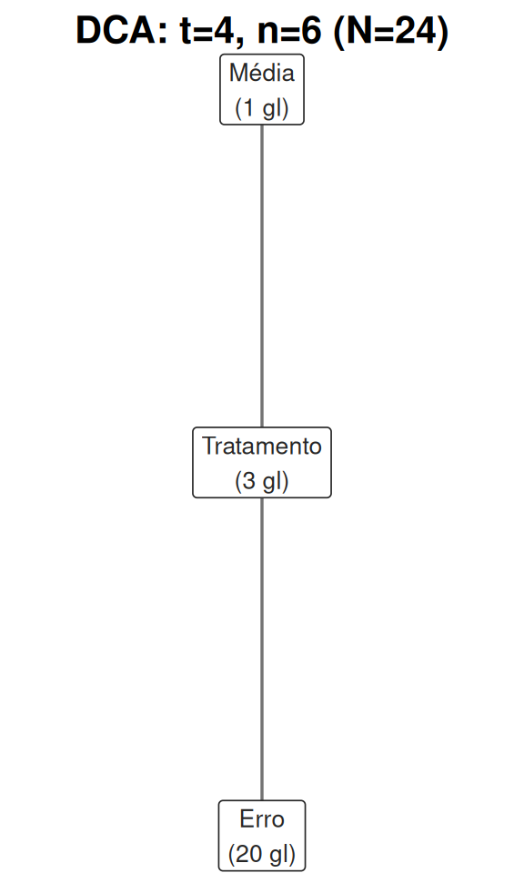
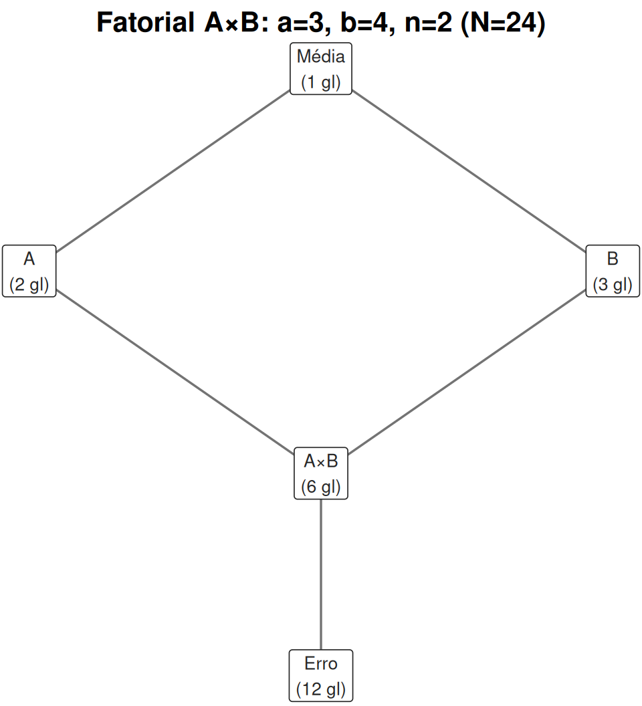
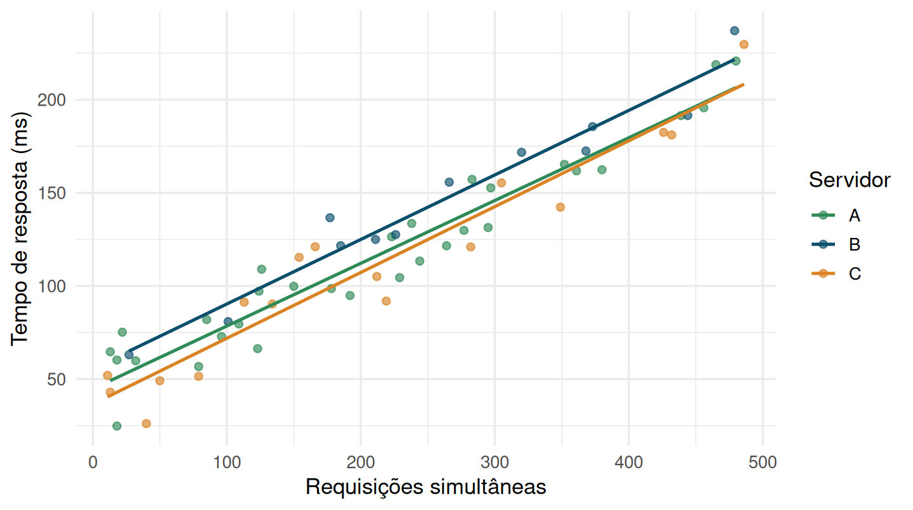
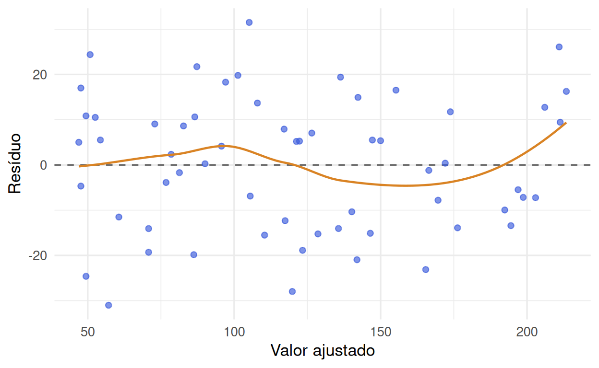
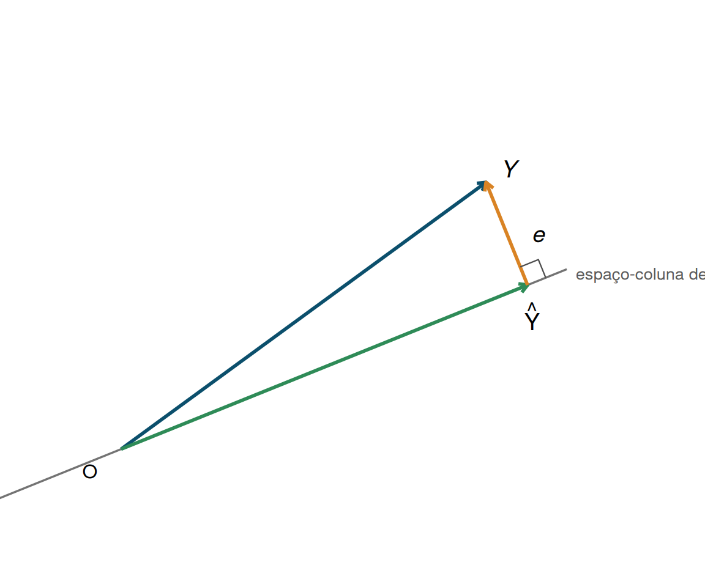
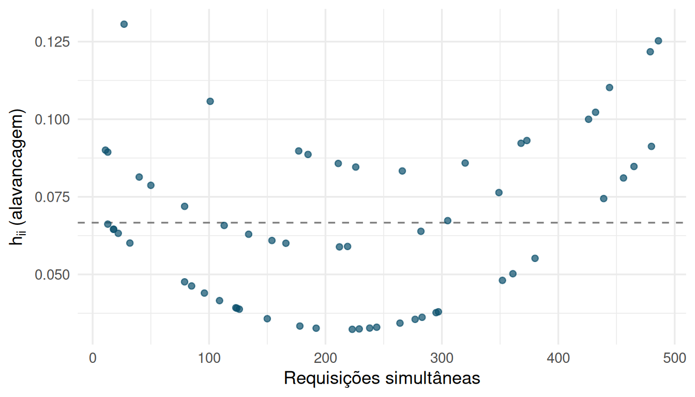
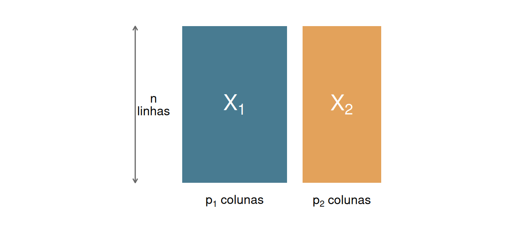
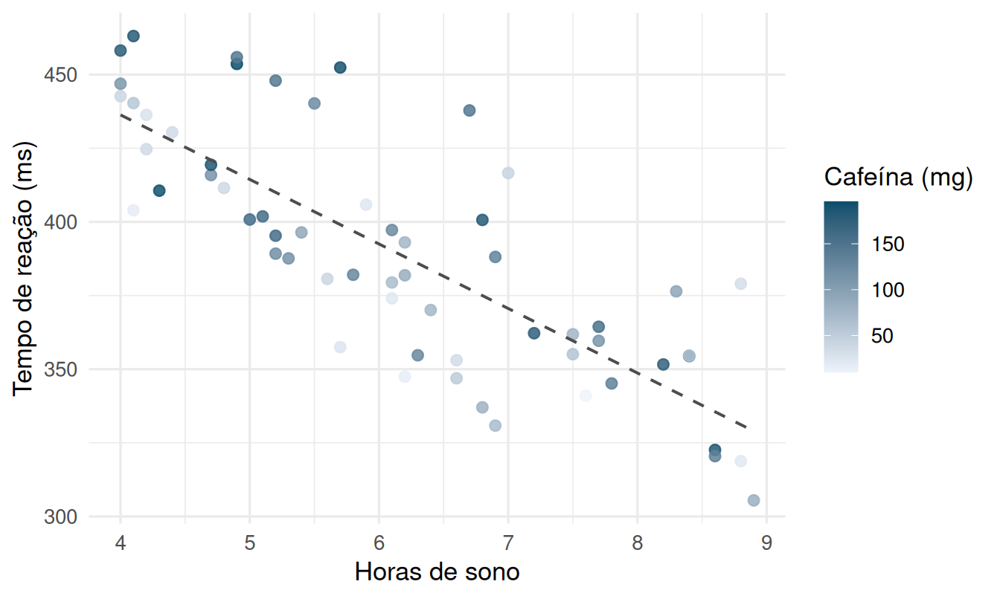
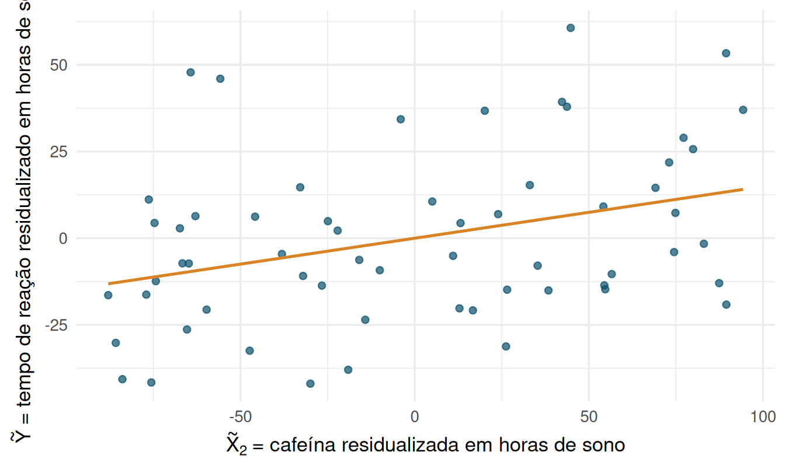
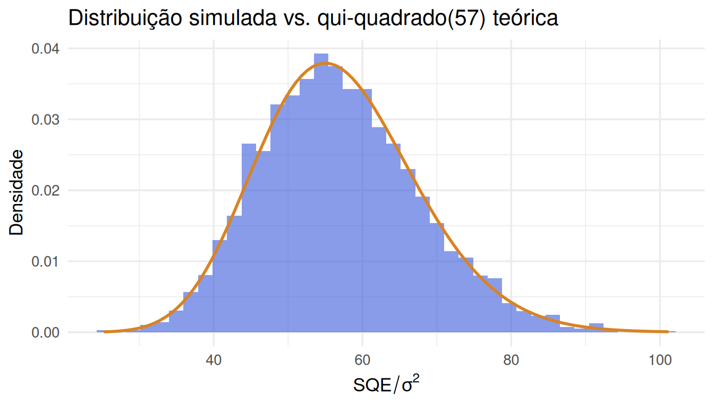

# Introdução aos modelos lineares {#modelos-lineares}


O Capítulo 1 tratou de *desenho*: como atribuir tratamentos a unidades experimentais para que uma
comparação seja justa. Este capítulo trata da *maquinaria formal* que usaremos, do Capítulo 3 em
diante, para transformar dados de um experimento bem desenhado em conclusões quantitativas: o
**modelo linear**. A ideia central — escrever a resposta observada como uma combinação linear de
parâmetros desconhecidos mais um erro aleatório — é simples de enunciar, mas sustenta toda a
teoria de análise de variância (ANOVA) que vem a seguir. Dominar a álgebra deste capítulo é o que
permite, no Capítulo 3, *deduzir* por que a ANOVA funciona, em vez de apenas aplicá-la
mecanicamente [@searle1971linear; @rao1973linear].

## Diagramas de Hasse: a estrutura do delineamento antes da álgebra {#hasse}

Antes de escrever qualquer modelo em símbolos, vale formalizar uma pergunta que o Capítulo 1 já
levantou de forma informal (Seção \@ref(fontes-variacao)) e que voltará em todo capítulo aplicado
deste livro: *que fontes de variação o desenho do experimento gera, e quantos graus de liberdade
cada uma consome?* Responder isso **antes** de rodar `aov()`/`lm()` — e não depois, como
confirmação — é o padrão de rigor que este livro segue desde o início; o **diagrama de Hasse**
[@bailey2008design] é a ferramenta gráfica padrão para fazer essa pergunta de forma sistemática,
útil sobretudo quando o delineamento tem múltiplos fatores cruzados e/ou aninhados (Capítulos 4–6).

### O diagrama como um retrato da estrutura do dado

Um diagrama de Hasse representa cada **termo** do delineamento — a média geral, cada fator, cada
interação, o erro — como um nó, e desenha uma aresta de um termo $u$ para um termo $v$ quando $v$
é uma **partição mais fina** de $u$ (cada classe de $v$ está contida em exatamente uma classe de
$u$) e não existe nenhum termo intermediário entre os dois — a mesma ideia de "cobertura" que dá
nome aos diagramas de Hasse em teoria de ordem. O termo do topo é sempre a **média geral** (uma
única classe, contendo todas as $N$ unidades) e o termo da base é sempre o **erro** (cada unidade
em sua própria classe, dentro do que os termos acima já explicaram). Dois termos que não têm
aresta entre si, nem um caminho de arestas ligando um ao outro, são **ortogonais** — nem um refina
o outro — e é exatamente esse tipo de relação que caracteriza fatores **cruzados**; uma cadeia
direta de arestas, por outro lado, caracteriza fatores **aninhados** (o padrão já visto no
submuestreo do Capítulo 3, antes mesmo de termos o nome para ele).

A regra para contar graus de liberdade a partir do diagrama é simples e se aplica termo a termo:
$$
\text{gl}(v) = (\text{número de classes distintas de } v) - \sum_{u \prec v} \text{gl}(u),
$$
em que $u \prec v$ percorre todo termo mais grosso que $v$ refina (todo nó "acima" de $v$ no
diagrama, ligado a ele por algum caminho). Em palavras: os graus de liberdade de um termo são a
contagem de "coisas novas" que ele distingue, descontado tudo que os termos mais grossos já
explicavam. Como consequência, os graus de liberdade de todos os termos do diagrama somam
exatamente $N$ — a decomposição do Capítulo 3 (\@ref(fontes-variacao)) em "tratamento + erro" é o
caso mais simples possível dessa regra, e a Seção \@ref(matriz-projecao) adiante mostrará que cada
$\text{gl}(v)$ é, algebricamente, o **posto de uma matriz de projeção** — o diagrama de Hasse é a
contrapartida geométrica, expressa como uma figura em vez de uma matriz.

```{=html}
<div class="caixa-r"><strong>Uso do R</strong> — diagrama de Hasse de um DCA de um fator</div>
```


``` r
nos_dca <- tibble(
  termo = c("Média", "Tratamento", "Erro"),
  df    = c(1, 4 - 1, 24 - 4),
  x     = c(0, 0, 0),
  y     = c(3, 2, 1)
)
arestas_dca <- tibble(de = c("Média", "Tratamento"), para = c("Tratamento", "Erro"))

plot_hasse(nos_dca, arestas_dca, titulo = "DCA: t=4, n=6 (N=24)")
```

<div class="figure" style="text-align: center">

<p class="caption">(\#fig:hasse-dca)Diagrama de Hasse de um DCA com t=4 tratamentos e n=6 réplicas por tratamento (N=24). Uma cadeia simples: cada termo refina exatamente o termo anterior, sem ramificação — a assinatura de um delineamento de um único fator, sem estrutura de bloqueio.</p>
</div>

O diagrama do DCA é uma simples cadeia — Média $\prec$ Tratamento $\prec$ Erro —, refletindo que
não há nenhuma outra fonte de variação estrutural além do tratamento: $1 + 3 + 20 = 24$. Contraste
isso com um delineamento de **dois fatores cruzados** $A \times B$, em que dois termos aparecem no
mesmo nível — nenhum refina o outro — e só se reencontram na interação:

```{=html}
<div class="caixa-r"><strong>Uso do R</strong> — diagrama de Hasse de um fatorial A×B cruzado</div>
```


``` r
nos_axb <- tibble(
  termo = c("Média", "A", "B", "A×B", "Erro"),
  df    = c(1, 3 - 1, 4 - 1, (3 - 1) * (4 - 1), 3 * 4 * (2 - 1)),
  x     = c(0, -1, 1, 0, 0),
  y     = c(4, 3, 3, 2, 1)
)
arestas_axb <- tibble(
  de   = c("Média", "Média", "A", "B", "A×B"),
  para = c("A", "B", "A×B", "A×B", "Erro")
)

plot_hasse(nos_axb, arestas_axb, titulo = "Fatorial A×B: a=3, b=4, n=2 (N=24)")
```

<div class="figure" style="text-align: center">

<p class="caption">(\#fig:hasse-axb)Diagrama de Hasse de um fatorial A×B cruzado, a=3 níveis de A, b=4 níveis de B, n=2 réplicas por casela (N=24). A e B aparecem no mesmo nível (cruzados, sem relação de refinamento entre si) e se reencontram na interação A×B, que os refina a ambos.</p>
</div>

Note a leitura direta dos graus de liberdade de $A{\times}B$ pela regra de subtração: o termo
$A{\times}B$ distingue $ab=12$ caselas, das quais $\text{gl}(\text{Média})=1$,
$\text{gl}(A)=2$ e $\text{gl}(B)=3$ já são "explicadas" pelos termos acima dele no diagrama —
sobra $12-1-2-3=6=(a-1)(b-1)$, exatamente a fórmula já familiar de graus de liberdade de
interação, aqui obtida por contagem geométrica em vez de memorizada como fórmula solta. Os
Capítulos 4 (bloqueio, onde bloco e tratamento tipicamente aparecem cruzados, como $A$ e $B$
acima) e 5–6 (fatoriais com três ou mais fatores, e confusão, em que o diagrama ajuda a visualizar
com qual termo um bloco foi deliberadamente confundido) reaproveitam este mesmo diagrama e a mesma
função `plot_hasse()` a cada novo delineamento.

## O modelo linear geral {#modelo-geral}

Um **modelo linear** escreve um vetor de respostas observadas $\mathbf{Y}$ ($n \times 1$) como

$$
\mathbf{Y} = \mathbf{X}\boldsymbol{\beta} + \boldsymbol{\varepsilon},
$$

em que:

- $\mathbf{X}$ é a **matriz de delineamento** (ou matriz-modelo), $n \times p$, com valores
  conhecidos (fixados pelo desenho do experimento ou observados nas covariáveis);
- $\boldsymbol{\beta}$ é o vetor de parâmetros desconhecidos, $p \times 1$;
- $\boldsymbol{\varepsilon}$ é o vetor de erros aleatórios, $n \times 1$, com
  $\mathrm{E}[\boldsymbol{\varepsilon}] = \mathbf{0}$ e $\mathrm{Cov}(\boldsymbol{\varepsilon}) =
  \sigma^2 \mathbf{I}_n$ (erros não correlacionados, de variância comum $\sigma^2$ — as
  **suposições de Gauss-Markov**). Quando precisarmos de distribuições exatas (não só médias e
  variâncias), acrescentaremos $\boldsymbol{\varepsilon} \sim N(\mathbf{0}, \sigma^2\mathbf{I}_n)$.

O termo "linear" refere-se à linearidade em $\boldsymbol{\beta}$, não em $\mathbf{X}$: um modelo
com $X$ contendo $\text{requisições}^2$ ou variáveis indicadoras continua sendo um modelo linear,
desde que a resposta seja combinação linear das *colunas* de $\mathbf{X}$.

### Por que esta é a forma natural, não arbitrária, do modelo {#porque-xbeta-mais-erro}

Vale parar um momento antes de seguir para a estimação e perguntar: por que escrever a resposta
como $\mathbf{X}\boldsymbol{\beta}+\boldsymbol{\varepsilon}$, em vez de qualquer outra forma
funcional? A resposta não é "porque é matematicamente conveniente" — é uma consequência direta da
estrutura de um experimento aleatorizado, já antecipada no Capítulo 1 (Seção
\@ref(fontes-variacao)) e formalizada ali com todo o rigor na Seção
\@ref(aditividade-aleatorizacao).

Relembrando o argumento: toda resposta varia por (1) efeito do tratamento, (2) diferenças
sistemáticas pré-existentes entre unidades e (3) erro experimental residual. A Seção
\@ref(aditividade-aleatorizacao) mostrou que a decomposição $Y_i(t)=\mu+\tau_t+\delta_i(t)$ é
sempre possível algebricamente, sem nenhuma suposição — mas que só se torna um **modelo
estatístico útil**, com um termo de erro que não depende do tratamento e não carrega viés, quando
a atribuição do tratamento é decidida por sorteio, independentemente das características das
unidades. É exatamente essa mesma lógica que $\mathbf{X}\boldsymbol{\beta}+\boldsymbol{\varepsilon}$
generaliza para qualquer estrutura de delineamento, não só para um único fator:

- $\mathbf{X}\boldsymbol{\beta}$ é a parte **sistemática** da resposta — tudo o que é determinado
  pelo desenho: quais colunas de tratamento, bloco ou covariável cada unidade carrega. $\mathbf{X}$
  é tratada como **fixa**, não aleatória, porque suas entradas são decididas pelo pesquisador (o
  sorteio de tratamento, a alocação em blocos) ou observadas antes do experimento (covariáveis
  pré-tratamento) — a mesma leitura de "resultados potenciais fixos, só a atribuição é aleatória"
  do modelo de Neyman-Rubin (Capítulo 1, Seção \@ref(neyman-rubin)).
- $\boldsymbol{\varepsilon}$ absorve tudo o que $\mathbf{X}$ não explica: a fonte 3 (erro
  experimental) e qualquer parte da fonte 2 (variação sistemática de unidades) que não entrou
  explicitamente em nenhuma coluna de $\mathbf{X}$. A suposição de Gauss-Markov
  $\mathrm{E}[\boldsymbol{\varepsilon}]=\mathbf{0}$ — nenhum viés sistemático associado a nenhuma
  coluna de $\mathbf{X}$ — não é postulada "por conveniência algébrica": é exatamente o que a
  aleatorização garante, porque ela impede que a fonte 2 não modelada fique correlacionada com as
  colunas de tratamento de $\mathbf{X}$ (o "vazamento" que a Seção \@ref(aditividade-aleatorizacao)
  descreveu em detalhe). Um desenho sem aleatorização — em que a atribuição de tratamento
  correlaciona-se com características não incluídas em $\mathbf{X}$ — quebraria precisamente essa
  suposição, mesmo que a forma $\mathbf{X}\boldsymbol{\beta}+\boldsymbol{\varepsilon}$ continuasse
  fazendo sentido como reparametrização algébrica.

Em outras palavras: $\mathbf{Y}=\mathbf{X}\boldsymbol{\beta}+\boldsymbol{\varepsilon}$ é a tradução
matricial exata de "efeito sistemático do desenho mais erro aleatório sob aleatorização" — e é
por isso que o teorema de Gauss-Markov (Seção \@ref(gauss-markov), adiante) consegue garantir
otimalidade de mínimos quadrados sem exigir normalidade: a otimalidade depende só de
$\mathrm{E}[\boldsymbol{\varepsilon}]=\mathbf{0}$ e variância constante, exatamente as duas
propriedades que a aleatorização entrega, não de nenhuma suposição extra sobre a forma da
distribuição de $\mathbf{Y}$.

```{=html}
<div class="caixa-aplicacao">
<strong>Aplicação — Ciência de dados: tempo de resposta de uma API</strong><br>
Uma equipe de engenharia monitora o <strong>tempo de resposta</strong> (em milissegundos) de uma
API sob diferentes números de <strong>requisições simultâneas</strong>, em três configurações de
<strong>servidor</strong> (A, B, C). A pergunta: o tempo de resposta cresce com a carga? Difere
entre servidores? Simulamos 60 medições.
</div>
```

```{=html}
<div class="caixa-r"><strong>Uso do R</strong> — simulando os dados da API</div>
```


``` r
set.seed(2026)
n <- 60
dados_api <- tibble(
  id = 1:n,
  requisicoes = round(runif(n, 10, 500)),
  servidor = factor(sample(c("A", "B", "C"), n, replace = TRUE), levels = c("A", "B", "C"))
)
efeito_servidor <- c(A = 0, B = 15, C = -8)
dados_api <- dados_api %>%
  mutate(tempo_resposta = 42 + 0.35 * requisicoes +
           efeito_servidor[as.character(servidor)] + rnorm(n, 0, 12))

dados_api %>% slice_head(n = 6) %>%
  kable(digits = 1, caption = "Seis primeiras observações do conjunto de dados da API") %>%
  kable_styling(full_width = FALSE)
```

<table class="table" style="width: auto !important; margin-left: auto; margin-right: auto;">
<caption>(\#tab:sim-api)(\#tab:sim-api)Seis primeiras observações do conjunto de dados da API</caption>
 <thead>
  <tr>
   <th style="text-align:right;"> id </th>
   <th style="text-align:right;"> requisicoes </th>
   <th style="text-align:left;"> servidor </th>
   <th style="text-align:right;"> tempo_resposta </th>
  </tr>
 </thead>
<tbody>
  <tr>
   <td style="text-align:right;"> 1 </td>
   <td style="text-align:right;"> 352 </td>
   <td style="text-align:left;"> A </td>
   <td style="text-align:right;"> 165.3 </td>
  </tr>
  <tr>
   <td style="text-align:right;"> 2 </td>
   <td style="text-align:right;"> 283 </td>
   <td style="text-align:left;"> A </td>
   <td style="text-align:right;"> 157.2 </td>
  </tr>
  <tr>
   <td style="text-align:right;"> 3 </td>
   <td style="text-align:right;"> 79 </td>
   <td style="text-align:left;"> C </td>
   <td style="text-align:right;"> 51.5 </td>
  </tr>
  <tr>
   <td style="text-align:right;"> 4 </td>
   <td style="text-align:right;"> 150 </td>
   <td style="text-align:left;"> A </td>
   <td style="text-align:right;"> 99.8 </td>
  </tr>
  <tr>
   <td style="text-align:right;"> 5 </td>
   <td style="text-align:right;"> 282 </td>
   <td style="text-align:left;"> C </td>
   <td style="text-align:right;"> 121.0 </td>
  </tr>
  <tr>
   <td style="text-align:right;"> 6 </td>
   <td style="text-align:right;"> 22 </td>
   <td style="text-align:left;"> A </td>
   <td style="text-align:right;"> 75.2 </td>
  </tr>
</tbody>
</table>

<div class="figure" style="text-align: center">

<p class="caption">(\#fig:plot-api-geral)Tempo de resposta em função da carga, por servidor, com retas de mínimos quadrados ajustadas separadamente em cada grupo.</p>
</div>

O gráfico já antecipa, visualmente, tudo o que a álgebra desta seção vai formalizar: (i) as três
nuvens de pontos têm inclinação semelhante, sugerindo que o efeito da carga (requisições) sobre o
tempo de resposta é aproximadamente o mesmo nos três servidores; (ii) as retas estão deslocadas
verticalmente umas em relação às outras — o servidor B responde sistematicamente mais devagar que
A, e C mais rápido — o que é exatamente a diferença de intercepto que a Seção
\@ref(estimabilidade) vai tratar como uma função estimável ($\alpha_B - \alpha_A$); e (iii) a
dispersão vertical em torno de cada reta parece razoavelmente constante ao longo do eixo
horizontal, uma checagem visual informal da suposição de variância constante ($\sigma^2$ comum a
todas as observações) que sustenta o teorema de Gauss-Markov da Seção \@ref(gauss-markov).

Para o modelo mais simples deste conjunto — tempo de resposta em função apenas do número de
requisições —, a linha $i$ da equação $\mathbf{Y} = \mathbf{X}\boldsymbol{\beta} +
\boldsymbol{\varepsilon}$ é

$$
y_i = \beta_0 + \beta_1 \, x_i + \varepsilon_i, \qquad i = 1, \dots, 60,
$$

em que $x_i$ é o número de requisições simultâneas na observação $i$. Em notação matricial,

$$
\mathbf{X} = \begin{bmatrix} 1 & x_1 \\ 1 & x_2 \\ \vdots & \vdots \\ 1 & x_{60} \end{bmatrix},
\qquad
\boldsymbol{\beta} = \begin{bmatrix} \beta_0 \\ \beta_1 \end{bmatrix}.
$$

A primeira coluna de $\mathbf{X}$, constante e igual a 1, é o que permite ao modelo ter um
intercepto $\beta_0$ — ela também é, ela mesma, um vetor de "delineamento": corresponde a uma
covariável fixa que vale 1 para todas as unidades. Concretamente, para as quatro primeiras
observações simuladas, $\mathbf{X}$ e $\mathbf{Y}$ são

<table class="table" style="width: auto !important; margin-left: auto; margin-right: auto;">
<caption>(\#tab:X-explicito)(\#tab:X-explicito)As quatro primeiras linhas da matriz de delineamento X (modelo simples)</caption>
 <thead>
  <tr>
   <th style="text-align:left;">  </th>
   <th style="text-align:right;"> (Intercept) </th>
   <th style="text-align:right;"> requisicoes </th>
  </tr>
 </thead>
<tbody>
  <tr>
   <td style="text-align:left;"> obs. 1 </td>
   <td style="text-align:right;"> 1 </td>
   <td style="text-align:right;"> 352 </td>
  </tr>
  <tr>
   <td style="text-align:left;"> obs. 2 </td>
   <td style="text-align:right;"> 1 </td>
   <td style="text-align:right;"> 283 </td>
  </tr>
  <tr>
   <td style="text-align:left;"> obs. 3 </td>
   <td style="text-align:right;"> 1 </td>
   <td style="text-align:right;"> 79 </td>
  </tr>
  <tr>
   <td style="text-align:left;"> obs. 4 </td>
   <td style="text-align:right;"> 1 </td>
   <td style="text-align:right;"> 150 </td>
  </tr>
</tbody>
</table>

Note que `model.matrix()` é a função do R que constrói $\mathbf{X}$ a partir da fórmula do modelo
e dos dados — ela é o objeto central de qualquer ajuste em R, mesmo quando `lm()` a esconde do
usuário por trás dos panos. Voltaremos a inspecioná-la explicitamente sempre que a codificação de
um fator não for óbvia.

## Estimação por mínimos quadrados {#minimos-quadrados}

Dado $\mathbf{X}$ conhecido e $\mathbf{Y}$ observado, queremos um valor $\hat{\boldsymbol{\beta}}$
que torne o modelo o mais compatível possível com os dados. O critério de **mínimos quadrados**
escolhe $\hat{\boldsymbol{\beta}}$ que minimiza a soma de quadrados dos resíduos,

$$
S(\boldsymbol{\beta}) = (\mathbf{Y} - \mathbf{X}\boldsymbol{\beta})'(\mathbf{Y} -
\mathbf{X}\boldsymbol{\beta}) = \sum_{i=1}^n (y_i - \mathbf{x}_i'\boldsymbol{\beta})^2,
$$

em que $\mathbf{x}_i'$ é a $i$-ésima linha de $\mathbf{X}$. Expandindo,
$S(\boldsymbol{\beta}) = \mathbf{Y}'\mathbf{Y} - 2\boldsymbol{\beta}'\mathbf{X}'\mathbf{Y} +
\boldsymbol{\beta}'\mathbf{X}'\mathbf{X}\boldsymbol{\beta}$, e derivando em relação a
$\boldsymbol{\beta}$ (usando $\partial(\mathbf{a}'\boldsymbol{\beta})/\partial\boldsymbol{\beta} =
\mathbf{a}$ e $\partial(\boldsymbol{\beta}'\mathbf{A}\boldsymbol{\beta})/\partial\boldsymbol{\beta}
= 2\mathbf{A}\boldsymbol{\beta}$ para $\mathbf{A}$ simétrica):

$$
\frac{\partial S(\boldsymbol{\beta})}{\partial \boldsymbol{\beta}} = -2\mathbf{X}'\mathbf{Y} +
2\mathbf{X}'\mathbf{X}\boldsymbol{\beta}.
$$

Igualando a $\mathbf{0}$ e escrevendo $\hat{\boldsymbol{\beta}}$ para a solução, obtemos as
**equações normais**:

$$
\mathbf{X}'\mathbf{X}\,\hat{\boldsymbol{\beta}} = \mathbf{X}'\mathbf{Y}.
$$

(A matriz Hessiana da segunda derivada é $2\mathbf{X}'\mathbf{X}$, semidefinida positiva sempre —
o que garante que qualquer ponto crítico é, de fato, um mínimo global de $S(\boldsymbol{\beta})$,
não apenas um ponto estacionário.)

Se $\mathbf{X}$ tem posto coluna completo ($\mathrm{posto}(\mathbf{X}) = p$, isto é, as colunas de
$\mathbf{X}$ são linearmente independentes), $\mathbf{X}'\mathbf{X}$ é invertível e a solução é
única:

$$
\hat{\boldsymbol{\beta}} = (\mathbf{X}'\mathbf{X})^{-1}\mathbf{X}'\mathbf{Y}.
$$

Quando $\mathbf{X}$ **não** tem posto coluna completo — o que acontece, por exemplo, ao
codificar um fator categórico com uma variável indicadora *para cada nível* mais um intercepto,
como veremos na Seção \@ref(estimabilidade) —, $\mathbf{X}'\mathbf{X}$ é singular (não invertível)
e as equações normais têm **infinitas soluções** $\hat{\boldsymbol{\beta}}$. Uma forma de escolher
uma delas é usar uma **inversa generalizada** $(\mathbf{X}'\mathbf{X})^-$ — qualquer matriz que
satisfaça $\mathbf{X}'\mathbf{X}(\mathbf{X}'\mathbf{X})^-\mathbf{X}'\mathbf{X} = \mathbf{X}'\mathbf{X}$
— e tomar

$$
\hat{\boldsymbol{\beta}} = (\mathbf{X}'\mathbf{X})^-\mathbf{X}'\mathbf{Y}.
$$

Duas inversas generalizadas diferentes produzem, em geral, **vetores $\hat{\boldsymbol{\beta}}$
diferentes** — por isso, quando $\mathbf{X}$ é deficiente em posto, $\boldsymbol{\beta}$ sozinho
não tem interpretação única (ele é apenas um artifício de parametrização). O que *não* muda,
qualquer que seja a inversa generalizada escolhida, são (i) os valores ajustados
$\mathbf{X}\hat{\boldsymbol{\beta}}$ e (ii) o valor de qualquer função linear **estimável**
$\boldsymbol{\lambda}'\hat{\boldsymbol{\beta}}$ — é exatamente esse fato que torna a noção de
estimabilidade da Seção \@ref(estimabilidade) necessária e útil, e não uma curiosidade técnica.

```{=html}
<div class="caixa-r"><strong>Uso do R</strong> — mínimos quadrados via álgebra de matrizes</div>
```


``` r
X <- model.matrix(~ requisicoes, data = dados_api)
Y <- dados_api$tempo_resposta

beta_hat <- solve(t(X) %*% X) %*% t(X) %*% Y
beta_hat
```

```
##                   [,1]
## (Intercept) 43.0996693
## requisicoes  0.3504591
```

``` r
# Comparação com lm(), que resolve as mesmas equações normais internamente
mod_simples <- lm(tempo_resposta ~ requisicoes, data = dados_api)
coef(mod_simples)
```

```
## (Intercept) requisicoes 
##  43.0996693   0.3504591
```

Os dois métodos coincidem, como deveriam: `lm()` não faz nada conceitualmente diferente de
resolver $\mathbf{X}'\mathbf{X}\hat{\boldsymbol{\beta}} = \mathbf{X}'\mathbf{Y}$ (na prática, usa
decomposição QR por estabilidade numérica, não a inversão direta de $\mathbf{X}'\mathbf{X}$, mas o
resultado é o mesmo). Cada requisição simultânea adicional está associada a um aumento estimado de
0.35 ms no tempo de resposta.

Uma propriedade geométrica das equações normais merece destaque: escrevendo os resíduos como
$\mathbf{e} = \mathbf{Y} - \mathbf{X}\hat{\boldsymbol{\beta}}$, as equações normais são
equivalentes a $\mathbf{X}'\mathbf{e} = \mathbf{0}$ — os resíduos são **ortogonais** a cada coluna
de $\mathbf{X}$. Em particular, se $\mathbf{X}$ tem uma coluna de 1's (intercepto), a soma dos
resíduos é exatamente zero.


``` r
e <- residuals(mod_simples)
c(soma_residuos = sum(e), produto_com_x = sum(e * dados_api$requisicoes))
```

```
## soma_residuos produto_com_x 
##  1.754152e-14 -2.650324e-12
```

Ambos os valores são numericamente zero (a menos de erro de arredondamento) — exatamente o que a
teoria prevê.

<div class="figure" style="text-align: center">

<p class="caption">(\#fig:plot-residuos-fitted)Resíduos contra valores ajustados do modelo simples (tempo de resposta ~ requisições).</p>
</div>

Este é o gráfico de diagnóstico mais usado em regressão. Aqui, a nuvem de resíduos se espalha em
torno de zero sem nenhuma curvatura sistemática — a linha de suavização (em laranja) fica
praticamente horizontal —, o que é consistente com termos incluído a covariável certa (não falta
um termo quadrático, por exemplo) e com dispersão aproximadamente constante ao longo do eixo
horizontal. Note que o modelo simples (sem o fator servidor) foi usado de propósito: ele omite uma
variável relevante, mas isso não produz um padrão visível no gráfico de resíduos porque `servidor`
é sorteado independentemente de `requisicoes` neste conjunto simulado — um lembrete de que a
ausência de padrão nos resíduos não é, sozinha, prova de que o modelo está bem especificado.

## Estimabilidade de funções lineares dos parâmetros {#estimabilidade}

Quando $\mathbf{X}$ não tem posto coluna completo, nem todo parâmetro individual de
$\boldsymbol{\beta}$ pode ser estimado de forma única — mas certas *combinações lineares* dos
parâmetros podem. Essa distinção é o conceito de **estimabilidade**, essencial para interpretar
corretamente os modelos de ANOVA do Capítulo 3, onde a codificação usual de um fator com $k$
níveis por $k$ variáveis indicadoras mais um intercepto é, propositalmente, deficiente em posto.

**Definição (estimabilidade).** Uma função linear $\boldsymbol{\lambda}'\boldsymbol{\beta}$ é
**estimável** se existe um vetor $\mathbf{a}$ tal que $\mathrm{E}[\mathbf{a}'\mathbf{Y}] =
\boldsymbol{\lambda}'\boldsymbol{\beta}$ para **todo** valor de $\boldsymbol{\beta}$. Como
$\mathrm{E}[\mathbf{Y}] = \mathbf{X}\boldsymbol{\beta}$, isso equivale a $\mathbf{a}'\mathbf{X} =
\boldsymbol{\lambda}'$ — ou seja, $\boldsymbol{\lambda}'\boldsymbol{\beta}$ é estimável se e
somente se $\boldsymbol{\lambda}'$ pertence ao **espaço-linha de $\mathbf{X}$**.

Em outras palavras: $\boldsymbol{\lambda}'\boldsymbol{\beta}$ é estimável quando podemos escrevê-la
como uma combinação linear das *médias* que o modelo de fato observa (as linhas de
$\mathrm{E}[\mathbf{Y}]$), sem depender de uma parametrização específica e não identificável de
$\boldsymbol{\beta}$. Quando $\mathbf{X}$ tem posto coluna completo, toda função linear é
estimável, porque o espaço-linha de $\mathbf{X}$ é todo $\mathbb{R}^p$.

```{=html}
<div class="caixa-aplicacao">
<strong>Aplicação — codificação sobreparametrizada do fator servidor</strong><br>
Em vez do contraste usual do R (que descarta uma coluna), codifique o fator
<code>servidor</code> com uma coluna indicadora para <strong>cada</strong> nível (A, B, C) mais o
intercepto. A matriz resultante tem 4 colunas, mas posto 3: a coluna do intercepto é a soma exata
das três colunas indicadoras.
</div>
```


``` r
contrastes_completos <- contrasts(dados_api$servidor, contrasts = FALSE)
X_sobre <- model.matrix(~ servidor, data = dados_api,
                         contrasts.arg = list(servidor = contrastes_completos))
colnames(X_sobre) <- c("Intercepto", "servidorA", "servidorB", "servidorC")

c(colunas = ncol(X_sobre), posto = qr(X_sobre)$rank)
```

```
## colunas   posto 
##       4       3
```

``` r
X_sobre[1:4, ] %>%
  kable(caption = "Primeiras linhas de X na codificação sobreparametrizada do fator servidor") %>%
  kable_styling(full_width = FALSE)
```

<table class="table" style="width: auto !important; margin-left: auto; margin-right: auto;">
<caption>(\#tab:estimabilidade-r)(\#tab:estimabilidade-r)Primeiras linhas de X na codificação sobreparametrizada do fator servidor</caption>
 <thead>
  <tr>
   <th style="text-align:right;"> Intercepto </th>
   <th style="text-align:right;"> servidorA </th>
   <th style="text-align:right;"> servidorB </th>
   <th style="text-align:right;"> servidorC </th>
  </tr>
 </thead>
<tbody>
  <tr>
   <td style="text-align:right;"> 1 </td>
   <td style="text-align:right;"> 1 </td>
   <td style="text-align:right;"> 0 </td>
   <td style="text-align:right;"> 0 </td>
  </tr>
  <tr>
   <td style="text-align:right;"> 1 </td>
   <td style="text-align:right;"> 1 </td>
   <td style="text-align:right;"> 0 </td>
   <td style="text-align:right;"> 0 </td>
  </tr>
  <tr>
   <td style="text-align:right;"> 1 </td>
   <td style="text-align:right;"> 0 </td>
   <td style="text-align:right;"> 0 </td>
   <td style="text-align:right;"> 1 </td>
  </tr>
  <tr>
   <td style="text-align:right;"> 1 </td>
   <td style="text-align:right;"> 1 </td>
   <td style="text-align:right;"> 0 </td>
   <td style="text-align:right;"> 0 </td>
  </tr>
</tbody>
</table>

A matriz tem 4 colunas e posto 3 — exatamente uma deficiência de posto, refletindo a redundância
$\text{Intercepto} = \text{servidorA} + \text{servidorB} + \text{servidorC}$ (a primeira coluna é
a soma exata das três últimas). Escrevendo o modelo como
$y_i = \mu + \alpha_{A} \mathbb{1}\{\text{servidor}_i = A\} + \alpha_B \mathbb{1}\{\cdot=B\} +
\alpha_C \mathbb{1}\{\cdot=C\} + \varepsilon_i$:

- $\mu$ sozinho **não é estimável**: não existe combinação de linhas de $\mathrm{E}[\mathbf{Y}]$
  que isole $\mu$ sem também carregar algum $\alpha_j$, porque toda observação tem exatamente um
  $\alpha_j$ "ligado".
- $\mu + \alpha_A$ **é estimável**: é exatamente a média populacional do tempo de resposta para o
  servidor A (a média dos $y_i$ com $\text{servidor}_i = A$, ajustada por requisições se estas
  entrarem no modelo).
- $\alpha_A - \alpha_B$ **é estimável**: é a diferença entre as médias dos servidores A e B,
  independente de como $\mu$ foi parametrizado. Esta é a razão pela qual, na ANOVA de um fator
  (Capítulo 3), *contrastes* entre níveis são sempre estimáveis e interpretáveis, mesmo quando os
  efeitos individuais $\alpha_j$, isoladamente, não são.

A regra prática para verificar estimabilidade sem procurar $\mathbf{a}$ à mão:
$\boldsymbol{\lambda}'\boldsymbol{\beta}$ é estimável se e somente se
$\boldsymbol{\lambda}'(\mathbf{X}'\mathbf{X})^-(\mathbf{X}'\mathbf{X}) = \boldsymbol{\lambda}'$,
para **qualquer** inversa generalizada $(\mathbf{X}'\mathbf{X})^-$. Aplicando essa regra às quatro
funções lineares discutidas acima:


``` r
XtX <- t(X_sobre) %*% X_sobre
XtX_g <- MASS::ginv(XtX)               # uma inversa generalizada de X'X (Moore-Penrose)

lambdas <- list(
  "mu"              = c(1, 0, 0, 0),
  "alpha_A"         = c(0, 1, 0, 0),
  "mu + alpha_A"    = c(1, 1, 0, 0),
  "alpha_A - alpha_B" = c(0, 1, -1, 0)
)
estimavel <- map_lgl(lambdas, function(lam) {
  isTRUE(all.equal(as.numeric(t(lam) %*% XtX_g %*% XtX), lam, tolerance = 1e-8))
})
tibble(funcao = names(lambdas), estimavel = estimavel) %>%
  kable(caption = "Verificação algébrica de estimabilidade via inversa generalizada") %>%
  kable_styling(full_width = FALSE)
```

<table class="table" style="width: auto !important; margin-left: auto; margin-right: auto;">
<caption>(\#tab:estimabilidade-criterio)(\#tab:estimabilidade-criterio)Verificação algébrica de estimabilidade via inversa generalizada</caption>
 <thead>
  <tr>
   <th style="text-align:left;"> funcao </th>
   <th style="text-align:left;"> estimavel </th>
  </tr>
 </thead>
<tbody>
  <tr>
   <td style="text-align:left;"> mu </td>
   <td style="text-align:left;"> FALSE </td>
  </tr>
  <tr>
   <td style="text-align:left;"> alpha_A </td>
   <td style="text-align:left;"> FALSE </td>
  </tr>
  <tr>
   <td style="text-align:left;"> mu + alpha_A </td>
   <td style="text-align:left;"> TRUE </td>
  </tr>
  <tr>
   <td style="text-align:left;"> alpha_A - alpha_B </td>
   <td style="text-align:left;"> TRUE </td>
  </tr>
</tbody>
</table>

O critério confirma exatamente a leitura intuitiva. Mais importante: embora $\hat{\boldsymbol{\beta}}$
não seja único quando $\mathbf{X}$ é deficiente em posto, **o valor de uma função estimável não
depende de qual solução das equações normais usamos**. Comparando duas parametrizações
completamente diferentes do mesmo fator (contrastes de tratamento vs. contrastes de soma no R):


``` r
mod_trat <- lm(tempo_resposta ~ servidor, data = dados_api)                      # contrastes de tratamento
mod_soma <- lm(tempo_resposta ~ servidor, data = dados_api,
                contrasts = list(servidor = "contr.sum"))                        # contrastes de soma

rbind(trat = coef(mod_trat), soma = coef(mod_soma))    # betas diferentes...
```

```
##      (Intercept) servidorB servidorC
## trat    117.0447 30.356612 -8.310288
## soma    124.3934 -7.348775 23.007837
```

``` r
c(max_diff_ajustados = max(abs(fitted(mod_trat) - fitted(mod_soma))),            # ...mas ajustados idênticos
  media_grupo_A_direta = mean(dados_api$tempo_resposta[dados_api$servidor == "A"]))
```

```
##   max_diff_ajustados media_grupo_A_direta 
##         1.421085e-13         1.170447e+02
```

Os vetores $\hat{\boldsymbol{\beta}}$ são completamente diferentes entre as duas parametrizações
— como deveria ser, já que $\boldsymbol{\beta}$ não é identificável sozinho —, mas os valores
ajustados $\mathbf{X}\hat{\boldsymbol{\beta}}$ (e, portanto, qualquer função estimável, como a
média do grupo A) coincidem exatamente. Essa invariância é a garantia formal de que a ANOVA do
Capítulo 3 produz as mesmas conclusões independentemente de qual codificação de contrastes o
software usa internamente.

### A pseudoinversa de Moore-Penrose via decomposição em valores singulares {#svd-moore-penrose}

O chunk anterior usou `MASS::ginv()` para obter *uma* inversa generalizada de $\mathbf{X}'\mathbf{X}$
sem explicar como essa função a calcula por dentro. Vale a pena abrir essa caixa-preta, porque a
construção é ao mesmo tempo concreta (poucas linhas de R) e a resposta canônica à pergunta "dentre
as infinitas inversas generalizadas de uma matriz, existe uma mais natural?" — e a resposta é sim.

Toda matriz $\mathbf{A}$ ($m \times n$, posto $r$) admite uma **decomposição em valores singulares**
(SVD, *singular value decomposition*):

$$
\mathbf{A} = \mathbf{U}\mathbf{D}\mathbf{V}',
$$

em que $\mathbf{U}$ ($m\times m$) e $\mathbf{V}$ ($n\times n$) são matrizes ortogonais
($\mathbf{U}'\mathbf{U}=\mathbf{I}_m$, $\mathbf{V}'\mathbf{V}=\mathbf{I}_n$) e $\mathbf{D}$
($m\times n$) é "diagonal" (zero fora da diagonal principal), com entradas $d_1 \geq d_2 \geq
\cdots \geq d_{\min(m,n)} \geq 0$, os **valores singulares** de $\mathbf{A}$ — exatamente $r$
deles são estritamente positivos [@golubvanloan2013]. A SVD existe para *qualquer* matriz, quadrada
ou não, de posto completo ou não, o que a torna mais geral do que a decomposição espectral (que
exige simetria).

**Definição (inversa de Moore-Penrose).** Para qualquer matriz $\mathbf{A}$, existe uma única
matriz $\mathbf{A}^+$, a **pseudoinversa de Moore-Penrose**, que satisfaz simultaneamente
[@penrose1955]:

1. $\mathbf{A}\mathbf{A}^+\mathbf{A} = \mathbf{A}$ (é uma inversa generalizada, no sentido já
   usado nesta seção);
2. $\mathbf{A}^+\mathbf{A}\mathbf{A}^+ = \mathbf{A}^+$;
3. $\mathbf{A}\mathbf{A}^+$ é simétrica;
4. $\mathbf{A}^+\mathbf{A}$ é simétrica.

A condição 1 é a única que $(\mathbf{X}'\mathbf{X})^-$ genérica precisa satisfazer; as condições
2–4 são o que torna $\mathbf{A}^+$ *única* entre as infinitas inversas generalizadas — é, em certo
sentido, a "mais simétrica" de todas. Ela se constrói diretamente da SVD invertendo apenas os
valores singulares não nulos e transpondo o formato:

$$
\mathbf{A}^+ = \mathbf{V}\mathbf{D}^+\mathbf{U}', \qquad
\mathbf{D}^+ = \begin{bmatrix} \mathbf{D}_r^{-1} & \mathbf{0} \\ \mathbf{0} & \mathbf{0}
\end{bmatrix},
$$

em que $\mathbf{D}_r^{-1}$ inverte, um a um, os $r$ valores singulares positivos. Quando
$\mathbf{A}$ tem posto coluna completo, $\mathbf{A}^+ = (\mathbf{A}'\mathbf{A})^{-1}\mathbf{A}'$
(a inversa "de mínimos quadrados" usual); quando não tem, $\mathbf{A}^+$ generaliza essa fórmula
de forma que as condições 1–4 continuem valendo.

```{=html}
<div class="caixa-r"><strong>Uso do R</strong> — construindo A⁺ à mão via svd() e comparando com MASS::ginv()</div>
```


``` r
# Reaproveitamos a mesma X'X deficiente em posto do exemplo do servidor (posto 3, 4 colunas)
svd_XtX <- svd(XtX)          # svd() do R devolve $u, $d (vetor) e $v tais que XtX = u %*% diag(d) %*% t(v)
svd_XtX$d                    # valores singulares: o quarto é (numericamente) zero -> posto 3
```

```
## [1] 8.431114e+01 2.213304e+01 1.355582e+01 1.789853e-15
```

``` r
tol <- 1e-8
d_inv <- ifelse(svd_XtX$d > tol, 1 / svd_XtX$d, 0)   # inverte só os valores singulares "reais"
XtX_svd <- svd_XtX$v %*% diag(d_inv) %*% t(svd_XtX$u)  # A+ = V D+ U'

# Comparação com a "caixa-preta" MASS::ginv(), já usada acima
max(abs(XtX_svd - XtX_g))
```

```
## [1] 6.938894e-18
```

A diferença máxima entre as duas construções é numericamente zero: `MASS::ginv()` calcula
exatamente essa fórmula $\mathbf{V}\mathbf{D}^+\mathbf{U}'$ internamente — não há mágica adicional.
O quarto valor singular de $\mathbf{X}'\mathbf{X}$ está na casa de $10^{-15}$, e não exatamente
zero, por causa do arredondamento de ponto flutuante — daí a necessidade da tolerância `tol` para
decidir quais valores singulares tratar como nulos, uma escolha prática que reaparece toda vez que
se resolve um sistema linear deficiente em posto numericamente.

Note que a pseudoinversa de Moore-Penrose é apenas **uma** entre infinitas inversas generalizadas
válidas de $\mathbf{X}'\mathbf{X}$ — a Seção anterior já mostrou que o critério de estimabilidade
$\boldsymbol{\lambda}'(\mathbf{X}'\mathbf{X})^-(\mathbf{X}'\mathbf{X}) = \boldsymbol{\lambda}'$
vale para *qualquer* inversa generalizada, incluindo esta. A vantagem prática de $\mathbf{A}^+$
não é estatística (nenhuma inversa generalizada é "mais correta" para calcular funções estimáveis
— todas dão o mesmo resultado, por definição), mas computacional e numérica: a SVD é o método mais
estável para lidar com matrizes próximas de deficientes em posto (por exemplo, quando duas
covariáveis são quase, mas não exatamente, colineares), e é o algoritmo que pacotes de álgebra
linear (R, `numpy`, `MATLAB`) de fato usam por trás de rotinas como `MASS::ginv()`.

## O teorema de Gauss-Markov e o BLUE {#gauss-markov}

Sob as suposições de Gauss-Markov ($\mathrm{E}[\boldsymbol{\varepsilon}] = \mathbf{0}$,
$\mathrm{Cov}(\boldsymbol{\varepsilon}) = \sigma^2\mathbf{I}_n$ — sem exigir normalidade), o
estimador de mínimos quadrados de uma função estimável $\boldsymbol{\lambda}'\boldsymbol{\beta}$
tem uma propriedade de otimalidade notável.

**Teorema (Gauss-Markov).** Se $\boldsymbol{\lambda}'\boldsymbol{\beta}$ é estimável, então
$\boldsymbol{\lambda}'\hat{\boldsymbol{\beta}}$ (com $\hat{\boldsymbol{\beta}}$ qualquer solução
das equações normais) é o **BLUE** — *best linear unbiased estimator*, o melhor estimador
linearmente não viesado: entre todos os estimadores da forma $\mathbf{c}'\mathbf{Y}$ que são
não viesados para $\boldsymbol{\lambda}'\boldsymbol{\beta}$, $\boldsymbol{\lambda}'\hat{\boldsymbol{\beta}}$
tem a menor variância [@plackett1950some; @searle1971linear; @kutner2005linear].

Duas observações práticas:

1. **"Melhor" é relativo à classe de estimadores lineares não viesados.** Estimadores viesados
   (como *ridge regression*) podem ter erro quadrático médio menor em certas situações — o
   teorema não afirma que mínimos quadrados é ótimo em qualquer sentido absoluto, só dentro dessa
   classe.
2. **O teorema não exige normalidade dos erros.** A otimalidade em variância vale sob as
   suposições de momentos apenas; a normalidade só entra quando precisamos de testes de hipótese
   exatos e intervalos de confiança (Seção \@ref(formas-quadraticas) e Capítulo 3).

Quando $\mathbf{X}$ tem posto completo, a variância de $\hat{\boldsymbol{\beta}}$ é

$$
\mathrm{Cov}(\hat{\boldsymbol{\beta}}) = \sigma^2 (\mathbf{X}'\mathbf{X})^{-1},
$$

e a variância de $\boldsymbol{\lambda}'\hat{\boldsymbol{\beta}}$ é $\sigma^2
\boldsymbol{\lambda}'(\mathbf{X}'\mathbf{X})^{-1}\boldsymbol{\lambda}$ — nenhum outro estimador
linear não viesado consegue variância menor, para nenhum $\boldsymbol{\lambda}$.

```{=html}
<div class="caixa-r"><strong>Uso do R</strong> — variância de <code>beta_hat</code> vs. <code>vcov()</code></div>
```


``` r
sigma2_hat <- sum(residuals(mod_simples)^2) / mod_simples$df.residual
cov_manual <- sigma2_hat * solve(t(X) %*% X)
cov_manual
```

```
##             (Intercept)   requisicoes
## (Intercept) 12.68362254 -0.0404331773
## requisicoes -0.04043318  0.0001824602
```

``` r
vcov(mod_simples)
```

```
##             (Intercept)   requisicoes
## (Intercept) 12.68362254 -0.0404331773
## requisicoes -0.04043318  0.0001824602
```

As duas matrizes coincidem: `vcov()` do R não faz nada além de aplicar
$\hat{\sigma}^2(\mathbf{X}'\mathbf{X})^{-1}$.

## A matriz de projeção {#matriz-projecao}

Os valores ajustados $\hat{\mathbf{Y}} = \mathbf{X}\hat{\boldsymbol{\beta}}$ podem ser escritos
como uma transformação linear direta de $\mathbf{Y}$:

$$
\hat{\mathbf{Y}} = \mathbf{X}(\mathbf{X}'\mathbf{X})^{-1}\mathbf{X}'\mathbf{Y} = \mathbf{P}_X\mathbf{Y},
\qquad \mathbf{P}_X = \mathbf{X}(\mathbf{X}'\mathbf{X})^{-1}\mathbf{X}'.
$$

$\mathbf{P}_X$ é a **matriz de projeção** (também chamada *hat matrix*, porque "coloca um chapéu"
em $\mathbf{Y}$) sobre o **espaço-coluna de $\mathbf{X}$** — o subespaço de $\mathbb{R}^n$ gerado
pelas colunas de $\mathbf{X}$. Geometricamente, $\hat{\mathbf{Y}}$ é o ponto desse subespaço mais
próximo de $\mathbf{Y}$, na distância euclidiana — exatamente o que "mínimos quadrados" significa.

<div class="figure" style="text-align: center">

<p class="caption">(\#fig:fig-geometria-projecao)Geometria da projeção ortogonal: o espaço-coluna de X é um subespaço de R^n (aqui representado, em corte esquemático, por uma reta); Y é um vetor fora desse subespaço; Y-chapéu é o ponto do subespaço mais próximo de Y; e o resíduo e = Y - Y-chapéu é ortogonal ao subespaço inteiro (marcado pelo ângulo reto).</p>
</div>

O diagrama acima é apenas um corte esquemático — na prática o espaço-coluna de $\mathbf{X}$ tem
$\mathrm{posto}(\mathbf{X})$ dimensões, não uma só —, mas captura exatamente a relação algébrica
que a Seção \@ref(matriz-projecao) formaliza: $\hat{\mathbf{Y}}$ é a "sombra" ortogonal de
$\mathbf{Y}$ sobre o subespaço, e o resíduo $\mathbf{e}$ é, por construção, perpendicular a esse
subespaço inteiro — nunca correlacionado com nenhuma coluna de $\mathbf{X}$, o fato algébrico
$\mathbf{X}'\mathbf{e}=\mathbf{0}$ já usado na Seção \@ref(minimos-quadrados).

$\mathbf{P}_X$ tem três propriedades algébricas que a caracterizam como projeção ortogonal, e as
duas primeiras se demonstram diretamente da definição:

1. **Simétrica:** $\mathbf{P}_X' = \big(\mathbf{X}(\mathbf{X}'\mathbf{X})^{-1}\mathbf{X}'\big)' =
   \mathbf{X}\big((\mathbf{X}'\mathbf{X})^{-1}\big)'\mathbf{X}' = \mathbf{X}(\mathbf{X}'\mathbf{X})^{-1}\mathbf{X}'
   = \mathbf{P}_X$, porque $(\mathbf{X}'\mathbf{X})^{-1}$ é simétrica (é a inversa de uma matriz
   simétrica, e a inversa de uma matriz simétrica é simétrica).
2. **Idempotente:**
   $$
   \mathbf{P}_X\mathbf{P}_X = \mathbf{X}(\mathbf{X}'\mathbf{X})^{-1}\underbrace{\mathbf{X}'\mathbf{X}(\mathbf{X}'\mathbf{X})^{-1}}_{=\,\mathbf{I}_p}\mathbf{X}'
   = \mathbf{X}(\mathbf{X}'\mathbf{X})^{-1}\mathbf{X}' = \mathbf{P}_X.
   $$
   Os dois fatores centrais $(\mathbf{X}'\mathbf{X})^{-1}\mathbf{X}'\mathbf{X}$ se cancelam
   exatamente em $\mathbf{I}_p$, deixando $\mathbf{P}_X$ inalterada. Projetar duas vezes é o mesmo
   que projetar uma vez, como esperado geometricamente.
3. **Posto igual ao traço:** para qualquer matriz idempotente, $\mathrm{posto} = \mathrm{tr}$ (os
   autovalores de uma projeção só podem ser 0 ou 1, e o traço soma os autovalores enquanto o posto
   conta os não nulos); como $\mathbf{P}_X\mathbf{X} = \mathbf{X}$, o espaço-coluna de
   $\mathbf{P}_X$ coincide com o de $\mathbf{X}$, logo $\mathrm{posto}(\mathbf{P}_X) =
   \mathrm{posto}(\mathbf{X})$.

O complemento $\mathbf{I}_n - \mathbf{P}_X$ projeta sobre o espaço ortogonal ao espaço-coluna de
$\mathbf{X}$, e produz os resíduos: $\mathbf{e} = (\mathbf{I}_n - \mathbf{P}_X)\mathbf{Y}$. Como
$\mathbf{I}_n - \mathbf{P}_X$ também é simétrica e idempotente, ela é igualmente uma projeção — o
que explica geometricamente por que $\hat{\mathbf{Y}}$ e $\mathbf{e}$ são ortogonais entre si
($\hat{\mathbf{Y}}'\mathbf{e} = 0$): são as duas componentes de $\mathbf{Y}$ em subespaços
ortogonais complementares.

Os elementos da diagonal de $\mathbf{P}_X$, chamados **alavancagens** ($h_{ii}$), medem o quanto a
$i$-ésima observação influencia seu próprio valor ajustado — valores de $h_{ii}$ próximos de 1
indicam pontos de alta alavancagem, potencialmente influentes.

```{=html}
<div class="caixa-r"><strong>Uso do R</strong> — construindo e verificando a matriz de projeção</div>
```


``` r
Xp <- model.matrix(~ requisicoes + servidor, data = dados_api)
Xp[1:4, ]   # a matriz de delineamento do modelo completo (requisições + servidor), 4 primeiras linhas
```

```
##   (Intercept) requisicoes servidorB servidorC
## 1           1         352         0         0
## 2           1         283         0         0
## 3           1          79         0         1
## 4           1         150         0         0
```

``` r
P  <- Xp %*% solve(t(Xp) %*% Xp) %*% t(Xp)

mod_completo_api <- lm(tempo_resposta ~ requisicoes + servidor, data = dados_api)

# Propriedades algébricas
c(
  simetrica_max_diff   = max(abs(P - t(P))),
  idempotente_max_diff = max(abs(P %*% P - P)),
  traco                = sum(diag(P)),
  posto_X              = qr(Xp)$rank
)
```

```
##   simetrica_max_diff idempotente_max_diff                traco 
##         3.469447e-17         4.163336e-17         4.000000e+00 
##              posto_X 
##         4.000000e+00
```

``` r
# Y-chapeu via P_X bate com fitted()
max(abs((P %*% Y) - fitted(mod_completo_api)))
```

```
## [1] 1.98952e-13
```

``` r
# Alavancagens: a diagonal de P bate com hatvalues()
max(abs(diag(P) - hatvalues(mod_completo_api)))
```

```
## [1] 5.551115e-17
```

Tudo confere: `hatvalues()` do R é, literalmente, a diagonal de $\mathbf{P}_X$.

<div class="figure" style="text-align: center">

<p class="caption">(\#fig:plot-alavancagem)Alavancagem (diagonal de P_X) de cada observação em função do número de requisições, no modelo completo (requisições + servidor).</p>
</div>

As alavancagens mais altas se concentram nos extremos do eixo horizontal — observações com número
de requisições muito baixo ou muito alto se afastam mais do centro $\bar x$ e, por isso, "puxam"
mais a reta ajustada na própria direção (a linha tracejada marca a alavancagem média, $p/n$).
Nenhum ponto aqui se destaca isoladamente muito acima dos demais, o que é esperado: como a
covariável `requisicoes` foi simulada de uma distribuição uniforme, sem valores atípicos por
construção, o padrão de alavancagem reflete só a geometria do desenho ($\mathbf{X}$), não uma
anomalia dos dados — é exatamente esse ponto que a Seção \@ref(matriz-projecao) faz: $\mathbf{P}_X$
não depende de $\mathbf{Y}$.

### A soma de quadrados total como forma quadrática {#soma-quadrados-total}

A matriz de projeção também permite escrever a decomposição clássica da soma de quadrados total
inteiramente em notação matricial — sem nenhuma soma indexada por $i$ —, o que é exatamente a
forma que usaremos para construir a tabela de ANOVA no Capítulo 3. Seja $\mathbf{J} =
\mathbf{1}\mathbf{1}'$ a matriz $n\times n$ de 1's, e $\mathbf{M} = \mathbf{I}_n -
\tfrac{1}{n}\mathbf{J}$. $\mathbf{M}$ é, ela mesma, uma matriz de projeção — simétrica e
idempotente — sobre o subespaço ortogonal ao vetor $\mathbf{1}$; projetar $\mathbf{Y}$ com
$\mathbf{M}$ é **centrar** os dados:

$$
\mathbf{Y}'\mathbf{M}\mathbf{Y} = \mathbf{Y}'\mathbf{Y} - \frac{1}{n}\mathbf{Y}'\mathbf{J}\mathbf{Y}
= \sum_{i=1}^n y_i^2 - n\bar{y}^2 = \sum_{i=1}^n (y_i - \bar{y})^2 = \mathrm{SQ}_{\text{Total}}.
$$

Quando $\mathbf{X}$ inclui uma coluna de intercepto (o caso usual), o espaço-coluna de
$\mathbf{X}$ contém $\mathbf{1}$, e daí $\mathbf{P}_X\mathbf{M} = \mathbf{M}\mathbf{P}_X =
\mathbf{M}$ — o que implica que $\mathbf{P}_X - \tfrac{1}{n}\mathbf{J}$ também é simétrica e
idempotente, com posto $\mathrm{posto}(\mathbf{X}) - 1$. Isso permite decompor:

$$
\underbrace{\mathbf{Y}'\mathbf{M}\mathbf{Y}}_{\mathrm{SQ}_{\text{Total}}} =
\underbrace{\mathbf{Y}'\Big(\mathbf{P}_X - \tfrac{1}{n}\mathbf{J}\Big)\mathbf{Y}}_{\mathrm{SQ}_{\text{Regressão}}}
+ \underbrace{\mathbf{Y}'(\mathbf{I}_n - \mathbf{P}_X)\mathbf{Y}}_{\mathrm{SQ}_{\text{Erro}}},
$$

porque $\mathbf{M} = (\mathbf{P}_X - \tfrac1n\mathbf{J}) + (\mathbf{I}_n - \mathbf{P}_X)$
diretamente. Cada termo é uma forma quadrática em uma matriz idempotente diferente — é exatamente
essa decomposição, com $\mathbf{X}$ especializada para o caso de um único fator categórico, que
se torna a soma de quadrados entre e dentro de tratamentos da ANOVA de um fator no Capítulo 3.

```{=html}
<div class="caixa-r"><strong>Uso do R</strong> — verificando a decomposição SQ<sub>Total</sub> = SQ<sub>Regressão</sub> + SQ<sub>Erro</sub></div>
```


``` r
n <- nrow(dados_api)
J <- matrix(1, n, n)
M <- diag(n) - J / n

SQ_total <- as.numeric(t(Y) %*% M %*% Y)
SQ_reg   <- as.numeric(t(Y) %*% (P - J / n) %*% Y)
SQ_erro  <- as.numeric(t(Y) %*% (diag(n) - P) %*% Y)

c(SQ_total = SQ_total, soma_reg_erro = SQ_reg + SQ_erro,
  SQ_total_direto = sum((Y - mean(Y))^2))
```

```
##        SQ_total   soma_reg_erro SQ_total_direto 
##        163350.1        163350.1        163350.1
```

A soma de $\mathrm{SQ}_{\text{Regressão}}$ e $\mathrm{SQ}_{\text{Erro}}$ reproduz
$\mathrm{SQ}_{\text{Total}}$ exatamente, como a álgebra garante — e isso vale por construção,
antes mesmo de olharmos para qualquer dado específico.

## O modelo linear particionado {#modelo-particionado}

É comum querer comparar um modelo completo com um **submodelo** que remove algumas colunas de
$\mathbf{X}$ — por exemplo, para testar se um conjunto de variáveis realmente contribui para
explicar a resposta. Particionamos

$$
\mathbf{X} = [\mathbf{X}_1 \ \ \mathbf{X}_2], \qquad
\boldsymbol{\beta} = \begin{bmatrix} \boldsymbol{\beta}_1 \\ \boldsymbol{\beta}_2 \end{bmatrix},
\qquad
\mathbf{Y} = \mathbf{X}_1\boldsymbol{\beta}_1 + \mathbf{X}_2\boldsymbol{\beta}_2 + \boldsymbol{\varepsilon},
$$

em que $\mathbf{X}_1$ ($n \times p_1$) contém as colunas que ficam em qualquer versão do modelo, e
$\mathbf{X}_2$ ($n \times p_2$) contém as colunas cuja utilidade queremos testar
($H_0: \boldsymbol{\beta}_2 = \mathbf{0}$).

<div class="figure" style="text-align: center">

<p class="caption">(\#fig:fig-particao-x)Partição da matriz de delineamento X em dois blocos de colunas: X1 (colunas mantidas em qualquer versão do modelo, p1 delas) e X2 (colunas cuja contribuição queremos testar, p2 delas). As linhas continuam representando as n observações em ambos os blocos.</p>
</div>

O **princípio da soma de quadrados extra**
compara a soma de quadrados dos erros do modelo reduzido (só $\mathbf{X}_1$) com a do modelo
completo:

$$
\mathrm{SQE}(\text{reduzido}) - \mathrm{SQE}(\text{completo}) =
\mathbf{Y}'(\mathbf{P}_X - \mathbf{P}_{X_1})\mathbf{Y},
$$

em que $\mathbf{P}_{X_1} = \mathbf{X}_1(\mathbf{X}_1'\mathbf{X}_1)^{-1}\mathbf{X}_1'$ é a projeção
sobre o espaço-coluna do modelo reduzido. Sob $H_0$ e normalidade dos erros, a estatística

$$
F = \frac{\big[\mathrm{SQE}(\text{reduzido}) - \mathrm{SQE}(\text{completo})\big] /
(p - p_1)}{\mathrm{SQE}(\text{completo}) / (n - p)}
$$

tem distribuição $F$ com $(p - p_1, \, n-p)$ graus de liberdade — é exatamente o mecanismo por
trás de `anova(modelo_reduzido, modelo_completo)` no R, e é **o mesmo mecanismo algébrico** que
produz a tabela de ANOVA de um fator no Capítulo 3, em que $\mathbf{X}_1$ é só o intercepto e
$\mathbf{X}_2$ são as colunas do fator de tratamento.

```{=html}
<div class="caixa-aplicacao">
<strong>Aplicação — Psicologia: tempo de reação, sono e cafeína</strong><br>
Um laboratório de psicologia cognitiva mede o <strong>tempo de reação</strong> (ms) de 60
participantes em uma tarefa de atenção, registrando também suas <strong>horas de sono</strong> na
noite anterior e o <strong>consumo de cafeína</strong> (mg) nas duas horas antes do teste.
Pergunta: depois de controlar pelas horas de sono, a cafeína ainda ajuda a explicar o tempo de
reação?
</div>
```

```{=html}
<div class="caixa-r"><strong>Uso do R</strong> — simulação e teste do submodelo</div>
```


``` r
set.seed(2026)
n2 <- 60
dados_sono <- tibble(
  id = 1:n2,
  horas_sono = round(runif(n2, 4, 9), 1),
  cafeina_mg = round(runif(n2, 0, 200))
) %>%
  mutate(tempo_reacao = 480 - 18 * horas_sono + 0.22 * cafeina_mg + rnorm(n2, 0, 22))
```

<div class="figure" style="text-align: center">

<p class="caption">(\#fig:plot-sono)Tempo de reação em função de horas de sono; a cor de cada ponto mostra o consumo de cafeína.</p>
</div>

A tendência decrescente geral (mais sono, tempo de reação menor) é visível na reta tracejada
ajustada só com `horas_sono`. Mas olhando a cor dos pontos, há um padrão adicional: para uma
mesma quantidade de horas de sono, os pontos mais escuros (mais cafeína) tendem a ficar acima da
reta, e os mais claros abaixo — um indício visual de que `cafeina_mg` carrega informação sobre
`tempo_reacao` que `horas_sono` sozinha não captura. É exatamente esse tipo de padrão residual que
o modelo particionado a seguir testa formalmente, em vez de apenas "olhar no gráfico".


``` r
# X1 (modelo reduzido, so intercepto + sono) e X (modelo completo, + cafeina)
model.matrix(~ horas_sono, data = dados_sono)[1:4, ]
```

```
##   (Intercept) horas_sono
## 1           1        7.5
## 2           1        6.8
## 3           1        4.7
## 4           1        5.4
```

``` r
model.matrix(~ horas_sono + cafeina_mg, data = dados_sono)[1:4, ]
```

```
##   (Intercept) horas_sono cafeina_mg
## 1           1        7.5         60
## 2           1        6.8        179
## 3           1        4.7        113
## 4           1        5.4         91
```

``` r
mod_reduzido <- lm(tempo_reacao ~ horas_sono, data = dados_sono)
mod_completo <- lm(tempo_reacao ~ horas_sono + cafeina_mg, data = dados_sono)

anova(mod_reduzido, mod_completo)
```

```
## Analysis of Variance Table
## 
## Model 1: tempo_reacao ~ horas_sono
## Model 2: tempo_reacao ~ horas_sono + cafeina_mg
##   Res.Df   RSS Df Sum of Sq      F   Pr(>F)   
## 1     58 35885                                
## 2     57 31598  1    4286.7 7.7328 0.007337 **
## ---
## Signif. codes:  0 '***' 0.001 '**' 0.01 '*' 0.05 '.' 0.1 ' ' 1
```

A segunda matriz ($\mathbf{X}$, do modelo completo) contém exatamente as colunas da primeira
($\mathbf{X}_1$, do modelo reduzido) mais a coluna de `cafeina_mg` — a estrutura
$\mathbf{X} = [\mathbf{X}_1\ \ \mathbf{X}_2]$ da teoria, com $\mathbf{X}_2$ reduzida a uma única
coluna neste caso.

O teste rejeita $H_0: \beta_{\text{cafeína}} = 0$ (p < 0.01): mesmo controlando pelas horas de
sono, a cafeína contribui para explicar o tempo de reação. Reproduzindo a mesma conta por álgebra
de matrizes, para deixar explícito o que `anova()` calcula por trás:


``` r
X1 <- model.matrix(~ horas_sono, data = dados_sono)
X  <- model.matrix(~ horas_sono + cafeina_mg, data = dados_sono)
Yr <- dados_sono$tempo_reacao

P1 <- X1 %*% solve(t(X1) %*% X1) %*% t(X1)
P  <- X  %*% solve(t(X)  %*% X)  %*% t(X)

sqe_reduzido <- as.numeric(t(Yr) %*% (diag(n2) - P1) %*% Yr)
sqe_completo <- as.numeric(t(Yr) %*% (diag(n2) - P)  %*% Yr)
sq_extra     <- sqe_reduzido - sqe_completo

gl_extra  <- qr(X)$rank - qr(X1)$rank
gl_residuo <- n2 - qr(X)$rank
F_extra   <- (sq_extra / gl_extra) / (sqe_completo / gl_residuo)

c(sq_extra = sq_extra, gl_extra = gl_extra, F = F_extra,
  p_valor = pf(F_extra, gl_extra, gl_residuo, lower.tail = FALSE))
```

```
##     sq_extra     gl_extra            F      p_valor 
## 4.286688e+03 1.000000e+00 7.732760e+00 7.336544e-03
```

Os valores batem exatamente com a saída de `anova()` — o modelo particionado é, literalmente, a
conta que o R faz internamente.

## O teorema de Frisch-Waugh-Lovell {#fwl}

A seção anterior respondeu "a covariável extra ($\mathbf{X}_2$) ajuda a explicar $\mathbf{Y}$?"
comparando somas de quadrados. Uma pergunta relacionada, mas diferente, é: existe uma forma de
*calcular* $\hat{\boldsymbol{\beta}}_2$ — não só testar se é zero — sem ajustar a regressão
múltipla completa de uma vez? A resposta é sim, e é um resultado clássico da econometria
[@frischwaugh1933; @lovell1963], hoje conhecido como **teorema de Frisch-Waugh-Lovell** (FWL). Ele
formaliza precisamente a intuição de "manter $\mathbf{X}_1$ constante" e é o alicerce algébrico da
**análise de covariância (ANCOVA)**, que usaremos com frequência nos capítulos seguintes para
incorporar covariáveis pré-tratamento a desenhos experimentais.

**Teorema (Frisch-Waugh-Lovell).** Considere o modelo particionado $\mathbf{Y} =
\mathbf{X}_1\boldsymbol{\beta}_1 + \mathbf{X}_2\boldsymbol{\beta}_2 + \boldsymbol{\varepsilon}$ da
Seção \@ref(modelo-particionado), e seja $\mathbf{M}_1 = \mathbf{I}_n - \mathbf{P}_{X_1}$ a matriz
que projeta sobre o complemento ortogonal do espaço-coluna de $\mathbf{X}_1$ (a "matriz
residualizadora" de $\mathbf{X}_1$). Então o subvetor $\hat{\boldsymbol{\beta}}_2$ da regressão
múltipla completa é numericamente idêntico ao coeficiente obtido em três passos:

1. Regrida $\mathbf{Y}$ em $\mathbf{X}_1$ e tome os resíduos, $\tilde{\mathbf{Y}} = \mathbf{M}_1\mathbf{Y}$
   (a parte de $\mathbf{Y}$ *não explicada* por $\mathbf{X}_1$);
2. Regrida cada coluna de $\mathbf{X}_2$ em $\mathbf{X}_1$ e tome os resíduos,
   $\tilde{\mathbf{X}}_2 = \mathbf{M}_1\mathbf{X}_2$ (a parte de $\mathbf{X}_2$ *não explicada* por
   $\mathbf{X}_1$);
3. Regrida $\tilde{\mathbf{Y}}$ em $\tilde{\mathbf{X}}_2$ (sem intercepto). O vetor de coeficientes
   dessa regressão simples/múltipla é exatamente $\hat{\boldsymbol{\beta}}_2$.

**Prova.** Escrevendo as equações normais do modelo completo em forma de blocos $2\times 2$,

$$
\begin{bmatrix} \mathbf{X}_1'\mathbf{X}_1 & \mathbf{X}_1'\mathbf{X}_2 \\
\mathbf{X}_2'\mathbf{X}_1 & \mathbf{X}_2'\mathbf{X}_2 \end{bmatrix}
\begin{bmatrix} \hat{\boldsymbol{\beta}}_1 \\ \hat{\boldsymbol{\beta}}_2 \end{bmatrix} =
\begin{bmatrix} \mathbf{X}_1'\mathbf{Y} \\ \mathbf{X}_2'\mathbf{Y} \end{bmatrix}.
$$

A primeira linha de blocos dá $\hat{\boldsymbol{\beta}}_1 =
(\mathbf{X}_1'\mathbf{X}_1)^{-1}(\mathbf{X}_1'\mathbf{Y} - \mathbf{X}_1'\mathbf{X}_2\hat{\boldsymbol{\beta}}_2)$.
Substituindo na segunda linha de blocos,

$$
\mathbf{X}_2'\mathbf{X}_1(\mathbf{X}_1'\mathbf{X}_1)^{-1}\mathbf{X}_1'\mathbf{Y} -
\mathbf{X}_2'\underbrace{\mathbf{X}_1(\mathbf{X}_1'\mathbf{X}_1)^{-1}\mathbf{X}_1'}_{=\,\mathbf{P}_{X_1}}\mathbf{X}_2\hat{\boldsymbol{\beta}}_2
+ \mathbf{X}_2'\mathbf{X}_2\hat{\boldsymbol{\beta}}_2 = \mathbf{X}_2'\mathbf{Y},
$$

que se rearranja em $\mathbf{X}_2'(\mathbf{X}_2 - \mathbf{P}_{X_1}\mathbf{X}_2)\hat{\boldsymbol{\beta}}_2
= \mathbf{X}_2'(\mathbf{Y} - \mathbf{P}_{X_1}\mathbf{Y})$, ou seja,

$$
\mathbf{X}_2'\mathbf{M}_1\mathbf{X}_2\,\hat{\boldsymbol{\beta}}_2 = \mathbf{X}_2'\mathbf{M}_1\mathbf{Y}
\qquad \Longrightarrow \qquad
\hat{\boldsymbol{\beta}}_2 = (\mathbf{X}_2'\mathbf{M}_1\mathbf{X}_2)^{-1}\mathbf{X}_2'\mathbf{M}_1\mathbf{Y}.
$$

Como $\mathbf{M}_1$ é simétrica e idempotente (Seção \@ref(matriz-projecao)), $\mathbf{X}_2'\mathbf{M}_1
= (\mathbf{M}_1\mathbf{X}_2)'\mathbf{M}_1 = (\mathbf{M}_1\mathbf{X}_2)'(\mathbf{M}_1\mathbf{X}_2)(\mathbf{M}_1\mathbf{X}_2)^{-1}\cdots$
— mais diretamente, basta notar que $\mathbf{X}_2'\mathbf{M}_1\mathbf{X}_2 =
(\mathbf{M}_1\mathbf{X}_2)'(\mathbf{M}_1\mathbf{X}_2) = \tilde{\mathbf{X}}_2'\tilde{\mathbf{X}}_2$ e
$\mathbf{X}_2'\mathbf{M}_1\mathbf{Y} = \tilde{\mathbf{X}}_2'\tilde{\mathbf{Y}}$ (usando $\mathbf{M}_1 =
\mathbf{M}_1'\mathbf{M}_1$), logo

$$
\hat{\boldsymbol{\beta}}_2 = (\tilde{\mathbf{X}}_2'\tilde{\mathbf{X}}_2)^{-1}\tilde{\mathbf{X}}_2'\tilde{\mathbf{Y}},
$$

que é exatamente o estimador de mínimos quadrados da regressão de $\tilde{\mathbf{Y}}$ em
$\tilde{\mathbf{X}}_2$. $\blacksquare$

O teorema não é apenas uma curiosidade algébrica — ele reaproveita, sem nenhum resultado novo,
exatamente a mesma matriz $\mathbf{M}_1$ (projeção sobre o complemento ortogonal) e a mesma soma
de quadrados extra $\mathbf{Y}'(\mathbf{P}_X - \mathbf{P}_{X_1})\mathbf{Y}$ da seção anterior:
FWL mostra que essa soma de quadrados extra e o próprio coeficiente $\hat{\boldsymbol{\beta}}_2$
têm a mesma interpretação de "o que sobra depois de remover $\mathbf{X}_1$".

### Conexão com planejamento de experimentos: por que a ANCOVA funciona {#fwl-experimentos}

O FWL explica precisamente por que incluir uma covariável pré-tratamento $\mathbf{X}_2$ (por
exemplo, uma medida basal do resultado, coletada *antes* do experimento) em um modelo com o
indicador de tratamento $\mathbf{X}_1$ não introduz viés e, ao mesmo tempo, pode aumentar a
precisão — a lógica da ANCOVA [@fisher1935statistical].

1. **Sob aleatorização, o tratamento e as covariáveis pré-tratamento são ortogonais em
   expectativa.** No modelo causal do Capítulo 1 (Seção \@ref(neyman-rubin)), o indicador de
   tratamento $Z_i$ é sorteado independentemente de qualquer característica pré-existente da
   unidade — incluindo qualquer covariável $\mathbf{X}_2$ medida antes da atribuição. Residualizar
   o tratamento em $\mathbf{X}_2$ (ou vice-versa) produz resíduos próximos do próprio tratamento
   original, porque há pouco a "explicar". Isso implica que $\hat{\boldsymbol{\beta}}$ do
   tratamento muda pouco entre o modelo simples e o modelo com covariável — a covariável não é
   necessária para remover viés, porque a aleatorização já cuidou disso.
2. **A covariável reduz a variância do erro, ganhando precisão.** Se $\mathbf{X}_2$ explica parte
   da variação de $\mathbf{Y}$, o resíduo $\tilde{\mathbf{Y}} = \mathbf{M}_1\mathbf{Y}$ tem
   variância menor do que $\mathbf{Y}$ bruto. Pela fórmula de Gauss-Markov da Seção
   \@ref(gauss-markov), $\mathrm{Var}(\hat{\boldsymbol{\beta}}_2) \propto \sigma^2$ — reduzir
   $\sigma^2$ efetivo (a variância não explicada) reduz o erro-padrão do coeficiente de interesse,
   aumentando o poder do teste $t$/$F$ associado, exatamente o mecanismo de soma de quadrados
   extra da Seção \@ref(modelo-particionado).

Em suma: aleatorização garante ausência de viés independentemente de covariáveis; covariáveis
pré-tratamento, incluídas via ANCOVA, aumentam a precisão sem comprometer esse não-viés — e o FWL
é o resultado algébrico que torna essa afirmação precisa, em vez de apenas intuitiva.

```{=html}
<div class="caixa-r"><strong>Uso do R</strong> — verificando o FWL nos dados de sono e cafeína</div>
```


``` r
# Passo 1: residualizar Y (tempo de reacao) em X1 (so horas_sono)
Y_tilde <- resid(lm(tempo_reacao ~ horas_sono, data = dados_sono))

# Passo 2: residualizar X2 (cafeina_mg) em X1 (so horas_sono)
X2_tilde <- resid(lm(cafeina_mg ~ horas_sono, data = dados_sono))

# Passo 3: regressao simples dos residuos
mod_fwl <- lm(Y_tilde ~ X2_tilde)

# Comparacao com o coeficiente de cafeina_mg do modelo completo (secao anterior)
c(beta2_regressao_completa = unname(coef(mod_completo)["cafeina_mg"]),
  beta2_via_fwl             = unname(coef(mod_fwl)[2]))
```

```
## beta2_regressao_completa            beta2_via_fwl 
##                0.1493076                0.1493076
```

<div class="figure" style="text-align: center">

<p class="caption">(\#fig:plot-fwl)Regressão dos resíduos: tempo de reação residualizado em horas de sono (eixo Y) contra cafeína residualizada em horas de sono (eixo X). A inclinação desta reta simples é idêntica ao coeficiente da cafeína na regressão múltipla completa.</p>
</div>

Os dois coeficientes coincidem exatamente (a menos de erro de arredondamento de ponto flutuante),
confirmando numericamente a prova algébrica acima. O gráfico mostra a relação "limpa" entre
cafeína e tempo de reação depois de remover tudo o que horas de sono já explicava — é essa nuvem
de pontos, e sua inclinação, que a regressão múltipla completa está de fato usando para estimar
$\hat\beta_{\text{cafeína}}$, mesmo que `lm(tempo_reacao ~ horas_sono + cafeina_mg)` nunca calcule
esses resíduos explicitamente.

## Distribuição de formas lineares e quadráticas {#formas-quadraticas}

Sob normalidade, $\boldsymbol{\varepsilon} \sim N(\mathbf{0}, \sigma^2\mathbf{I}_n)$, é possível
derivar a distribuição exata das quantidades que a inferência estatística usa: combinações
lineares de $\mathbf{Y}$ (como $\hat{\boldsymbol{\beta}}$) e formas quadráticas (como somas de
quadrados). Esses dois resultados são os alicerces algébricos da ANOVA — o Capítulo 3 não
introduz nenhuma matemática nova, apenas aplica o que segue a decomposições específicas de
$\mathbf{X}$.

**Formas lineares.** Se $\mathbf{L} = \mathbf{a}'\mathbf{Y}$ para um vetor fixo $\mathbf{a}$,
então

$$
\mathrm{E}[\mathbf{L}] = \mathbf{a}'\mathbf{X}\boldsymbol{\beta}, \qquad
\mathrm{Var}(\mathbf{L}) = \sigma^2 \mathbf{a}'\mathbf{a},
$$

e, sob normalidade, $\mathbf{L} \sim N(\mathbf{a}'\mathbf{X}\boldsymbol{\beta}, \sigma^2
\mathbf{a}'\mathbf{a})$ exatamente (não apenas assintoticamente) — é isso que garante que
$\hat{\boldsymbol{\beta}} = (\mathbf{X}'\mathbf{X})^{-1}\mathbf{X}'\mathbf{Y}$, sendo uma
combinação linear de $\mathbf{Y}$, tenha distribuição normal exata.

**Formas quadráticas.** Se $\mathbf{Q} = \mathbf{Y}'\mathbf{A}\mathbf{Y}$ para uma matriz simétrica
fixa $\mathbf{A}$, e $\mathrm{E}[\mathbf{Y}] = \boldsymbol{\mu} = \mathbf{X}\boldsymbol{\beta}$,
$\mathrm{Cov}(\mathbf{Y}) = \sigma^2\mathbf{I}_n$, então

$$
\mathrm{E}[\mathbf{Q}] = \sigma^2\,\mathrm{tr}(\mathbf{A}) + \boldsymbol{\mu}'\mathbf{A}\boldsymbol{\mu}.
$$

O resultado que faz a ANOVA funcionar é o seguinte:

**Teorema (distribuição qui-quadrado de formas quadráticas idempotentes).** Se $\mathbf{A}$ é
**idempotente** ($\mathbf{A}\mathbf{A} = \mathbf{A}$) com posto (= traço) $r$, e
$\mathbf{Y} \sim N(\boldsymbol{\mu}, \sigma^2\mathbf{I}_n)$, então
$\mathbf{Y}'\mathbf{A}\mathbf{Y}/\sigma^2$ tem distribuição **qui-quadrado** com $r$ graus de
liberdade, não central com parâmetro de não centralidade
$\boldsymbol{\mu}'\mathbf{A}\boldsymbol{\mu}/\sigma^2$. Em particular, se
$\mathbf{A}\boldsymbol{\mu} = \mathbf{0}$, a distribuição é qui-quadrado **central** com $r$ graus
de liberdade.

Como $\mathbf{I}_n - \mathbf{P}_X$ é idempotente com posto $n - \mathrm{posto}(\mathbf{X})$ e
$(\mathbf{I}_n - \mathbf{P}_X)\mathbf{X}\boldsymbol{\beta} = \mathbf{0}$ (os resíduos não têm
componente sistemática, por construção), segue diretamente que

$$
\frac{\mathrm{SQE}}{\sigma^2} = \frac{\mathbf{Y}'(\mathbf{I}_n - \mathbf{P}_X)\mathbf{Y}}{\sigma^2}
\ \sim \ \chi^2_{\,n - \mathrm{posto}(\mathbf{X})} \quad \text{(qui-quadrado central)},
$$

e a soma de quadrados extra da Seção \@ref(modelo-particionado),
$\mathbf{Y}'(\mathbf{P}_X - \mathbf{P}_{X_1})\mathbf{Y}$, é qui-quadrado não central sob a
alternativa e central sob $H_0: \boldsymbol{\beta}_2 = \mathbf{0}$ — a razão de duas quadráticas
independentes, cada uma dividida por seus graus de liberdade, é exatamente a estatística $F$ que
usamos. (A independência entre $\mathbf{P}_X - \mathbf{P}_{X_1}$ e $\mathbf{I}_n - \mathbf{P}_X$
decorre de um resultado adicional — o teorema de Cochran — que não desenvolvemos aqui, mas que
garante que a decomposição da soma de quadrados total em partes independentes, central ao
Capítulo 3, é matematicamente válida.)

```{=html}
<div class="caixa-r"><strong>Uso do R</strong> — verificando a distribuição qui-quadrado por simulação de Monte Carlo</div>
```


``` r
set.seed(2026)
sigma <- 22
n_rep <- 4000
gl_residuo2 <- n2 - qr(X)$rank

estatisticas <- replicate(n_rep, {
  Y_sim <- as.numeric(X %*% coef(mod_completo)) + rnorm(n2, 0, sigma)
  as.numeric(t(Y_sim) %*% (diag(n2) - P) %*% Y_sim) / sigma^2
})

ggplot(tibble(estatisticas), aes(x = estatisticas)) +
  geom_histogram(aes(y = after_stat(density)), bins = 40, fill = "#3b5bdb", alpha = 0.6) +
  stat_function(fun = dchisq, args = list(df = gl_residuo2), color = "#d98324", linewidth = 1) +
  labs(x = expression(SQE / sigma^2), y = "Densidade",
       title = paste0("Distribuição simulada vs. qui-quadrado(", gl_residuo2, ") teórica")) +
  theme_minimal(base_size = 13)
```



O histograma simulado (4.000 réplicas de Monte Carlo, regerando $\mathbf{Y}$ sob o modelo
verdadeiro a cada repetição) acompanha de perto a densidade qui-quadrado teórica com
57 graus de liberdade — a confirmação empírica de que $\mathrm{SQE}/\sigma^2$ se
comporta exatamente como a teoria prevê.

```{=html}
<div class="caixa-discussao">
<strong>Para discutir</strong>
<ol>
<li>No exemplo da API, por que $\mu$ (o "intercepto puro" da codificação sobreparametrizada do
servidor) não é estimável, mas a média de cada servidor, $\mu + \alpha_j$, é? O que isso diz sobre
como devemos interpretar um coeficiente de intercepto em um modelo com fatores categóricos?</li>
<li>O teorema de Gauss-Markov garante que $\hat{\boldsymbol{\beta}}$ tem variância mínima entre
estimadores lineares não viesados. Em que sentido isso é diferente de dizer que
$\hat{\boldsymbol{\beta}}$ é o "melhor" estimador possível, sem qualificação?</li>
<li>Na análise de tempo de reação vs. sono e cafeína, o que aconteceria com a soma de quadrados
extra se, em vez de cafeína, adicionássemos ao modelo completo uma variável irrelevante (por
exemplo, o dia da semana em que o teste foi feito, sorteado aleatoriamente)? O teste $F$
continuaria válido?</li>
<li>A matriz de projeção $\mathbf{P}_X$ depende apenas de $\mathbf{X}$, nunca de $\mathbf{Y}$. Que
consequência prática isso tem para decidir, antes de coletar os dados, quão precisas serão as
estimativas de um experimento planejado?</li>
</ol>
</div>
```

## Resumo do capítulo

- O modelo linear $\mathbf{Y} = \mathbf{X}\boldsymbol{\beta} + \boldsymbol{\varepsilon}$ organiza
  qualquer resposta observada como combinação linear de parâmetros mais erro aleatório; a matriz
  $\mathbf{X}$ codifica o desenho do experimento.
- Mínimos quadrados resolve $\mathbf{X}'\mathbf{X}\hat{\boldsymbol{\beta}} = \mathbf{X}'\mathbf{Y}$;
  quando $\mathbf{X}$ não tem posto completo, só funções lineares **estimáveis** de
  $\boldsymbol{\beta}$ (contrastes, médias de grupo) têm estimativa única.
- O teorema de Gauss-Markov garante que mínimos quadrados é o BLUE entre estimadores lineares não
  viesados, sem exigir normalidade.
- A matriz de projeção $\mathbf{P}_X$ formaliza "ajuste" como projeção ortogonal sobre o
  espaço-coluna de $\mathbf{X}$; suas propriedades (simetria, idempotência, traço = posto)
  explicam a ortogonalidade entre ajustados e resíduos.
- O modelo particionado e o princípio da soma de quadrados extra formalizam a comparação entre um
  modelo completo e um submodelo — o mecanismo algébrico por trás de todo teste $F$ que veremos.
- O teorema de Frisch-Waugh-Lovell mostra que o coeficiente de uma covariável na regressão
  múltipla completa é idêntico ao coeficiente de uma regressão simples entre os resíduos de
  $\mathbf{Y}$ e da covariável, ambos residualizados no resto do modelo — o fundamento algébrico
  da ANCOVA.
- A pseudoinversa de Moore-Penrose, construída via decomposição em valores singulares, é a inversa
  generalizada mais simétrica entre as infinitas possíveis para $\mathbf{X}'\mathbf{X}$ deficiente
  em posto — e é o que `MASS::ginv()` calcula internamente.
- Sob normalidade, formas lineares de $\mathbf{Y}$ são normais e formas quadráticas idempotentes
  de $\mathbf{Y}$ são qui-quadrado — a base exata da tabela de ANOVA do Capítulo 3.

### Uma nota sobre notação: de $\beta$ genérico a $\tau$, e depois a $\alpha,\beta,\gamma,\dots$ {-}

Este capítulo usou o vetor genérico $\boldsymbol{\beta}$ para os parâmetros do modelo linear,
porque a teoria de mínimos quadrados, estimabilidade e projeção vale para *qualquer* matriz de
delineamento $\mathbf{X}$, independentemente do que suas colunas representam. A partir do Capítulo
3, a notação se especializa, e vale registrar a convenção adotada no restante do livro para que a
mudança não pareça arbitrária:

- Quando o modelo tem **um único fator de tratamento** (delineamento completamente aleatorizado,
  Capítulo 3; blocos, Capítulo 4), os efeitos de tratamento são denotados $\tau_i$ — não $\beta_i$
  — para deixar explícito, só pela notação, que a matriz $\mathbf{X}$ correspondente é a
  codificação sobreparametrizada de fator ($\mu + \tau_i$) discutida na Seção
  \@ref(estimabilidade), e não um vetor de coeficientes de regressão sobre variáveis contínuas.
- Quando dois ou mais fatores são **cruzados** em um arranjo fatorial (Capítulos 5–6), cada fator
  recebe sua própria letra grega — $\alpha_i$ para o fator A, $\beta_j$ para o fator B, $\gamma_k$
  para um terceiro fator C, e assim por diante — evitando que um único símbolo $\tau$ com múltiplos
  índices ($\tau_{ij}$) deixe ambíguo se o índice pertence ao fator A, ao fator B ou à sua
  interação. Esta é a convenção padrão da literatura de planejamento de experimentos
  [@montgomery2017design], e reaparecerá sem aviso adicional a partir do Capítulo 5.

Em todos os casos, o vetor $\boldsymbol{\beta}$ deste capítulo permanece o objeto matematicamente
subjacente: $\tau_i$, $\alpha_i$, $\beta_j$ etc. são apenas nomes diferentes para entradas
específicas de $\boldsymbol{\beta}$ em uma parametrização de $\mathbf{X}$ particular — toda a
maquinaria de estimabilidade, projeção e soma de quadrados extra construída aqui se aplica sem
nenhuma modificação, trocando apenas os rótulos.

O Capítulo 3 aplica exatamente esta maquinaria ao caso do delineamento completamente
aleatorizado (DCA): a matriz $\mathbf{X}$ passa a codificar um único fator categórico, e a
decomposição $\mathbf{Y}'\mathbf{Y} = \mathbf{Y}'\mathbf{P}_X\mathbf{Y} + \mathbf{Y}'(\mathbf{I}_n
- \mathbf{P}_X)\mathbf{Y}$ se torna, literalmente, a tabela de soma de quadrados entre e dentro de
tratamentos.
