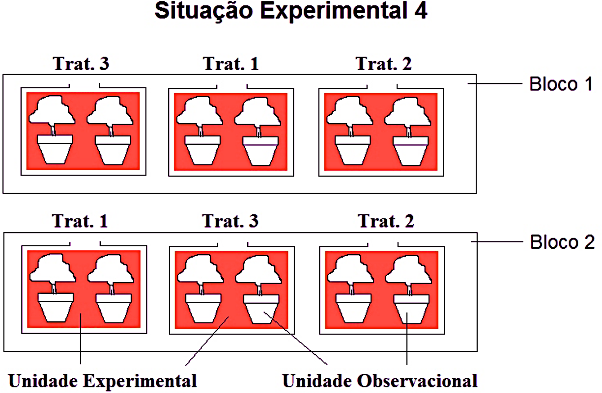

# Delineamentos com fontes de bloqueio {#blocos}

```{r setup-cap4, include=FALSE}
knitr::opts_chunk$set(echo = TRUE, warning = FALSE, message = FALSE,
                       fig.align = "center", out.width = "75%")
suppressPackageStartupMessages({
  library(tidyverse)
  library(kableExtra)
  library(broom)
  library(sf)
  library(emmeans)
})
source("hasse_helpers.R")
```

O princípio do **controle local** foi apresentado na Seção \@ref(tres-aspectos): quando se sabe
de antemão que as unidades experimentais não são homogêneas, agrupá-las em blocos internamente
homogêneos e aleatorizar os tratamentos *dentro* de cada bloco retira uma fonte conhecida de
variação do erro experimental antes mesmo da análise. Este capítulo formaliza essa ideia. Partimos
do caso de **uma única fonte de bloqueio** (o delineamento em blocos completos aleatorizados,
DBCA), tratamos do que fazer quando falta uma observação e de como quantificar o ganho obtido com
a blocagem. Em seguida apresentamos uma alternativa não paramétrica (teste de Friedman) e uma
extensão para quando os blocos são pequenos demais para conter todos os tratamentos (blocos
incompletos balanceados). Terminamos com **duas fontes de bloqueio cruzadas** (quadrado latino) e
**três** (quadrado greco-latino).

## O delineamento em blocos completos aleatorizados (DBCA) {#dbca}

### Motivação: o que dá errado sem controle local — fatores confundidos

Antes de descrever o DBCA formalmente, vale entender **o que exatamente ele evita**. Dois fatores
$A$ e $B$ são ditos **completamente confundidos** quando, no delineamento usado, seus efeitos são
matematicamente indistinguíveis — toda vez que $A$ está em um certo nível, $B$ também está, sem
exceção, de modo que nenhuma comparação isola um do outro.

```{=html}
<div class="caixa-aplicacao">
<strong>Aplicação — Ciência de dados: um programa de incentivo mal desenhado</strong><br>
Uma prefeitura lança um programa de incentivo ao comércio local e, por conveniência logística,
implementa-o apenas em bairros de renda alta, usando bairros de renda baixa como "controle" (sem
o programa). Depois de um trimestre, compara o faturamento médio do comércio nos bairros com
programa contra os sem programa.
</div>
```

```{r confundido-sim}
set.seed(777)
dados_confundido <- tibble(
  bairro    = c("Boa Viagem", "Casa Forte", "Graças", "Ibura", "Coelhos", "Brasília Teimosa"),
  renda     = factor(rep(c("Alta", "Baixa"), each = 3), levels = c("Alta", "Baixa")),
  programa  = factor(rep(c("Incentivo", "Controle"), each = 3), levels = c("Incentivo", "Controle")),
  # bairros de renda alta já faturam mais, com ou sem programa
  faturamento = c(rnorm(3, 520, 40), rnorm(3, 210, 25))
)
dados_confundido
```

```{r confundido-plot, fig.width=6, fig.height=4}
ggplot(dados_confundido, aes(x = programa, y = faturamento, fill = renda)) +
  geom_boxplot(alpha = 0.6, width = 0.5) +
  geom_jitter(width = 0.08, size = 2.6) +
  scale_fill_manual(values = c("#2a78d6", "#eb6834"), name = "Renda do bairro") +
  labs(x = NULL, y = "Faturamento médio (R$ mil)",
       title = "Efeito aparente do programa — ou efeito de renda?") +
  theme_minimal(base_size = 12)
```

O grupo "Incentivo" fatura visivelmente mais — mas **não há como saber se isso é efeito do
programa, da renda pré-existente do bairro, ou de ambos**, porque `renda` e `programa` variam em
perfeita sincronia nesse delineamento: todo bairro de renda alta recebeu o programa, e nenhum de
renda baixa recebeu. Ajustar `lm(faturamento ~ renda + programa)` sequer é possível de forma
identificável aqui (as duas colunas de $X$ seriam idênticas a menos de uma constante) — o R
reportaria um coeficiente `NA` para uma delas. Isso não é uma falha de estimação, é uma falha de
**delineamento**: nenhuma quantidade de dados adicionais no mesmo esquema resolveria o problema.

O DBCA é, em certo sentido, o oposto desse erro. Ele **não** trava um tratamento a um nível fixo de
uma variável de ruído (o que criaria confusão); ao contrário, ele **agrupa** unidades por essa
variável de ruído em blocos e depois **sorteia** os tratamentos dentro de cada bloco, de modo que
todo tratamento seja observado em todo nível da variável de ruído. Um bairro poderia, por exemplo,
funcionar como bloco geográfico legítimo — desde que a alocação do tratamento dentro dele seja
aleatória, não determinada pela própria característica do bloco. O mapa abaixo, com os bairros do
Recife (RPA — Região Político-Administrativa) coloridos por sua área de planejamento, ilustra a
escala em que uma blocagem geográfica desse tipo é definida: cada RPA agruparia unidades vizinhas,
presumivelmente mais parecidas entre si, dentro das quais os tratamentos seriam então sorteados.

```{r confundido-mapa, fig.width=6, fig.height=5.2}
recife <- st_read("../Aulas/Bairros_Recife/bairros-polygon.shp", quiet = TRUE)

ggplot(recife) +
  geom_sf(aes(fill = factor(rpa)), color = "white", linewidth = 0.15) +
  scale_fill_brewer(palette = "Set2", name = "RPA\n(bloco geográfico)") +
  labs(title = "Bairros do Recife agrupados por Região Político-Administrativa",
       subtitle = "Cada RPA poderia servir de bloco geográfico em um DBCA") +
  theme_minimal(base_size = 11) +
  theme(axis.text = element_blank(), panel.grid = element_blank())
```

Com `r nrow(recife)` bairros distribuídos em seis RPAs, um pesquisador que quisesse comparar, por
exemplo, três estratégias de precificação no comércio local poderia blocar por RPA (controlando
diferenças regionais de renda e densidade comercial) e, **dentro de cada RPA**, sortear os bairros
participantes entre as três estratégias — o mesmo princípio do exemplo agrícola que segue, só que
com blocos definidos por geografia urbana em vez de área de viveiro.

### O modelo

Sejam $t$ tratamentos e $b$ blocos. No DBCA, cada bloco contém exatamente uma unidade experimental
por tratamento — os blocos são "completos" porque nenhum tratamento fica de fora de nenhum bloco —
e a ordem de aplicação dos tratamentos dentro de cada bloco é sorteada independentemente em cada
bloco. O modelo estatístico é

$$
Y_{ij} = \mu + \tau_i + \beta_j + \varepsilon_{ij}, \qquad i = 1,\dots,t;\ j = 1,\dots,b,
$$

em que $\mu$ é a média geral, $\tau_i$ é o efeito (fixo) do $i$-ésimo tratamento, $\beta_j$ é o
efeito do $j$-ésimo bloco (em geral tratado como aleatório, $\beta_j \sim N(0,\sigma^2_\beta)$,
independente dos erros, embora a análise de efeitos fixos produza os mesmos testes-$F$ sobre os
tratamentos) e $\varepsilon_{ij} \sim N(0,\sigma^2)$, independentes. Usamos as restrições
$\sum_i \tau_i = 0$ e $\sum_j \beta_j = 0$ para identificabilidade. Note a ausência de um termo de
interação tratamento$\times$bloco: o modelo assume que o efeito de um tratamento é o mesmo, a
menos de erro aleatório, em todos os blocos (**aditividade** tratamento-bloco) — retomaremos essa
suposição ao final da seção.

```{r fig-ue-uo-blocos, echo=FALSE, out.width="55%", fig.cap="Situação Experimental 4: a mesma lógica de unidade experimental (UE) e unidade amostral da Seção 3.5, agora cruzada com blocos. Dentro de cada Bloco, os três tratamentos são sorteados independentemente entre as UEs daquele bloco; cada UE contém, por sua vez, duas unidades amostrais (vasos) medidas individualmente."}

```

O diagrama retoma as Situações Experimentais 1 e 2 da Seção \@ref(dca-submuestreo), acrescentando
agora a estrutura de blocagem: cada retângulo maior ("Bloco 1", "Bloco 2") é um bloco completo, e o
sorteio dos três tratamentos ocorre **dentro** de cada bloco, de forma independente — Bloco 1
sorteia a ordem Trat. 3, Trat. 1, Trat. 2, enquanto Bloco 2 sorteia Trat. 1, Trat. 3, Trat. 2, uma
permutação diferente, exatamente como a Seção \@ref(dbca) descreve a aleatorização restrita: cada
UE dentro de um bloco tem a mesma chance de receber cada tratamento, mas o sorteio não se estende
entre blocos. Note também que cada UE aqui contém duas unidades amostrais (dois vasos), o que
significa que este desenho combina blocagem **e** submuestreo simultaneamente — um lembrete de que
as duas ideias (Seção \@ref(dca-submuestreo) e esta seção) não são mutuamente exclusivas: é
perfeitamente possível ter um DBCA com submuestreo dentro de cada UE, embora o modelo $Y_{ij} = \mu
+ \tau_i + \beta_j + \varepsilon_{ij}$ apresentado acima descreva o caso mais simples, sem
submuestreo (uma única observação por combinação tratamento-bloco).

### Notação matricial: $Y=X\beta+\varepsilon$

O modelo do DBCA é um caso particular do modelo linear geral que formalizaremos no Capítulo 2,
$Y = X\beta + \varepsilon$, e vale a pena escrevê-lo assim desde já, porque a estrutura de $X$
deixa visualmente óbvio um fato que, em palavras, é fácil de esquecer: **não há colunas de
produto entre tratamento e bloco**. Empilhando as $tb$ observações em um vetor $Y$, a matriz de
delineamento tem a forma em blocos de colunas

$$
X = \big[\,\mathbf{1} \mid X_{trat} \mid X_{bloco}\,\big],
$$

em que $\mathbf 1$ é a coluna de uns (intercepto), $X_{trat}$ tem $t-1$ colunas indicadoras dos
tratamentos e $X_{bloco}$ tem $b-1$ colunas indicadoras dos blocos (uma coluna é omitida em cada
grupo para evitar colinearidade com o intercepto, na parametrização usual de "tratamento de
referência"). O vetor de parâmetros é $\beta=(\mu,\tau_2,\dots,\tau_t,\beta_2,\dots,\beta_b)'$.
Repare que **não existe** nenhuma coluna do tipo (indicador de tratamento) $\times$ (indicador de
bloco): é exatamente essa ausência — não uma suposição adicional escondida em algum lugar — que
constitui, em termos de $X$, a suposição de aditividade tratamento-bloco. Um quadrado latino
(Seção \@ref(quadrado-latino)) terá a mesma estrutura, só que com **três** blocos de colunas
lado a lado (tratamento, linha, coluna) em vez de dois — e nenhuma delas cruzada com as outras.

```{=html}
<div class="caixa-r"><strong>Uso do R</strong> — a estrutura de X para um DBCA pequeno (t=3, b=2)</div>
```

```{r dbca-matriz-toy}
dados_toy <- expand_grid(bloco = factor(1:2), tratamento = factor(1:3))
model.matrix(~ tratamento + bloco, data = dados_toy)
```

O estimador de mínimos quadrados $\hat\beta=(X'X)^{-1}X'Y$ e a matriz de projeção
$H=X(X'X)^{-1}X'$ (Capítulo 2) aplicam-se sem modificação — a ANOVA que segue nada mais é do que
uma forma de organizar $\|Y-\hat Y\|^2=\|(I-H)Y\|^2$ e suas partes atribuíveis a cada bloco de
colunas de $X$.

### Blocagem como aleatorização restrita: a camada causal

Vale a pena revisitar a blocagem sob a ótica causal potencial-outcomes de Neyman e Rubin
[@neyman1923application; @rubin1974estimating; @imbensrubin2015], já que ela explica *por que* o
DBCA continua produzindo um estimador não viesado do efeito do tratamento, e não apenas *como*
calculá-lo. Para cada unidade $u$ e tratamento $i$, existe um resultado potencial $Y_u(i)$ — a
resposta que $u$ *teria* sob o tratamento $i$, quer esse tratamento tenha sido de fato aplicado a
$u$ ou não. O efeito causal médio do tratamento $i$ contra o tratamento $i'$ é
$\mathbb E[Y_u(i)-Y_u(i')]$, tomado sobre a população de unidades.

Em um DCA (sem blocos), o sorteio é *completo*: cada unidade tem a mesma probabilidade de receber
cada tratamento, e essa aleatorização garante $\mathbb E[Y_u(i)\mid \text{recebeu }i] =
\mathbb E[Y_u(i)]$ — o grupo que de fato recebeu $i$ é, em expectativa, uma amostra representativa
de como *toda* a população responderia a $i$. No DBCA, o sorteio é **restrito** (ou
*estratificado*): dentro de cada bloco $j$, sorteiam-se os $t$ tratamentos entre as unidades
daquele bloco. Isso ainda é aleatorização — cada unidade dentro do bloco tem a mesma chance de
receber cada tratamento —, só que aplicada separadamente em cada estrato. A analogia com
amostragem estratificada é direta: assim como estimar uma média populacional estratificando por
uma variável correlacionada com a resposta produz um estimador **igualmente não viesado**, mas com
**variância menor** que a amostragem aleatória simples, blocar por uma variável correlacionada com
a resposta produz um estimador do efeito de tratamento igualmente não viesado, mas com erro-padrão
menor — precisamente o ganho que a eficiência relativa, adiante, quantifica. A condição para que a
blocagem *não piore nada* é fraca (basta que o sorteio dentro de cada bloco seja de fato aleatório);
a condição para que ela *ajude* é que os blocos correlacionem com a resposta — se não
correlacionarem, o único custo é gastar $b-1$ graus de liberdade do erro à toa, como veremos no
exemplo do viveiro de pepineiros.

### Tabela de ANOVA

A soma de quadrados total se decompõe em três partes:

$$
\underbrace{\sum_{i,j}(Y_{ij}-\bar Y_{..})^2}_{SQ_{Total}} =
\underbrace{b\sum_i(\bar Y_{i.}-\bar Y_{..})^2}_{SQ_{Trat}} +
\underbrace{t\sum_j(\bar Y_{.j}-\bar Y_{..})^2}_{SQ_{Bloco}} +
\underbrace{SQ_{Total}-SQ_{Trat}-SQ_{Bloco}}_{SQ_{Erro}}.
$$

```{r tabela-anova-dbca, echo=FALSE}
tibble(
  `Fonte de variação` = c("Tratamento", "Bloco", "Erro", "Total"),
  `Graus de liberdade` = c("$t-1$", "$b-1$", "$(t-1)(b-1)$", "$tb-1$"),
  `Soma de quadrados` = c("$SQ_{Trat}$", "$SQ_{Bloco}$", "$SQ_{Erro}$", "$SQ_{Total}$"),
  `Quadrado médio` = c("$QM_{Trat}=SQ_{Trat}/(t-1)$", "$QM_{Bloco}=SQ_{Bloco}/(b-1)$",
                        "$QM_{Erro}=SQ_{Erro}/[(t-1)(b-1)]$", "")
) %>%
  kable(caption = "Tabela de ANOVA do DBCA", escape = FALSE) %>%
  kable_styling(full_width = FALSE)
```

O teste de interesse compara $F_0 = QM_{Trat}/QM_{Erro}$ com $F_{\alpha,\,t-1,\,(t-1)(b-1)}$. Um
teste sobre os blocos ($QM_{Bloco}/QM_{Erro}$) também é produzido pelo software, mas **não deve
guiar decisões de retirar a blocagem do modelo**: os blocos foram fixados pelo delineamento (não
sorteados), então o objetivo de incluí-los é reduzir o erro experimental, não testar sua
significância — mesmo um bloco "não significativo" já removeu variação do erro que, de outra
forma, inflaria $QM_{Erro}$ e reduziria o poder do teste sobre os tratamentos.

### Esperança dos quadrados médios

A afirmação anterior — que o teste $F$ sobre blocos não deve orientar decisão alguma — não é só uma
convenção prática; ela é uma consequência direta de quem entra na **esperança** de cada quadrado
médio. Sob o modelo de efeitos fixos $\sum_i\tau_i=0$, $\sum_j\beta_j=0$,

$$
\mathbb E[QM_{Trat}] = \sigma^2 + \frac{b}{t-1}\sum_{i=1}^t \tau_i^2, \qquad
\mathbb E[QM_{Bloco}] = \sigma^2 + \frac{t}{b-1}\sum_{j=1}^b \beta_j^2, \qquad
\mathbb E[QM_{Erro}] = \sigma^2.
$$

O denominador correto de um teste $F$ é sempre um quadrado médio cuja esperança é $\sigma^2$ **sob
a hipótese nula de interesse** — e $QM_{Erro}$ cumpre esse papel tanto para o teste de tratamentos
quanto, formalmente, para um teste de blocos. O problema não é a matemática do teste
$QM_{Bloco}/QM_{Erro}$ (ele é perfeitamente calculável e o software o reporta sem erro); é que
$H_0:\beta_1=\dots=\beta_b=0$ não corresponde a pergunta científica alguma neste delineamento — os
blocos não foram sorteados de uma população de blocos possíveis, foram *escolhidos* porque já se
sabia, a priori, que representavam uma fonte real de heterogeneidade (áreas do viveiro com solos e
insolação diferentes). Testar se algo que já sabíamos ser heterogêneo é "estatisticamente
heterogêneo" é uma pergunta mal colocada; a pergunta que importa — "quanto essa heterogeneidade
conhecida contaminaria o erro se eu a ignorasse?" — é justamente o que a eficiência relativa,
adiante, responde.

```{=html}
<div class="caixa-aplicacao">
<strong>Aplicação — Agricultura: irrigação, silício e altura de pepineiros</strong><br>
Um experimento de horticultura investiga o efeito conjunto de dois <strong>níveis de
irrigação</strong> (0,5 e 1,0, uma fração da lâmina de referência) e <strong>quatro doses de
silício</strong> (0, 500, 1000 e 1500 ml) sobre a altura de plantas de pepino. As oito
combinações de irrigação e silício foram aplicadas em <strong>três blocos</strong> (áreas
contíguas do viveiro, cada uma com sua própria heterogeneidade de solo e insolação), com uma
planta de cada combinação por bloco.
</div>
```

Para introduzir o DBCA de um único fator, tratamos cada uma das $2\times 4=8$ combinações de
irrigação e silício como um "tratamento" só, deixando a decomposição desse efeito em irrigação,
silício e sua interação para o Capítulo 5 (fatoriais em blocos), quando retomaremos exatamente
este conjunto de dados.

```{=html}
<div class="caixa-r"><strong>Uso do R</strong> — ajustando o DBCA</div>
```

```{r dbca-pepino}
pepino <- read_csv("data/pepino.csv", show_col_types = FALSE) %>%
  mutate(
    tratamento = factor(paste0("riego", riego, "_", silicio)),
    bloco      = factor(bloque)
  )
glimpse(pepino)
```

A coluna `bloco` não é uma variável de interesse científico — ninguém pergunta "o bloco 2 produz
plantas mais altas que o bloco 1?" — ela apenas identifica **qual área contígua do viveiro**
originou cada planta, uma fonte conhecida de heterogeneidade de solo e insolação que queremos
neutralizar antes de comparar irrigação e silício. É por isso, e não por acaso de notação, que a
Seção anterior insistiu em não usar o teste $F$ de blocos para decidir se vale a pena mantê-los no
modelo: a pergunta "o bloco é estatisticamente significativo?" não é a pergunta que nos interessa
sobre essa coluna.

```{r dbca-pepino-mod}
mod_dbca <- aov(altura ~ tratamento + bloco, data = pepino)
anova(mod_dbca) %>%
  broom::tidy() %>%
  kable(digits = 4, caption = "ANOVA do DBCA — altura de pepineiros") %>%
  kable_styling(full_width = FALSE)
```

Há evidência forte de efeito de tratamento ($F_{7,14}=5{,}25$, $p=0{,}0041$): pelo menos uma
combinação de irrigação/silício produz altura média diferente das demais. O efeito de bloco é
pequeno neste conjunto de dados ($p=0{,}89$) — voltaremos a esse ponto na discussão sobre
eficiência relativa, adiante.

### Visualizando aditividade: o gráfico de perfis

A suposição de aditividade tratamento-bloco (Seção anterior) tem um diagnóstico visual direto:
plotar a resposta por tratamento, com uma linha ligando as observações de cada bloco. Se o efeito
de bloco fosse puramente aditivo — um simples deslocamento vertical, igual para todos os
tratamentos —, as três linhas seriam **aproximadamente paralelas**.

```{=html}
<div class="caixa-r"><strong>Uso do R</strong> — gráfico de perfis por bloco</div>
```

```{r dbca-perfis, fig.width=8, fig.height=4.3}
pal_blocos <- c("#2a78d6", "#eb6834", "#1baf7a")  # paleta categórica validada (3 blocos)

ggplot(pepino, aes(x = tratamento, y = altura, group = bloco, color = bloco)) +
  geom_line(linewidth = 0.9, alpha = 0.85) +
  geom_point(size = 2.6) +
  scale_color_manual(values = pal_blocos, name = "Bloco") +
  labs(x = NULL, y = "Altura (cm)",
       title = "Altura por combinação irrigação-silício, uma linha por bloco") +
  theme_minimal(base_size = 12) +
  theme(axis.text.x = element_text(angle = 40, hjust = 1))
```

As três linhas **não** são paralelas: cruzam-se em vários pontos (por exemplo, em torno de
`riego1_0 ml`, o bloco 3 despenca abaixo dos blocos 1 e 2, invertendo a ordem que tinham no
tratamento anterior). Isso sugere que a suposição de aditividade é, na melhor das hipóteses,
aproximada — mas, com uma única observação por célula tratamento$\times$bloco (sem repetição
dentro da célula), **não há graus de liberdade sobráveis para testar formalmente** uma interação
tratamento$\times$bloco: qualquer desvio da aditividade fica automaticamente absorvido no termo de
erro do DBCA, inflando-o. O gráfico de perfis não substitui esse teste (que exigiria repetição
dentro de cada combinação tratamento-bloco), mas é o diagnóstico informal mais direto disponível, e
vale examiná-lo sempre antes de confiar cegamente na tabela de ANOVA.

```{r dbca-pepino-X}
X <- model.matrix(mod_dbca)
dim(X)               # 24 linhas (unidades), 10 colunas: 1 + (8-1) trat + (3-1) bloco
X[1:4, c(1:3, 8:9)]  # note: nenhuma coluna cruza tratamento com bloco
```

### Diagrama de Hasse do DBCA: por que não há nó de interação

A ausência de colunas de produto em $X$, confirmada acima, e a ausência de graus de liberdade
sobráveis para testar tratamento$\times$bloco (parágrafo anterior) são a mesma afirmação vista de
dois ângulos diferentes — e o diagrama de Hasse do Capítulo 2 (Seção \@ref(hasse)) é o terceiro
ângulo, geométrico, que amarra os outros dois. No fatorial $A\times B$ cruzado do Capítulo 2
(Figura \@ref(fig:hasse-axb)), $A$ e $B$ aparecem no mesmo nível e se reencontram em um nó de
interação $A{\times}B$, que absorve $(a-1)(b-1)$ graus de liberdade *antes* de chegar ao erro. O
DBCA tem a mesma estrutura de topo — Tratamento e Bloco cruzados, no mesmo nível — mas **sem**
esse nó intermediário:

```{=html}
<div class="caixa-r"><strong>Uso do R</strong> — diagrama de Hasse do DBCA (exemplo pepino)</div>
```

```{r hasse-dbca, fig.width=5, fig.height=5.5, fig.cap="Diagrama de Hasse do DBCA, exemplo pepino: t=8 combinações irrigação-silício (tratamento), b=3 blocos, N=24. Tratamento e Bloco aparecem no mesmo nível (cruzados), mas -- ao contrário do fatorial A x B do Capítulo 2 (seção sobre diagramas de Hasse) -- não há nó de interação entre eles: com uma única observação por casela tratamento x bloco, os dois convergem direto no Erro."}
nos_dbca <- tibble(
  termo = c("Média", "Tratamento", "Bloco", "Erro"),
  df    = c(1, 8 - 1, 3 - 1, (8 - 1) * (3 - 1)),
  x     = c(0, -1, 1, 0),
  y     = c(4, 3, 3, 2)
)
arestas_dbca <- tibble(
  de   = c("Média", "Média", "Tratamento", "Bloco"),
  para = c("Tratamento", "Bloco", "Erro", "Erro")
)

plot_hasse(nos_dbca, arestas_dbca, titulo = "DBCA (pepino): t=8, b=3 (N=24)")
```

Os quatro nós somam $1+7+2+14=24=tb=N$: nada sobra para um quinto nó de interação. A razão
algébrica é a mesma que gera esse fato geométrico — cada casela tratamento$\times$bloco do DBCA
contém **exatamente uma** unidade experimental, então o próprio Erro *é* a variação residual
dentro de cada casela, o mesmo lugar onde um eventual efeito de interação teria de morar. Não é
que a interação tratamento$\times$bloco seja assumida igual a zero por conveniência; é que o
delineamento, ao não replicar dentro de casela, não deixa **nenhum** grau de liberdade disponível
para separar os dois — a formalização de $\mathbb E[QM_{Erro}]=\sigma^2$ da Seção anterior já
assume essa ausência, e o diagrama simplesmente torna visível, como contagem de nós e arestas, o
motivo pelo qual $\mathbb E[QM_{Erro}]$ não tem outro termo a mais somado a $\sigma^2$: não há
onde ele seria estimado. É por isso que o gráfico de perfis logo acima é o único diagnóstico
disponível para uma possível não aditividade — nenhum teste $F$ formal pode substituí-lo neste
delineamento.

### Dados faltantes: estimação do valor perdido

Perder uma observação é comum em campo (planta morre, parcela é destruída por um evento externo).
O DBCA deixa de ser balanceado, e o cálculo manual das somas de quadrados deixa de ser trivial. A
solução clássica de Yates [@yates1936incomplete] é **estimar o valor perdido** de modo a minimizar
a soma de quadrados do erro, e então prosseguir com a ANOVA usual, com duas ressalvas: (i) reduz-se
em 1 o grau de liberdade do erro (a observação estimada não traz informação nova), e (ii) a soma de
quadrados de tratamentos calculada com o valor estimado fica levemente viesada para cima e pode ser
corrigida.

Para uma única observação perdida na célula (tratamento $i^\*$, bloco $j^\*$), o valor que
minimiza $SQ_{Erro}$ é

$$
\hat y_{i^*j^*} = \frac{t\,T'_{i^*} + b\,B'_{j^*} - G'}{(t-1)(b-1)},
$$

em que $T'_{i^*}$ é o total do tratamento $i^\*$ (excluindo a observação perdida), $B'_{j^*}$ é o
total do bloco $j^\*$ (idem) e $G'$ é o total geral (idem). A correção aproximada para a soma de
quadrados de tratamentos é

$$
SQ_{Trat}^{\,ajustada} = SQ_{Trat}^{\,ingênua} - \frac{\left[B'_{j^*} - (t-1)\hat y_{i^*j^*}\right]^2}{t(t-1)}.
$$

```{=html}
<div class="caixa-r"><strong>Uso do R</strong> — estimando um valor perdido (fórmula de Yates)</div>
```

```{r dbca-missing}
# Removemos, propositalmente, a altura observada para riego = 1, silicio = "1000 ml", bloco 2
alvo <- which(pepino$riego == 1 & pepino$silicio == "1000 ml" & pepino$bloque == 2)
valor_real <- pepino$altura[alvo]

pepino_miss <- pepino
pepino_miss$altura[alvo] <- NA

t <- nlevels(pepino$tratamento); b <- nlevels(pepino$bloco)
trat_alvo  <- pepino$tratamento[alvo]
bloco_alvo <- pepino$bloco[alvo]

Tlinha <- sum(pepino_miss$altura[pepino_miss$tratamento == trat_alvo], na.rm = TRUE)
Blinha <- sum(pepino_miss$altura[pepino_miss$bloco == bloco_alvo], na.rm = TRUE)
Glinha <- sum(pepino_miss$altura, na.rm = TRUE)

y_hat <- (t * Tlinha + b * Blinha - Glinha) / ((t - 1) * (b - 1))
c(valor_real = valor_real, estimado = y_hat, erro = y_hat - valor_real)
```

```{r dbca-missing-2}
pepino_imputado <- pepino_miss
pepino_imputado$altura[alvo] <- y_hat
mod_imputado <- aov(altura ~ tratamento + bloco, data = pepino_imputado)
tab_imp <- anova(mod_imputado)

correcao <- (Blinha - (t - 1) * y_hat)^2 / (t * (t - 1))
SS_trat_ajustado <- tab_imp["tratamento", "Sum Sq"] - correcao
c(SQ_trat_ingenua = tab_imp["tratamento", "Sum Sq"],
  correcao = correcao, SQ_trat_ajustada = SS_trat_ajustado)
```

Neste exemplo, o valor real era $5{,}12$ cm e a fórmula de Yates estimou $4{,}69$ cm — um erro de
$0{,}43$ cm, razoável frente ao desvio-padrão residual do modelo completo. A correção da soma de
quadrados de tratamentos foi minúscula ($0{,}0012$), porque a discrepância entre bloco e
tratamento neste conjunto de dados já era pequena. Em conjuntos de dados com blocos muito
diferentes entre si, a correção pode ser relevante, e ignorá-la infla ligeiramente a estatística
$F$ de tratamentos. Com **mais de um valor perdido**, o mesmo princípio se generaliza por
iteração: estima-se cada valor faltante pela fórmula acima usando os demais valores (observados
e já estimados), repetindo o processo até os valores estimados convergirem — na prática, hoje,
resolve-se de forma exata por mínimos quadrados com dados desbalanceados (Capítulo 2), e a fórmula
de Yates permanece valiosa por seu valor didático e por dispensar software especializado.

### Eficiência relativa do DBCA frente ao DCA

Ter reduzido o erro experimental valeu a pena? A **eficiência relativa (ER)** do DBCA em relação a
um DCA hipotético (que teria usado as mesmas $tb$ unidades, mas ignorado os blocos) responde essa
pergunta comparando as variâncias por unidade experimental que os dois desenhos produziriam. Uma
aproximação amplamente usada [@montgomery2017design; @cochran1957experimental], que leva em conta
a perda de graus de liberdade do erro ao se estimar $QM_{Bloco}$ a mais, é

$$
ER(DBCA, DCA) = \frac{(gl_B+1)(gl_{E,DCA}+3)\, QM_{Bloco} + gl_{E,DCA}(gl_B+3)\, QM_{Erro}}
                     {(gl_{E,DCA}+1)(gl_B+3)\, QM_{Erro}},
$$

em que $gl_B = b-1$ e $gl_{E,DCA} = gl_{Erro} + gl_B = t(b-1)$ são os graus de liberdade do erro
que um DCA teria tido com o mesmo número de observações. $ER>1$ indica que o DBCA foi mais
eficiente: seria necessário aumentar o número de repetições do DCA por um fator $ER$ para igualar
a precisão do DBCA.

```{r dbca-re}
tab <- anova(mod_dbca)
MSB <- tab["bloco", "Mean Sq"];      MSE      <- tab["Residuals", "Mean Sq"]
gl_b <- tab["bloco", "Df"];          gl_e_dbca <- tab["Residuals", "Df"]
gl_e_dca <- gl_e_dbca + gl_b

ER <- ((gl_b + 1) * (gl_e_dca + 3) * MSB + gl_e_dca * (gl_b + 3) * MSE) /
      ((gl_e_dca + 1) * (gl_b + 3) * MSE)
ER
```

$ER \approx 1{,}02$: a blocagem por área do viveiro trouxe um ganho de eficiência muito modesto
neste experimento — coerente com o quadrado médio de blocos ser menor que o quadrado médio do
erro na Tabela acima. Isso não é falha do delineamento: **a blocagem só compensa quando os blocos
capturam uma fonte real de heterogeneidade**; quando as unidades já eram homogêneas, o DBCA "gasta"
$b-1$ graus de liberdade do erro sem retorno proporcional. Antes de blocar, vale perguntar se há
motivo concreto (agronômico, temporal, logístico) para esperar heterogeneidade entre as unidades
que vão compor cada bloco.

```{=html}
<div class="caixa-r"><strong>Uso do R</strong> — comparando o quadrado médio do erro dos dois desenhos</div>
```

```{r dbca-re-plot, fig.width=6, fig.height=4.3}
QME_dbca <- MSE
QME_dca  <- (tab["Residuals","Sum Sq"] + tab["bloco","Sum Sq"]) / gl_e_dca  # erro + bloco, agrupados

df_re <- tibble(
  Delineamento = factor(c("DBCA", "DCA (hipotético)"), levels = c("DBCA", "DCA (hipotético)")),
  QM_Erro = c(QME_dbca, QME_dca)
)

ggplot(df_re, aes(x = Delineamento, y = QM_Erro, fill = Delineamento)) +
  geom_col(width = 0.55) +
  geom_text(aes(label = sprintf("%.4f", QM_Erro)), vjust = -0.5, size = 4.2) +
  scale_fill_manual(values = c("#2a78d6", "#eb6834"), guide = "none") +
  labs(x = NULL, y = expression(QM[Erro]),
       title = "Quadrado médio do erro: DBCA vs. DCA hipotético") +
  ylim(0, max(df_re$QM_Erro) * 1.2) +
  theme_minimal(base_size = 12)
```

Este gráfico expõe uma armadilha comum: comparado ingenuamente, o $QM_{Erro}$ do DCA hipotético
($0{,}0493$) é, na verdade, **menor** que o do DBCA ($0{,}0554$) — o que, à primeira vista,
sugeriria que o DCA teria sido a escolha melhor! Isso acontece porque agrupar $SQ_{Bloco}$ (muito
pequena) de volta ao erro, dividido por mais graus de liberdade ($16$ em vez de $14$), reduz
ligeiramente a média. Mas comparar apenas os quadrados médios ignora que uma estimativa de
variância com **mais** graus de liberdade é, por si só, mais confiável (produz intervalos de
confiança e testes mais precisos) do que uma com menos graus — é exatamente essa troca entre
"quadrado médio menor" e "menos graus de liberdade" que a fórmula de $ER$ pondera formalmente
através dos termos $(gl_{E,DCA}+3)$ e $(gl_B+3)$. Ao aplicá-la, o resultado ($ER\approx1{,}02$)
ainda favorece — por pouco — o DBCA, mostrando que a comparação direta e ingênua das barras acima
pode enganar: **eficiência relativa não é o mesmo que "quadrado médio do erro menor"**.

```{=html}
<div class="caixa-discussao">
<strong>Para discutir</strong>
<ol>
<li>Se, neste experimento, o quadrado médio de blocos tivesse sido bem maior que o quadrado médio
do erro, o que isso indicaria sobre a decisão original de blocar por área do viveiro?</li>
<li>O modelo do DBCA não inclui interação tratamento$\times$bloco. O que essa suposição de
aditividade significa em termos práticos — por exemplo, é razoável supor que a diferença entre
duas doses de silício seja a mesma nos três blocos deste experimento?</li>
<li>Por que não se deve decidir remover o termo de bloco do modelo com base no teste $F$ de
blocos não ser significativo?</li>
</ol>
</div>
```

## Teste de Friedman {#friedman}

Quando a suposição de normalidade dos erros é implausível — respostas em escala ordinal, poucos
blocos, distribuições muito assimétricas — o **teste de Friedman** [@friedman1937] oferece uma
alternativa não paramétrica ao DBCA. É particularmente natural quando **o bloco é o próprio
sujeito** em um desenho de medidas repetidas: cada indivíduo é observado sob todos os tratamentos,
e a comparação entre tratamentos é feita *dentro* de cada indivíduo, exatamente como no DBCA.

```{=html}
<div class="caixa-aplicacao">
<strong>Aplicação — Psicologia: bloco = paciente em um desenho terapêutico</strong><br>
Uma clínica compara três técnicas terapêuticas breves — <strong>TCC</strong> (terapia
cognitivo-comportamental), <strong>terapia interpessoal</strong> e <strong>ativação
comportamental</strong> — quanto à redução percentual de sintomas depressivos autorreportados.
Doze pacientes (o <strong>bloco</strong>) recebem, cada um, as três técnicas em sessões
diferentes, em ordem aleatorizada, com período de washout entre elas. A resposta é assimétrica à
direita (a maioria melhora pouco, alguns melhoram muito), o que torna a suposição de normalidade
do DBCA questionável com apenas 12 blocos.
</div>
```

Dentro de cada bloco $j$, atribuem-se postos $1,\dots,t$ às $t$ respostas (do menor para o maior).
Sejam $R_i = \sum_j \text{posto}(Y_{ij})$ as somas de posto por tratamento. Sob $H_0$ (nenhuma
diferença sistemática entre tratamentos), a estatística de Friedman

$$
F_r = \frac{12}{bt(t+1)}\sum_{i=1}^t R_i^2 - 3b(t+1)
$$

segue, aproximadamente, uma distribuição $\chi^2_{t-1}$ para $b$ ou $t$ não muito pequenos.

```{=html}
<div class="caixa-r"><strong>Uso do R</strong> — <code>friedman.test()</code></div>
```

```{r friedman-sim}
set.seed(2026)
n_pac <- 12
tecnicas <- c("TCC", "Terapia_Interpessoal", "Ativacao_Comportamental")
efeito_pac <- rexp(n_pac, rate = 1 / 8)                 # heterogeneidade entre pacientes, assimétrica
efeito_tec <- c(TCC = 2, Terapia_Interpessoal = 0, Ativacao_Comportamental = 4)

dados_terapia <- expand_grid(paciente = 1:n_pac, tecnica = tecnicas) %>%
  mutate(
    tecnica = factor(tecnica, levels = tecnicas),
    reducao = round(5 + efeito_pac[paciente] + efeito_tec[as.character(tecnica)] +
                     rexp(n(), rate = 1 / 2), 1)
  )

mat <- dados_terapia %>%
  pivot_wider(names_from = tecnica, values_from = reducao) %>%
  select(-paciente) %>%
  as.matrix()

friedman.test(mat) %>% broom::tidy() %>%
  kable(digits = 3, caption = "Teste de Friedman — redução de sintomas por técnica") %>%
  kable_styling(full_width = FALSE)
```

```{r friedman-ranks, echo=FALSE}
ranks <- t(apply(mat, 1, rank))
tibble(Técnica = colnames(mat), `Soma de postos` = colSums(ranks)) %>%
  kable(caption = "Soma de postos por técnica (12 blocos, postos de 1 a 3)") %>%
  kable_styling(full_width = FALSE)
```

O gráfico de perfis usado para o DBCA (Seção anterior) tem uma versão natural aqui: uma linha por
paciente, ligando sua resposta nas três técnicas, sobreposta a um boxplot por técnica que resume a
distribuição marginal.

```{r friedman-perfis, fig.width=7, fig.height=4.2}
ggplot(dados_terapia, aes(x = tecnica, y = reducao)) +
  geom_line(aes(group = paciente), color = "grey70", alpha = 0.6) +
  geom_boxplot(aes(fill = tecnica), width = 0.35, alpha = 0.7, outlier.shape = NA) +
  geom_point(aes(color = tecnica), size = 1.8) +
  scale_fill_manual(values = pal_blocos, guide = "none") +
  scale_color_manual(values = pal_blocos, guide = "none") +
  labs(x = NULL, y = "Redução de sintomas (%)",
       title = "Redução de sintomas por técnica, uma linha por paciente") +
  theme_minimal(base_size = 12) +
  theme(axis.text.x = element_text(angle = 15, hjust = 1))
```

Duas coisas ficam visíveis que a estatística de Friedman, por si só, não mostra: (i) a assimetria à
direita mencionada na motivação — a maioria dos pacientes melhora pouco e uma cauda melhora muito,
em todas as três técnicas, o que já é um sinal contra a normalidade assumida pelo DBCA; e (ii) as
linhas cinzas cruzam-se com frequência — poucos pacientes mantêm a mesma ordenação relativa entre
as três técnicas —, o que é visualmente coerente com a soma de postos pouco discrepante e o
$p$-valor não significativo do teste.

Com $\chi^2_2 = 2{,}09$ e $p=0{,}35$, não há evidência, nesta amostra simulada, de diferença
sistemática entre as três técnicas — apesar de a soma de postos da ativação comportamental ser a
maior (indicando a técnica mais frequentemente "melhor" em cada paciente), a diferença não é
grande o bastante frente à variabilidade entre pacientes para ser distinguida de acaso com apenas
12 blocos. O teste de Friedman troca sensibilidade (ele usa menos informação que a ANOVA quando a
normalidade de fato vale) por robustez: não assume forma alguma para a distribuição dos erros,
apenas que, sob $H_0$, qualquer ordenação dos $t$ tratamentos dentro de um bloco é igualmente
provável.

## Blocos incompletos balanceados {#bib}

Às vezes o bloco não comporta todos os $t$ tratamentos — um degustador só consegue avaliar um
número limitado de amostras antes que o paladar sature; uma parcela experimental só tem espaço
físico para poucas variedades; um paciente só tolera um número limitado de sessões de teste. Um
**delineamento em blocos incompletos** usa blocos de tamanho $k < t$. Se, além disso, o desenho é
construído de modo que **cada par de tratamentos apareça junto no mesmo bloco o mesmo número de
vezes**, o delineamento é dito **balanceado (BIB)** [@yates1936incomplete] — a propriedade que
preserva a comparabilidade entre quaisquer dois tratamentos, análoga ao que a completude dos
blocos garante no DBCA.

Um BIB é caracterizado por cinco parâmetros: $t$ tratamentos, $b$ blocos, cada tratamento
aparecendo em $r$ blocos, cada bloco de tamanho $k$, e cada par de tratamentos coocorrendo em
$\lambda$ blocos. Esses parâmetros satisfazem duas identidades de contagem:

$$
bk = tr \qquad \text{e} \qquad \lambda(t-1) = r(k-1).
$$

```{=html}
<div class="caixa-aplicacao">
<strong>Aplicação — Agricultura: painel sensorial com degustadores</strong><br>
Um painel sensorial compara <strong>quatro</strong> variedades de café ($t=4$), mas cada
degustador (o bloco) consegue avaliar de forma confiável apenas <strong>três</strong> xícaras por
sessão ($k=3$) antes de o paladar saturar.
</div>
```

```{r bibd-tabela, echo=FALSE}
tribble(
  ~Bloco, ~`Tratamentos no bloco`,
  1, "1, 2, 3",
  2, "1, 2, 4",
  3, "1, 3, 4",
  4, "2, 3, 4"
) %>%
  kable(caption = "Um BIB com t=4, b=4, k=3, r=3, λ=2") %>%
  kable_styling(full_width = FALSE)
```

Cada tratamento aparece em $r=3$ dos $b=4$ blocos, e cada par (por exemplo, tratamentos 1 e 2)
coocorre em exatamente $\lambda=2$ blocos — confira: $bk=4\times3=12=tr=4\times3$ e
$\lambda(t-1)=2\times3=6=r(k-1)=3\times2$.

A propriedade de balanceamento fica mais fácil de enxergar em uma **matriz de incidência**
bloco$\times$tratamento: cada célula marca se aquele tratamento aparece naquele bloco.

```{r bibd-incidencia, fig.width=5, fig.height=3.6, echo=FALSE}
incidencia <- tribble(
  ~Bloco, ~Tratamento, ~presente,
  1, 1, 1,  1, 2, 1,  1, 3, 1,  1, 4, 0,
  2, 1, 1,  2, 2, 1,  2, 3, 0,  2, 4, 1,
  3, 1, 1,  3, 2, 0,  3, 3, 1,  3, 4, 1,
  4, 1, 0,  4, 2, 1,  4, 3, 1,  4, 4, 1
) %>% mutate(Bloco = factor(Bloco), Tratamento = factor(Tratamento))

ggplot(incidencia, aes(x = Tratamento, y = Bloco, fill = factor(presente))) +
  geom_tile(color = "white", linewidth = 1) +
  scale_fill_manual(values = c("0" = "grey92", "1" = "#2a78d6"),
                     labels = c("ausente", "presente"), name = NULL) +
  coord_fixed() +
  labs(title = "Matriz de incidência do BIB (t=4, b=4, k=3)") +
  theme_minimal(base_size = 12) +
  theme(panel.grid = element_blank())
```

Cada linha (bloco) tem exatamente $k=3$ células azuis, cada coluna (tratamento) tem exatamente
$r=3$ células azuis, e qualquer par de colunas compartilha azul em exatamente $\lambda=2$ linhas —
a checagem visual imediata de que o arranjo é de fato balanceado, sem precisar reconferir a tabela
de blocos linha por linha. A análise de um BIB é mais elaborada que a do DBCA
porque as médias de tratamento observadas precisam ser **ajustadas** pelos blocos em que cada
tratamento efetivamente apareceu — nem todo tratamento convive com os mesmos "vizinhos", ao
contrário do DBCA, em que todo tratamento aparece em todo bloco.

**Análise intrablocos.** Sejam $T_{i\cdot}$ a soma de todas as observações do tratamento $i$ e
$B_{\cdot j}$ a soma de todas as observações do bloco $j$. Como o tratamento $i$ não aparece em
todo bloco, comparar $T_{i\cdot}$ diretamente entre tratamentos confundiria o efeito do tratamento
com o efeito dos blocos particulares em que ele calhou de aparecer. A correção clássica
[@montgomery2017design] define o **total ajustado**
$$
Q_i = T_{i\cdot} - \frac{1}{k}\sum_{j:\, i \in \text{bloco } j} B_{\cdot j}, \qquad i = 1,\dots,t,
$$
que subtrai de $T_{i\cdot}$ a média dos totais dos blocos em que $i$ apareceu (ponderada por $k$) —
por construção, $\sum_i Q_i = 0$. A soma de quadrados de tratamentos **ajustada por blocos** é
$$
SQ_{\text{Trat(ajustada)}} = \frac{k\sum_{i=1}^t Q_i^2}{\lambda t},
$$
com $t-1$ graus de liberdade, entrando na tabela de ANOVA no lugar da $SQ_{Trat}$ não ajustada
usada no DBCA — é essa soma de quadrados, e não a diferença ingênua entre médias de tratamento
brutas, que deve orientar o teste $F$ de tratamentos em um BIB.

```{=html}
<div class="caixa-r"><strong>Uso do R</strong> — verificando a fórmula de Q_i contra a soma de quadrados sequencial de aov()</div>
```

```{r bibd-ajuste}
set.seed(2026)
blocos_lista <- list(c(1,2,3), c(1,2,4), c(1,3,4), c(2,3,4))   # os 4 blocos da Tabela acima
efeito_trat_bib  <- c(0, 3, -2, 5)     # tau_i (apenas para simular uma resposta plausivel)
efeito_bloco_bib <- c(-4, 2, 1, 6)     # beta_j

dados_bib <- map_dfr(seq_along(blocos_lista), function(j) {
  tibble(bloco = j, trat = blocos_lista[[j]],
         nota = 50 + efeito_trat_bib[blocos_lista[[j]]] + efeito_bloco_bib[j] + rnorm(3, 0, 1.5))
}) %>% mutate(bloco = factor(bloco), trat = factor(trat))

k_bib <- 3; t_bib <- 4; lambda_bib <- 2
T_trat  <- tapply(dados_bib$nota, dados_bib$trat, sum)
B_bloco <- tapply(dados_bib$nota, dados_bib$bloco, sum)

soma_blocos_do_trat <- sapply(1:t_bib, function(i) {
  bl <- which(map_lgl(blocos_lista, ~ i %in% .x))
  sum(B_bloco[bl])
})

Q <- T_trat - soma_blocos_do_trat / k_bib
SQ_trat_ajustada <- k_bib * sum(Q^2) / (lambda_bib * t_bib)

c(SQ_trat_formula = SQ_trat_ajustada,
  SQ_trat_aov = anova(aov(nota ~ bloco + trat, data = dados_bib))["trat", "Sum Sq"])
```

Os dois valores coincidem: ajustar `bloco` **antes** de `trat` no modelo linear e pedir a soma de
quadrados sequencial (Tipo I) de `trat` é, algebricamente, a mesma conta que a fórmula de $Q_i$
calcula à mão — o software não faz nada além disso por trás de `aov()`. Fica o essencial: **use um
BIB quando o tamanho físico ou logístico do bloco força $k<t$, e quando for possível construir um
arranjo em que todo par de tratamentos seja comparado com a mesma frequência**; a análise, embora
mais trabalhosa que a do DBCA, permanece inteiramente dentro do mesmo princípio de isolar a
variação de bloco antes de comparar tratamentos.

## Delineamento em quadrado latino {#quadrado-latino}

O DBCA controla **uma** fonte de variação sistemática. Quando há **duas** fontes de bloqueio
cruzadas e conhecidas — por exemplo, uma tendência de fertilidade ao longo das linhas de um
talhão *e*, simultaneamente, ao longo das colunas —, um **quadrado latino** de ordem $n$ permite
controlar as duas simultaneamente usando apenas $n^2$ unidades experimentais para comparar $n$
tratamentos, em vez das $n^3$ que um cruzamento completo de linha $\times$ coluna $\times$
tratamento exigiria. A ideia, que remonta aos ensaios de campo de Fisher em Rothamsted
[@fisher1935design], é arranjar os $n$ tratamentos em uma matriz $n\times n$ de modo que **cada
tratamento apareça exatamente uma vez em cada linha e exatamente uma vez em cada coluna**.

### Motivação: dois gradientes ortogonais, e por que um bloqueio simples não basta

Suponha um talhão em que a fertilidade varia em **duas direções ao mesmo tempo e
independentemente**: ao longo das linhas (por exemplo, declividade do terreno) e ao longo das
colunas (por exemplo, um gradiente de umidade, perpendicular à declividade).

```{r ql-motivacao-grid, fig.width=6.5, fig.height=4.6}
set.seed(48)
campo <- expand_grid(linha = 1:8, coluna = 1:8) %>%
  mutate(fertilidade = 70 - 3 * linha - 4 * coluna + rnorm(n(), 0, 3))

ggplot(campo, aes(x = coluna, y = linha, fill = fertilidade)) +
  geom_tile(color = "white") +
  scale_fill_gradient(low = "khaki1", high = "olivedrab", name = "Fertilidade") +
  scale_y_reverse() +
  labs(x = "Coluna (gradiente de umidade)", y = "Linha (gradiente de declividade)",
       title = "Fertilidade sob dois gradientes ortogonais") +
  theme_minimal(base_size = 12)
```

Se bloqueássemos **só** por linha (faixas horizontais), cada bloco ainda conteria o gradiente
inteiro de coluna, não neutralizado; se bloqueássemos **só** por coluna, sobraria o gradiente de
linha. Nenhum bloqueio de um único fator resolve os dois simultaneamente — e um DBCA com blocos
definidos pelo cruzamento linha$\times$coluna (cada combinação um bloco) exigiria $n$ observações
por bloco, ou seja, voltaríamos a precisar de replicação completa dentro de cada célula da grade. O
quadrado latino resolve isso de forma mais econômica: em vez de tratar linha$\times$coluna como um
único fator de blocagem com $n^2$ níveis, ele trata linha e coluna como **dois** fatores de
bloqueio cruzados, cada um com $n$ níveis, e usa a restrição de que cada tratamento apareça uma vez
por linha e uma vez por coluna para caber em exatamente $n^2$ unidades — sem replicação dentro de
cada célula.

### O modelo

$$
Y_{ijk} = \mu + \rho_i + \gamma_j + \tau_k + \varepsilon_{ijk},
$$

em que $\rho_i$ ($i=1,\dots,n$) é o efeito da linha, $\gamma_j$ ($j=1,\dots,n$) é o efeito da
coluna e $\tau_k$ ($k=1,\dots,n$) é o efeito do tratamento — mas, diferentemente de um fatorial
completo, apenas **uma** das $n$ combinações $(i,j)$ recebe cada tratamento $k$: o índice $k$ é
determinado pelo arranjo do quadrado latino, não varia livremente. Há apenas $n^2$ observações, não
$n^3$.

```{r tabela-anova-ql, echo=FALSE}
tibble(
  `Fonte de variação` = c("Linha", "Coluna", "Tratamento", "Erro", "Total"),
  `Graus de liberdade` = c("$n-1$", "$n-1$", "$n-1$", "$(n-1)(n-2)$", "$n^2-1$")
) %>%
  kable(caption = "Tabela de ANOVA do quadrado latino") %>%
  kable_styling(full_width = FALSE)
```

Como no DBCA, vale explicitar a esperança de cada quadrado médio, sob $\sum_i\rho_i=\sum_j\gamma_j
=\sum_k\tau_k=0$:

$$
\mathbb E[QM_{Linha}] = \sigma^2+\frac{n}{n-1}\sum_i\rho_i^2, \quad
\mathbb E[QM_{Coluna}] = \sigma^2+\frac{n}{n-1}\sum_j\gamma_j^2, \quad
\mathbb E[QM_{Trat}] = \sigma^2+\frac{n}{n-1}\sum_k\tau_k^2,
$$

com $\mathbb E[QM_{Erro}]=\sigma^2$ em qualquer caso. Como no DBCA, só o teste sobre tratamentos usa
essa estrutura para inferência; linha e coluna foram escolhidas pelo delineamento, não sorteadas de
uma população de linhas/colunas possíveis, então seus quadrados médios servem para *purificar* o
erro, não para serem testados.

```{=html}
<div class="caixa-aplicacao">
<strong>Aplicação — Agricultura: quatro adubações, controlando declividade e umidade</strong><br>
Um talhão experimental tem uma tendência de fertilidade ao longo de suas <strong>linhas</strong>
(declividade do terreno) e, independentemente, ao longo de suas <strong>colunas</strong>
(gradiente de umidade). Quatro formulações de adubo (A, B, C, D) são comparadas usando um
quadrado latino $4\times4$, de modo que cada formulação apareça uma vez em cada linha e uma vez
em cada coluna.
</div>
```

```{=html}
<div class="caixa-r"><strong>Uso do R</strong> — construindo e analisando um quadrado latino 4x4</div>
```

```{r ql-construcao}
quad <- matrix(c(
  "A","B","C","D",
  "B","C","D","A",
  "C","D","A","B",
  "D","A","B","C"
), nrow = 4, byrow = TRUE)
quad   # cada linha e cada coluna contém A, B, C, D exatamente uma vez
```

O arranjo abstrato de letras fica mais concreto como um diagrama: cada célula da grade
linha$\times$coluna recebe a cor do tratamento que lhe cabe, com a letra sobreposta para que a
identidade do tratamento nunca dependa só da cor.

```{r ql-heatmap, fig.width=5.5, fig.height=5, echo=FALSE}
pal4 <- c("#2a78d6", "#eb6834", "#1baf7a", "#eda100")  # paleta categórica validada (4 tratamentos)

expand_grid(linha = 1:4, coluna = 1:4) %>%
  mutate(tratamento = factor(mapply(function(i, j) quad[i, j], linha, coluna),
                              levels = c("A","B","C","D"))) %>%
  ggplot(aes(x = factor(coluna), y = factor(linha), fill = tratamento)) +
  geom_tile(color = "white", linewidth = 1.2) +
  geom_text(aes(label = tratamento), color = "black", fontface = "bold", size = 6) +
  scale_fill_manual(values = pal4, name = "Tratamento") +
  scale_y_discrete(limits = rev) +
  coord_fixed() +
  labs(x = "Coluna", y = "Linha", title = "Esquema do quadrado latino 4x4") +
  theme_minimal(base_size = 12) +
  theme(panel.grid = element_blank())
```

Cada linha da grade (lida da esquerda para a direita) contém as quatro letras exatamente uma vez,
e o mesmo vale para cada coluna (lida de cima para baixo) — é essa dupla restrição, visível de
imediato na figura, que define um quadrado latino. Ler o diagrama por linha diz que fixação em
qualquer talhão (linha) já garante que os quatro adubos serão testados; ler por coluna diz o
mesmo para qualquer data de aplicação.

### Diagrama de Hasse do quadrado latino: três fatores cruzados dois a dois

O quadrado latino é o primeiro delineamento deste livro com **três** fatores no mesmo nível do
diagrama de Hasse, em vez de dois — Linha, Coluna e Tratamento são cruzados dois a dois (nenhum
refina o outro), e os três convergem diretamente no Erro, pela mesma razão geométrica já vista no
DBCA: sem repetição dentro de cada célula linha$\times$coluna, não sobra grau de liberdade para
nenhuma interação entre eles.

```{=html}
<div class="caixa-r"><strong>Uso do R</strong> — diagrama de Hasse do quadrado latino 4x4</div>
```

```{r hasse-ql, fig.width=6, fig.height=5.5, fig.cap="Diagrama de Hasse do quadrado latino 4x4 (exemplo dos quatro adubos): n=4 linhas, n=4 colunas, n=4 tratamentos, N=n^2=16. Linha, Coluna e Tratamento aparecem no mesmo nível -- cruzados dois a dois -- e convergem direto no Erro, sem nó de interação, pela mesma razão do DBCA (seção anterior)."}
nos_ql <- tibble(
  termo = c("Média", "Linha", "Coluna", "Tratamento", "Erro"),
  df    = c(1, 4 - 1, 4 - 1, 4 - 1, (4 - 1) * (4 - 2)),
  x     = c(0, -1.6, 0, 1.6, 0),
  y     = c(4, 3, 3, 3, 2)
)
arestas_ql <- tibble(
  de   = c("Média", "Média", "Média", "Linha", "Coluna", "Tratamento"),
  para = c("Linha", "Coluna", "Tratamento", "Erro", "Erro", "Erro")
)

plot_hasse(nos_ql, arestas_ql, titulo = "Quadrado latino: n=4 (N=16)")
```

Os cinco nós somam $1+3+3+3+6=16=n^2$: Linha, Coluna e Tratamento consomem $n-1=3$ graus de
liberdade cada um (idêntico entre si, porque os três têm exatamente $n$ níveis), e sobram
$(n-1)(n-2)=3\times2=6$ para o Erro — a mesma fórmula da tabela de ANOVA acima, aqui obtida por
contagem direta no diagrama: $n^2$ caselas menos os $1+3+3+3=10$ graus de liberdade já
"explicados" pelos quatro nós superiores. Note o padrão que se repete a cada capítulo: quanto mais
fatores cruzados sem repetição dentro de casela, menos graus de liberdade sobram para o erro — um
quadrado latino de ordem $n$ "gasta" $3(n-1)$ graus de liberdade em estrutura antes de chegar ao
erro, contra apenas $(t-1)+(b-1)$ do DBCA de dois fatores.

### Aleatorização de um quadrado latino [@yates1933latin]

O quadro `quad` acima foi escrito de próprio punho, na ordem "óbvia" — mas usar sempre o mesmo
arranjo fixo reintroduz exatamente o problema que a aleatorização deveria evitar: se, por exemplo,
o adubo A está sempre na diagonal principal, e a diagonal principal coincidir por acaso com alguma
característica não modelada do talhão (digamos, um carreador de máquinas), o efeito de A ficaria
confundido com essa característica em **todo** experimento que reusasse esse quadrado.
Yates [-@yates1933latin] (ver @fisher1935design para o contexto experimental) propôs um
procedimento de aleatorização em quatro etapas que garante que a atribuição de tratamentos a
células não dependa de nenhuma escolha arbitrária do pesquisador:

1. Partir de um **quadrado latino reduzido** (primeira linha e primeira coluna em ordem "alfabética"
   $1,2,\dots,n$) — existe pelo menos um para toda ordem $n$, e é fácil de escrever (por exemplo, a
   construção cíclica $\text{quad}[i,j] = ((i+j-2)\bmod n)+1$).
2. Permutar aleatoriamente as **linhas** do quadrado reduzido.
3. Permutar aleatoriamente as **colunas** do resultado.
4. Sortear aleatoriamente **quais tratamentos reais** correspondem a cada símbolo $1,\dots,n$.

```{=html}
<div class="caixa-r"><strong>Uso do R</strong> — implementação do algoritmo de Yates (1933)</div>
```

```{r yates-aleatorizacao}
aleatorizar_quadrado_latino <- function(n, tratamentos, seed = NULL) {
  if (!is.null(seed)) set.seed(seed)
  # Passo 0: quadrado latino reduzido, construção cíclica
  reduzido <- outer(0:(n - 1), 0:(n - 1), function(i, j) ((i + j) %% n) + 1)

  # Passos 2-3: permutar linhas e colunas independentemente
  perm_linhas  <- sample(n)
  perm_colunas <- sample(n)
  design_idx   <- reduzido[perm_linhas, perm_colunas]

  # Passo 4: atribuir tratamentos reais aos símbolos 1..n
  atrib <- sample(tratamentos)
  design <- matrix(atrib[design_idx], nrow = n)

  list(design = design, perm_linhas = perm_linhas, perm_colunas = perm_colunas, atrib = atrib)
}

set.seed(2026)
resultado_yates <- aleatorizar_quadrado_latino(4, c("A", "B", "C", "D"))
resultado_yates$design
```

```{r yates-validacao}
# a aleatorização não pode violar a definição de quadrado latino
d <- resultado_yates$design
c(linhas_ok  = all(apply(d, 1, function(r) length(unique(r)) == 4)),
  colunas_ok = all(apply(d, 2, function(cl) length(unique(cl)) == 4)))
```

O quadrado gerado por essa execução (`r paste(resultado_yates$design[1,], collapse=" ")` na
primeira linha) é apenas **um entre muitos** igualmente válidos e igualmente prováveis sob o
procedimento de Yates — rodar novamente com outra semente produziria outro arranjo, também válido.
É esse espaço de arranjos possíveis, e não um único quadrado fixo, que sustenta a distribuição de
referência da aleatorização por trás do teste $F$: o argumento de Neyman-Rubin da Seção
\@ref(dbca) se aplica aqui do mesmo modo, só que a aleatorização agora é restrita simultaneamente
por linha e por coluna, não apenas por bloco.

```{r ql-sim}
efeito_linha  <- c(0, 2, -1, 1)
efeito_coluna <- c(0, -2, 1, 1)
efeito_trat   <- c(A = 0, B = 3, C = 5, D = 1)

set.seed(11)
dados_ql <- expand_grid(linha = 1:4, coluna = 1:4) %>%
  mutate(
    tratamento = factor(mapply(function(i, j) quad[i, j], linha, coluna),
                         levels = c("A","B","C","D")),
    linha  = factor(linha), coluna = factor(coluna),
    resposta = round(20 + efeito_linha[as.integer(linha)] + efeito_coluna[as.integer(coluna)] +
                 efeito_trat[as.character(tratamento)] + rnorm(n(), 0, 1.2), 2)
  )

mod_ql <- aov(resposta ~ linha + coluna + tratamento, data = dados_ql)
anova(mod_ql) %>% broom::tidy() %>%
  kable(digits = 4, caption = "ANOVA do quadrado latino 4x4 (dados simulados)") %>%
  kable_styling(full_width = FALSE)
```

Vale explicitar a matriz de delineamento aqui: agora $X=[\mathbf 1\mid X_{linha}\mid X_{coluna}
\mid X_{trat}]$ tem **três** blocos de colunas, e continua sem nenhum produto cruzado entre eles —
essa ortogonalidade de blocos de colunas é exatamente o que torna o quadrado latino "econômico":
ele estima três efeitos principais com $n^2$ observações porque abre mão de qualquer termo de
interação entre linha, coluna e tratamento.

```{r ql-matriz}
X_ql <- model.matrix(mod_ql)
dim(X_ql)   # 16 linhas, 1 + 3 (linha) + 3 (coluna) + 3 (tratamento) = 10 colunas
X_ql[1:4, ]
```

Com apenas 16 unidades experimentais, controlamos duas fontes de variação e ainda testamos o
efeito de adubação ($F_{3,6}=13{,}9$, $p=0{,}004$) — um fatorial completo de linha $\times$
coluna $\times$ tratamento precisaria de $4^3=64$ unidades para o mesmo número de níveis. O preço
é a suposição extra de que **não há interação** entre linha, coluna e tratamento: se o efeito de
uma adubação de fato depender da combinação específica de declividade e umidade, o quadrado
latino confunde essa interação com o erro experimental, sem meios de separá-las.

### Quadrados latinos replicados

Com $n$ pequeno (tipicamente $n\le5$), o quadrado latino sozinho deixa poucos graus de liberdade
para o erro — apenas $(n-1)(n-2)$, que é $6$ para $n=4$ e apenas $2$ para $n=3$. **Replicar** o
quadrado latino em $p$ conjuntos independentes de unidades experimentais (por exemplo, $p$
fazendas ou $p$ safras, cada uma com suas próprias linhas e colunas) aumenta os graus de liberdade
do erro sem aumentar $n$. Quando cada réplica tem suas próprias linhas e colunas (o caso mais
comum, em que os blocos de linha/coluna não são os mesmos de uma réplica para outra):

```{r tabela-anova-ql-rep, echo=FALSE}
tibble(
  `Fonte de variação` = c("Réplicas", "Linhas (dentro de réplica)", "Colunas (dentro de réplica)",
                           "Tratamento", "Erro", "Total"),
  `Graus de liberdade` = c("$p-1$", "$p(n-1)$", "$p(n-1)$", "$n-1$",
                            "$(n-1)[p(n-1)-1]$", "$pn^2-1$")
) %>%
  kable(caption = "Tabela de ANOVA do quadrado latino replicado (p réplicas independentes)") %>%
  kable_styling(full_width = FALSE)
```

```{=html}
<div class="caixa-r"><strong>Uso do R</strong> — duas réplicas independentes do mesmo quadrado latino</div>
```

```{r ql-replicado}
n <- 4; p <- 2
dados_rep <- map_dfr(1:p, function(rep_id) {
  expand_grid(linha = 1:4, coluna = 1:4) %>%
    mutate(
      replica    = rep_id,
      tratamento = factor(mapply(function(i, j) quad[i, j], linha, coluna),
                           levels = c("A","B","C","D")),
      linha_id   = factor(paste0(rep_id, "-", linha)),
      coluna_id  = factor(paste0(rep_id, "-", coluna))
    )
})

set.seed(22)
dados_rep <- dados_rep %>%
  mutate(
    replica  = factor(replica),
    resposta = round(20 + rnorm(n(), 0, 1) + efeito_trat[as.character(tratamento)] +
                 as.numeric(replica) * 1.5 + rnorm(n(), 0, 1.2), 2)
  )

mod_rep <- aov(resposta ~ replica + linha_id + coluna_id + tratamento, data = dados_rep)
anova(mod_rep) %>% broom::tidy() %>%
  kable(digits = 4, caption = "ANOVA de duas réplicas do quadrado latino 4x4") %>%
  kable_styling(full_width = FALSE)
```

Confira: $gl_{Erro} = (n-1)[p(n-1)-1] = 3\times(2\times3-1) = 15$, exatamente o valor produzido
pelo ajuste acima — replicar duas vezes elevou os graus de liberdade do erro de 6 para 15,
tornando o teste sobre tratamentos bem mais sensível do que seria com um único quadrado.

### Quantas réplicas? Uma análise de poder

A pergunta prática — "vale a pena replicar, e quantas vezes?" — pode ser respondida antes de
coletar qualquer dado, por **análise de poder**. A estatística de teste do quadrado latino
replicado segue, sob $H_1$, uma distribuição $F$ não central com parâmetro de não-centralidade
$\lambda = N f^2$, em que $N=pn^2$ é o número total de unidades e $f$ é o tamanho de efeito de
Cohen para o fator de tratamento — a mesma convenção usada em análises de poder de ANOVA de um
fator ($f=0{,}10$: efeito pequeno; $f=0{,}25$: médio; $f=0{,}40$: grande).

```{=html}
<div class="caixa-r"><strong>Uso do R</strong> — poder do teste de tratamento em função do número de réplicas</div>
```

```{r poder-ql-func}
poder_ql_replicado <- function(n, p, alpha = 0.05, f = 0.4) {
  gl1 <- n - 1
  gl2 <- (n - 1) * (p * (n - 1) - 1)
  N   <- p * n^2
  ncp <- N * f^2
  f_crit <- qf(1 - alpha, gl1, gl2)
  1 - pf(f_crit, gl1, gl2, ncp)
}

tab_poder <- tibble(p = 1:6) %>%
  mutate(
    gl_erro = (4 - 1) * (p * (4 - 1) - 1),
    poder   = poder_ql_replicado(n = 4, p = p, f = 0.4)
  )
tab_poder %>%
  kable(digits = 3, caption = "Poder do teste de tratamento vs. número de réplicas (n=4, f=0,4)") %>%
  kable_styling(full_width = FALSE)
```

```{r poder-ql-plot, fig.width=6, fig.height=4}
ggplot(tab_poder, aes(x = p, y = poder)) +
  geom_line(color = "#2a78d6", linewidth = 1) +
  geom_point(size = 2.6, color = "#2a78d6") +
  geom_hline(yintercept = 0.8, linetype = "dashed", color = "grey40") +
  scale_x_continuous(breaks = 1:6) +
  labs(x = "Número de réplicas do quadrado (p)", y = "Poder estatístico",
       title = "Poder para detectar um efeito grande (f=0,4) de tratamento") +
  ylim(0, 1) +
  theme_minimal(base_size = 12)
```

Com um único quadrado ($p=1$, $gl_{Erro}=6$), o poder para detectar um efeito grande é de apenas
`r scales::percent(tab_poder$poder[tab_poder$p==1], accuracy=1)` — mesmo um efeito real e
substantivo tem boa chance de passar despercebido. Duas réplicas (o exemplo acima) elevam o poder
para `r scales::percent(tab_poder$poder[tab_poder$p==2], accuracy=1)`; são necessárias
`r tab_poder$p[which(tab_poder$poder >= 0.8)[1]]` réplicas para cruzar a convenção usual de
poder $\ge0{,}80$. Essa é exatamente a natureza da decisão prática de delineamento: replicar tem
custo (mais unidades experimentais, mais tempo, mais recursos), e a análise de poder converte
"quantas réplicas?" de uma escolha arbitrária em uma conta explícita, condicionada ao menor efeito
que se considera cientificamente relevante detectar. Efeitos menores ($f=0{,}25$ ou $f=0{,}10$)
exigiriam ainda mais réplicas para o mesmo poder — vale repetir o cálculo acima variando `f` antes
de decidir o tamanho do experimento.

### Eficiência relativa do quadrado latino frente ao DBCA e ao DCA {#eficiencia-ql}

A Seção \@ref(dbca) definiu a eficiência relativa do DBCA frente ao DCA comparando a variância por
unidade experimental que cada delineamento produziria. A mesma lógica formal se estende ao
quadrado latino — só que agora há **duas** fontes de bloqueio (linha e coluna), e cabe perguntar
não só "valeu a pena blocar?", mas "qual das duas fontes carregou mais peso?". A comparação mais
direta aqui é, na verdade, **exata**, sem nenhuma aproximação: como $SQ_{Total}$ não depende de
qual modelo foi ajustado, a soma de quadrados que um DCA hipotético (que ignorasse linha e coluna)
atribuiria ao erro é exatamente o que sobra depois de remover só o tratamento,
$$
SQ_{Erro}^{(DCA)} = SQ_{Total} - SQ_{Trat} = SQ_{Linha} + SQ_{Coluna} + SQ_{Erro}^{(QL)},
$$
com $gl_{Erro}^{(DCA)} = n^2-1-(n-1) = n(n-1)$ graus de liberdade. Substituindo
$SQ_{Linha}=(n-1)QM_{Linha}$, $SQ_{Coluna}=(n-1)QM_{Coluna}$ e
$SQ_{Erro}^{(QL)}=(n-1)(n-2)QM_{Erro}$ e dividindo pelos graus de liberdade,
$$
QM_{Erro}^{(DCA)} = \frac{QM_{Linha}+QM_{Coluna}+(n-2)\,QM_{Erro}}{n}, \qquad
ER(QL,DCA) = \frac{QM_{Erro}^{(DCA)}}{QM_{Erro}^{(QL)}}.
$$
O mesmo raciocínio, aplicado a um DBCA hipotético que usasse **só uma** das duas fontes de bloqueio
(digamos, só linha, absorvendo coluna de volta ao erro), dá
$$
QM_{Erro}^{(DBCA\text{-linha})} = \frac{QM_{Coluna}+(n-2)\,QM_{Erro}}{n-1}, \qquad
ER(QL,DBCA\text{-linha}) = \frac{QM_{Erro}^{(DBCA\text{-linha})}}{QM_{Erro}^{(QL)}},
$$
e simetricamente para $ER(QL,DBCA\text{-coluna})$, trocando $QM_{Coluna}$ por $QM_{Linha}$.
Diferente da fórmula de Fisher usada na Seção \@ref(dbca) (que corrige o pequeno viés de usar uma
variância *estimada*, com poucos graus de liberdade, para julgar precisão futura), estas três
razões são identidades algébricas exatas — seguem diretamente de como $SQ_{Total}$ se particiona
entre fontes ortogonais, não de uma aproximação assintótica.

```{=html}
<div class="caixa-r"><strong>Uso do R</strong> — eficiência relativa do quadrado latino das quatro adubações</div>
```

```{r ql-eficiencia}
tab_ql <- anova(mod_ql)
QM_linha_ql  <- tab_ql["linha", "Mean Sq"]
QM_coluna_ql <- tab_ql["coluna", "Mean Sq"]
QM_erro_ql   <- tab_ql["Residuals", "Mean Sq"]
n_ql <- 4

QM_erro_dca <- (QM_linha_ql + QM_coluna_ql + (n_ql - 2) * QM_erro_ql) / n_ql
ER_dca      <- QM_erro_dca / QM_erro_ql

QM_erro_dbca_linha <- (QM_coluna_ql + (n_ql - 2) * QM_erro_ql) / (n_ql - 1)
ER_dbca_linha       <- QM_erro_dbca_linha / QM_erro_ql

QM_erro_dbca_coluna <- (QM_linha_ql + (n_ql - 2) * QM_erro_ql) / (n_ql - 1)
ER_dbca_coluna       <- QM_erro_dbca_coluna / QM_erro_ql

tibble(
  Comparação = c("QL vs. DCA (ignora linha e coluna)",
                 "QL vs. DBCA (só bloqueia linha)",
                 "QL vs. DBCA (só bloqueia coluna)"),
  `Eficiência relativa` = c(ER_dca, ER_dbca_linha, ER_dbca_coluna)
) %>%
  kable(digits = 2, caption = "Eficiência relativa do quadrado latino 4x4 das quatro adubações") %>%
  kable_styling(full_width = FALSE)
```

O quadrado latino é claramente a escolha certa neste experimento: comparado a um DCA que ignorasse
os dois gradientes, seria preciso `r round(ER_dca,1)` vezes mais unidades experimentais para
igualar sua precisão; mesmo comparado a um DBCA que já controlasse a declividade (linha), ainda
seria preciso `r round(ER_dbca_linha,1)` vezes mais. O padrão
$ER(QL,DBCA\text{-linha}) < ER(QL,DBCA\text{-coluna})$ é informativo por si só: como
$QM_{Linha}=$ `r round(QM_linha_ql,2)` é maior que $QM_{Coluna}=$ `r round(QM_coluna_ql,2)` na
Tabela de ANOVA acima, é a **linha** (declividade) que carrega mais heterogeneidade real — um DBCA
que já a controlasse deixaria pouca "sobra" para o quadrado latino explicar ao acrescentar a
coluna, exatamente o que a eficiência relativa menor
(`r round(ER_dbca_linha,1)` contra `r round(ER_dbca_coluna,1)`) mostra. É esse tipo de
decomposição — não apenas "o quadrado latino ajudou?", mas "qual das duas fontes de bloqueio
carregou mais peso?" — que a extensão da eficiência relativa a duas dimensões permite responder.

### Um segundo exemplo completo: cinco variantes de checkout em e-commerce {#ql-exemplo-ecommerce}

Para fixar a notação matricial do quadrado latino em um domínio bem diferente da agricultura —
ciência de dados, o mesmo cenário que o Capítulo 8 retomará sob a ótica de testes A/B —, considere
um segundo exemplo completo, agora com $n=5$.

```{=html}
<div class="caixa-aplicacao">
<strong>Aplicação — Ciência de dados: cinco variantes de checkout, controlando hora do dia e dia
da semana</strong><br>
Uma equipe de produto quer comparar <strong>cinco variantes</strong> (A–E) do botão de finalizar
compra em um site de e-commerce, medindo a taxa de conversão (%). A conversão varia
sistematicamente tanto pela <strong>hora do dia</strong> (cinco faixas horárias) quanto pelo
<strong>dia da semana</strong> (cinco dias úteis) — duas fontes de bloqueio conhecidas e cruzadas,
o cenário exato de um quadrado latino $5\times5$: cada variante é exibida exatamente uma vez em
cada faixa horária e uma vez em cada dia da semana, ao longo de 25 janelas de exibição.
</div>
```

```{=html}
<div class="caixa-r"><strong>Uso do R</strong> — construção, ajuste e notação matricial do quadrado latino 5x5</div>
```

```{r ql-ex2-construcao}
n5 <- 5
quad5 <- matrix(LETTERS[outer(0:(n5-1), 0:(n5-1), function(i, j) ((i + j) %% n5) + 1)], nrow = n5)
quad5   # construção cíclica: quad5[i,j] = letra ((i+j) mod 5)

ef_hora <- c(0, 0.5, 1.2, 0.8, -0.3)             # efeito de faixa horária (pontos percentuais)
ef_dia  <- c(0, -0.4, 0.2, 0.6, -0.2)            # efeito de dia da semana
ef_var  <- c(A = 0, B = 0.9, C = 1.6, D = 0.4, E = -0.5)  # efeito de variante

set.seed(2025)
dados_ec <- expand_grid(hora = 1:n5, dia = 1:n5) %>%
  mutate(
    variante = factor(mapply(function(i, j) quad5[i, j], hora, dia), levels = LETTERS[1:5]),
    hora = factor(hora), dia = factor(dia),
    conversao = round(8 + ef_hora[as.integer(hora)] + ef_dia[as.integer(dia)] +
                 ef_var[as.character(variante)] + rnorm(n(), 0, 0.35), 3)
  )

mod_ec <- aov(conversao ~ hora + dia + variante, data = dados_ec)
anova(mod_ec) %>% broom::tidy() %>%
  kable(digits = 4, caption = "ANOVA do quadrado latino 5x5 (variantes de checkout)") %>%
  kable_styling(full_width = FALSE)
```

Como no exemplo anterior, a matriz de delineamento tem a forma em blocos de colunas
$X=[\mathbf 1\mid X_{hora}\mid X_{dia}\mid X_{variante}]$, agora com $n-1=4$ colunas indicadoras
para cada um dos três fatores (parametrização de referência): $1+4+4+4=13$ colunas para
$N=n^2=25$ observações.

```{r ql-ex2-matriz}
X_ec <- model.matrix(mod_ec)
dim(X_ec)   # 25 linhas, 13 colunas
```

O posto de $X$ tem que ser exatamente 13 — nenhuma coluna é combinação linear das demais, porque
não há produto cruzado entre os três blocos de colunas. A matriz de projeção
$H=X(X'X)^{-1}X'$ (Capítulo 2) confirma isso diretamente: seu traço, que mede a dimensão do
subespaço de $\mathbb R^{25}$ em que $Y$ é projetado, coincide com o posto de $X$.

```{r ql-ex2-hat}
H_ec <- X_ec %*% solve(t(X_ec) %*% X_ec) %*% t(X_ec)
c(traco_H = sum(diag(H_ec)), posto_X = qr(X_ec)$rank)
```

Os três testes-$F$ são significativos — hora do dia ($F=$ `r round(anova(mod_ec)["hora","F value"],2)`,
$p=$ `r round(anova(mod_ec)["hora","Pr(>F)"],4)`), dia da semana ($F=$
`r round(anova(mod_ec)["dia","F value"],2)`, $p=$ `r round(anova(mod_ec)["dia","Pr(>F)"],4)`) e,
principalmente, variante ($F=$ `r round(anova(mod_ec)["variante","F value"],2)`,
$p<0{,}001$) —, confirmando que as duas fontes de bloqueio de fato carregavam variação real (o
quadrado latino não gastou seus graus de liberdade à toa) e que as variantes diferem entre si.

```{=html}
<div class="caixa-r"><strong>Uso do R</strong> — médias ajustadas por variante, controlando hora e dia</div>
```

```{r ql-ex2-emm, fig.width=6.2, fig.height=4.2}
library(emmeans)
emm_var <- emmeans(mod_ec, ~ variante)
emm_df  <- as_tibble(emm_var)

ggplot(emm_df, aes(x = variante, y = emmean)) +
  geom_pointrange(aes(ymin = lower.CL, ymax = upper.CL), color = "#2a78d6", linewidth = 0.9) +
  labs(x = "Variante de checkout", y = "Conversão média ajustada (%)",
       title = "Médias ajustadas por variante (IC 95%, controlando hora e dia)") +
  theme_minimal(base_size = 12)
```

As médias ajustadas separam claramente a variante C (`r round(emm_df$emmean[emm_df$variante=="C"],2)`%,
a melhor) da variante E (`r round(emm_df$emmean[emm_df$variante=="E"],2)`%, a pior) — os intervalos
de 95% não se sobrepõem entre as duas, evidência forte de que a diferença é real e não ruído de
amostragem. Note o paralelo direto com um teste A/B: se a equipe tivesse testado só C contra A sem
controlar hora e dia (um DCA disfarçado de "teste A/B simples"), o mesmo efeito real de variante
teria ficado misturado com a variação sistemática de tráfego ao longo do dia e da semana — o
Capítulo 8 retoma exatamente esse ponto ao discutir por que testes A/B ingênuos, sem nenhum
controle local, podem levar a conclusões erradas mesmo com milhares de observações.

### Quadrados de Youden: quando o quadrado latino não pode ser completo {#youden}

Um quadrado latino exige $n$ linhas *e* $n$ colunas — mas, às vezes, o número de "posições"
disponíveis em uma das duas direções é menor que o número de tratamentos: um viveiro tem $v=7$
variedades a comparar, mas a bancada de casa de vegetação só tem $r=3$ posições físicas por data de
plantio; um painel sensorial quer balancear $v$ produtos contra $v$ sessões, mas cada degustador
(linha) só avalia $r<v$ produtos por sessão. Um **quadrado de Youden** resolve exatamente esse
caso: é um quadrado latino **incompleto**, em que uma das duas dimensões de bloqueio (aqui,
coluna) tem menos níveis do que tratamentos.

Formalmente, um quadrado de Youden com parâmetros $(v,r)$, $r<v$, é um arranjo retangular de $r$
linhas por $v$ colunas, com $v$ tratamentos, tal que:

1. cada **linha** contém cada um dos $v$ tratamentos exatamente uma vez — como em um quadrado
   latino completo, a linha não é incompleta;
2. cada **coluna** contém apenas $r$ dos $v$ tratamentos, e o conjunto de tratamentos que aparece
   em cada coluna forma um bloco de um delineamento em blocos incompletos balanceados (Seção
   \@ref(bib)) **simétrico**, com parâmetros $t=b=v$, $k=r$ e
   $\lambda = \dfrac{r(r-1)}{v-1}$.

Em outras palavras: um quadrado de Youden é, ao mesmo tempo, um quadrado latino em relação a
linha$\times$tratamento (ortogonalidade completa) e um BIB em relação a coluna$\times$tratamento
(balanceamento incompleto) — as duas estruturas dos capítulos anterior e desta seção, combinadas em
um único delineamento. Com $N=rv$ unidades em vez das $v^2$ que um quadrado latino completo
exigiria, o modelo é
$$
Y_{ijk} = \mu + \rho_i + \gamma_j + \tau_k + \varepsilon_{ijk}, \qquad i=1,\dots,r,\ \ j=1,\dots,v,
$$
com $k$ novamente determinado pelo arranjo, não livre. Como linha é ortogonal a tratamento (item 1
acima), a soma de quadrados de tratamento **não** precisa de ajuste em relação à linha — só em
relação à coluna, exatamente com a fórmula de $Q_i$ e $SQ_{Trat(ajustada)}$ da Seção \@ref(bib),
usando $T_{i\cdot}$ (soma do tratamento $i$) e $B_{\cdot j}$ (soma da coluna $j$) no lugar de bloco:
$$
Q_i = T_{i\cdot} - \frac{1}{r}\sum_{j:\, i\,\in\,\text{coluna }j} B_{\cdot j}, \qquad
SQ_{\text{Trat(ajustada)}} = \frac{r\sum_{i=1}^v Q_i^2}{\lambda v}.
$$

```{r tabela-anova-youden, echo=FALSE}
tibble(
  `Fonte de variação` = c("Linha", "Coluna", "Tratamento (ajustado)", "Erro", "Total"),
  `Graus de liberdade` = c("$r-1$", "$v-1$", "$v-1$", "$(v-1)(r-2)$", "$rv-1$")
) %>%
  kable(caption = "Tabela de ANOVA do quadrado de Youden") %>%
  kable_styling(full_width = FALSE)
```

```{=html}
<div class="caixa-aplicacao">
<strong>Aplicação — Agricultura: sete genótipos de soja, três posições por data de plantio</strong><br>
Um experimento de casa de vegetação compara <strong>sete genótipos</strong> de soja ($v=7$) ao
longo de <strong>sete datas de plantio</strong> (colunas), mas a bancada só comporta
<strong>três</strong> vasos por data ($r=3$). Cada genótipo ainda deve aparecer exatamente uma vez
em cada "posição" (linha) da bancada, e cada par de genótipos deve coocorrer no mesmo número de
datas — a estrutura de um quadrado de Youden $(v,r)=(7,3)$.
</div>
```

A construção clássica parte de um **conjunto de diferenças perfeito** — aqui, $D=\{1,2,4\}\pmod 7$
(os resíduos quadráticos módulo 7): a célula $(i,j)$ recebe o tratamento $(d_i+j)\bmod 7$, para
$d_i\in D$ (na ordem fixa $1,2,4$) e $j=0,\dots,6$. Ler ao longo de uma linha $i$ fixa faz $j$
percorrer $0,\dots,6$ e, portanto, $(d_i+j)\bmod7$ percorre todos os 7 tratamentos — a propriedade
(1) acima. Ler ao longo de uma coluna $j$ fixa dá o bloco $D+j\pmod7$, uma translação cíclica de
$D$: como $D$ é um conjunto de diferenças perfeito, todo par de tratamentos coocorre em exatamente
$\lambda=1$ coluna — a propriedade (2).

```{=html}
<div class="caixa-r"><strong>Uso do R</strong> — construção e verificação do quadrado de Youden (7,3)</div>
```

```{r youden-construcao}
v_y <- 7; r_y <- 3
D <- c(1, 2, 4)                                  # resíduos quadráticos mod 7 (conjunto de diferenças)
genotipos <- paste0("G", 1:7)

Y <- matrix(NA_integer_, nrow = r_y, ncol = v_y)
for (i in 1:r_y) for (j in 0:(v_y - 1)) Y[i, j + 1] <- (D[i] + j) %% v_y + 1
rownames(Y) <- paste0("linha", 1:r_y); colnames(Y) <- paste0("data", 1:v_y)
matrix(genotipos[Y], nrow = r_y, dimnames = dimnames(Y))

# verificação: cada linha e uma permutação dos 7 genotipos; cada par coocorre 1 vez
linhas_ok <- all(apply(Y, 1, function(lin) length(unique(lin)) == v_y))
pares <- combn(1:v_y, 2)
lambda_obs <- range(apply(pares, 2, function(p) sum(sapply(1:v_y, function(j) all(p %in% Y[, j])))))
c(linhas_sao_permutacoes = linhas_ok, lambda_min = lambda_obs[1], lambda_max = lambda_obs[2])
```

```{r youden-heatmap, fig.width=7, fig.height=3.2, echo=FALSE}
expand_grid(linha = 1:r_y, coluna = 1:v_y) %>%
  mutate(genotipo = factor(genotipos[mapply(function(i, j) Y[i, j], linha, coluna)],
                            levels = genotipos)) %>%
  ggplot(aes(x = factor(coluna), y = factor(linha), fill = genotipo)) +
  geom_tile(color = "white", linewidth = 1) +
  geom_text(aes(label = genotipo), size = 3.6, fontface = "bold") +
  scale_fill_manual(values = scales::hue_pal()(7), guide = "none") +
  scale_y_discrete(limits = rev) +
  labs(x = "Coluna (data de plantio)", y = "Linha (posição na bancada)",
       title = "Quadrado de Youden (v=7, r=3)",
       subtitle = "cada linha tem os 7 genótipos; cada coluna, só 3") +
  theme_minimal(base_size = 11) +
  theme(panel.grid = element_blank())
```

O contraste com o quadrado latino completo salta aos olhos: cada **linha** ainda contém todos os 7
genótipos (lida na horizontal, a figura mostra os 7 rótulos diferentes), mas cada **coluna** só
mostra 3 dos 7 (a "incompletude" que dá nome ao delineamento) — e ainda assim, por construção via o
conjunto de diferenças, todo par de genótipos aparece junto em exatamente uma coluna.

```{r youden-analise}
ef_trat_y  <- c(G1 = 0, G2 = 1.5, G3 = 3, G4 = -1, G5 = 2, G6 = 0.5, G7 = -2)
ef_linha_y <- c(0, 1, -1)
ef_col_y   <- c(0, 0.5, -0.5, 1, -1, 0.3, -0.3)

set.seed(48)
dados_youden <- expand_grid(linha = 1:r_y, coluna = 1:v_y) %>%
  mutate(
    trat  = factor(genotipos[mapply(function(i, j) Y[i, j], linha, coluna)], levels = genotipos),
    linha = factor(linha), coluna = factor(coluna),
    altura = round(30 + ef_linha_y[as.integer(linha)] + ef_col_y[as.integer(coluna)] +
               ef_trat_y[as.character(trat)] + rnorm(n(), 0, 1), 2)
  )

mod_youden <- aov(altura ~ linha + coluna + trat, data = dados_youden)
anova(mod_youden) %>% broom::tidy() %>%
  kable(digits = 4, caption = "ANOVA do quadrado de Youden (7,3): altura de plântulas de soja") %>%
  kable_styling(full_width = FALSE)
```

```{r youden-verificacao-qi}
lambda_y <- r_y * (r_y - 1) / (v_y - 1)   # = 1 para (v,r) = (7,3)

T_trat  <- tapply(dados_youden$altura, dados_youden$trat, sum)
B_col   <- tapply(dados_youden$altura, dados_youden$coluna, sum)
soma_col_do_trat <- sapply(genotipos, function(g) {
  cols <- unique(dados_youden$coluna[dados_youden$trat == g])
  sum(B_col[as.character(cols)])
})

Q_y <- T_trat - soma_col_do_trat / r_y
SQ_trat_ajustada_y <- r_y * sum(Q_y^2) / (lambda_y * v_y)

c(SQ_trat_formula_Qi = SQ_trat_ajustada_y,
  SQ_trat_aov         = anova(mod_youden)["trat", "Sum Sq"])
```

Os dois valores coincidem, exatamente como no BIB da Seção \@ref(bib) — a diferença é que aqui a
linha, por ser ortogonal a tratamento, pode entrar no modelo em qualquer ordem sem alterar a soma
de quadrados de tratamento; só a coluna exige o ajuste de $Q_i$. Com apenas $N=rv=21$ unidades (bem
menos que as $v^2=49$ de um quadrado latino $7\times7$ completo), o quadrado de Youden ainda separa
com clareza os efeitos de linha, coluna e genótipo, ao custo de $(v-1)(r-2)=6$ graus de liberdade
de erro — a mesma troca entre economia de unidades experimentais e graus de liberdade de erro já
vista para o BIB e para o quadrado latino replicado.

W. J. Youden introduziu esse delineamento em 1937, em ensaios agrícolas de campo; a referência
ainda não consta em `Livro/refs.bib`, então nenhuma citação foi inserida aqui para evitar uma
chave bibliográfica quebrada no PDF/HTML final.

## Delineamento em quadrado greco-latino {#quadrado-greco-latino}

Quando há **três** fontes de bloqueio cruzadas — ou, equivalentemente, duas fontes de bloqueio e
um segundo fator de tratamento que se deseja controlar simultaneamente à primeira — o **quadrado
greco-latino** sobrepõe dois quadrados latinos **ortogonais** de ordem $n$: um com letras romanas
(A, B, C, ...) e outro com letras gregas ($\alpha,\beta,\gamma,\dots$), construídos de modo que
**cada par (letra romana, letra grega) ocorra exatamente uma vez** no quadrado $n\times n$. Isso só
é possível quando existe um **par de quadrados latinos ortogonais** de ordem $n$ — a próxima
subseção formaliza para quais $n$ isso vale, e conta a história de sua exceção mais famosa.

### Quadrados latinos mutuamente ortogonais (MOLS): existência e o problema de Euler {#mols}

Dois quadrados latinos $L_1$ e $L_2$ de ordem $n$ são **ortogonais** se, ao sobrepô-los, cada um
dos $n^2$ pares ordenados de símbolos $(L_1(i,j), L_2(i,j))$ ocorre exatamente uma vez — a
propriedade exigida na construção do quadrado greco-latino acima. Um conjunto de $k$ quadrados
latinos de ordem $n$, ortogonais dois a dois, é chamado de **MOLS** de ordem $n$ (*mutually
orthogonal Latin squares*), denotado $\text{MOLS}(n,k)$.

**Cota superior.** O número máximo $N(n)$ de quadrados latinos de ordem $n$ mutuamente ortogonais
satisfaz
$$
N(n) \le n-1
$$
[@montgomery2017design; @dean2017design]. Esse máximo é **atingido** — existe um conjunto completo
de $n-1$ MOLS — sempre que $n$ é uma potência de primo: identificando os $n$ símbolos com os
elementos do corpo de Galois $GF(n)$, os $n-1$ quadrados $L_a(x,y) = ax+y$ (aritmética em $GF(n)$),
para $a\in GF(n)\setminus\{0\}$, são ortogonais dois a dois — duas linhas $x,x'$ de $L_a$ coincidem
em coluna $y$ apenas se $ax+y=ax'+y$, ou seja $x=x'$, e o mesmo argumento aplicado a
$L_a(x,y)-L_{a'}(x,y)=(a-a')x$ garante que $L_a$ e $L_{a'}$ ($a\ne a'$) nunca repetem um par
$(s,t)$. Essa é exatamente a construção por trás dos exemplos de quadrado greco-latino desta seção
(que usam $n=4=2^2$, potência de primo).

```{=html}
<div class="caixa-r"><strong>Uso do R</strong> — construindo e verificando um conjunto completo de MOLS de ordem 5</div>
```

```{r mols-gf5}
n_mols <- 5   # primo: GF(5) = Z_5 com aritmetica usual
mols5 <- lapply(1:(n_mols - 1), function(a) {
  outer(0:(n_mols - 1), 0:(n_mols - 1), function(x, y) (a * x + y) %% n_mols)
})

ortogonais <- function(A, B) length(unique(paste(A, B))) == n_mols^2
pares_idx  <- combn(1:(n_mols - 1), 2)
todos_ortogonais <- all(apply(pares_idx, 2, function(p) ortogonais(mols5[[p[1]]], mols5[[p[2]]])))

c(quadrados_construidos = length(mols5), maximo_teorico = n_mols - 1,
  todos_pares_ortogonais = todos_ortogonais)
```

Os `r n_mols - 1` quadrados $L_1,\dots,L_4$ atingem exatamente a cota $N(5)\le4$ — um conjunto
completo de MOLS de ordem 5.

**A exceção de Euler: o problema dos 36 oficiais ($n=6$).** Em 1782, Euler propôs o problema dos
*36 oficiais*: arranjar 36 oficiais, provenientes de 6 regimentos e com 6 postos distintos — um
oficial de cada posto por regimento —, em uma formação $6\times6$ de modo que cada fileira e cada
coluna contenha exatamente um oficial de cada posto **e** um de cada regimento. Isso é, exatamente,
um quadrado greco-latino de ordem 6 (postos = letras romanas, regimentos = letras gregas), e
portanto exige um **par** de quadrados latinos ortogonais de ordem 6, ou seja, $N(6)\ge2$. Euler
não encontrou solução e conjecturou que não existe nenhuma; Tarry [-@tarry1900] confirmou a conjectura por
enumeração exaustiva de todos os quadrados latinos de ordem 6: $N(6)=1$ — não há sequer **um** par
de quadrados latinos ortogonais de ordem 6, o único caso, entre todas as ordens $n\ge3$, em que o
quadrado greco-latino é impossível de construir.

**O caso geral.** Euler foi além do caso $n=6$ e conjecturou que $N(n)=1$ (nenhum par ortogonal)
para **todo** $n\equiv2\pmod4$, isto é, $n=2,6,10,14,18,\dots$ — o caso $n=2$ é trivial (só existe
um quadrado latino de ordem 2, a menos de renomear símbolos, então nada pode ser ortogonal a ele).
Essa conjectura mais geral permaneceu em aberto por quase 180 anos, até que Bose, Shrikhande e
Parker [-@boseshrikhandeparker1960] a **refutaram**: construíram explicitamente pares de quadrados latinos
ortogonais para **todo** $n\equiv2\pmod4$ com $n\ge10$ — ficando conhecidos, por isso, como os
"Euler spoilers". Combinando esse resultado com a verificação direta de Tarry para $n=6$ e a
trivialidade de $n=2$, o quadro completo é
$$
N(n)\ge2 \quad \text{para todo } n\ge3 \text{ exceto } n=6.
$$
Ou seja: $n=6$ não é apenas um exemplo de dificuldade — é a **única** ordem, entre todas as
possíveis, em que o quadrado greco-latino simplesmente não existe [@tarry1900; @boseshrikhandeparker1960].

### O modelo

$$
Y_{ijkl} = \mu + \rho_i + \gamma_j + \tau_k + \omega_l + \varepsilon_{ijkl},
$$

com $\rho_i$ (linha), $\gamma_j$ (coluna), $\tau_k$ (tratamento romano) e $\omega_l$ (tratamento
grego), $i,j,k,l=1,\dots,n$, novamente com apenas $n^2$ observações — cada uma das quatro fontes
consome $n-1$ graus de liberdade, restando $(n-1)(n-3)$ para o erro.

```{r tabela-anova-glq, echo=FALSE}
tibble(
  `Fonte de variação` = c("Linha", "Coluna", "Tratamento (romano)", "Tratamento (grego)",
                           "Erro", "Total"),
  `Graus de liberdade` = c("$n-1$", "$n-1$", "$n-1$", "$n-1$", "$(n-1)(n-3)$", "$n^2-1$")
) %>%
  kable(caption = "Tabela de ANOVA do quadrado greco-latino") %>%
  kable_styling(full_width = FALSE)
```

Com $(n-1)(n-3)$ graus de liberdade para o erro, o quadrado greco-latino só é útil quando $n$ é
razoavelmente grande — em $n=4$, restam apenas 3 graus de liberdade, insuficientes para uma
estimativa confiável do erro na prática, mas ainda ilustrativos para o exemplo abaixo.

```{=html}
<div class="caixa-aplicacao">
<strong>Aplicação — Agricultura: variedade e adubo, controlando linha e coluna</strong><br>
Ao experimento de quadrado latino anterior (linha = declividade, coluna = umidade,
tratamento romano = variedade de semente), acrescenta-se um segundo fator de tratamento —
<strong>tipo de adubo</strong> ($\alpha,\beta,\gamma,\delta$) — que também se deseja balancear
perfeitamente contra variedade, linha e coluna, sem aumentar o número de parcelas.
</div>
```

```{=html}
<div class="caixa-r"><strong>Uso do R</strong> — sobrepondo dois quadrados latinos ortogonais</div>
```

```{r glq-construcao}
L1 <- matrix(c(1,2,3,4, 2,1,4,3, 3,4,1,2, 4,3,2,1), nrow = 4, byrow = TRUE)  # letras romanas
L2 <- matrix(c(1,2,3,4, 3,4,1,2, 4,3,2,1, 2,1,4,3), nrow = 4, byrow = TRUE)  # letras gregas
romanos <- c("A","B","C","D")
gregos  <- c("alpha","beta","gamma","delta")

dados_glq <- expand_grid(linha = 1:4, coluna = 1:4) %>%
  mutate(
    roman  = factor(mapply(function(i, j) romanos[L1[i, j]], linha, coluna), levels = romanos),
    grego  = factor(mapply(function(i, j) gregos[L2[i, j]],  linha, coluna), levels = gregos),
    linha  = factor(linha), coluna = factor(coluna)
  )

n_distinct(paste(dados_glq$roman, dados_glq$grego))  # 16: todo par (romano, grego) aparece 1 vez
```

A sobreposição dos dois quadrados fica mais concreta como diagrama: a cor de cada célula marca a
variedade (letra romana), e o rótulo mostra o par completo (variedade, adubo).

```{r glq-heatmap, fig.width=5.8, fig.height=5.2, echo=FALSE}
ggplot(dados_glq, aes(x = coluna, y = linha, fill = roman)) +
  geom_tile(color = "white", linewidth = 1.2) +
  geom_text(aes(label = paste0(roman, "\n", grego)), color = "black", size = 3.4, lineheight = 0.85) +
  scale_fill_manual(values = pal4, name = "Variedade") +
  scale_y_discrete(limits = rev) +
  coord_fixed() +
  labs(x = "Coluna", y = "Linha",
       title = "Quadrado greco-latino 4x4: variedade (cor/romano) x adubo (grego)") +
  theme_minimal(base_size = 11) +
  theme(panel.grid = element_blank())
```

O padrão de cores reproduz exatamente o quadrado latino de variedades da seção anterior — cada cor
(romano) ainda aparece uma vez por linha e uma vez por coluna —, mas agora cada célula também traz
um rótulo grego, e **nenhum par (romano, grego) se repete** no quadro inteiro: é essa dupla
ortogonalidade, visível de imediato, que permite estimar os efeitos de variedade e de adubo
simultaneamente, além de linha e coluna, com as mesmas 16 unidades experimentais do quadrado latino
original.

```{r glq-anova}
set.seed(33)
ef_roman <- c(A = 0, B = 2, C = 4, D = 1)
ef_grego <- c(alpha = 0, beta = 1, gamma = -1, delta = 2)

dados_glq <- dados_glq %>%
  mutate(resposta = round(30 + ef_roman[as.character(roman)] + ef_grego[as.character(grego)] +
               rnorm(n(), 0, 1.5), 2))

mod_glq <- aov(resposta ~ linha + coluna + roman + grego, data = dados_glq)
anova(mod_glq) %>% broom::tidy() %>%
  kable(digits = 4, caption = "ANOVA do quadrado greco-latino 4x4 (dados simulados)") %>%
  kable_styling(full_width = FALSE)
```

Com apenas 3 graus de liberdade para o erro, os testes-$F$ de variedade e adubo ficam pouco
sensíveis ($p\approx0{,}07$ e $p\approx0{,}08$, respectivamente, apesar de os efeitos simulados
serem reais) — o preço de controlar quatro fontes de variação com só 16 unidades experimentais.
Na prática, quadrados greco-latinos só compensam quando $n$ é grande o bastante para deixar um
erro estimável com confiança, ou quando são replicados como na Seção anterior.

```{=html}
<div class="caixa-discussao">
<strong>Para discutir</strong>
<ol>
<li>Por que o modelo de um quadrado latino não permite estimar uma interação entre linha e
tratamento, ao contrário de um fatorial completo linha$\times$tratamento?</li>
<li>No exemplo do painel sensorial (BIB), por que faz sentido balancear a <em>frequência</em> com
que cada par de variedades é degustado junto, e não apenas garantir que cada variedade apareça o
mesmo número de vezes no total?</li>
<li>Um pesquisador tem $n=4$ tratamentos e poderia usar um quadrado latino $4\times4$ (16
unidades) ou um DBCA com 4 blocos de 4 unidades cada (também 16 unidades, mas controlando só uma
fonte de bloqueio). Em que condições vale a pena "gastar" o grau de liberdade extra do quadrado
latino controlando uma segunda fonte de variação, em vez de usá-lo para estimar o erro com mais
precisão?</li>
</ol>
</div>
```

## Resumo do capítulo

- Sem controle algum, um fator de ruído pode ficar **completamente confundido** com o tratamento
  (alocação não aleatória) — falha que nenhuma quantidade de dados resolve. O DBCA evita isso
  agrupando unidades por uma fonte de ruído conhecida em blocos e **sorteando** os tratamentos
  dentro de cada bloco, generalizando o DCA ao controlar **uma** fonte de variação sistemática sem
  estimar interação tratamento$\times$bloco; a ANOVA separa $SQ_{Total}$ em tratamento, bloco e
  erro, e a esperança dos quadrados médios mostra formalmente por que não se testa o bloco.
- Um valor perdido pode ser estimado pela fórmula de Yates, ao custo de 1 grau de liberdade do
  erro e de um pequeno viés (corrigível) na soma de quadrados de tratamentos.
- A eficiência relativa quantifica se a blocagem valeu a pena; ela só compensa quando os blocos
  de fato capturam heterogeneidade real entre unidades.
- O teste de Friedman é a alternativa não paramétrica ao DBCA, especialmente útil em desenhos de
  medidas repetidas (bloco = sujeito) com respostas não normais.
- Blocos incompletos balanceados (BIB) resolvem o caso em que o bloco não comporta todos os
  tratamentos, desde que seja possível arranjar os blocos para que todo par de tratamentos
  coocorra com a mesma frequência $\lambda$.
- O quadrado latino controla **duas** fontes de bloqueio cruzadas com apenas $n^2$ unidades,
  eliminando gradientes ortogonais que nenhum bloqueio de um único fator resolveria sozinho; sua
  aleatorização (Yates, 1933) permuta linhas, colunas e a atribuição de tratamentos de um quadrado
  reduzido, garantindo uma distribuição de referência válida para o teste $F$. A eficiência
  relativa se estende ao caso de duas fontes de bloqueio (quadrado latino contra DCA e contra um
  DBCA de uma só fonte), decompondo exatamente quanto cada gradiente contribuiu, e um segundo
  exemplo completo (checkout de e-commerce) fixa a mesma notação matricial $X=[\mathbf1\mid
  X_{linha}\mid X_{coluna}\mid X_{trat}]$ em um domínio de dados. Quando uma das duas dimensões de
  bloqueio não comporta todos os tratamentos, o **quadrado de Youden** combina a estrutura de
  quadrado latino (linha) com a de um BIB simétrico (coluna) em $N=rv<n^2$ unidades. O quadrado
  greco-latino controla **três** fontes, sobrepondo um par de quadrados latinos **mutuamente
  ortogonais (MOLS)** — que existe sempre que $n$ é potência de primo e, de fato, para toda ordem
  $n\ge3$ exceto a célebre exceção de Euler, $n=6$ (o problema dos 36 oficiais, $N(6)=1$) — ao
  custo de graus de liberdade do erro, recuperáveis por replicação; a análise de poder converte
  "quantas réplicas?" em uma conta explícita a partir do menor efeito relevante a detectar.

Até aqui, cada capítulo tratou de **um único fator de tratamento** (ainda que controlado por uma
ou mais fontes de bloqueio). O Capítulo 5 introduz o caso em que **dois ou mais fatores de
tratamento** são cruzados deliberadamente no mesmo experimento — os arranjos fatoriais —,
permitindo não só estimar o efeito de cada fator, mas também se o efeito de um depende do nível do
outro.
