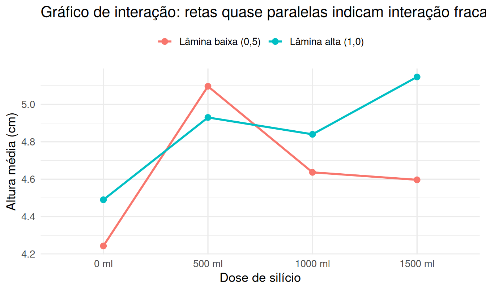
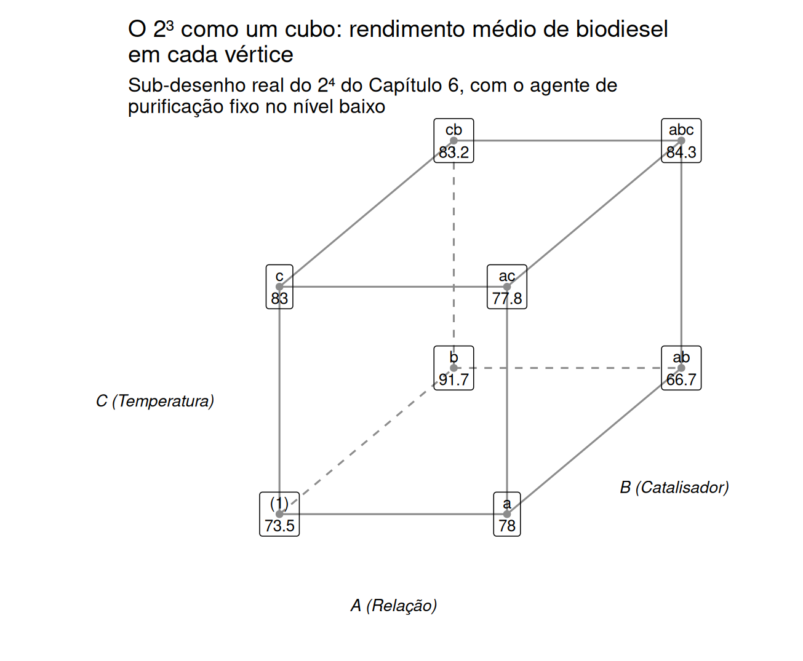
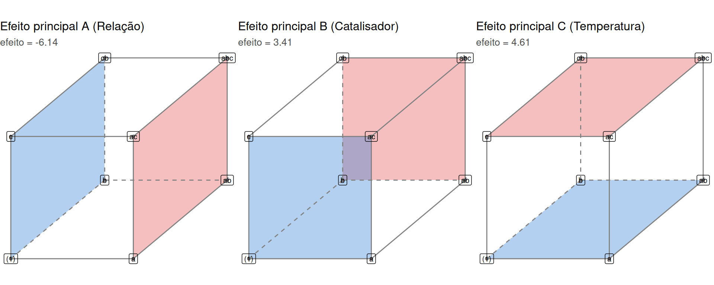
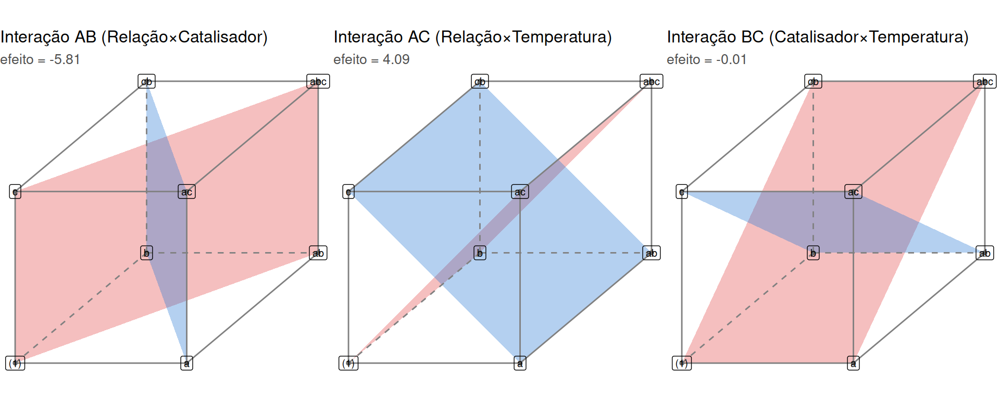
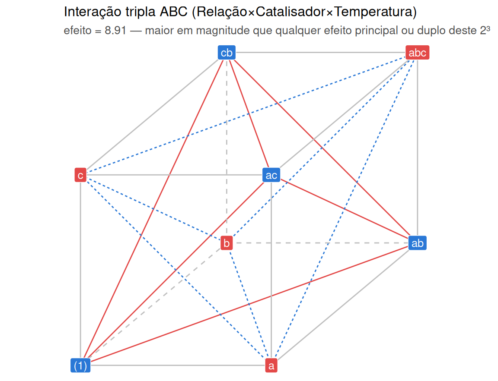
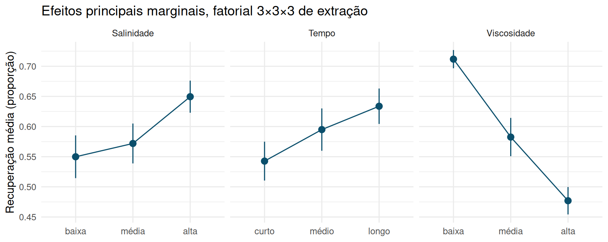
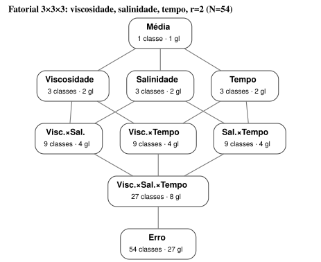
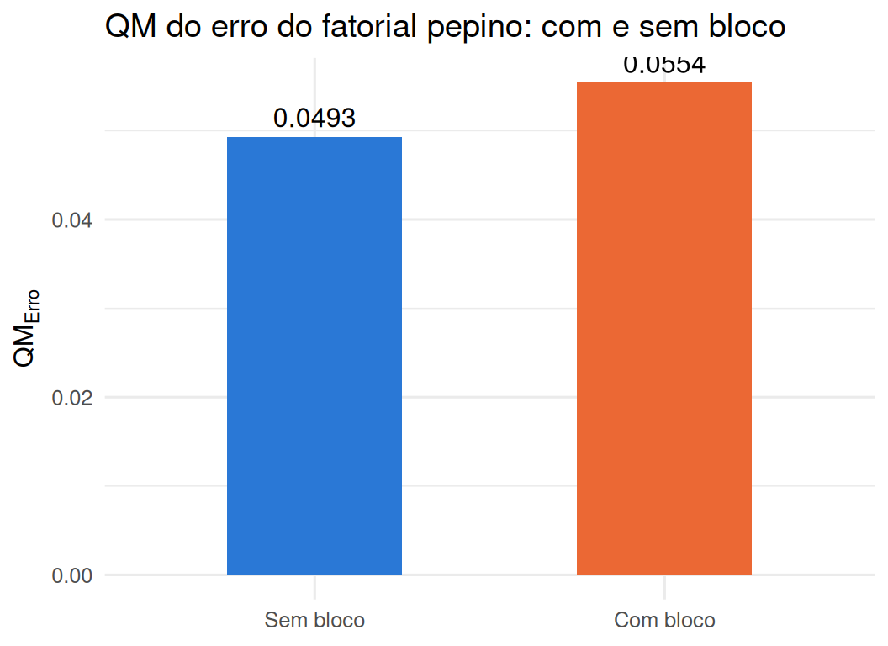

# Delineamentos com arranjos fatoriais {#fatoriais}


Até aqui, cada capítulo tratou de **um único fator de tratamento** — a técnica de estudo, o
método de ensino, o algoritmo de recomendação — ainda que sob desenhos crescentemente
sofisticados para controlar o erro experimental (blocos, quadrados latinos). Mas a maioria das
perguntas de pesquisa interessantes envolve *várias* variáveis que podem afetar a resposta
simultaneamente, e frequentemente o interesse não está apenas em cada uma isoladamente, mas em
**como elas interagem**. Este capítulo introduz o **arranjo fatorial**: em vez de rodar um
experimento por fator, cruzamos todos os níveis de todos os fatores em um único desenho.

**Uma nota sobre notação.** Os Capítulos 3 e 4 escreveram o efeito de tratamento como $\tau_i$,
porque havia apenas **um** fator em jogo. A partir daqui, com múltiplos fatores cruzados, trocamos
essa notação por $\alpha_i, \beta_j, \gamma_k, \dots$ — uma letra grega por fator — seguindo a
convenção usual para desenhos fatoriais [@montgomery2017design; @dean2017design]: $\tau$ seria
ambíguo assim que há mais de um fator, porque não indicaria a qual deles o índice pertence. A
mudança é só de rótulo, não de conceito — $\alpha_i$ desempenha, para o fator $A$, exatamente o
mesmo papel que $\tau_i$ desempenhava no Capítulo 3 para o único fator do DCA. A sistematização
completa desse arranjo — o que hoje chamamos de "delineamento fatorial" — é obra de Fisher e,
sobretudo, de Yates, que formalizou a análise e a notação de sinais $(1), a, b, ab, \dots$ que
usaremos ao longo deste capítulo e do próximo [@yates1937design].

## Por que cruzar fatores? {#por-que-fatorial}

Suponha que uma equipe queira saber se a viscosidade de um solvente e a salinidade de uma solução
afetam a recuperação de um composto volátil em um processo de extração de laboratório. A
estratégia ingênua — "um fator de cada vez" (*one factor at a time*, OFAT) — fixaria a salinidade
em um valor de referência, variaria só a viscosidade, escolheria o "melhor" nível, e só depois
variaria a salinidade mantendo fixa a viscosidade "vencedora". Essa estratégia tem dois problemas
sérios [@boxhunterhunter2005; @montgomery2017design]:

1. **Não detecta interação.** Se o efeito da viscosidade depende do nível de salinidade (e
   vice-versa), o OFAT pode convergir para uma combinação que está longe do ótimo real, porque
   nunca observa as combinações que revelariam a dependência mútua.
2. **É estatisticamente ineficiente.** Um fatorial completo com o mesmo número total de unidades
   experimentais estima os efeitos de **todos** os fatores com a mesma precisão que um
   experimento de um único fator dedicado inteiramente a cada um — sem custo adicional. Esse é,
   literalmente, o argumento com que Fisher introduziu o desenho fatorial: cada unidade
   experimental participa, ao mesmo tempo, de uma comparação de $A$ e de uma comparação de $B$, de
   modo que o fatorial produz o equivalente a uma "réplica oculta" de cada fator dentro do
   experimento do outro [@fisher1935design].

```{=html}
<div class="caixa-aplicacao">
<strong>Aplicação — Agricultura: irrigação e silício na altura do pepino</strong><br>
Um experimento agronômico testa dois fatores sobre a altura de plantas de pepino (<em>Cucumis
sativus</em>): a lâmina de <strong>irrigação</strong> (<code>riego</code>, dois níveis: 0,5 e 1,0,
em unidades relativas da lâmina de referência) e a <strong>dose de silício</strong> aplicada ao
solo (<code>silicio</code>, quatro níveis: 0, 500, 1000 e 1500 mL de solução por parcela). Todas
as $2 \times 4 = 8$ combinações de níveis foram testadas, com três repetições cada
(24 parcelas ao todo).
</div>
```

## O fatorial A×B: efeitos principais e interação {#modelo-axb}

Sejam dois fatores, $A$ com $a$ níveis e $B$ com $b$ níveis, cruzados em um desenho balanceado com
$r$ repetições por combinação. O modelo de efeitos fixos é

$$
y_{ijk} = \mu + \alpha_i + \beta_j + (\alpha\beta)_{ij} + \varepsilon_{ijk}, \qquad
\begin{aligned}
&i = 1, \dots, a,\\
&j = 1, \dots, b,\\
&k = 1, \dots, r,
\end{aligned}
$$

com $\varepsilon_{ijk} \stackrel{iid}{\sim} N(0, \sigma^2)$ e as restrições usuais de
identificabilidade $\sum_i \alpha_i = 0$, $\sum_j \beta_j = 0$, $\sum_i (\alpha\beta)_{ij} = 0$
para todo $j$, e $\sum_j (\alpha\beta)_{ij} = 0$ para todo $i$. Os termos têm interpretação direta:

- $\alpha_i$: **efeito principal** de $A$ — o desvio médio do nível $i$ de $A$ em relação à média
  geral, calculado *marginalizando* sobre todos os níveis de $B$.
- $\beta_j$: efeito principal de $B$, analogamente.
- $(\alpha\beta)_{ij}$: **efeito de interação** — o quanto a combinação $(i,j)$ se desvia do que
  se esperaria apenas somando os efeitos principais $\alpha_i + \beta_j$. Interação diferente de
  zero significa que **o efeito de $A$ muda conforme o nível de $B$** (e vice-versa): as retas que
  ligam as médias de $A$ dentro de cada nível de $B$ deixam de ser paralelas.

**Uma leitura causal.** Sob a estrutura potencial-outcomes [@imbensrubin2015], e sob a restrição
soma-zero $\sum_i \alpha_i = 0$, o parâmetro $\alpha_i$ é o **desvio** do nível $i$ de $A$ em
relação à média sobre os níveis de $A$ — não, por si só, um efeito causal. O objeto causal é o
**contraste** entre dois níveis:
$$
\text{ATE}(i,i') \;=\; E\!\left[Y_u(i) - Y_u(i')\right] \;=\; \alpha_i - \alpha_{i'},
$$
o efeito causal médio de receber o nível $i$ em vez do nível $i'$, *marginalizado* sobre a
distribuição de níveis de $B$ presente no experimento — uma média do efeito de $A$ que "soma
sobre" todas as condições de $B$ observadas. A distinção importa: $\alpha_i$ depende de qual
restrição de identificação se adotou (com casela de referência, $\alpha_i$ já *seria* um contraste
contra o nível de referência), ao passo que $\alpha_i - \alpha_{i'}$ é invariante — é estimável no
sentido da Seção \@ref(estimabilidade), e é por isso que o objeto causal é ele. A interação $(\alpha\beta)_{ij}$, por sua vez,
é exatamente o objeto que a literatura de inferência causal moderna chama de **heterogeneidade de
efeito de tratamento** (*treatment effect heterogeneity*, ou interação trata-tratamento quando
ambos $A$ e $B$ são manipuláveis): ela mede o quanto o efeito causal de $A$ *difere* conforme o
nível de $B$ em que é avaliado. Um efeito principal significativo com interação nula diz "o
tratamento funciona, e funciona igual em todos os subgrupos definidos por $B$"; um efeito
principal com interação forte diz "o tratamento funciona, mas seu tamanho depende de $B$" —
duas conclusões científicas e práticas muito diferentes, ainda que ambas comecem no mesmo modelo
fatorial.

```{=html}
<div class="caixa-r"><strong>Uso do R</strong> — ajustando o fatorial A×B (ignorando o bloco por
ora)</div>
```


``` r
pepino <- read_csv("data/pepino.csv", show_col_types = FALSE) %>%
  mutate(
    riego   = factor(riego, labels = c("Lâmina baixa (0,5)", "Lâmina alta (1,0)")),
    silicio = factor(silicio, levels = c("0 ml", "500 ml", "1000 ml", "1500 ml")),
    bloque  = factor(bloque)
  )

modelo_axb <- aov(altura ~ riego * silicio, data = pepino)
summary(modelo_axb)
```

```
##               Df Sum Sq Mean Sq F value   Pr(>F)    
## riego          1 0.2604  0.2604   5.283 0.035355 *  
## silicio        3 1.3872  0.4624   9.380 0.000819 ***
## riego:silicio  3 0.3883  0.1294   2.626 0.086050 .  
## Residuals     16 0.7887  0.0493                     
## ---
## Signif. codes:  0 '***' 0.001 '**' 0.01 '*' 0.05 '.' 0.1 ' ' 1
```



As retas são quase paralelas — sinal de que a interação, embora presente na tabela ($p \approx
0{,}09$), é discreta perto do nível de significância usual de 5%: o efeito da dose de silício
sobre a altura parece semelhante nas duas lâminas de irrigação, e o efeito da irrigação parece
semelhante nas quatro doses.

## Tabela de ANOVA para o fatorial A×B balanceado {#anova-axb}

A soma de quadrados total se decompõe exatamente em quatro parcelas ortogonais:

$$SQ_{Total} = SQ_A + SQ_B + SQ_{AB} + SQ_E,$$

com

$$
SQ_A = rb\sum_i (\bar{y}_{i..} - \bar{y}_{...})^2, \quad
SQ_B = ra\sum_j (\bar{y}_{.j.} - \bar{y}_{...})^2,
$$
$$
SQ_{AB} = r\sum_{i,j} (\bar{y}_{ij.} - \bar{y}_{i..} - \bar{y}_{.j.} + \bar{y}_{...})^2, \quad
SQ_E = \sum_{i,j,k} (y_{ijk} - \bar{y}_{ij.})^2.
$$

<table class="table" style="width: auto !important; margin-left: auto; margin-right: auto;">
<caption>(\#tab:tabela-anova-axb)ANOVA do fatorial A×B balanceado</caption>
 <thead>
  <tr>
   <th style="text-align:left;"> Fonte de variação </th>
   <th style="text-align:left;"> Graus de liberdade </th>
   <th style="text-align:left;"> Soma de quadrados </th>
   <th style="text-align:left;"> Quadrado médio </th>
   <th style="text-align:left;"> F </th>
  </tr>
 </thead>
<tbody>
  <tr>
   <td style="text-align:left;"> Fator A </td>
   <td style="text-align:left;"> $a-1$ </td>
   <td style="text-align:left;"> $SQ_A$ </td>
   <td style="text-align:left;"> $QM_A = SQ_A/(a-1)$ </td>
   <td style="text-align:left;"> $QM_A/QM_E$ </td>
  </tr>
  <tr>
   <td style="text-align:left;"> Fator B </td>
   <td style="text-align:left;"> $b-1$ </td>
   <td style="text-align:left;"> $SQ_B$ </td>
   <td style="text-align:left;"> $QM_B = SQ_B/(b-1)$ </td>
   <td style="text-align:left;"> $QM_B/QM_E$ </td>
  </tr>
  <tr>
   <td style="text-align:left;"> Interação A×B </td>
   <td style="text-align:left;"> $(a-1)(b-1)$ </td>
   <td style="text-align:left;"> $SQ_{AB}$ </td>
   <td style="text-align:left;"> $QM_{AB} = SQ_{AB}/[(a-1)(b-1)]$ </td>
   <td style="text-align:left;"> $QM_{AB}/QM_E$ </td>
  </tr>
  <tr>
   <td style="text-align:left;"> Erro </td>
   <td style="text-align:left;"> $ab(r-1)$ </td>
   <td style="text-align:left;"> $SQ_E$ </td>
   <td style="text-align:left;"> $QM_E = SQ_E/[ab(r-1)]$ </td>
   <td style="text-align:left;">  </td>
  </tr>
  <tr>
   <td style="text-align:left;"> Total </td>
   <td style="text-align:left;"> $abr-1$ </td>
   <td style="text-align:left;"> $SQ_{Total}$ </td>
   <td style="text-align:left;">  </td>
   <td style="text-align:left;">  </td>
  </tr>
</tbody>
</table>

**Por que o teste $F$ funciona: valor esperado dos quadrados médios.** O Capítulo 2 (Seção
\@ref(formas-quadraticas)) mostrou que uma forma quadrática $\mathbf{Y}'\mathbf{A}\mathbf{Y}$, com
$\mathbf{A}$ idempotente de posto $r$, é $\sigma^2$ vezes uma qui-quadrado com $r$ graus de
liberdade e parâmetro de não centralidade $\boldsymbol{\mu}'\mathbf{A}\boldsymbol{\mu}/\sigma^2$.
Cada uma das quatro somas de quadrados acima ($SQ_A, SQ_B, SQ_{AB}, SQ_E$) é exatamente uma forma
quadrática desse tipo — a soma de quadrados de $A$, por exemplo, usa a matriz idempotente que
projeta sobre a direção dos efeitos de $A$ dentro do espaço-coluna de $\mathbf{X}$ (Seção
\@ref(matriz-axb)). Isso permite calcular o valor esperado de cada quadrado médio sem depender de
nenhuma simulação:

<table class="table" style="width: auto !important; margin-left: auto; margin-right: auto;">
<caption>(\#tab:tabela-eqm-axb)Esperança dos quadrados médios do fatorial A×B (efeitos fixos)</caption>
 <thead>
  <tr>
   <th style="text-align:left;"> Quadrado médio </th>
   <th style="text-align:left;"> Valor esperado </th>
  </tr>
 </thead>
<tbody>
  <tr>
   <td style="text-align:left;"> $QM_A$ </td>
   <td style="text-align:left;"> $\sigma^2 + \dfrac{rb\sum_i \alpha_i^2}{a-1}$ </td>
  </tr>
  <tr>
   <td style="text-align:left;"> $QM_B$ </td>
   <td style="text-align:left;"> $\sigma^2 + \dfrac{ra\sum_j \beta_j^2}{b-1}$ </td>
  </tr>
  <tr>
   <td style="text-align:left;"> $QM_{AB}$ </td>
   <td style="text-align:left;"> $\sigma^2 + \dfrac{r\sum_{i,j} (\alpha\beta)_{ij}^2}{(a-1)(b-1)}$ </td>
  </tr>
  <tr>
   <td style="text-align:left;"> $QM_E$ </td>
   <td style="text-align:left;"> $\sigma^2$ </td>
  </tr>
</tbody>
</table>

Cada linha tem a mesma estrutura: $\sigma^2$ (o que $QM_E$ estima sozinho) mais um termo
não negativo que só se anula quando o efeito correspondente é identicamente zero. É exatamente
essa estrutura que justifica usar $QM_E$ como denominador comum dos três testes $F$: sob
$H_0: \alpha_i = 0\ \forall i$, por exemplo, $E[QM_A] = E[QM_E] = \sigma^2$ e a razão $QM_A/QM_E$
segue uma $F$ central; sob a alternativa, o numerador de $E[QM_A]$ cresce com a soma dos quadrados
dos $\alpha_i$, deslocando a distribuição de $F$ para a direita (não centralidade) e aumentando a
chance de rejeitar $H_0$ — a mesma lógica de poder já usada no Capítulo 3 (Seção
\@ref(numero-replicas-dca)), agora com três parâmetros de não centralidade em jogo simultaneamente
em vez de um só.

Note que, diferentemente de um DCA de um único fator, o fatorial A×B testa **três hipóteses**
com um único conjunto de dados: $H_0: \alpha_i = 0\ \forall i$ (nenhum efeito de $A$),
$H_0: \beta_j = 0\ \forall j$ (nenhum efeito de $B$) e $H_0: (\alpha\beta)_{ij} = 0\ \forall i,j$
(nenhuma interação) — todas usando o mesmo $QM_E$ como denominador, o que é exatamente a
eficiência estatística mencionada na Seção \@ref(por-que-fatorial). Na prática, a convenção é
examinar primeiro a interação: se ela for relevante, interpretar os efeitos principais isolados
pode ser enganoso, e a análise deve reportar as médias de célula (combinação $i,j$) diretamente.

### Quando as células não têm o mesmo tamanho: somas de quadrados Tipo I, II e III {#tipos-sq}

A decomposição exata $SQ_{Total} = SQ_A+SQ_B+SQ_{AB}+SQ_E$ da seção anterior depende de uma
suposição que ficou implícita: **o mesmo número $r$ de réplicas em toda casela** $(i,j)$. Sob
balanceamento, as colunas de $\mathbf{X}$ associadas a $A$, a $B$ e à interação são ortogonais
entre si (a mesma ideia da Seção \@ref(matriz-axb) do fatorial $2^k$, agora para um A×B geral) —
$SQ_A$ mede exatamente a mesma coisa, seja $A$ ajustado sozinho ou na presença de $B$. Quando as
caselas têm tamanhos diferentes — a norma, não a exceção, em dados que não vêm de um experimento
de campo cuidadosamente balanceado (tráfego real de um teste A/B, perda de observações,
inscrição voluntária) —, essa ortogonalidade se perde: as colunas de $A$ e de $B$ passam a ser
correlacionadas, e "o quanto $A$ explica" passa a depender de **o que mais já está no modelo**
[@speedhockinghackney1978]. Três convenções resolvem essa ambiguidade de formas diferentes:

- **Tipo I (sequencial):** cada termo é testado ajustado só pelos termos que entraram **antes**
  dele no modelo, na ordem em que foram escritos. $SQ_A$ ignora $B$; $SQ_B$ já ajusta para $A$;
  $SQ_{AB}$ ajusta para ambos. Consequência direta: **a ordem em que os fatores são escritos na
  fórmula muda o resultado** — `aov(y ~ A*B)` e `aov(y ~ B*A)` dão $SQ_A$ e $SQ_B$ diferentes
  (a soma dos quatro termos continua igual a $SQ_{Total}$ em qualquer ordem, só a divisão entre
  $A$ e $B$ muda). É o padrão de `aov()`/`anova()` no R.
- **Tipo II:** cada efeito principal é ajustado pelo **outro** efeito principal, mas não pela
  interação — simétrico em $A$ e $B$ (não depende de ordem), sob a suposição de que a interação
  é desprezível o bastante para não "roubar" variação dos efeitos principais.
- **Tipo III (marginal):** cada termo é ajustado por **todos** os outros, incluindo a interação —
  a mais conservadora e a única que testa exatamente as mesmas hipóteses
  $H_0: \alpha_i=0\ \forall i$ etc. do caso balanceado, mesmo com interação presente. Exige
  **contrastes de soma zero** (`options(contrasts = c("contr.sum", "contr.poly"))` no R) — com a
  parametrização padrão do R (`contr.treatment`), o teste Tipo III do "efeito principal" testa uma
  combinação que depende de qual nível é a referência, não o que o pesquisador normalmente quer
  dizer por "efeito de $A$".

```{=html}
<div class="caixa-aplicacao">
<strong>Aplicação — Ciência de dados: teste A/B/n com tráfego desigual</strong><br>
Uma loja testa <strong>layout</strong> (Lista/Grade) × <strong>desconto exibido</strong>
(Sim/Não) sobre o tempo de permanência na página (s). Diferente de um experimento de campo, o
tráfego real não se divide em partes iguais entre as quatro combinações — a tabela abaixo mostra
tamanhos de casela desiguais (30 a 70 sessões), a situação típica de um teste A/B em produção.
</div>
```


``` r
set.seed(2026)
n_celula <- c(Lista_Nao = 40, Lista_Sim = 55, Grade_Nao = 30, Grade_Sim = 70)
media_celula <- c(Lista_Nao = 42, Lista_Sim = 47, Grade_Nao = 44, Grade_Sim = 53)

dados_desbal <- map2_dfr(n_celula, media_celula, ~ tibble(tempo = rnorm(.x, .y, 8)),
                         .id = "celula") %>%
  separate(celula, into = c("layout", "desconto"), sep = "_") %>%
  mutate(layout = factor(layout, labels = c("Grade", "Lista")),
         desconto = factor(desconto, labels = c("Nao", "Sim")))

table(dados_desbal$layout, dados_desbal$desconto)
```

```
##        
##         Nao Sim
##   Grade  30  70
##   Lista  40  55
```


``` r
summary(aov(tempo ~ layout * desconto, data = dados_desbal))   # layout primeiro
```

```
##                  Df Sum Sq Mean Sq F value   Pr(>F)    
## layout            1   2332  2332.0  37.974 4.16e-09 ***
## desconto          1   2511  2510.8  40.886 1.21e-09 ***
## layout:desconto   1    451   450.9   7.342  0.00735 ** 
## Residuals       191  11729    61.4                     
## ---
## Signif. codes:  0 '***' 0.001 '**' 0.01 '*' 0.05 '.' 0.1 ' ' 1
```

``` r
summary(aov(tempo ~ desconto * layout, data = dados_desbal))   # desconto primeiro
```

```
##                  Df Sum Sq Mean Sq F value   Pr(>F)    
## desconto          1   3114  3113.5  50.700 2.13e-11 ***
## layout            1   1729  1729.3  28.159 3.08e-07 ***
## desconto:layout   1    451   450.9   7.342  0.00735 ** 
## Residuals       191  11729    61.4                     
## ---
## Signif. codes:  0 '***' 0.001 '**' 0.01 '*' 0.05 '.' 0.1 ' ' 1
```

$SQ_{\text{layout}}$ e $SQ_{\text{desconto}}$ mudam de fato conforme a ordem — exatamente o
sintoma da falta de ortogonalidade. Nos dois casos, $SQ_{AB}$ (a interação) é idêntico, porque a
interação é sempre o último termo a entrar, ajustado por tudo o resto em qualquer ordem.

```{=html}
<div class="caixa-r"><strong>Uso do R</strong> — Tipo II e Tipo III com <code>car::Anova()</code></div>
```


``` r
contrastes_originais <- options("contrasts")           # preserva o default do capitulo
options(contrasts = c("contr.sum", "contr.poly"))      # exigido para Tipo III fazer sentido
modelo_desbal <- lm(tempo ~ layout * desconto, data = dados_desbal)

car::Anova(modelo_desbal, type = "II")
```

```
## Anova Table (Type II tests)
## 
## Response: tempo
##                  Sum Sq  Df F value    Pr(>F)    
## layout           1729.3   1 28.1595 3.079e-07 ***
## desconto         2510.8   1 40.8856 1.210e-09 ***
## layout:desconto   450.9   1  7.3418   0.00735 ** 
## Residuals       11729.4 191                      
## ---
## Signif. codes:  0 '***' 0.001 '**' 0.01 '*' 0.05 '.' 0.1 ' ' 1
```

``` r
car::Anova(modelo_desbal, type = "III")
```

```
## Anova Table (Type III tests)
## 
## Response: tempo
##                 Sum Sq  Df   F value    Pr(>F)    
## (Intercept)     380434   1 6194.9229 < 2.2e-16 ***
## layout            1143   1   18.6178 2.560e-05 ***
## desconto          2610   1   42.4968 6.153e-10 ***
## layout:desconto    451   1    7.3418   0.00735 ** 
## Residuals        11729 191                        
## ---
## Signif. codes:  0 '***' 0.001 '**' 0.01 '*' 0.05 '.' 0.1 ' ' 1
```

``` r
options(contrastes_originais)   # restaura imediatamente -- nao deve vazar para as secoes seguintes
```

O Tipo II dá exatamente $SQ_{\text{layout}}=$ 1729.3
(o mesmo valor de quando `layout` entra **depois** de `desconto` no Tipo I) e
$SQ_{\text{desconto}}=$ 2510.8
— cada um ajustado pelo outro, nenhum pela interação, e por isso independente da ordem de escrita.
O Tipo III muda de novo (ajusta também pela interação), e é o único dos três cuja soma de
quadrados de `layout`/`desconto` não bate com nenhuma das duas linhas de Tipo I acima.

Recomendação prática, seguindo a literatura sobre o tema [@langsrud2003]: olhar a interação
primeiro; se ela for desprezível, o Tipo II é preferível ao III (mais poder, mesma interpretação
de "efeito principal médio"); se a interação for relevante, nenhum teste de efeito principal —
de nenhum tipo — costuma responder a pergunta certa, e a análise deve reportar as médias de
célula diretamente (a mesma recomendação da seção anterior, agora reforçada pelo caso
desbalanceado). Delineamentos de campo bem balanceados evitam esse problema por construção — mais
uma razão prática para preferir balanceamento sempre que o custo do experimento permitir.

## Notação matricial do fatorial A×B {#matriz-axb}

O Capítulo 2 escreveu todo modelo linear como $\mathbf{Y} = \mathbf{X}\boldsymbol{\beta} +
\boldsymbol{\varepsilon}$ e definiu a matriz de projeção $\mathbf{P}_X =
\mathbf{X}(\mathbf{X}'\mathbf{X})^{-1}\mathbf{X}'$ (Seção \@ref(matriz-projecao)). O fatorial A×B
é um caso particular dessa estrutura geral, e vale a pena tornar explícito **como** a matriz
$\mathbf{X}$ se monta a partir dos dois fatores. Usando **codificação de casela de referência**
(`contr.treatment`, o padrão do R: colunas indicadoras de cada fator com um nível omitido, que
passa a ser a referência — não confundir com a **codificação de efeito**, `contr.sum`, o esquema
$\pm1$ soma-zero que corresponde às restrições de identificação da Seção \@ref(modelo-axb)),
sejam $\mathbf{X}_A$ (dimensão $n \times
(a-1)$) e $\mathbf{X}_B$ (dimensão $n \times (b-1)$) as submatrizes que codificam os efeitos
principais de $A$ e $B$. A matriz completa do fatorial A×B é o bloco

$$
\mathbf{X} = \big[\, \mathbf{1} \ \big|\ \mathbf{X}_A \ \big|\ \mathbf{X}_B \ \big|\
\mathbf{X}_A \odot \mathbf{X}_B \,\big],
$$

em que $\mathbf{X}_A \odot \mathbf{X}_B$ denota a matriz cujas colunas são **todos os produtos
elemento a elemento** (produto de Hadamard) entre uma coluna de $\mathbf{X}_A$ e uma coluna de
$\mathbf{X}_B$ — exatamente $(a-1)(b-1)$ colunas, o mesmo número de graus de liberdade da
interação na Seção \@ref(anova-axb). Esta não é uma analogia: é **literalmente** como
`model.matrix()` constrói uma coluna de interação no R.

```{=html}
<div class="caixa-r"><strong>Uso do R</strong> — a coluna de interação é o produto das colunas
principais</div>
```


``` r
X <- model.matrix(~ riego * silicio, data = pepino)
colnames(X)
```

```
## [1] "(Intercept)"                          
## [2] "riegoLâmina alta (1,0)"               
## [3] "silicio500 ml"                        
## [4] "silicio1000 ml"                       
## [5] "silicio1500 ml"                       
## [6] "riegoLâmina alta (1,0):silicio500 ml" 
## [7] "riegoLâmina alta (1,0):silicio1000 ml"
## [8] "riegoLâmina alta (1,0):silicio1500 ml"
```

``` r
# A coluna de interação é, por construção, o produto elemento a elemento
# das duas colunas principais correspondentes:
identical(
  X[, "riegoLâmina alta (1,0):silicio500 ml"],
  X[, "riegoLâmina alta (1,0)"] * X[, "silicio500 ml"]
)
```

```
## [1] TRUE
```

Essa forma de bloco tem uma consequência importante para a Seção \@ref(anova-axb): o teste de
interação é, em termos do Capítulo 2 (Seção \@ref(modelo-particionado)), exatamente a comparação
entre o modelo reduzido $\mathbf{X}_1 = [\mathbf{1}\ |\ \mathbf{X}_A\ |\ \mathbf{X}_B]$ (só efeitos
principais) e o modelo completo $\mathbf{X} = [\mathbf{X}_1\ |\ \mathbf{X}_2]$, com
$\mathbf{X}_2 = \mathbf{X}_A \odot \mathbf{X}_B$ — a mesma lógica de $F = \dfrac{(SQE_{reduzido} -
SQE_{completo})/p_2}{QM_{E,\,completo}}$ usada para testar qualquer bloco de colunas em um modelo
linear geral, agora aplicada especificamente ao bloco de colunas de interação.

## Fatoriais A×B×C: interações duplas e tripla {#axbxc}

Com três fatores $A$, $B$, $C$ (níveis $a$, $b$, $c$) e $r$ repetições, o modelo se estende
naturalmente:

$$
y_{ijkl} = \mu + \alpha_i + \beta_j + \gamma_k
+ (\alpha\beta)_{ij} + (\alpha\gamma)_{ik} + (\beta\gamma)_{jk}
+ (\alpha\beta\gamma)_{ijk} + \varepsilon_{ijkl}.
$$

Surge um novo tipo de termo: a **interação tripla** $(\alpha\beta\gamma)_{ijk}$. Sua
interpretação é um nível acima da interação dupla — ela mede se **a interação entre dois fatores
muda conforme o nível do terceiro**. Por exemplo, se a interação viscosidade×salinidade for forte
quando o tempo de exposição é curto, mas quase nula quando o tempo é longo, há interação tripla.
Interações triplas costumam ser mais difíceis de interpretar e, na prática, mais raras de serem
grandes o suficiente para serem detectadas — mas ignorá-las sem testar é um erro de análise.

### O cubo do $2^3$: visualizando efeitos principais, duplos e triplo {#cubo-2x2x2}

Antes de tratar o fatorial $3\times3\times3$ completo da próxima aplicação, vale construir
intuição geométrica com o caso mais simples possível de três fatores cruzados: um $2\times2\times2$
($2^3$), em que cada fator tem só dois níveis. Cada um dos $2^3=8$ tratamentos corresponde a um
**vértice de um cubo** — os três eixos do cubo são os três fatores, e cada aresta liga dois
tratamentos que diferem em exatamente um fator. O Capítulo 6 (Seção \@ref(fatoriais-2k)) trata
fatoriais $2^k$ em profundidade; aqui adiantamos só a leitura geométrica, com dados reais. A
representação do $2^k$ como um cubo (ou hipercubo, para $k>3$) cujos vértices são os tratamentos é
o dispositivo visual clássico da literatura de fatoriais [@boxhunterhunter2005; @yates1937design],
e a notação de cada vértice — $(1)$ para a combinação de níveis baixos, letras minúsculas para
indicar quais fatores estão no nível alto — é exatamente a notação de sinais introduzida por Yates.

Em vez de simular dados fictícios, recortamos um sub-desenho real de dentro do fatorial $2^4$ de
biodiesel que será analisado por completo no Capítulo 6: fixamos o agente de purificação
(`Agente`) no nível baixo e mantemos os outros três fatores — razão molar ($A$ = `Relacion`),
catalisador ($B$ = `Catalizador`) e temperatura ($C$ = `Temperatura`) — com suas duas repetições
cada, totalizando 16 corridas.




Cada vértice mostra o tratamento (notação de Yates [@yates1937design]) e o rendimento médio
observado nas duas repetições. Já dá para notar, a olho, que os vértices não seguem um padrão simples: o vértice `b`
(91,7) é bem mais alto que seus vizinhos `(1)` (73,5) e `ab` (66,7) — um primeiro sinal visual de
que a superfície de resposta sobre o cubo não é "plana" (efeitos puramente aditivos).

**Efeitos principais como faces do cubo.** O efeito principal de um fator é a diferença entre a
média da face "alta" e da face "baixa" desse fator — geometricamente, as duas faces retangulares
opostas do cubo:



**Interações duplas como planos diagonais.** A interação $AB$ compara a diferença $B_+-B_-$
calculada dentro de $A_+$ com a mesma diferença dentro de $A_-$ — geometricamente, dois planos
diagonais que cruzam o cubo (cada um ligando quatro vértices alternados):



Os dois planos de cada painel se cruzam no centro do cubo — visualmente, é exatamente essa
sobreposição que corresponde a um efeito de interação não nulo: se as duas faixas coloridas
fossem, em vez disso, faces opostas e paralelas (como nos efeitos principais acima), a interação
seria zero por construção.

**A interação tripla.** Não existe mais um "plano" simples de duas cores para representar $ABC$
— em vez disso, os oito vértices se dividem em dois grupos de quatro, alternados, que formam dois
tetraedros entrelaçados dentro do cubo:



Neste sub-desenho real, a interação tripla ($8.91$) já é **maior em
magnitude** do que qualquer um dos seis efeitos principais e duplos — um preview exato do que a
ANOVA completa do fatorial $2^4$ vai confirmar formalmente no Capítulo 6 (Seção
\@ref(fatoriais-2k)), com os quatro fatores e teste de significância. A leitura geométrica não
substitui o teste formal, mas explica *por que* uma interação tripla grande é, à primeira vista,
contraintuitiva: não há uma única "direção" no cubo — como uma face ou um plano diagonal — que a
represente sozinha, só a alternância entre os dois tetraedros.

```{=html}
<div class="caixa-aplicacao">
<strong>Aplicação — Ciência de dados/Engenharia: otimizando um processo de extração como um
teste A/B/n de três fatores</strong><br>
Uma equipe de laboratório trata a otimização de um processo de recuperação de um composto
volátil exatamente como uma equipe de produto trataria um teste A/B/n multivariado (também
chamado teste fatorial online; Kohavi, Tang &amp; Xu, 2020): em vez de dois braços
(A vs. B), há <strong>três fatores de configuração</strong> cruzados, cada um com três níveis —
viscosidade do solvente (<code>baixa</code>/<code>média</code>/<code>alta</code>), salinidade da
solução (<code>baixa</code>/<code>média</code>/<code>alta</code>) e tempo de exposição
(<code>curto</code>/<code>médio</code>/<code>longo</code>) — totalizando
$3\times3\times3=27$ combinações, cada uma executada em duas injeções independentes
(repetições), 54 corridas ao todo. A resposta é a proporção do composto recuperado.
</div>
```

```{=html}
<div class="caixa-r"><strong>Uso do R</strong> — ANOVA do fatorial 3×3×3 com repetição</div>
```


``` r
acuosas <- read_csv("data/acuosas.csv", show_col_types = FALSE) %>%
  transmute(
    viscosidade = factor(Viscosidad, labels = c("baixa", "média", "alta")),
    salinidade  = factor(Salinidad,  labels = c("baixa", "média", "alta")),
    tempo       = factor(Tiempo,     labels = c("curto", "médio", "longo")),
    injecao     = factor(inyeccion),
    recuperacao = recupera
  )

modelo_axbxc <- aov(recuperacao ~ viscosidade * salinidade * tempo, data = acuosas)
summary(modelo_axbxc)
```

```
##                              Df Sum Sq Mean Sq F value   Pr(>F)    
## viscosidade                   2 0.4981 0.24906  34.680 3.47e-08 ***
## salinidade                    2 0.0986 0.04930   6.865  0.00389 ** 
## tempo                         2 0.0751 0.03757   5.231  0.01202 *  
## viscosidade:salinidade        4 0.0388 0.00969   1.350  0.27736    
## viscosidade:tempo             4 0.0048 0.00119   0.166  0.95404    
## salinidade:tempo              4 0.0501 0.01252   1.743  0.16974    
## viscosidade:salinidade:tempo  8 0.0753 0.00941   1.311  0.28001    
## Residuals                    27 0.1939 0.00718                     
## ---
## Signif. codes:  0 '***' 0.001 '**' 0.01 '*' 0.05 '.' 0.1 ' ' 1
```

Os três efeitos principais são estatisticamente significativos ($p < 0{,}05$ para os três), mas
**nenhuma das interações — duplas ou tripla — é significativa** neste conjunto de dados. Isso é
uma conclusão substantiva importante, não um resultado "nulo" sem interesse: significa que os
três fatores atuam de forma aproximadamente **aditiva** sobre a recuperação, e que otimizar cada
um isoladamente (ao contrário do que a Seção \@ref(por-que-fatorial) alertou em geral) levaria,
neste caso específico, a uma conclusão muito parecida com a do fatorial completo — algo que só
podemos afirmar com confiança *depois* de testar a interação, nunca antes.

<table class="table" style="width: auto !important; margin-left: auto; margin-right: auto;">
<caption>(\#tab:acuosas-medias)Médias marginais por fator (fatorial 3×3×3 do processo de extração)</caption>
 <thead>
  <tr>
   <th style="text-align:left;"> fator </th>
   <th style="text-align:left;"> nível </th>
   <th style="text-align:right;"> recuperação_média </th>
  </tr>
 </thead>
<tbody>
  <tr>
   <td style="text-align:left;vertical-align: top !important;" rowspan="3"> Viscosidade </td>
   <td style="text-align:left;"> baixa </td>
   <td style="text-align:right;"> 0.712 </td>
  </tr>
  <tr>
   
   <td style="text-align:left;"> média </td>
   <td style="text-align:right;"> 0.583 </td>
  </tr>
  <tr>
   
   <td style="text-align:left;"> alta </td>
   <td style="text-align:right;"> 0.477 </td>
  </tr>
  <tr>
   <td style="text-align:left;vertical-align: top !important;" rowspan="3"> Salinidade </td>
   <td style="text-align:left;"> baixa </td>
   <td style="text-align:right;"> 0.550 </td>
  </tr>
  <tr>
   
   <td style="text-align:left;"> média </td>
   <td style="text-align:right;"> 0.572 </td>
  </tr>
  <tr>
   
   <td style="text-align:left;"> alta </td>
   <td style="text-align:right;"> 0.650 </td>
  </tr>
  <tr>
   <td style="text-align:left;vertical-align: top !important;" rowspan="3"> Tempo </td>
   <td style="text-align:left;"> curto </td>
   <td style="text-align:right;"> 0.543 </td>
  </tr>
  <tr>
   
   <td style="text-align:left;"> médio </td>
   <td style="text-align:right;"> 0.595 </td>
  </tr>
  <tr>
   
   <td style="text-align:left;"> longo </td>
   <td style="text-align:right;"> 0.634 </td>
  </tr>
</tbody>
</table>

A recuperação **diminui** com o aumento da viscosidade (0,712 → 0,477) — solventes mais viscosos
dificultam a transferência de massa — e **aumenta** discretamente com salinidade e tempo de
exposição. Como as interações não são relevantes, essas três tendências marginais já resumem bem
o comportamento do processo.

<div class="figure" style="text-align: center">

<p class="caption">(\#fig:plot-acuosas-marginais)Recuperação média marginal de cada fator do fatorial 3x3x3, com barra de erro-padrão. Como nenhuma interação é significativa, estas três tendências isoladas já descrevem quase todo o comportamento do processo.</p>
</div>

O painel deixa visível, lado a lado, o que a tabela de médias descreveu em prosa: a reta de
viscosidade cai monotonicamente, enquanto salinidade e tempo sobem de forma mais discreta e quase
linear. As barras de erro-padrão são pequenas em relação às diferenças entre níveis — consistente
com os três efeitos principais significativos da ANOVA — e a ausência de qualquer "dobra" abrupta
dentro de cada painel é o retrato visual da aditividade: cada fator parece empurrar a recuperação
na mesma direção, ao longo de toda a faixa observada, independentemente do nível dos outros dois.

### O diagrama de Hasse do fatorial 3×3×3 {#hasse-axbxc}

A Seção \@ref(hasse) (Capítulo 2) introduziu o diagrama de Hasse para um DCA de um fator e para um
fatorial $A{\times}B$ de dois fatores; o desenho de extração acima — três fatores cruzados, cada um
com $3$ níveis, $r=2$ injeções por combinação, $N = 3\times3\times3\times2 = 54$ — é o primeiro
exemplo deste livro com **três** fatores cruzados, e vale formalizar sua estrutura antes de seguir
para os fatoriais $2^k$ do Capítulo 6, em que diagramas com quatro e mais fatores serão a norma.

```{=html}
<div class="caixa-r"><strong>Uso do R</strong> — diagrama de Hasse do fatorial 3×3×3 de extração</div>
```


``` r
nos_axbxc <- tibble(
  termo   = c("Média", "Viscosidade", "Salinidade", "Tempo",
              "Visc.×Sal.", "Visc.×Tempo", "Sal.×Tempo",
              "Visc.×Sal.×Tempo", "Erro"),
  # classes = numero de combinacoes distintas que o termo distingue
  classes = c(1, 3, 3, 3,
              3 * 3, 3 * 3, 3 * 3,
              3 * 3 * 3, 54)
)

arestas_axbxc <- tibble(
  de   = c("Média", "Média", "Média",
           "Viscosidade", "Salinidade",
           "Viscosidade", "Tempo",
           "Salinidade", "Tempo",
           "Visc.×Sal.", "Visc.×Tempo", "Sal.×Tempo",
           "Visc.×Sal.×Tempo"),
  para = c("Viscosidade", "Salinidade", "Tempo",
           "Visc.×Sal.", "Visc.×Sal.",
           "Visc.×Tempo", "Visc.×Tempo",
           "Sal.×Tempo", "Sal.×Tempo",
           "Visc.×Sal.×Tempo", "Visc.×Sal.×Tempo", "Visc.×Sal.×Tempo",
           "Erro")
)

knitr::include_graphics(
  hasse_svg(nos_axbxc, arestas_axbxc,
            arquivo = "figuras/hasse/axbxc.svg",
            titulo  = "Fatorial 3&#215;3&#215;3: viscosidade, salinidade, tempo, r=2 (N=54)")
)
```

<div class="figure" style="text-align: center">

<p class="caption">(\#fig:hasse-axbxc)Diagrama de Hasse do fatorial 3x3x3 de extração (viscosidade, salinidade, tempo, r=2 injeções, N=54). Os três fatores ocupam o mesmo nível (cruzados entre si); as três interações duplas refinam exatamente o par de fatores que as compõe; a interação tripla refina as três duplas simultaneamente; o Erro, na base, recebe o que sobra depois de toda a estrutura de tratamento.</p>
</div>

Os três fatores (Viscosidade, Salinidade, Tempo) aparecem lado a lado no mesmo nível do diagrama,
sem aresta entre nenhum par deles — a assinatura de fatores **cruzados**, já vista no Capítulo 2
para dois fatores e agora estendida a três. Cada interação dupla refina exatamente os dois fatores
que a compõem (Visc.×Sal. desce de Viscosidade *e* de Salinidade, nunca de Tempo), e a interação
tripla é o único nó que desce simultaneamente das três duplas — geometricamente, o único ponto do
diagrama "abaixo" de toda a estrutura de tratamento, exatamente como o cubo do $2^3$
(Seção \@ref(cubo-2x2x2)) tampouco tem uma única face ou plano que represente $ABC$ sozinho.
Aplicando a regra de subtração da Seção \@ref(hasse) ao nó da tripla: ela distingue $3\times3\times3=27$
caselas, das quais $1+2+2+2+4+4+4=19$ graus de liberdade já foram "gastos" pelos termos acima dela
no diagrama, sobrando $27-19=8=(3-1)^3$ — a mesma fórmula da interação tripla escrita algebricamente
na Seção \@ref(axbxc). Somando todos os nós, $1+2+2+2+4+4+4+8+27=54=N$: os graus de liberdade do
diagrama esgotam exatamente as $54$ observações, sem sobra e sem falta — a mesma verificação de
contabilidade que a Seção \@ref(hasse) fez para o DCA e o fatorial $A{\times}B$, agora com uma
estrutura de árvore em vez de uma cadeia ou um losango simples.

```{=html}
<div class="caixa-discussao">
<strong>Para discutir</strong>
<ol>
<li>Se a interação viscosidade×salinidade tivesse sido significativa, por que reportar apenas as
médias marginais da Tabela acima seria enganoso? O que deveria ser reportado no lugar?</li>
<li>O desenho usa duas injeções por combinação de níveis (repetição verdadeira, não submuestreo —
ver a seção sobre unidades experimentais e amostrais do Capítulo 1). O que mudaria na análise, e por que ela deixaria de ser válida, se
houvesse apenas uma corrida por combinação?</li>
<li>Uma equipe de produto testando cor do botão × layout × texto do CTA sobre a taxa de conversão
está, estruturalmente, no mesmo desenho A×B×C. Que cuidado adicional um teste A/B/n online exige
que um experimento de bancada, como este, controla mais facilmente (aleatorização, ausência de
interferência entre unidades)?</li>
</ol>
</div>
```

## Fatoriais de dois fatores em blocos completos {#fatoriais-blocos}

A Seção \@ref(modelo-axb) analisou o experimento do pepino **como se** as 24 parcelas fossem
completamente intercambiáveis — mas a variável `bloque` (três blocos de terreno) foi ignorada de
propósito, para isolar o modelo A×B primeiro. Se os blocos capturam uma fonte real e conhecida de
variação (fertilidade do solo, posição no terreno), ignorá-los desperdiça informação: a variação
entre blocos permanece dentro do erro experimental, inflando $QM_E$ e reduzindo o poder dos testes
de $A$, $B$ e $A{\times}B$ — exatamente o problema que a blocagem foi criada para resolver
(Capítulo 4).

O modelo correto para um fatorial de dois fatores em **blocos completos** (cada bloco contém
todas as $ab$ combinações de tratamento, uma vez) acrescenta um termo aditivo de bloco:

$$
y_{ijk} = \mu + \alpha_i + \beta_j + (\alpha\beta)_{ij} + \rho_k + \varepsilon_{ijk}, \qquad
k = 1, \dots, r,
$$

com $\rho_k$ o efeito fixo do $k$-ésimo bloco ($\sum_k \rho_k = 0$) e a suposição usual de que o
bloco **não interage** com os fatores de tratamento (a mesma suposição de aditividade do
delineamento em blocos completos aleatorizados do Capítulo 4). Tratar cada combinação de
tratamento do fatorial como uma "unidade de tratamento" única e blocá-la exatamente como no
Capítulo 4 é a extensão natural do DBCA a mais de um fator [@oehlert2010first]. A soma de quadrados
do erro perde $r-1$ graus de liberdade, que passam a ser explicados pelo termo de bloco:

```{=html}
<div class="caixa-r"><strong>Uso do R</strong> — o mesmo fatorial, agora com o bloco</div>
```


``` r
modelo_blocos <- aov(altura ~ bloque + riego * silicio, data = pepino)
summary(modelo_blocos)
```

```
##               Df Sum Sq Mean Sq F value  Pr(>F)   
## bloque         2 0.0128  0.0064   0.116 0.89158   
## riego          1 0.2604  0.2604   4.699 0.04791 * 
## silicio        3 1.3872  0.4624   8.343 0.00199 **
## riego:silicio  3 0.3883  0.1294   2.335 0.11807   
## Residuals     14 0.7759  0.0554                   
## ---
## Signif. codes:  0 '***' 0.001 '**' 0.01 '*' 0.05 '.' 0.1 ' ' 1
```

<table class="table" style="width: auto !important; margin-left: auto; margin-right: auto;">
<caption>(\#tab:comparacao-qme)Efeito de incluir o bloco sobre o quadrado médio do erro</caption>
 <thead>
  <tr>
   <th style="text-align:left;"> Modelo </th>
   <th style="text-align:right;"> QM do erro </th>
   <th style="text-align:right;"> gl do erro </th>
  </tr>
 </thead>
<tbody>
  <tr>
   <td style="text-align:left;"> Sem bloco (Seção 5.2) </td>
   <td style="text-align:right;"> 0.0493 </td>
   <td style="text-align:right;"> 16 </td>
  </tr>
  <tr>
   <td style="text-align:left;"> Com bloco (Seção 5.5) </td>
   <td style="text-align:right;"> 0.0554 </td>
   <td style="text-align:right;"> 14 </td>
  </tr>
</tbody>
</table>

Neste conjunto de dados específico, o bloco explica muito pouco ($SQ_{bloco} \approx 0{,}013$,
$p \approx 0{,}89$): os três blocos de terreno acabaram sendo bastante homogêneos entre si, então
"gastar" 2 graus de liberdade com eles não trouxe ganho de precisão — o $QM_E$ com bloco é, na
verdade, ligeiramente **maior** do que sem ele. Isso ilustra um ponto importante que vale a pena
enfatizar: **blocar é uma decisão que deve ser tomada a partir do conhecimento do delineamento,
antes de ver os dados**, e não uma garantia automática de ganho de precisão. Quando os blocos
correspondem a uma fonte real de heterogeneidade, o ganho costuma ser substancial (como visto no
Capítulo 4); quando não, o custo em graus de liberdade é pequeno, mas não nulo.

<div class="figure" style="text-align: center">

<p class="caption">(\#fig:plot-qme-bloco-axb)Quadrado médio do erro do fatorial pepino, com e sem o termo de bloco. A diferença mínima entre as duas barras é o retrato visual de um bloco que captura pouca heterogeneidade real.</p>
</div>

As duas barras são quase idênticas — ao contrário do ganho de eficiência claro que a blocagem
trouxe em outros exemplos do Capítulo 4, aqui incluir o bloco não reduziu (e, por este critério
ingênuo, até aumentou ligeiramente) o quadrado médio do erro, confirmando numericamente, e agora
visualmente, que os três blocos de terreno deste experimento específico não carregavam heterogeneidade
suficiente para compensar os graus de liberdade gastos com eles.

## Resumo do capítulo

- Cruzar fatores em um arranjo fatorial detecta **interação** — algo que nenhuma sequência de
  experimentos de um único fator (OFAT) consegue capturar — sem custo adicional de unidades
  experimentais.
- O modelo A×B decompõe a resposta em efeito principal de $A$, efeito principal de $B$ e
  interação $A{\times}B$; a tabela de ANOVA testa as três hipóteses com o mesmo $QM_E$.
- Com três fatores, surgem interações duplas e uma interação **tripla**, que mede se a interação
  entre dois fatores muda com o nível do terceiro.
- Um fatorial em **blocos completos** soma um termo aditivo de bloco ao modelo — útil quando os
  blocos capturam heterogeneidade real; caso contrário, apenas consome graus de liberdade.

O Capítulo 6 aprofunda o caso especial (e extremamente comum na prática) em que todos os fatores
têm exatamente dois níveis — os fatoriais $2^k$ — e as técnicas específicas para analisá-los sem
repetição, confundi-los em blocos e fracioná-los [@finney1945fractional] quando o número de
fatores é grande demais para rodar o fatorial completo.
