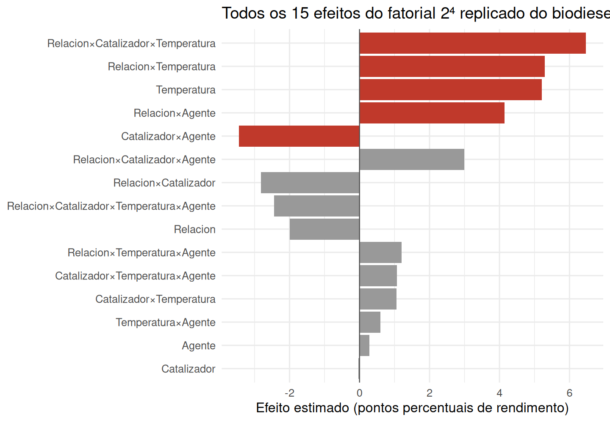
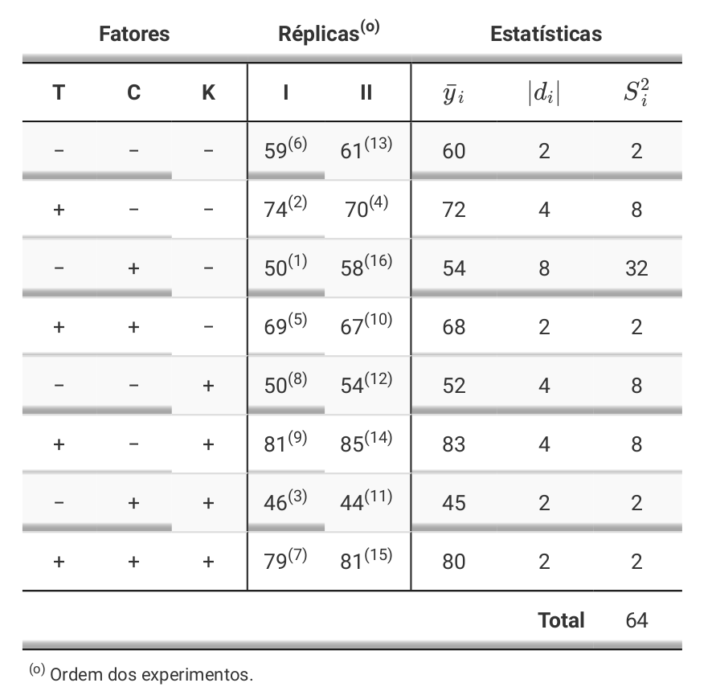
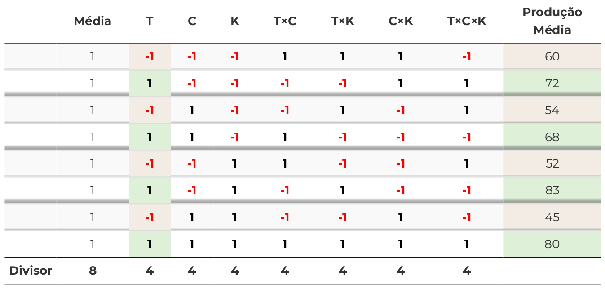
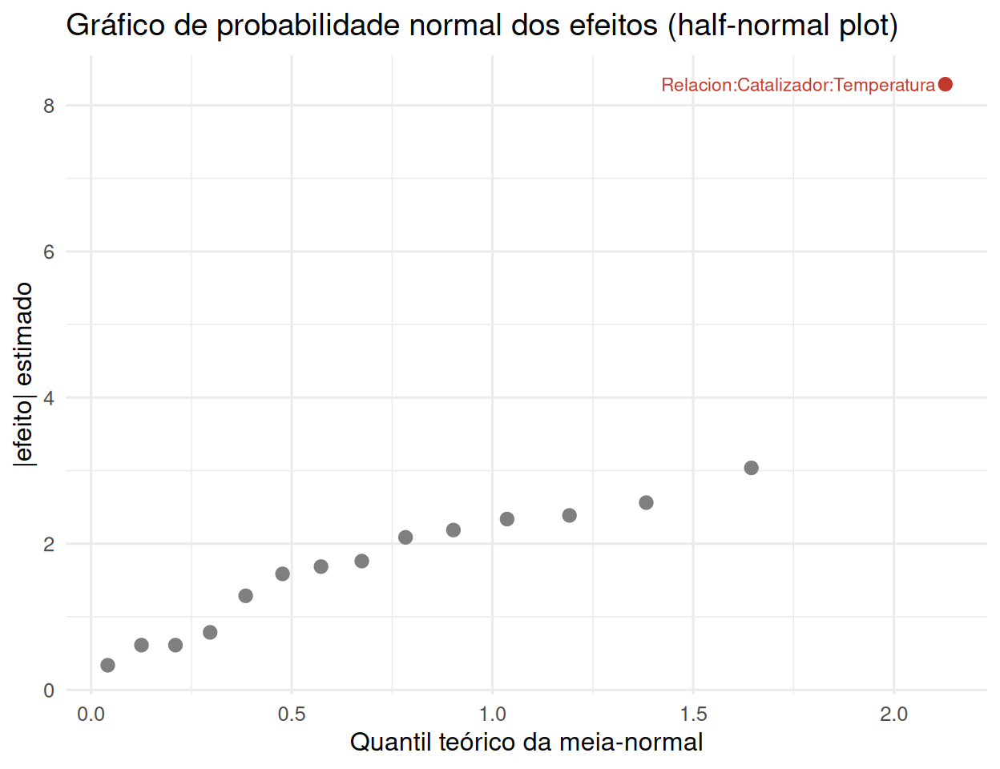
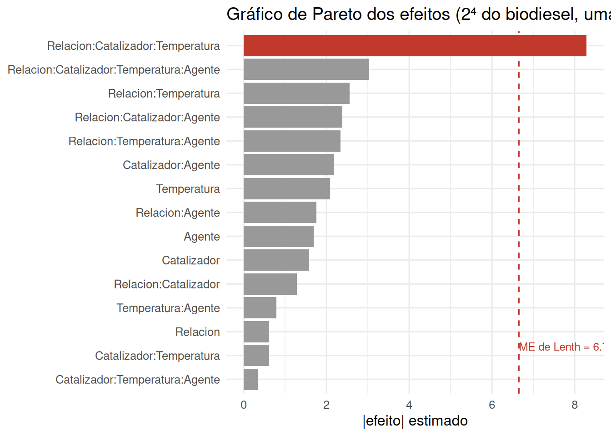
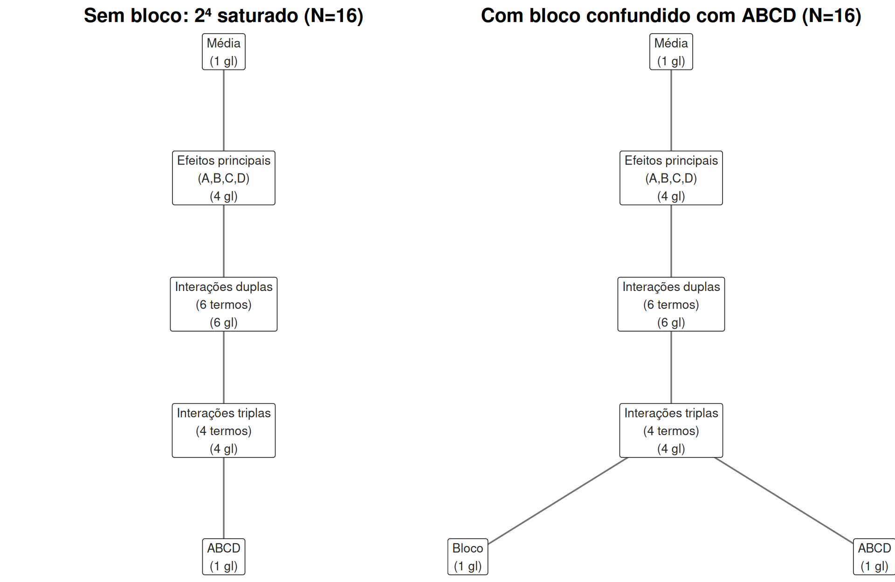

# Fatoriais avançados: confusão, fracionamento e superfície de resposta {#fatoriais-avancado}


O Capítulo 5 tratou fatoriais com número arbitrário de níveis por fator. Este capítulo se
concentra no caso particular — e de longe o mais usado na prática industrial e científica — em
que **todos os fatores têm exatamente dois níveis**: os fatoriais $2^k$. Sua popularidade não é
acidente: com apenas duas configurações por fator (tipicamente um nível "baixo" e um "alto"), um
fatorial $2^k$ estima todos os efeitos principais e interações com o menor número de corridas
possível, e sua álgebra é simples o bastante para ser feita à mão — uma vantagem que continua
relevante mesmo com software disponível, porque torna transparente *o que* está sendo estimado.
O Capítulo 7 dá sequência a este, trocando a pergunta "o que importa?" pela pergunta "qual é o
ótimo?" — a **metodologia de superfície de resposta**.

## Fatoriais $2^k$: notação e ANOVA {#fatoriais-2k}

Com $k$ fatores de dois níveis cada, há $2^k$ tratamentos distintos. Por convenção, codificamos
o nível baixo como $-1$ e o alto como $+1$ (ou, na notação clássica de Yates, o nível baixo de um
fator recebe a letra minúscula ausente e o alto a letra presente: `(1)`, `a`, `b`, `ab` para
$k=2$). Um **efeito** — principal ou de interação — é definido como a diferença média na resposta
ao mover o(s) fator(es) envolvido(s) do nível baixo ao alto, e pode ser calculado diretamente como
duas vezes o coeficiente de uma regressão da resposta sobre as colunas codificadas em $\pm 1$
(e suas interações, construídas por produto de colunas):

$$
\text{efeito}_A = \bar{y}(A{=}{+}1) - \bar{y}(A{=}{-}1) = 2\hat{\beta}_A, \qquad
\text{efeito}_{AB} = 2\hat{\beta}_{AB}, \ \ldots
$$

Com $r$ repetições por tratamento, a ANOVA de um $2^k$ é um caso especial da tabela do Capítulo 5:
cada efeito principal e cada interação (de ordem 2 até ordem $k$) tem exatamente **1 grau de
liberdade** (porque cada fator só tem 2 níveis), e o erro tem $2^k(r-1)$ graus de liberdade. Isso
faz a tabela de ANOVA de um $2^k$ replicado ser simples de ler: cada linha é uma pergunta binária
sobre um único contraste.

```{=html}
<div class="caixa-aplicacao">
<strong>Aplicação — Engenharia química: rendimento de biodiesel em um fatorial 2⁴</strong><br>
Uma planta piloto de biodiesel testa quatro fatores de processo, cada um em dois níveis
codificados ($-1$/$+1$): razão molar álcool:óleo (<code>Relacion</code>), tipo de catalisador
(<code>Catalizador</code>), temperatura de reação (<code>Temperatura</code>) e agente de
purificação (<code>Agente</code>). O fatorial $2^4$ completo (16 tratamentos) foi executado com
<strong>duas repetições</strong> (32 corridas), medindo o rendimento percentual de biodiesel.
</div>
```

```{=html}
<div class="caixa-r"><strong>Uso do R</strong> — ANOVA completa do 2⁴ replicado</div>
```


``` r
# Mantemos os quatro fatores em sua codificação numérica original (-1/+1), em vez de
# convertê-los para factor(): a seção "Ortogonalidade da matriz de desenho" mostra que é exatamente essa
# codificação simétrica que faz X'X ser diagonal. A tabela de ANOVA abaixo não muda em nada
# — soma de quadrados de um fatorial 2^k balanceado não depende de como cada fator é codificado —
# mas as próximas seções (contraste de Yates, Lenth) dependem disso de forma essencial.
biodiesel <- read_csv("data/biodiesel.csv", show_col_types = FALSE)

modelo_2k <- aov(Rendimiento ~ Relacion * Catalizador * Temperatura * Agente, data = biodiesel)
broom::tidy(modelo_2k) %>%
  filter(p.value < 0.10 | is.na(p.value)) %>%
  mutate(across(where(is.numeric), ~round(., 4))) %>%
  kable(caption = "Termos com p < 0,10 na ANOVA completa do fatorial 2⁴ (rendimento de biodiesel)") %>%
  kable_styling(full_width = FALSE)
```

<table class="table" style="width: auto !important; margin-left: auto; margin-right: auto;">
<caption>(\#tab:biodiesel-anova)(\#tab:biodiesel-anova)Termos com p &lt; 0,10 na ANOVA completa do fatorial 2⁴ (rendimento de biodiesel)</caption>
 <thead>
  <tr>
   <th style="text-align:left;"> term </th>
   <th style="text-align:right;"> df </th>
   <th style="text-align:right;"> sumsq </th>
   <th style="text-align:right;"> meansq </th>
   <th style="text-align:right;"> statistic </th>
   <th style="text-align:right;"> p.value </th>
  </tr>
 </thead>
<tbody>
  <tr>
   <td style="text-align:left;"> Temperatura </td>
   <td style="text-align:right;"> 1 </td>
   <td style="text-align:right;"> 216.8403 </td>
   <td style="text-align:right;"> 216.8403 </td>
   <td style="text-align:right;"> 10.4857 </td>
   <td style="text-align:right;"> 0.0051 </td>
  </tr>
  <tr>
   <td style="text-align:left;"> Relacion:Catalizador </td>
   <td style="text-align:right;"> 1 </td>
   <td style="text-align:right;"> 63.5628 </td>
   <td style="text-align:right;"> 63.5628 </td>
   <td style="text-align:right;"> 3.0737 </td>
   <td style="text-align:right;"> 0.0987 </td>
  </tr>
  <tr>
   <td style="text-align:left;"> Relacion:Temperatura </td>
   <td style="text-align:right;"> 1 </td>
   <td style="text-align:right;"> 224.1903 </td>
   <td style="text-align:right;"> 224.1903 </td>
   <td style="text-align:right;"> 10.8411 </td>
   <td style="text-align:right;"> 0.0046 </td>
  </tr>
  <tr>
   <td style="text-align:left;"> Relacion:Agente </td>
   <td style="text-align:right;"> 1 </td>
   <td style="text-align:right;"> 137.3653 </td>
   <td style="text-align:right;"> 137.3653 </td>
   <td style="text-align:right;"> 6.6425 </td>
   <td style="text-align:right;"> 0.0203 </td>
  </tr>
  <tr>
   <td style="text-align:left;"> Catalizador:Agente </td>
   <td style="text-align:right;"> 1 </td>
   <td style="text-align:right;"> 94.8753 </td>
   <td style="text-align:right;"> 94.8753 </td>
   <td style="text-align:right;"> 4.5879 </td>
   <td style="text-align:right;"> 0.0479 </td>
  </tr>
  <tr>
   <td style="text-align:left;"> Relacion:Catalizador:Temperatura </td>
   <td style="text-align:right;"> 1 </td>
   <td style="text-align:right;"> 334.7578 </td>
   <td style="text-align:right;"> 334.7578 </td>
   <td style="text-align:right;"> 16.1878 </td>
   <td style="text-align:right;"> 0.0010 </td>
  </tr>
  <tr>
   <td style="text-align:left;"> Relacion:Catalizador:Agente </td>
   <td style="text-align:right;"> 1 </td>
   <td style="text-align:right;"> 71.7003 </td>
   <td style="text-align:right;"> 71.7003 </td>
   <td style="text-align:right;"> 3.4672 </td>
   <td style="text-align:right;"> 0.0811 </td>
  </tr>
  <tr>
   <td style="text-align:left;"> Residuals </td>
   <td style="text-align:right;"> 16 </td>
   <td style="text-align:right;"> 330.8750 </td>
   <td style="text-align:right;"> 20.6797 </td>
   <td style="text-align:right;"> NA </td>
   <td style="text-align:right;"> NA </td>
  </tr>
</tbody>
</table>

Com as duas repetições, cinco termos emergem como estatisticamente relevantes ($p<0{,}05$): o
efeito principal da **temperatura**, as interações duplas
**razão:temperatura**, **razão:agente** e **catalisador:agente**, e — o efeito dominante — a
**interação tripla razão:catalisador:temperatura** ($p \approx 0{,}001$). Voltaremos a este
mesmo conjunto de dados na próxima seção, mas fingindo, por um momento, que só tínhamos rodado
**uma** repetição — o cenário mais comum na prática, porque cada corrida de um fatorial $2^k$
completo já é cara, e dobrar o número de corridas para obter uma repetição raramente é viável
quando $k$ é grande.

<div class="figure" style="text-align: center">

<p class="caption">(\#fig:biodiesel-efeitos-plot)Os quinze efeitos estimados do fatorial 2⁴ replicado (duas repetições cada). Barras vermelhas marcam os cinco termos com p<0,05 na ANOVA completa: o efeito principal de temperatura, três interações duplas e a interação tripla dominante.</p>
</div>

O painel deixa visível, de um só golpe, o que a tabela de p-valores só confirma termo a termo: a
interação tripla razão:catalisador:temperatura não é apenas "significativa" — é, em magnitude, o
maior de todos os quinze efeitos, maior até que o efeito principal da temperatura sozinho. Os
outros dez efeitos não destacados (barras cinzas) se acumulam perto de zero, um padrão visual que
antecipa exatamente o que a Seção \@ref(nao-replicado) explora a seguir: a maioria dos efeitos de
um fatorial $2^k$ tende a ser pequena, e só uns poucos se destacam — o princípio da esparsidade dos
efeitos, aqui visto com a repetição completa disponível, antes de precisarmos de qualquer método
que dispense repetição para enxergá-lo.

### Ortogonalidade da matriz de desenho {#ortogonalidade-2k}

A Seção \@ref(matriz-axb) mostrou que a matriz $\mathbf{X}$ de um fatorial A×B se monta em blocos
$[\mathbf{1}\ |\ \mathbf{X}_A\ |\ \mathbf{X}_B\ |\ \mathbf{X}_A \odot \mathbf{X}_B]$. No $2^k$
codificado em $\{-1,+1\}$, essa construção ganha uma propriedade extra e muito especial: **todas
as colunas de $\mathbf{X}$ — incluindo o intercepto e todas as colunas de interação, de qualquer
ordem — são mutuamente ortogonais**, isto é, $\mathbf{X}'\mathbf{X}$ é uma matriz **diagonal**
(cada entrada fora da diagonal é o produto interno de duas colunas de $\pm1$'s, que se cancela
exatamente quando o desenho é balanceado). Isso não é uma coincidência do desenho — é uma
consequência direta de cada coluna assumir apenas os valores $\pm1$ em proporções iguais e de
forma cruzada.

```{=html}
<div class="caixa-r"><strong>Uso do R</strong> — verificando que X'X é diagonal no 2⁴</div>
```


``` r
X <- model.matrix(~ Relacion * Catalizador * Temperatura * Agente, data = biodiesel)
XtX <- t(X) %*% X

# Todas as entradas fora da diagonal são zero?
all(XtX[upper.tri(XtX)] == 0)
```

```
## [1] TRUE
```

``` r
# A diagonal inteira vale n = 32 (o número de corridas)
range(diag(XtX))
```

```
## [1] 32 32
```

Quando $\mathbf{X}'\mathbf{X}$ é diagonal, sua inversa também é diagonal — basta inverter cada
elemento — e as equações normais $\mathbf{X}'\mathbf{X}\hat{\boldsymbol{\beta}} =
\mathbf{X}'\mathbf{Y}$ do Capítulo 2 (Seção \@ref(minimos-quadrados)) se **desacoplam**
completamente: cada coeficiente $\hat\beta_j$ passa a ter uma fórmula fechada que não depende de
nenhum outro coeficiente,

$$
\hat\beta_j = \frac{\mathbf{x}_j'\mathbf{Y}}{\mathbf{x}_j'\mathbf{x}_j}
= \frac{\mathbf{x}_j'\mathbf{Y}}{n}, \qquad
\text{efeito}_j = 2\hat\beta_j = \frac{2}{n}\,\mathbf{x}_j'\mathbf{Y}
= \frac{2}{n}\sum_{i=1}^n (\pm 1)\, y_i,
$$

isto é, cada efeito é (duas vezes) o **produto interno** da coluna de sinais $\mathbf{x}_j$ com a
resposta, normalizado pela norma ao quadrado da coluna. Essa é exatamente a fórmula clássica do
"contraste de Yates" — soma da resposta com sinal $+$ menos soma com sinal $-$, dividida pela
metade do número de corridas — só que agora obtida como caso particular da álgebra de mínimos
quadrados do Capítulo 2, não como uma regra memorizada à parte.


``` r
y  <- biodiesel$Rendimiento
xa <- X[, "Relacion"]                      # coluna de sinais ±1 do fator Relação

efeito_via_produto_interno <- 2 * sum(xa * y) / sum(xa * xa)
efeito_via_regressao <- 2 * coef(lm(Rendimiento ~ Relacion * Catalizador *
                                       Temperatura * Agente, data = biodiesel))["Relacion"]

c(produto_interno = efeito_via_produto_interno,
  regressao        = unname(efeito_via_regressao))
```

```
## produto_interno       regressao 
##        -1.99375        -1.99375
```

A ortogonalidade tem uma segunda consequência, agora sobre a ANOVA: como as colunas são
ortogonais, a soma de quadrados de cada efeito é $SQ_j = n\,\hat\beta_j^2$ e a soma de quadrados
total se decompõe **exatamente** na soma das $SQ_j$ de todos os efeitos — sem nenhum termo
cruzado. É por isso que, em um $2^k$ balanceado, é possível estimar e testar cada efeito
isoladamente, um de cada vez, sem que a ordem em que os fatores entram no modelo afete o
resultado (ao contrário de desenhos desbalanceados, em que $\mathbf{X}'\mathbf{X}$ deixa de ser
diagonal e a soma de quadrados de cada termo passa a depender de quais outros termos já estão no
modelo — o problema das "somas de quadrados Tipo I vs. Tipo III" que volta a aparecer sempre que
o balanceamento se perde).

### O algoritmo tabular de Yates {#algoritmo-yates}

A Seção anterior obteve cada efeito como um produto interno, $\text{efeito}_j = \tfrac{2}{n}
\mathbf{x}_j'\mathbf{Y}$. Antes de existirem pacotes estatísticos, essa conta era feita literalmente
assim, à mão: monta-se uma tabela com uma coluna de sinais $\pm1$ para cada efeito — principais e
interações —, multiplica-se cada coluna pela resposta média do tratamento correspondente, somam-se
os produtos e divide-se pelo divisor apropriado. O exemplo clássico a seguir — um $2^3$ com fatores
de processo $T$, $C$ e $K$, cada um em dois níveis, com duas réplicas — é reproduzido do material
de aula do curso e ilustra esse procedimento numericamente, antes de o formalizarmos como um
algoritmo mais rápido e o reproduzirmos em R sobre os próprios dados do biodiesel.

<div class="figure" style="text-align: center">

<p class="caption">(\#fig:yates-dados-classicos)Um 2³ clássico com fatores T, C e K (duas réplicas cada, I e II). As colunas de sinais (-/+) definem os oito tratamentos em ordem-padrão; as colunas à direita resumem média, amplitude e variância de cada tratamento.</p>
</div>

<div class="figure" style="text-align: center">

<p class="caption">(\#fig:yates-tabela-classica)A tabela de sinais e contrastes para o 2³ acima: cada coluna (T, C, K, T x C, T x K, C x K, T x C x K) é a coluna de sinais ±1 daquele efeito, multiplicada pela Produção Média de cada tratamento (última coluna) e somada; o resultado, dividido pelo divisor do rodapé, é o efeito estimado -- exatamente o produto interno da Seção 6.1.1.</p>
</div>

<div class="figure" style="text-align: center">

<p class="caption">(\#fig:yates-efeito-tk)Cálculo manual do efeito de interação dupla T x C (temperatura x catalisador) no mesmo exemplo 2^3: as quatro combinações com sinal '+' (diagonal do cubo) contra as quatro com sinal '-' produzem a mesma conta que a coluna 'T x C' da tabela de sinais -- a leitura geométrica (planos diagonais do cubo, seção sobre o cubo do 2 ao cubo do Capítulo 5) e a leitura tabular (produto de colunas de sinais) chegam ao mesmo número.</p>
</div>

Essa tabela é a versão numérica, célula a célula, da fórmula algébrica $\text{efeito}_j =
\tfrac{2}{n}\mathbf{x}_j'\mathbf{Y}$: cada coluna de sinais é uma coluna $\mathbf{x}_j$ diferente
(a de "T" é o efeito principal do fator $T$; a de "T×C" é o produto elemento a elemento das colunas
de $T$ e $C$, exatamente como a Seção \@ref(matriz-axb) descreveu para o caso geral A×B); a soma dos
produtos sinal$\times$resposta é o numerador do produto interno; e o "Divisor" do rodapé — $4$ para
qualquer efeito neste $2^3$ — é $2^{k-1}$, a metade do número de tratamentos, que aparece porque a
tabela já trabalha com a **produção média** de cada tratamento (a média das duas réplicas), não com
o total. Montar essa tabela inteira, coluna a coluna, é exatamente o que os pesquisadores faziam
antes de qualquer software — e é exatamente o que `model.matrix()` faz por trás dos panos hoje.

Montar a tabela de sinais completa fica caro rapidamente: um $2^k$ tem $2^k-1$ colunas de sinal,
cada uma com $2^k$ entradas. Yates [-@yates1937design] percebeu que **não é preciso montar a
tabela inteira**:
os mesmos $2^k$ contrastes podem ser obtidos com apenas $k$ passadas sucessivas de somas e
diferenças sobre os totais de tratamento dispostos em ordem-padrão (`(1), a, b, ab, c, ac, bc,
abc, ...`, em que cada letra sucessiva repete o bloco de tratamentos já listado, acrescentando-o
com o novo fator no nível alto). Em cada passada: (i) a primeira metade do novo vetor é a soma de
pares consecutivos do vetor anterior; (ii) a segunda metade é a diferença (segundo menos primeiro)
desses mesmos pares. Depois de $k$ passadas, a primeira entrada do vetor final é o total geral, e
cada entrada seguinte é o contraste de um efeito — na mesma ordem-padrão dos rótulos —, pronto
para ser dividido por $n\,2^{k-1}$ (obtendo o efeito) ou elevado ao quadrado e dividido por
$n\,2^k$ (obtendo sua soma de quadrados, a mesma $SQ_j = n\hat\beta_j^2$ da Seção
\@ref(ortogonalidade-2k)). O ganho é computacional, não conceitual: $k\,2^k$ somas/diferenças no
total, contra a ordem $2^k(2^k-1)$ de operações da tabela de sinais completa — uma economia que
importava muito com lápis e papel, e que hoje sobrevive sobretudo por seu valor didático.

```{=html}
<div class="caixa-r"><strong>Uso do R</strong> — implementando o algoritmo tabular de Yates e
verificando-o contra os efeitos já calculados do biodiesel</div>
```


``` r
# Uma passada do algoritmo: metade inferior = somas de pares consecutivos,
# metade superior = diferencas (segundo menos primeiro) dos mesmos pares
passada_yates <- function(v) {
  n <- length(v)
  somas       <- v[seq(1, n, by = 2)] + v[seq(2, n, by = 2)]
  diferencas  <- v[seq(2, n, by = 2)] - v[seq(1, n, by = 2)]
  c(somas, diferencas)
}

algoritmo_yates <- function(totais, k) {
  v <- totais
  for (passo in seq_len(k)) v <- passada_yates(v)
  v
}

# Reaproveitando o 2^4 do biodiesel (secao "Fatoriais 2^k: notacao e ANOVA"): totais de tratamento
# em ordem-padrao (1, a, b, ab, c, ac, ..., abcd), construida a partir dos 4 bits do indice
k <- 4
ordem_padrao <- tibble(idx = 0:(2^k - 1)) %>%
  mutate(
    Relacion    = if_else(bitwAnd(idx, 1L) > 0,  1, -1),
    Catalizador = if_else(bitwAnd(idx, 2L) > 0,  1, -1),
    Temperatura = if_else(bitwAnd(idx, 4L) > 0,  1, -1),
    Agente      = if_else(bitwAnd(idx, 8L) > 0,  1, -1)
  )

totais_trat <- ordem_padrao %>%
  left_join(
    biodiesel %>% group_by(Relacion, Catalizador, Temperatura, Agente) %>%
      summarise(total = sum(Rendimiento), n = n(), .groups = "drop"),
    by = c("Relacion", "Catalizador", "Temperatura", "Agente")
  )

v_final <- algoritmo_yates(totais_trat$total, k)
r <- unique(totais_trat$n)                          # 2 replicas por tratamento
efeitos_yates <- v_final[-1] / (r * 2^(k - 1))        # descarta o total geral (posicao 1)

# Efeitos ja calculados via produto interno / regressao (secao "Ortogonalidade da matriz de desenho")
efeitos_regressao <- 2 * coef(lm(Rendimiento ~ Relacion * Catalizador * Temperatura * Agente,
                                  data = biodiesel))[-1]

max(abs(sort(efeitos_yates) - sort(efeitos_regressao)))
```

```
## [1] 1.676437e-14
```

A diferença máxima entre os 15 efeitos calculados pelo algoritmo tabular e os mesmos 15 efeitos
obtidos por regressão é numericamente zero: as duas rotas — produto interno de colunas de sinais e
somas/diferenças sucessivas — chegam exatamente ao mesmo resultado, porque são, algebricamente, a
mesma conta organizada de duas formas diferentes. A vantagem do algoritmo de Yates nunca foi
precisão adicional, e sim **custo computacional**: $k$ passadas de $2^{k-1}$ somas e
$2^{k-1}$ diferenças cada ($k\,2^k$ operações ao todo) contra o cálculo de $2^k-1$ produtos
internos de comprimento $2^k$ cada (proporcional a $2^k(2^k-1)$ operações) — uma economia que
importava muito quando as contas eram feitas à mão ou em calculadoras mecânicas, e que hoje
sobrevive sobretudo por seu valor didático: tornar visível, coluna a coluna, como cada efeito de
ordem crescente nasce dos efeitos de ordem menor já calculados.

## Análise de um fatorial $2^k$ não replicado {#nao-replicado}

Sem repetição, não há graus de liberdade sobrando para estimar $\sigma^2$ diretamente — o modelo
saturado (todos os $2^k - 1$ efeitos) consome todos os graus de liberdade disponíveis, e não
sobra um "erro puro" para comparar. A saída clássica [@daniel1959use; @boxhunterhunter2005]
explora um fato empírico: **a maioria dos efeitos de ordem alta é, de fato, próxima de zero**
(o chamado *princípio da esparsidade dos efeitos*), então os efeitos verdadeiramente nulos se
comportam como ruído aproximadamente normal em torno de zero, enquanto os poucos efeitos reais se
destacam como discrepantes dessa distribuição.

### Gráfico de probabilidade normal (half-normal plot)

O dispositivo gráfico proposto por Daniel [-@daniel1959use] para essa situação é simples e eficaz:
se ordenarmos os $2^k - 1$ efeitos estimados por valor absoluto e os colocarmos contra os
quantis teóricos de uma normal-meio (half-normal, já que só nos importa a magnitude), os efeitos
nulos devem cair aproximadamente sobre uma reta que passa pela origem; efeitos reais se afastam
dela, tipicamente no canto superior direito do gráfico.

### Gráfico de Pareto dos efeitos

Uma alternativa mais direta é ordenar as magnitudes dos efeitos do maior para o menor em um
gráfico de barras — o "gráfico de Pareto dos efeitos" — sobrepondo uma linha de referência
(a margem de erro de Lenth, descrita a seguir) para separar visualmente o que é "grande demais
para ser ruído" do que não é.

### Margem de erro pelo método de Lenth

O método de Lenth [-@lenth1989quick] fornece uma margem de erro formal sem exigir repetição,
usando a **mediana** dos efeitos como uma estimativa robusta de escala (pouco sensível aos
próprios efeitos grandes que queremos detectar):

$$
s_0 = 1{,}5 \cdot \text{mediana}_i |c_i|, \qquad
\text{PSE} = 1{,}5 \cdot \text{mediana}_{\{i:\, |c_i| < 2{,}5 s_0\}} |c_i|,
$$

onde $c_i$ percorre os $m = 2^k - 1$ efeitos estimados. O primeiro passo ($s_0$) dá uma
estimativa inicial e grosseira de escala; o segundo passo refina essa estimativa — batizada de
**erro-padrão pseudo** (PSE) — usando só os efeitos que já parecem "pequenos" segundo $s_0$,
descartando os candidatos a efeito real. A margem de erro (ME) usa esse PSE como se fosse um
erro-padrão comum, com $d = m/3$ graus de liberdade (uma aproximação heurística validada por
simulação no artigo original):

$$
\text{ME} = t_{0{,}975;\, d} \cdot \text{PSE}.
$$

Um efeito é declarado "grande" se $|c_i| > \text{ME}$.

```{=html}
<div class="caixa-r"><strong>Uso do R</strong> — método de Lenth, half-normal e Pareto em uma
única repetição do 2⁴</div>
```


``` r
# Simulando o cenário mais comum: apenas UMA repetição por tratamento
rep_unica <- biodiesel %>%
  distinct(Relacion, Catalizador, Temperatura, Agente, .keep_all = TRUE)

modelo_saturado <- lm(Rendimiento ~ Relacion * Catalizador * Temperatura * Agente,
                       data = rep_unica)
efeitos <- 2 * coef(modelo_saturado)[-1]   # exclui o intercepto
efeitos <- sort(efeitos, decreasing = TRUE)

# --- Método de Lenth ---
s0  <- 1.5 * median(abs(efeitos))
pse <- 1.5 * median(abs(efeitos)[abs(efeitos) < 2.5 * s0])
m   <- length(efeitos)
d   <- m / 3
me  <- qt(0.975, d) * pse

cat("PSE =", round(pse, 3), " | graus de liberdade efetivos =", d,
    " | margem de erro (ME) =", round(me, 3), "\n")
```

```
## PSE = 2.588  | graus de liberdade efetivos = 5  | margem de erro (ME) = 6.651
```

``` r
efeitos[abs(efeitos) > me]
```

```
## Relacion:Catalizador:Temperatura 
##                           8.2875
```





O gráfico de Pareto mostra a mesma informação do half-normal em outra forma: uma única barra
ultrapassa a linha tracejada da margem de erro de Lenth. A segunda maior barra (a interação de
quarta ordem razão:catalisador:temperatura:agente, $|c|\approx3{,}0$) já fica a menos da metade da
margem de erro ($\text{ME}\approx6{,}7$) — um contraste nítido que deixa claro, visualmente, por
que só um efeito é sinalizado como "grande demais para ser ruído".

Com uma única repetição, o único efeito que ultrapassa a margem de erro de Lenth é a **interação
tripla razão:catalisador:temperatura** — que é, coincidentemente, o efeito de maior magnitude
também na análise completa com duas repetições da Seção \@ref(fatoriais-2k). O método acerta o
efeito dominante, mas — de forma esperada e didaticamente importante — é conservador demais para
sinalizar os outros quatro efeitos moderados que a repetição completa havia revelado como
estatisticamente significativos. Esse é o preço de dispensar a repetição: ganha-se em economia de
corridas, perde-se em poder para detectar efeitos de magnitude intermediária.

```{=html}
<div class="caixa-discussao">
<strong>Para discutir</strong>
<ol>
<li>Por que a mediana, e não o desvio-padrão amostral, é a escolha certa para estimar a escala
dos efeitos no método de Lenth? O que aconteceria se um dos poucos efeitos realmente grandes
entrasse no cálculo de $s_0$ sem qualquer proteção?</li>
<li>Se um fatorial $2^5$ não replicado (31 efeitos) tivesse, por acaso, um único efeito
verdadeiramente grande e os outros 30 exatamente nulos, o que você esperaria ver no gráfico de
probabilidade normal? E se dois terços dos 31 efeitos fossem moderadamente grandes?</li>
</ol>
</div>
```

## Confusão em $2^k$: designação de tratamentos a blocos {#confusao-2k}

Fatoriais $2^k$ crescem rápido: um $2^6$ já tem 64 tratamentos. Se uma única unidade de bloqueio
(um lote de matéria-prima, um turno de operação, um dia) só comporta metade das corridas, o
fatorial completo precisa ser dividido em blocos — e queremos que a divisão **não contamine** os
efeitos que nos interessam. A técnica de **confusão** (do inglês *confounding*) escolhe
deliberadamente um efeito de interação — normalmente de ordem alta, o que consideramos menos
provável de ser grande e mais fácil de "sacrificar" — para ficar indistinguível do efeito de
bloco.

### Esquema de designação: o contraste definidor

Para dividir um $2^k$ em 2 blocos de $2^{k-1}$ corridas, escolhemos um efeito — o **contraste
definidor** — e calculamos seu sinal (produto dos níveis codificados $\pm1$ dos fatores
envolvidos) para cada tratamento. Tratamentos com sinal $+1$ vão para um bloco; com sinal $-1$,
para o outro.

```{=html}
<div class="caixa-r"><strong>Uso do R</strong> — confundindo ABCD com o bloco no 2⁴ do biodiesel
(construção didática)</div>
```


``` r
# Suponha que as 16 combinações do 2^4 só coubessem em 2 lotes de solvente (bloco),
# de 8 corridas cada, e que quiséssemos "sacrificar" a interação de quarta ordem ABCD.
# rep_unica já está na codificação numérica -1/+1 (seção "Ortogonalidade da matriz de desenho"), então o
# sinal de ABCD é só o produto direto das quatro colunas.
combinacoes <- rep_unica %>%
  mutate(ABCD = Relacion * Catalizador * Temperatura * Agente,
         bloco = if_else(ABCD > 0, "Bloco 1", "Bloco 2"))

count(combinacoes, bloco)
```

```
## # A tibble: 2 × 2
##   bloco       n
##   <chr>   <int>
## 1 Bloco 1     8
## 2 Bloco 2     8
```

Como o sinal de $ABCD$ é constante *dentro* de cada bloco e varia *entre* blocos, a diferença
entre as médias dos dois blocos é algebricamente idêntica à estimativa do efeito $ABCD$ — os dois
ficam **totalmente confundidos**: é impossível, a partir dos dados, separar "efeito do lote de
solvente" de "interação de quarta ordem entre os quatro fatores". Isso é aceitável precisamente
porque escolhemos confundir um efeito que, a priori, julgamos pouco provável de ser grande (efeitos
de ordem 3 ou 4 raramente dominam, pelo princípio da esparsidade da Seção \@ref(nao-replicado)) —
mas seria um erro grave confundir um efeito principal ou uma interação dupla dessa forma.

### Confusão como colinearidade em $\mathbf{X}$ {#confusao-projecao}

A Seção \@ref(ortogonalidade-2k) mostrou que a força do $2^k$ vem de $\mathbf{X}'\mathbf{X}$ ser
diagonal — cada efeito, incluindo $ABCD$, ocupa sua própria coluna, ortogonal a todas as outras.
Confundir $ABCD$ com o bloco é, em termos exatamente matriciais, **construir a coluna de bloco
$\mathbf{x}_{bloco}$ para ser idêntica à coluna $\mathbf{x}_{ABCD}$** (a menos de uma
reescala/sinal): ambas separam as mesmas 8 corridas do mesmo lado. O efeito é que, se
tentássemos colocar as duas colunas simultaneamente na matriz de desenho, $\mathbf{X}$ deixaria de
ter posto coluna completo — exatamente a situação de deficiência de posto do Capítulo 2 (Seção
\@ref(estimabilidade)) — e $(\mathbf{X}'\mathbf{X})^{-1}$ deixaria de existir.

```{=html}
<div class="caixa-r"><strong>Uso do R</strong> — a colinearidade exata entre bloco e ABCD</div>
```


``` r
combinacoes <- combinacoes %>%
  mutate(bloco_num = if_else(bloco == "Bloco 1", 1, -1))

# A coluna de bloco é, literalmente, a coluna ABCD (correlação perfeita)
cor(combinacoes$ABCD, combinacoes$bloco_num)
```

```
## [1] 1
```

``` r
# Ao incluir as duas no mesmo modelo, R %>% lm() detecta a colinearidade exata
# e descarta uma delas, reportando coeficiente NA:
dados_conf <- rep_unica %>% bind_cols(bloco = factor(combinacoes$bloco))
mod_confundido <- lm(Rendimiento ~ Relacion * Catalizador * Temperatura * Agente + bloco,
                      data = dados_conf)
coef(mod_confundido)[c("blocoBloco 2", "Relacion:Catalizador:Temperatura:Agente")]
```

```
##                            blocoBloco 2 Relacion:Catalizador:Temperatura:Agente 
##                                  3.0375                                      NA
```

O `NA` no coeficiente da interação de quarta ordem não é um erro numérico — é o R relatando, da
única forma possível, que **não existe informação nos dados capaz de distinguir** "efeito de
bloco" de "interação $ABCD$": as duas colunas de $\mathbf{X}$ apontam exatamente na mesma direção
do espaço-coluna, e $\mathbf{P}_X$ (Seção \@ref(matriz-projecao)) não consegue projetar
separadamente sobre duas direções que coincidem. Esta é a face matricial, concreta, de uma ideia
que de outra forma permanece abstrata: **confundir é, literalmente, fazer duas colunas do modelo
colidirem**, e a escolha de qual efeito confundir é a escolha de qual coluna estamos dispostos a
sacrificar.

### Confusão total vs. confusão parcial

O esquema acima é **confusão total**: o mesmo efeito é sacrificado em *todas* as repetições do
experimento. Quando há mais de uma repetição (como no biodiesel, com 2 réplicas), uma alternativa
melhor é a **confusão parcial**: usar um contraste definidor diferente em cada repetição (por
exemplo, $ABCD$ na repetição 1 e $ABC$ na repetição 2). Cada efeito confundido perde informação
apenas na repetição em que foi sacrificado — nas demais, permanece estimável a partir das
comparações intra-bloco — de modo que **nenhum efeito é totalmente perdido**, ao custo de uma
análise ligeiramente mais elaborada (a informação de cada efeito parcialmente confundido é
recuperada combinando as repetições em que ele não foi sacrificado, com peso proporcional à
informação disponível). A confusão parcial é preferível sempre que o número de repetições permite,
justamente porque nenhuma pergunta de pesquisa fica inteiramente sem resposta.

### Visualizando a confusão com um diagrama de Hasse {#hasse-confusao}

A Seção \@ref(hasse) (Capítulo 2) definiu o diagrama de Hasse pela regra de que os graus de
liberdade de todos os termos, somados, esgotam exatamente $N$ — nenhum termo novo pode entrar no
diagrama sem "tomar" seus graus de liberdade de algum lugar. É exatamente essa contabilidade
rígida que torna a confusão visualmente clara: o desenho de réplica única do $2^4$ (`rep_unica`,
$N=16$) é **saturado** — a Seção \@ref(nao-replicado) já observou que os $2^4-1=15$ efeitos mais a
média esgotam os 16 graus de liberdade disponíveis, sem sobrar nenhum para um termo de erro. Um
diagrama de Hasse desse desenho (agrupando, por clareza visual, os quatro efeitos principais em um
só nó, as seis interações duplas em outro, e as quatro triplas em um terceiro — mantendo apenas
$ABCD$ em destaque, o termo que a próxima figura vai confundir) tem exatamente esta forma:

```{=html}
<div class="caixa-r"><strong>Uso do R</strong> — Hasse do 2⁴ saturado, sem e com bloco confundido
com ABCD</div>
```

<div class="figure" style="text-align: center">

<p class="caption">(\#fig:hasse-confusao)Esquerda: diagrama de Hasse do 2^4 de réplica única (N=16), saturado -- todos os 16 graus de liberdade já estão ocupados por Média, efeitos principais, duplas, triplas e ABCD, sem sobra para Erro nem para Bloco. Direita: para incluir um termo de Bloco (2 blocos de 8 corridas), a confusão faz Bloco e ABCD ocuparem a mesma posição relativa na estrutura -- o mesmo único grau de liberdade, com dois rótulos possíveis, em vez de um grau de liberdade roubado de outro termo.</p>
</div>

O painel esquerdo é o retrato do problema: com réplica única, todo grau de liberdade do desenho já
tem dono, incluindo o próprio $ABCD$ — não existe espaço "livre" para um termo de Bloco entrar sem
que algum outro termo perca graus de liberdade. O painel direito mostra a solução da confusão, e é
aqui que o diagrama de Hasse ganha um significado que a tabela de ANOVA sozinha não deixa tão
explícito: **Bloco** e **ABCD** aparecem lado a lado, no mesmo nível, ambos descendo do mesmo nó de
interações triplas — não porque sejam dois termos novos de 1 grau de liberdade cada (o que somaria
17, estourando $N=16$), mas porque são **o mesmo** grau de liberdade, com dois rótulos possíveis
para a mesma coluna de $\mathbf{X}$ (exatamente a colinearidade exata demonstrada algebricamente
acima, Seção \@ref(confusao-projecao)). Somando o diagrama corretamente — contando o par
Bloco/ABCD como um único grau de liberdade compartilhado, não dois —, a contabilidade volta a
fechar: $1+4+6+4+1=16=N$, a mesma soma do painel sem bloco, só que agora um dos 16 "lugares" tem
duas etiquetas em vez de uma. É essa disputa por espaço no diagrama — não uma analogia, mas a
mesma regra de contagem de graus de liberdade da Seção \@ref(hasse) aplicada literalmente — que
explica por que confusão sempre sacrifica *algum* termo: adicionar uma fonte de variação a um
desenho saturado nunca é gratuito, e a única escolha real é *qual* termo aceita dividir sua coluna
com o novo bloco.

## Fatoriais $3^k$: ideia geral e confusão com $AB^2$ {#fatoriais-3k}

Quando um fator tem três níveis igualmente espaçados (por exemplo, para permitir a estimação de
curvatura, não só de tendência linear), o fatorial correspondente é um $3^k$: $3^k$ tratamentos,
cada efeito principal com $3-1=2$ graus de liberdade (que podem, por sua vez, ser decompostos em
componentes linear e quadrático — ver polinômios ortogonais, Capítulo 3), e interações com graus
de liberdade multiplicativos — por exemplo, $2 \times 2 = 4$ graus de liberdade para uma interação
dupla $A{\times}B$ em um $3^2$.

```{=html}
<div class="caixa-aplicacao">
<strong>Aplicação — Usinagem: velocidade de corte e ângulo em um 3²</strong><br>
Um experimento de usinagem mede a energia de corte consumida em função da <strong>velocidade de
corte</strong> (três níveis: 2,3, 3,4 e 4,5 m/s) e do <strong>ângulo de saída da ferramenta</strong>
(três níveis: 20°, 40° e 60°) — um $3^2$ completo, com quatro repetições por combinação (36
corridas). Retomaremos este mesmo conjunto de dados na seção sobre superfície de resposta, adiante neste capítulo.
</div>
```

Assim como no $2^k$, dividir um $3^k$ em blocos exige confundir algum efeito com o bloco. A
construção usa **contrastes de graus de liberdade únicos** da forma $AB^2$ (ou $A^2B$), em vez de
simplesmente $AB$: como cada efeito de interação em um $3^k$ tem múltiplos graus de liberdade, é
preciso escolher *um* componente específico para confundir, e a notação $AB^2$ indica o contraste
$L = i + 2j \pmod 3$, onde $i$ e $j$ são os níveis (codificados $0,1,2$) de $A$ e $B$. Valores de
$L$ iguais a $0$, $1$ e $2$ definem três blocos de tamanho $3^{k-1}$:

<table class="table" style="width: auto !important; margin-left: auto; margin-right: auto;">
<caption>(\#tab:tabela-ab2)(\#tab:tabela-ab2)Designação de blocos por AB² em um 3² (ilustração conceitual)</caption>
 <thead>
  <tr>
   <th style="text-align:right;"> A </th>
   <th style="text-align:right;"> B </th>
   <th style="text-align:right;"> L </th>
   <th style="text-align:left;"> Bloco </th>
  </tr>
 </thead>
<tbody>
  <tr>
   <td style="text-align:right;"> 0 </td>
   <td style="text-align:right;"> 0 </td>
   <td style="text-align:right;"> 0 </td>
   <td style="text-align:left;"> Bloco 1 </td>
  </tr>
  <tr>
   <td style="text-align:right;"> 1 </td>
   <td style="text-align:right;"> 1 </td>
   <td style="text-align:right;"> 0 </td>
   <td style="text-align:left;"> Bloco 1 </td>
  </tr>
  <tr>
   <td style="text-align:right;"> 2 </td>
   <td style="text-align:right;"> 2 </td>
   <td style="text-align:right;"> 0 </td>
   <td style="text-align:left;"> Bloco 1 </td>
  </tr>
  <tr>
   <td style="text-align:right;"> 0 </td>
   <td style="text-align:right;"> 2 </td>
   <td style="text-align:right;"> 1 </td>
   <td style="text-align:left;"> Bloco 2 </td>
  </tr>
  <tr>
   <td style="text-align:right;"> 1 </td>
   <td style="text-align:right;"> 0 </td>
   <td style="text-align:right;"> 1 </td>
   <td style="text-align:left;"> Bloco 2 </td>
  </tr>
  <tr>
   <td style="text-align:right;"> 2 </td>
   <td style="text-align:right;"> 1 </td>
   <td style="text-align:right;"> 1 </td>
   <td style="text-align:left;"> Bloco 2 </td>
  </tr>
  <tr>
   <td style="text-align:right;"> 0 </td>
   <td style="text-align:right;"> 1 </td>
   <td style="text-align:right;"> 2 </td>
   <td style="text-align:left;"> Bloco 3 </td>
  </tr>
  <tr>
   <td style="text-align:right;"> 1 </td>
   <td style="text-align:right;"> 2 </td>
   <td style="text-align:right;"> 2 </td>
   <td style="text-align:left;"> Bloco 3 </td>
  </tr>
  <tr>
   <td style="text-align:right;"> 2 </td>
   <td style="text-align:right;"> 0 </td>
   <td style="text-align:right;"> 2 </td>
   <td style="text-align:left;"> Bloco 3 </td>
  </tr>
</tbody>
</table>

A lógica é a mesma do $2^k$: o contraste $AB^2$ (que mistura um componente da interação
$A{\times}B$) fica confundido com o bloco, e o custo é aceitável se julgarmos, a priori, que esse
componente específico da interação é o menos relevante para a pergunta de pesquisa. Fatoriais
$3^k$ com $k \geq 3$ seguem a mesma lógica, usando geradores da forma $AB^2C$, e são discutidos em
detalhe por @montgomery2017design (Cap. 9) e @boxhunterhunter2005.

## Fatoriais fracionados de dois níveis: a ideia geral {#fracionados}

Quando $k$ é grande (a partir de aproximadamente $k=5$ ou $6$), mesmo um $2^k$ completo pode ter
mais corridas do que o orçamento do experimento permite — e, pelo princípio da esparsidade dos
efeitos, grande parte dessas corridas está sendo "gasta" para estimar interações de ordem alta que
provavelmente são desprezíveis. Um **fatorial fracionado** $2^{k-p}$ roda apenas uma fração
$1/2^p$ do fatorial completo, escolhida deliberadamente por meio de $p$ **relações geradoras** — a
ideia, introduzida por Finney [-@finney1945fractional] para desenhos agrícolas com muitos fatores,
tornou-se décadas depois o pilar das aplicações industriais de controle de qualidade associadas aos
**arranjos ortogonais de Taguchi** [@taguchi1986], que nada mais são, em essência, do que fatoriais
fracionados (ou fatoriais $3^{k-p}$ e desenhos mistos) escolhidos para robustez do processo a
fontes de ruído não controláveis.

A ideia central é a mesma da confusão: ao usar só uma fração das corridas, alguns efeitos deixam
de ser estimáveis separadamente — ficam **aliasados** (confundidos) uns com os outros. A diferença
é que, na confusão, sacrificamos a distinção entre um efeito e o *bloco*; no fracionamento,
sacrificamos a distinção entre **dois efeitos de tratamento**. A **relação definidora**
($I = $ produto de letras) determina exatamente quais efeitos ficam aliasados a quais — por
exemplo, com geradora $D = ABC$ (equivalente a $I = ABCD$) em um $2^{4-1}$ de 8 corridas, o efeito
principal $A$ fica aliasado com a interação tripla $BCD$: o que estimamos como "$A$" é, na
verdade, a soma $A + BCD$, indistinguível a partir dos dados.

A **resolução** de um fracionado resume a "qualidade" desse aliasamento:

- **Resolução III**: efeitos principais aliasados com interações duplas.
- **Resolução IV**: efeitos principais limpos de interações duplas (aliasados só com triplas ou
  mais); mas interações duplas aliasadas entre si.
- **Resolução V**: efeitos principais e interações duplas todos limpos entre si; aliasamento só
  aparece em interações de ordem 3 ou mais.

Quanto maior a resolução, mais informação útil o fracionado preserva — ao custo de exigir mais
corridas (menor fração) para o mesmo $k$. Na prática, escolher a fração certa é uma decisão de
compromisso entre orçamento experimental e quais interações o pesquisador está disposto a assumir,
a priori, como desprezíveis — a mesma lógica de custo-benefício da confusão, aplicada aos próprios
efeitos de tratamento em vez de ao bloco. O leitor interessado em construir geradores para $k$
maiores e tabelas de resolução encontra o tratamento completo em @montgomery2017design (Cap. 8) e
@boxhunterhunter2005 (Cap. 6).

## Rumo à otimização: superfície de resposta {#rumo-superficie-resposta}

Tudo até aqui respondeu "quais fatores importam, e há interação?". O Capítulo 7 muda a
pergunta para "qual combinação de níveis **otimiza** a resposta?" — a metodologia de
superfície de resposta, que estende os fatoriais $2^k$ deste capítulo com um modelo
polinomial de segunda ordem capaz de representar curvatura e localizar um ótimo.

## Resumo do capítulo

- Fatoriais $2^k$ estimam todos os efeitos com o menor número de corridas possível; cada efeito
  tem 1 grau de liberdade, e sua magnitude é o dobro do coeficiente de regressão correspondente.
- Sem repetição, o princípio da esparsidade dos efeitos permite separar sinal de ruído por meios
  gráficos (half-normal, Pareto) e formais (margem de erro de Lenth), ainda que com menos poder do
  que uma análise replicada.
- Confusão sacrifica deliberadamente um efeito de interação (idealmente de ordem alta) para
  viabilizar blocos menores; confusão parcial, usando geradores diferentes por repetição, evita
  perder qualquer efeito por completo.
- $3^k$ generaliza a lógica de $2^k$ para fatores de três níveis, com confusão via contrastes de
  grau único como $AB^2$; fracionados $2^{k-p}$ generalizam a lógica de confusão para os próprios
  efeitos de tratamento, classificados por resolução (III, IV, V) segundo a "qualidade" do
  aliasamento resultante.
- O Capítulo 7 retoma esses mesmos fatoriais para responder a uma pergunta diferente: não "o que
  importa?", mas "qual é o ótimo?".

