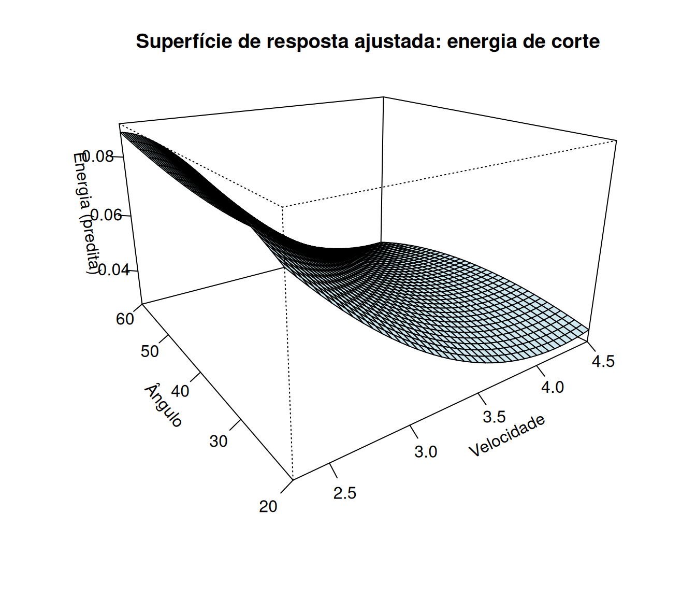
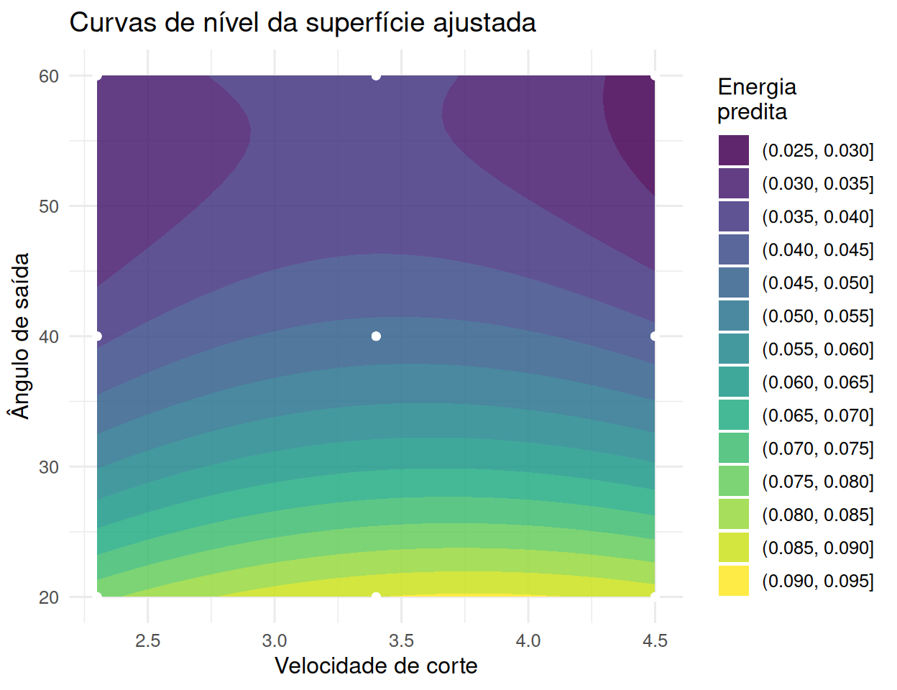
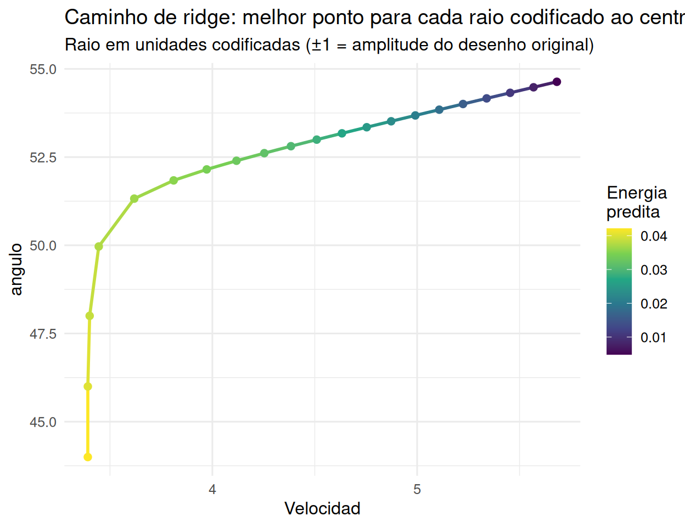
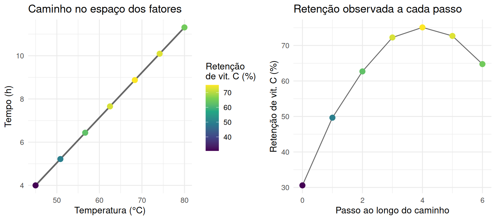
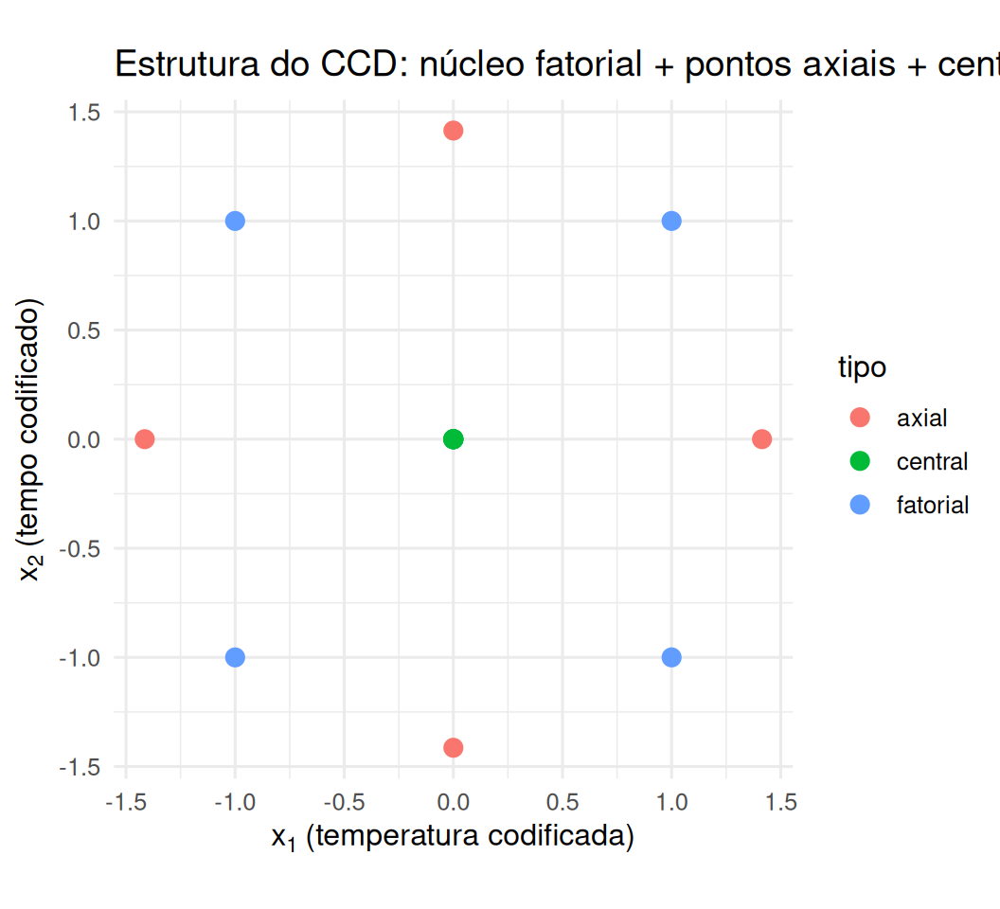
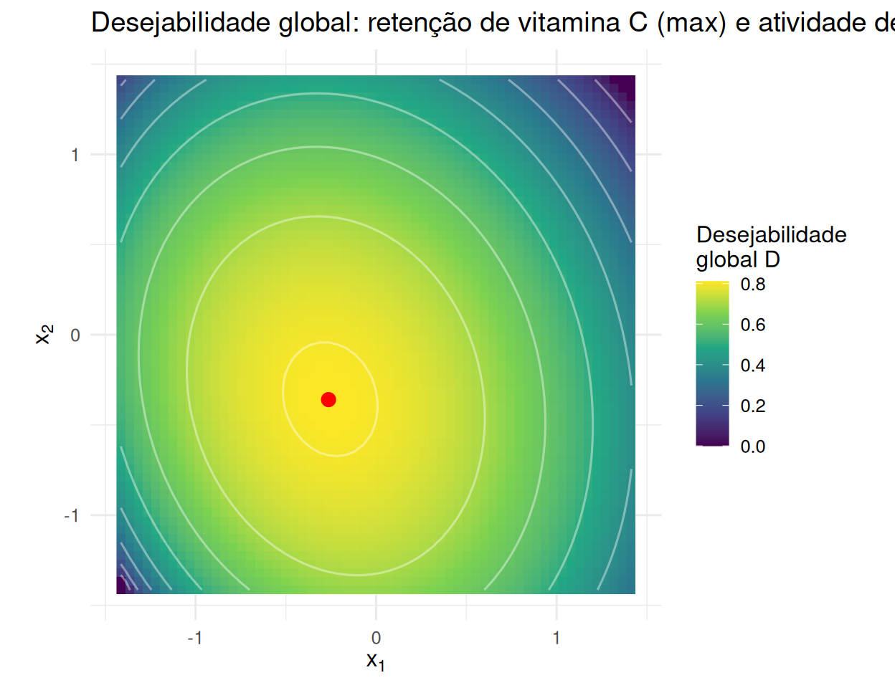

# Metodologia de superfície de resposta {#superficie-resposta-cap}


Os Capítulos 5 e 6 trataram fatoriais desenhados para **detectar e estimar efeitos** — a pergunta
era "quais fatores importam, e há interação?". Este capítulo muda a pergunta para "qual combinação
de níveis **otimiza** a resposta?" — a metodologia de superfície de resposta (MSR), um dos usos
mais comuns de delineamento de experimentos na indústria e na ciência de dados hoje em dia (ajuste
de hiperparâmetros, otimização de processos químicos e de manufatura, desenho de produtos).

## Introdução à superfície de resposta {#superficie-resposta}

Fatoriais $2^k$ e $3^k$ são desenhados para **detectar e estimar efeitos** — a pergunta é "quais
fatores importam, e há interação?". A **metodologia de superfície de resposta** (MSR), formalizada
por Box e Wilson [-@boxwilson1951] como uma sequência de fatoriais e desenhos aumentados que
"escala" a superfície na direção de maior melhoria [@boxhunterhunter2005; @montgomery2017design], muda a
pergunta para "qual combinação de níveis **otimiza** a resposta?", tipicamente ajustando um modelo
polinomial de segunda ordem que permite representar curvatura:

$$
y = \beta_0 + \sum_{i=1}^k \beta_i x_i + \sum_{i=1}^k \beta_{ii} x_i^2
+ \sum_{i<j} \beta_{ij} x_i x_j + \varepsilon.
$$

Os termos quadráticos $\beta_{ii}$ são o que distingue este modelo do fatorial $2^k$ (que só
estima efeitos lineares e de interação): eles permitem capturar um máximo, mínimo ou ponto de
sela dentro da região experimental, em vez de apenas uma tendência linear.

```{=html}
<div class="caixa-r"><strong>Uso do R</strong> — ajustando e visualizando a superfície de resposta
da energia de corte</div>
```


``` r
energia <- read_csv("data/energia.csv", show_col_types = FALSE)

modelo_rsm <- lm(
  energia ~ Velocidad + angulo + I(Velocidad^2) + I(angulo^2) + Velocidad:angulo,
  data = energia
)
summary(modelo_rsm)$coefficients %>%
  round(4) %>%
  kable(caption = "Modelo de segunda ordem para energia de corte") %>%
  kable_styling(full_width = FALSE)
```

<table class="table" style="width: auto !important; margin-left: auto; margin-right: auto;">
<caption>(\#tab:energia-rsm)(\#tab:energia-rsm)Modelo de segunda ordem para energia de corte</caption>
 <thead>
  <tr>
   <th style="text-align:left;">  </th>
   <th style="text-align:right;"> Estimate </th>
   <th style="text-align:right;"> Std. Error </th>
   <th style="text-align:right;"> t value </th>
   <th style="text-align:right;"> Pr(&gt;&amp;#124;t&amp;#124;) </th>
  </tr>
 </thead>
<tbody>
  <tr>
   <td style="text-align:left;"> (Intercept) </td>
   <td style="text-align:right;"> 0.0768 </td>
   <td style="text-align:right;"> 0.0479 </td>
   <td style="text-align:right;"> 1.6035 </td>
   <td style="text-align:right;"> 0.1193 </td>
  </tr>
  <tr>
   <td style="text-align:left;"> Velocidad </td>
   <td style="text-align:right;"> 0.0448 </td>
   <td style="text-align:right;"> 0.0260 </td>
   <td style="text-align:right;"> 1.7261 </td>
   <td style="text-align:right;"> 0.0946 </td>
  </tr>
  <tr>
   <td style="text-align:left;"> angulo </td>
   <td style="text-align:right;"> -0.0041 </td>
   <td style="text-align:right;"> 0.0010 </td>
   <td style="text-align:right;"> -3.9442 </td>
   <td style="text-align:right;"> 0.0004 </td>
  </tr>
  <tr>
   <td style="text-align:left;"> I(Velocidad^2) </td>
   <td style="text-align:right;"> -0.0055 </td>
   <td style="text-align:right;"> 0.0037 </td>
   <td style="text-align:right;"> -1.4864 </td>
   <td style="text-align:right;"> 0.1476 </td>
  </tr>
  <tr>
   <td style="text-align:left;"> I(angulo^2) </td>
   <td style="text-align:right;"> 0.0000 </td>
   <td style="text-align:right;"> 0.0000 </td>
   <td style="text-align:right;"> 3.6139 </td>
   <td style="text-align:right;"> 0.0011 </td>
  </tr>
  <tr>
   <td style="text-align:left;"> Velocidad:angulo </td>
   <td style="text-align:right;"> -0.0002 </td>
   <td style="text-align:right;"> 0.0001 </td>
   <td style="text-align:right;"> -1.0642 </td>
   <td style="text-align:right;"> 0.2957 </td>
  </tr>
</tbody>
</table>

O termo quadrático de $\hat\beta_{\text{ângulo}^2}$ é altamente significativo ($p<0{,}01$), e o
$R^2$ ajustado do modelo (0.773) confirma que a
superfície de segunda ordem descreve bem os dados — evidência de curvatura real, que um fatorial
$2^k$ nesses mesmos dois fatores nunca teria detectado, porque um desenho de apenas dois níveis
por fator é algebricamente cego a termos quadráticos.





A perspectiva 3D e o gráfico de contorno são duas janelas para o mesmo objeto matemático: a
primeira dá intuição sobre a forma geral da superfície (aqui, a energia sobe em algumas direções e
desce em outras — um sinal visual de que a curvatura não é simplesmente "uma tigela"); a segunda é
mais útil para leitura precisa, e para localizar exatamente onde a superfície para de subir ou
descer.

### Classificando o ponto estacionário: gradiente e Hessiana {#ponto-estacionario}

Derivando o modelo de segunda ordem em relação a cada regressor e igualando a zero, o **ponto
estacionário** $\mathbf{x}_0$ resolve o sistema linear

$$
\nabla y(\mathbf{x}_0) = \mathbf{b} + 2\mathbf{B}\mathbf{x}_0 = \mathbf{0}
\quad\Longrightarrow\quad
\mathbf{x}_0 = -\tfrac{1}{2}\mathbf{B}^{-1}\mathbf{b},
$$

em que $\mathbf{b} = (\hat\beta_{\text{Velocidad}}, \hat\beta_{\text{ângulo}})'$ é o vetor de
coeficientes lineares e $\mathbf{B}$ é a matriz **Hessiana** (simétrica) dos termos quadráticos e
de interação,

$$
\mathbf{B} = \begin{pmatrix} \hat\beta_{\text{Velocidad}^2} & \hat\beta_{\text{Velocidad}\cdot
\text{ângulo}}/2 \\ \hat\beta_{\text{Velocidad}\cdot\text{ângulo}}/2 & \hat\beta_{\text{ângulo}^2}
\end{pmatrix}.
$$

A **natureza** do ponto estacionário — máximo, mínimo ou sela — é decidida pelos autovalores de
$\mathbf{B}$: ambos negativos indicam máximo, ambos positivos indicam mínimo, e **sinais opostos
indicam ponto de sela** (a superfície sobe em uma direção do espaço dos regressores e desce em
outra, exatamente o padrão sugerido pelo gráfico anterior).


``` r
b_rsm <- coef(modelo_rsm)
B_hess <- matrix(
  c(2 * b_rsm["I(Velocidad^2)"],     b_rsm["Velocidad:angulo"],
    b_rsm["Velocidad:angulo"],       2 * b_rsm["I(angulo^2)"]),
  nrow = 2
) / 2   # ver definição de B acima: os termos da diagonal do modelo já vêm com o "2"

ponto_estacionario <- -0.5 * solve(B_hess) %*% c(b_rsm["Velocidad"], b_rsm["angulo"])
rownames(ponto_estacionario) <- c("Velocidade", "Ângulo")
ponto_estacionario
```

```
##                 [,1]
## Velocidade  3.282264
## Ângulo     56.358108
```

``` r
eigen(B_hess)$values   # sinais dos autovalores classificam o ponto
```

```
## [1]  4.158071e-05 -5.510702e-03
```

Os dois autovalores têm **sinais opostos** — o ponto estacionário ($V\approx3{,}28$,
ângulo$\approx56{,}4°$) é uma **sela**, não um mínimo nem um máximo. Isso significa que, dentro da
região experimental, o menor valor de energia predito não está nesse ponto interior, mas em algum
ponto da **fronteira** da região — a varredura da grade confirma que o mínimo prático fica no
canto $V=4{,}5$, ângulo$\approx59{,}0°$ (energia $\approx0{,}027$). Esse é exatamente o tipo de
situação em que o gráfico de contorno é indispensável: sem ele, seria fácil confundir "a superfície
tem curvatura" com "a superfície tem um ótimo interior", quando na verdade tem as duas coisas ao
mesmo tempo, mas não no mesmo ponto.

### Análise canônica: além de classificar, descrever a forma da superfície {#analise-canonica}

A classificação do ponto estacionário acima (máximo, mínimo ou sela) usa só os **sinais** dos
autovalores de $\mathbf{B}$. A **análise canônica** usa os autovalores *e* autovetores completos
para reescrever o modelo ajustado numa base em que a curvatura fica diagonal — revelando não só
*que tipo* de ponto estacionário existe, mas *quão rápido* a resposta muda em cada direção
principal da superfície. Partindo do modelo centrado no ponto estacionário $\mathbf{x}_0$,
$\hat y - \hat y_0 = (\mathbf{x}-\mathbf{x}_0)'\mathbf{B}(\mathbf{x}-\mathbf{x}_0)$, e da
decomposição espectral $\mathbf{B} = \mathbf{V}\boldsymbol\Lambda\mathbf{V}'$ ($\mathbf{V}$
ortogonal, colunas = autovetores; $\boldsymbol\Lambda=\text{diag}(\lambda_1,\lambda_2)$), a mudança
de variável $\mathbf{w} = \mathbf{V}'(\mathbf{x}-\mathbf{x}_0)$ (uma rotação de eixos, não uma
translação arbitrária) elimina o termo cruzado:
$$
\hat y = \hat y_0 + \lambda_1 w_1^2 + \lambda_2 w_2^2.
$$

```{=html}
<div class="caixa-r"><strong>Uso do R</strong> — forma canônica da superfície da energia de corte</div>
```


``` r
decomp <- eigen(B_hess)
V_rot <- decomp$vectors
lambda_canonico <- decomp$values

y0_chapeu <- predict(modelo_rsm, newdata = as.data.frame(t(ponto_estacionario)) %>%
                        setNames(c("Velocidad", "angulo")))

list(y0 = unname(y0_chapeu), lambda = lambda_canonico, eixos_w = V_rot)
```

```
## $y0
## [1] 0.03579915
## 
## $lambda
## [1]  4.158071e-05 -5.510702e-03
## 
## $eixos_w
##             [,1]        [,2]
## [1,]  0.01381628 -0.99990455
## [2,] -0.99990455 -0.01381628
```

Os eixos canônicos $w_1,w_2$ são combinações lineares (rotacionadas) de velocidade e ângulo — não
correspondem a nenhum dos dois fatores originais isoladamente. O sinal oposto de
$\lambda_1\approx$ 0 e $\lambda_2\approx$
-0.006 é a mesma informação da Seção \@ref(ponto-estacionario) (sela),
mas agora quantificada: a superfície cai com taxa $|\lambda_1|$ ao longo de $w_1$ e sobe com taxa
$|\lambda_2|$ ao longo de $w_2$ — a direção $w_1$ (maior $|\lambda|$) é onde a superfície muda mais
rápido, a informação que a análise canônica acrescenta à classificação simples do ponto
estacionário [@myersmontgomery2016].

### Análise de ridge: otimizando dentro de um raio fixo da região experimental {#ridge-analysis}

Quando o ponto estacionário é uma sela (como aqui) ou cai fora da região onde os dados foram
coletados, extrapolar até $\mathbf{x}_0$ é injustificado — o modelo de segunda ordem só é confiável
*dentro* da nuvem de pontos observados. A **análise de ridge** [@myersmontgomery2016] resolve isso
perguntando uma pergunta mais modesta: para cada raio fixo $\rho$ (distância ao centro do desenho),
qual é o melhor ponto sobre o círculo (ou esfera, em mais dimensões) de raio $\rho$? Isso é
otimização restrita — maximizar $\hat y(\mathbf{x})$ sujeito a $\mathbf{x}'\mathbf{x}=\rho^2$ —, cuja
condição de estacionariedade de Lagrange é
$$
\mathbf{b} + 2\mathbf{B}\mathbf{x} = 2\mu\,\mathbf{x}
\quad\Longleftrightarrow\quad
\mathbf{x}(\mu) = \tfrac{1}{2}(\mu\mathbf{I}-\mathbf{B})^{-1}\mathbf{b},
$$
em que o multiplicador de Lagrange $\mu$ é ajustado até que $\lVert\mathbf{x}(\mu)\rVert=\rho$.
Variando $\rho$ de $0$ até a borda da região experimental, obtém-se o **caminho de ridge**: a
sequência de pontos ótimos restritos, um para cada raio.

Velocidade e ângulo estão em escalas e unidades muito diferentes ($2$–$5\text{ m/s}$ contra
$20$–$60°$) — um "raio" euclidiano só faz sentido depois de **codificar** as duas variáveis para
uma escala comum, a mesma convenção de $\pm1$ já usada em todo o livro para fatoriais.


``` r
c_vel <- mean(range(energia$Velocidad)); s_vel <- diff(range(energia$Velocidad)) / 2
c_ang <- mean(range(energia$angulo));    s_ang <- diff(range(energia$angulo)) / 2

energia_cod <- energia %>%
  mutate(z1 = (Velocidad - c_vel) / s_vel, z2 = (angulo - c_ang) / s_ang)

modelo_rsm_cod <- lm(energia ~ z1 + z2 + I(z1^2) + I(z2^2) + z1:z2, data = energia_cod)
b_cod <- coef(modelo_rsm_cod)[c("z1", "z2")]
B_cod <- matrix(
  c(2 * coef(modelo_rsm_cod)["I(z1^2)"], coef(modelo_rsm_cod)["z1:z2"],
    coef(modelo_rsm_cod)["z1:z2"],       2 * coef(modelo_rsm_cod)["I(z2^2)"]),
  nrow = 2
) / 2
y0_cod <- coef(modelo_rsm_cod)["(Intercept)"]
```


``` r
raios <- seq(0.2, 2.2, by = 0.1)

y_no_circulo <- function(theta, rho) {
  z_theta <- rho * c(cos(theta), sin(theta))
  as.numeric(y0_cod) + as.numeric(t(z_theta) %*% b_cod) + as.numeric(t(z_theta) %*% B_cod %*% z_theta)
}

caminho_ridge <- map_dfr(raios, function(rho) {
  # y_no_circulo(theta) tem em geral DOIS mínimos e DOIS máximos em [0,2pi) (forma quadrática
  # indefinida sobre um círculo) -- optimize() assume unimodalidade e pode convergir para um
  # mínimo local errado; uma busca em grade fina, seguida de refinamento local, é mais confiável.
  grade_theta <- seq(0, 2 * pi, length.out = 721)[-721]
  th0 <- grade_theta[which.min(sapply(grade_theta, y_no_circulo, rho = rho))]
  opt <- optimize(function(th) y_no_circulo(th, rho),
                   interval = c(th0 - 2 * pi / 360, th0 + 2 * pi / 360), maximum = FALSE)
  z_theta <- rho * c(cos(opt$minimum), sin(opt$minimum))
  tibble(raio = rho, Velocidad = c_vel + s_vel * z_theta[1], angulo = c_ang + s_ang * z_theta[2],
         y_predito = opt$objective)
})

ggplot(caminho_ridge, aes(Velocidad, angulo, color = y_predito)) +
  geom_path(linewidth = 1) + geom_point(size = 2) +
  scale_color_viridis_c(name = "Energia\npredita") +
  labs(title = "Caminho de ridge: melhor ponto para cada raio codificado ao centro do desenho",
       subtitle = "Raio em unidades codificadas (±1 = amplitude do desenho original)") +
  theme_minimal(base_size = 12)
```



O caminho de ridge sai do centro do desenho e se afasta em direção à combinação de
velocidade/ângulo que **minimiza** a energia predita a cada raio, agora com um raio bem definido
porque as duas variáveis foram trazidas à mesma escala (a análise pode ser invertida trivialmente
para buscar o máximo, bastando trocar o sinal do problema de otimização) — uma alternativa
disciplinada a simplesmente relatar "o mínimo fica na fronteira" como fizemos antes: em
vez de um único ponto de fronteira, o caminho de ridge mostra *toda a trajetória* de pontos
ótimos-restritos, permitindo escolher um raio que equilibre otimização e distância seguro do
extrapolar além dos dados observados.

## O caminho de máxima inclinação: de um fatorial inicial até a região do ótimo {#steepest-ascent}

A energia de corte partiu de um modelo de segunda ordem já ajustado — mas, na prática, raramente se
começa perto do ótimo. A estratégia sequencial clássica da MSR [@boxwilson1951; @boxhunter1957] tem
duas fases: (1) longe do ótimo, um modelo de **primeira ordem** (fatorial $2^k$, sem termos
quadráticos) é suficiente para apontar uma *direção* de melhoria — o **caminho de máxima
inclinação** (*steepest ascent*); (2) perto do ótimo, a curvatura passa a importar, e um desenho de
segunda ordem (como o CCD da próxima seção) é necessário.

```{=html}
<div class="caixa-aplicacao">
<strong>Aplicação — Engenharia de alimentos: secagem de fatias de fruta</strong><br>
Uma planta de desidratação de frutas quer encontrar a combinação de <strong>temperatura</strong>
($30$–$70°\text{C}$) e <strong>tempo de secagem</strong> ($2$–$8$ h) que maximiza a retenção de
vitamina C. Um fatorial $2^2$ inicial, rodado numa região exploratória de baixa temperatura/tempo
curto (onde a equipe suspeitava, sem certeza, que a retenção seria baixa), estima um modelo de
primeira ordem.
</div>
```


``` r
set.seed(2026)
codif_para_natural <- function(x1, x2) tibble(temperatura = 45 + 10 * x1, tempo = 4 + 1.5 * x2)

fatorial_inicial <- expand_grid(x1 = c(-1, 1), x2 = c(-1, 1), rep = 1:3) %>%
  bind_cols(codif_para_natural(.$x1, .$x2)) %>%
  mutate(retencao = 55 + 4 * x1 + 6 * x2 - 1.5 * x1 * x2 + rnorm(n(), 0, 1.5))

modelo_1a_ordem <- lm(retencao ~ x1 + x2, data = fatorial_inicial)
coef(modelo_1a_ordem)
```

```
## (Intercept)          x1          x2 
##   54.132313    4.054148    5.647708
```

O gradiente estimado $(\hat\beta_{x_1}, \hat\beta_{x_2})$ aponta a direção de subida mais rápida em
**unidades codificadas**; convertendo para as unidades naturais originais (multiplicando cada
componente pela meia-amplitude codificada de cada fator, $10°\text{C}$ e $1{,}5\text{h}$) dá o
**passo** a cada movimento ao longo do caminho:


``` r
grad_codificado <- coef(modelo_1a_ordem)[c("x1", "x2")]
passo_unitario <- grad_codificado / sqrt(sum(grad_codificado^2))  # direção unitária

caminho_subida <- tibble(passo = 0:6) %>%
  mutate(
    x1 = passo * passo_unitario["x1"],
    x2 = passo * passo_unitario["x2"],
    temperatura = 45 + 10 * x1,
    tempo       = 4 + 1.5 * x2,
    # retencao "verdadeira" simulada ao longo do caminho, com um maximo por volta de x1=2.5,x2=3.2
    # -- ruido pequeno (sd=0.3) para que o pico fique visível apesar de uma única corrida por passo
    retencao_verdadeira = 75 - 3 * (x1 - 2.5)^2 - 2.5 * (x2 - 3.2)^2 + rnorm(n(), 0, 0.3)
  )
caminho_subida %>% select(passo, temperatura, tempo, retencao_verdadeira) %>%
  kable(digits = 1, caption = "Caminho de máxima inclinação: um novo experimento a cada passo") %>%
  kable_styling(full_width = FALSE)
```

<table class="table" style="width: auto !important; margin-left: auto; margin-right: auto;">
<caption>(\#tab:steepest-ascent-passos)(\#tab:steepest-ascent-passos)Caminho de máxima inclinação: um novo experimento a cada passo</caption>
 <thead>
  <tr>
   <th style="text-align:right;"> passo </th>
   <th style="text-align:right;"> temperatura </th>
   <th style="text-align:right;"> tempo </th>
   <th style="text-align:right;"> retencao_verdadeira </th>
  </tr>
 </thead>
<tbody>
  <tr>
   <td style="text-align:right;"> 0 </td>
   <td style="text-align:right;"> 45.0 </td>
   <td style="text-align:right;"> 4.0 </td>
   <td style="text-align:right;"> 30.6 </td>
  </tr>
  <tr>
   <td style="text-align:right;"> 1 </td>
   <td style="text-align:right;"> 50.8 </td>
   <td style="text-align:right;"> 5.2 </td>
   <td style="text-align:right;"> 49.7 </td>
  </tr>
  <tr>
   <td style="text-align:right;"> 2 </td>
   <td style="text-align:right;"> 56.7 </td>
   <td style="text-align:right;"> 6.4 </td>
   <td style="text-align:right;"> 62.7 </td>
  </tr>
  <tr>
   <td style="text-align:right;"> 3 </td>
   <td style="text-align:right;"> 62.5 </td>
   <td style="text-align:right;"> 7.7 </td>
   <td style="text-align:right;"> 72.3 </td>
  </tr>
  <tr>
   <td style="text-align:right;"> 4 </td>
   <td style="text-align:right;"> 68.3 </td>
   <td style="text-align:right;"> 8.9 </td>
   <td style="text-align:right;"> 75.1 </td>
  </tr>
  <tr>
   <td style="text-align:right;"> 5 </td>
   <td style="text-align:right;"> 74.2 </td>
   <td style="text-align:right;"> 10.1 </td>
   <td style="text-align:right;"> 72.7 </td>
  </tr>
  <tr>
   <td style="text-align:right;"> 6 </td>
   <td style="text-align:right;"> 80.0 </td>
   <td style="text-align:right;"> 11.3 </td>
   <td style="text-align:right;"> 64.8 </td>
  </tr>
</tbody>
</table>



Cada passo ao longo do caminho é uma **corrida experimental real** (não uma predição): a equipe
segue na direção do gradiente até que a resposta pare de melhorar. O painel da direita deixa isso
inequívoco — a retenção sobe até o passo 4 e cai nos passos 5–6 — enquanto o painel da esquerda
mostra que essa mesma informação é quase imperceptível só pela cor ao longo do caminho espacial,
porque a escala de cor é dominada pela subida grande dos primeiros passos. É esse declínio, visível
no painel da direita, que sinaliza que a região passou por perto do ótimo e que a
curvatura, ignorada pelo modelo de primeira ordem, começou a importar. É exatamente esse o
sinal para trocar de estratégia: parar de subir e desenhar um experimento de segunda ordem —
tipicamente um CCD — centrado na vizinhança onde o caminho parou de melhorar.

## Delineamento composto central (CCD) {#ccd}

Um fatorial $2^k$ sozinho não estima termos quadráticos $\beta_{ii}$ (só tem dois níveis por
fator). O **delineamento composto central** [@boxwilson1951; @boxhunter1957] aumenta um fatorial
$2^k$ com dois tipos de corrida extra, mantendo a estrutura fatorial como núcleo:

- $2^k$ pontos **fatoriais** (nível $\pm1$ em todos os fatores) — estimam efeitos principais e
  interações, como antes;
- $2k$ pontos **axiais** (**"em estrela"**): cada um varia **um único** fator para $\pm\alpha$,
  com os demais fixos em $0$ — são esses pontos que tornam os termos quadráticos $\beta_{ii}$
  estimáveis;
- $n_c$ pontos **centrais** ($\mathbf{x}=\mathbf{0}$, repetidos $n_c$ vezes) — estimam o erro puro
  e checam curvatura pura antes mesmo de ajustar o modelo completo.

```{=html}
<div class="caixa-r"><strong>Uso do R</strong> — construindo um CCD rotacionável para a secagem de fruta</div>
```


``` r
k_ccd <- 2
alpha_rot <- (2^k_ccd)^(1/4)   # alpha que torna o desenho rotacionavel (Var(y-chapeu) so depende do raio)
nc <- 5                         # pontos centrais (regra pratica: 4-6 para k=2)

ccd_codificado <- bind_rows(
  expand_grid(x1 = c(-1, 1), x2 = c(-1, 1)) %>% mutate(tipo = "fatorial"),
  tibble(x1 = c(-alpha_rot, alpha_rot, 0, 0), x2 = c(0, 0, -alpha_rot, alpha_rot), tipo = "axial"),
  tibble(x1 = rep(0, nc), x2 = rep(0, nc), tipo = "central")
)
nrow(ccd_codificado)   # N = 4 + 4 + 5 = 13 corridas
```

```
## [1] 13
```

A **rotabilidade** — a propriedade de que $\text{Var}(\hat y(\mathbf{x}))$ depende só da distância
$\lVert\mathbf{x}\rVert$ ao centro, não da direção — é obtida escolhendo
$\alpha = (2^k)^{1/4}$ (para $k=2$, $\alpha=$ 1.414); um desenho rotacionável
garante que a precisão da predição não privilegia nenhuma direção do espaço de fatores, desejável
quando não se sabe de antemão em que direção o ótimo vai estar.


``` r
set.seed(2026)
ccd_dados <- ccd_codificado %>%
  mutate(
    temperatura = 65 + 10 * x1,   # CCD centrado onde o caminho de subida parou de melhorar
    tempo       = 6 + 1.5 * x2,
    retencao = 78 - 3 * x1^2 - 2.5 * x2^2 + 0.8 * x1 - 0.5 * x2 - 1.2 * x1 * x2 + rnorm(n(), 0, 1),
    atividade_agua = 0.42 + 0.03 * x1 + 0.025 * x2 + 0.015 * x1^2 + 0.01 * x2^2 -
      0.008 * x1 * x2 + rnorm(n(), 0, 0.01)
  )

ggplot(ccd_dados, aes(x1, x2, color = tipo)) +
  geom_point(size = 3) +
  coord_equal() +
  labs(title = "Estrutura do CCD: núcleo fatorial + pontos axiais + centrais",
       x = expression(x[1]~"(temperatura codificada)"), y = expression(x[2]~"(tempo codificado)")) +
  theme_minimal(base_size = 12)
```



O gráfico mostra a assinatura geométrica de um CCD: um quadrado (núcleo fatorial), quatro pontos
sobre os eixos além do quadrado (axiais, a distância $\alpha>1$ do centro) e uma pilha de pontos na
origem (centrais) — nenhum desses três grupos, sozinho, estimaria a superfície completa de segunda
ordem; juntos, com $N=13$ corridas, estimam os 6 parâmetros do modelo
($\beta_0,\beta_1,\beta_2,\beta_{11},\beta_{22},\beta_{12}$) com graus de liberdade sobrando para
estimar o erro puro a partir só dos pontos centrais.

## Otimização de múltiplas respostas: funções de desejabilidade {#desejabilidade}

A planta de secagem tem duas respostas em jogo — **retenção de vitamina C** (maximizar) e
**atividade de água residual** (minimizar, por segurança microbiológica) — e o ponto que maximiza
uma pode não ser o que minimiza a outra. A abordagem de **desejabilidade**
[@derringersuich1980] converte cada resposta $\hat y_j(\mathbf{x})$ numa escala comum
$d_j(\mathbf{x})\in[0,1]$ (0 = inaceitável, 1 = ideal) e combina as $m$ desejabilidades individuais
pela **média geométrica**,
$$
D(\mathbf{x}) = \Big(\prod_{j=1}^m d_j(\mathbf{x})\Big)^{1/m},
$$
de modo que $D=0$ se **qualquer** resposta for inaceitável (a média geométrica penaliza um único
$d_j=0$ derrubando o produto inteiro — uma média aritmética não teria essa propriedade). Para uma
resposta a **maximizar** entre um mínimo aceitável $L$ e um alvo $T$,
$d_j = \big[(\hat y_j-L)/(T-L)\big]^{s}$ (truncado em $[0,1]$); para **minimizar** entre um alvo $T$
e um máximo aceitável $U$, $d_j = \big[(U-\hat y_j)/(U-T)\big]^{s}$; o expoente $s$ controla quão
rígida é a aproximação à meta ($s=1$: linear).


``` r
modelo_retencao <- lm(retencao ~ x1 + x2 + I(x1^2) + I(x2^2) + x1:x2, data = ccd_dados)
modelo_atividade <- lm(atividade_agua ~ x1 + x2 + I(x1^2) + I(x2^2) + x1:x2, data = ccd_dados)
```


``` r
desej_maximizar <- function(y, L, T_alvo) pmin(pmax((y - L) / (T_alvo - L), 0), 1)
desej_minimizar <- function(y, T_alvo, U) pmin(pmax((U - y) / (U - T_alvo), 0), 1)

grade_ccd <- expand_grid(x1 = seq(-alpha_rot, alpha_rot, length.out = 60),
                          x2 = seq(-alpha_rot, alpha_rot, length.out = 60)) %>%
  mutate(
    retencao_pred  = predict(modelo_retencao, newdata = .),
    atividade_pred = predict(modelo_atividade, newdata = .),
    d_retencao  = desej_maximizar(retencao_pred, L = 65, T_alvo = 78),
    d_atividade = desej_minimizar(atividade_pred, T_alvo = 0.35, U = 0.55),
    D = sqrt(d_retencao * d_atividade)   # media geometrica, m=2
  )

melhor_ponto <- grade_ccd %>% slice_max(D, n = 1)

ggplot(grade_ccd, aes(x1, x2, fill = D)) +
  geom_raster() +
  geom_contour(aes(z = D), color = "white", alpha = 0.4) +
  geom_point(data = melhor_ponto, aes(x1, x2), color = "red", size = 3) +
  scale_fill_viridis_c(name = "Desejabilidade\nglobal D") +
  coord_equal() +
  labs(title = "Desejabilidade global: retenção de vitamina C (max) e atividade de água (min)",
       x = expression(x[1]), y = expression(x[2])) +
  theme_minimal(base_size = 12)
```



O ponto vermelho — o máximo de $D(\mathbf{x})$ na grade — não coincide nem com o máximo isolado da
retenção nem com o mínimo isolado da atividade de água; é o **compromisso** que a média geométrica
das duas desejabilidades encontra, exatamente o problema que motivou a técnica. Na escala natural,
esse ponto corresponde a temperatura $\approx$ 62.4°C e
tempo $\approx$ 5.5 h, com desejabilidade global
$D\approx$ 0.81.

## Resumo do capítulo

- A metodologia de superfície de resposta troca a pergunta "o que importa?" (típica dos
  fatoriais) pela pergunta "qual é o ótimo?", ajustando um modelo de segunda ordem que captura
  curvatura — algo que nenhum fatorial de dois níveis consegue estimar.
- O ponto estacionário resolve $\mathbf{b}+2\mathbf{B}\mathbf{x}_0=\mathbf{0}$; os autovalores da
  Hessiana $\mathbf{B}$ classificam-no como máximo, mínimo ou sela — no exemplo da energia de
  corte, uma sela, o que desloca a busca pelo ótimo prático para a fronteira da região
  experimental.
- A análise canônica (autovetores, não só autovalores, de $\mathbf{B}$) reescreve o modelo numa
  base rotacionada onde a curvatura fica diagonal, revelando a direção em que a superfície muda
  mais rápido — informação que a classificação simples do ponto estacionário não dá.
- A análise de ridge otimiza dentro de um raio fixo do centro do desenho (em unidades codificadas),
  produzindo um caminho de pontos ótimos-restritos — uma alternativa disciplinada a extrapolar até
  um ponto estacionário fora da região onde os dados foram coletados.
- O caminho de máxima inclinação usa um modelo de primeira ordem, longe do ótimo, para apontar uma
  direção de melhoria com corridas reais sequenciais; quando a resposta para de melhorar (a
  curvatura passa a importar), é hora de desenhar um experimento de segunda ordem.
- O delineamento composto central (CCD) — núcleo fatorial $2^k$ + pontos axiais + pontos centrais —
  é o desenho de segunda ordem padrão; a escolha $\alpha=(2^k)^{1/4}$ o torna rotacionável.
- Quando há mais de uma resposta em jogo, funções de desejabilidade combinam metas individuais
  (maximizar, minimizar ou mirar um alvo) numa única escala $[0,1]$ via média geométrica, que
  penaliza qualquer resposta inaceitável isoladamente.

## Fim do programa do semestre

Este capítulo fecha os sete capítulos alinhados ao cronograma de MATD48 — a jornada que começou no
Capítulo 1 com uma distinção aparentemente simples, unidade experimental versus unidade amostral, e
terminou aqui ajustando superfícies de segunda ordem sobre fatoriais completos de múltiplos
fatores. A própria MSR tem, hoje, uma contraparte para respostas obtidas por simulação
computacional em vez de experimento físico — os **desenhos de experimentos computacionais**, que
substituem réplicas e erro aleatório por desenhos "preenchedores de espaço" (*space-filling*,
como hipercubos latinos) e modelos de processo gaussiano no lugar do polinômio de segunda ordem
[@sacks1989; @santner2003design], uma direção que foge do escopo deste curso mas que compartilha
o mesmo objetivo de mapear uma superfície de resposta com o menor número de corridas possível. O
Capítulo 8 estende o livro (não o semestre) para o domínio de experimentação onde o delineamento
clássico encontrou, nas últimas duas décadas, sua aplicação mais numerosa: testes A/B e bandits em
produtos digitais — o mesmo arcabouço causal do Capítulo 1, a mesma lógica de aleatorização e
controle de confusão, aplicados a um contexto em que os experimentos são sequenciais, numerosos e
frequentemente automatizados.
